# 📡Web 3.0 验证器节点的无服务器故障转移解决方案🤖 🔧

> 原文：<https://medium.com/hackernoon/a-serverless-failover-solution-for-web-3-0-validator-nodes-e26b9d24c71d>

在 Web 2 基础设施上建立自动化节点故障转移解决方案非常容易。它有两个内容相同的节点。外部服务器监控主节点并检测是否有问题。如果是这样，您站点的内部 DNS 会自动更新，以便流量会被重定向到您的辅助节点。一旦您的主节点恢复工作，流量将返回到您的主节点。

根据最终配置，此解决方案可能会带来高冗余。然而，它并不便宜；它需要三台服务器，即使它们没有做太多工作，也会持续消耗大量资源。

本教程的主要目标之一是降低成本。虚拟云提供商有许多工具来管理云基础架构，让我们能够更好地控制预算。

在 Web 3.0 基础设施中，我们需要更复杂的解决方案来创建类似的方法。管理对等连接和重定向流量要复杂得多。

我们将在本教程中探索的另一个解决方案是，只有当我们的主节点关闭时，才启动辅助验证节点。我们可以把它想象成一个“应急电力系统”

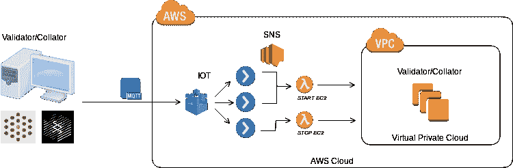

为了实现这一点，我们将使用一个 AWS EC2 实例来替换主节点，以防出现故障。主节点可以在您的办公室、家中或任何云提供商的位置。通过使用简单的发布/订阅设置，该节点将通过 AWS 物联网网关连接到 AWS 云。

# 什么是 AWS IoT？

AWS IoT 是一个高效管理“物联网”设备的平台，也称为“东西”。AWS 物联网可以连接到 AWS 云中的其他应用程序，如 Lambda 函数，这是无服务器基础设施的一个方便工具。

东西通过物联网网关传输数据，称为消息，在那里它们更新一个**东西影子**或到达一个**规则引擎**。事物阴影是一个(JSON)对象，它包含当事物/设备的状态改变时更新的关于设备的信息。它允许我们设置、存储和同步事物状态及其云表示。
规则引擎，顾名思义，是一组规则，使消息能够与从物联网网关到少数下游 AWS 服务的 SQL 类型语句进行交互。
我们将关注规则引擎，因为我们希望将我们的东西/设备连接到 Lambda 函数。

> 消息队列遥测传输( **MQTT** )是一个客户端-服务器发布/订阅消息传输协议。它是轻量级的、开放的、简单的，并且被设计成易于实现。这些特性使它非常适合在许多情况下使用，包括受限环境，如机器对机器(M2M)和物联网(IoT)环境中的通信，在这些环境中需要少量代码和/或网络带宽非常宝贵。它启用了一种在发生异常断开时通知相关方的机制。
> 该协议运行在 TCP/IP 或其他提供有序、无损、双向连接的网络协议上。——[http://mqtt.org/](http://mqtt.org/)

**物联网网关**作为 **MQTT** **代理**工作，以允许设备-云通信。

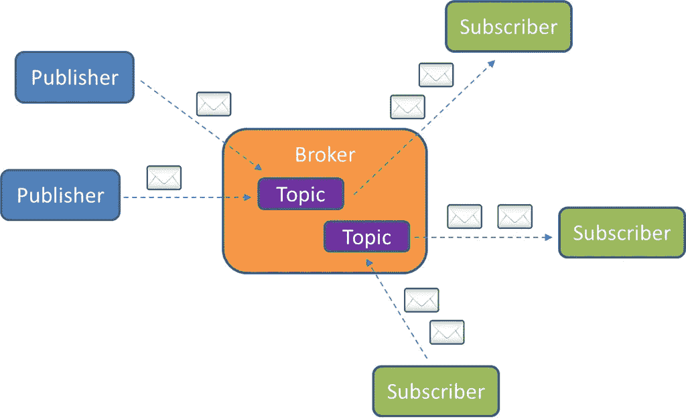

[http://micrasystems.com/real-time-messaging-using-mqtt/](http://micrasystems.com/real-time-messaging-using-mqtt/)

1.  订户(事物/服务)连接到代理。它可以订阅代理中的任何消息“主题”。
2.  发布者(客户端/事物)通过向代理发送消息和主题来发布主题下的消息。对于敏感消息，此连接将被加密。
3.  然后，代理(IoT MQTT 代理)将消息转发给订阅该主题的所有事物/服务。

# 什么是 Lambda 函数？

AWS Lambda 是一个事件驱动的计算平台，按需执行代码。此功能支持任何应用程序的无服务器架构。

触发 AWS Lambda 函数的一种常见方式是通过主题使用规则。我们之前提到过 AWS 物联网规则引擎；我们将使用它作为从 MQTT 代理触发规则的工具。这是一种分离消息发布者和订阅者的令人信服的方式，并且消除了轮询新消息的需要。

我们将设置一个规则，并订阅一个 Lambda 函数，以便在每次主题收到消息时启动/停止 EC2 实例。这个规则还会触发一个 SNS 话题通过邮件通知我们。

# 云的形成

CloudFormation 是一个 AWS 工具，可以帮助我们毫不费力地建立云基础设施。我们定义 AWS 应该构建到模板文档中的所有资源，点击一个按钮，AWS 就神奇地创建了一切。

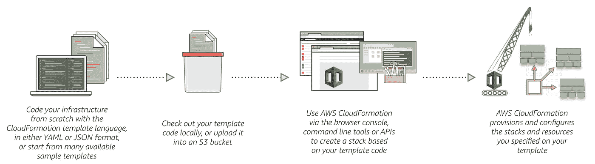

[https://aws.amazon.com/cloudformation/](https://aws.amazon.com/cloudformation/)

我们将使用一个模板来创建我们的物联网，配置规则引擎，创建 Python Lambda 函数，最后设置相关的事件、角色和策略。

# 我们来建吧！

无服务器架构将处理 EC2 实例的启动和停止。本教程要求您已经拥有一个带有 [polkadot 客户端](http://wiki.polkadot.network/en/latest/polkadot/node/guides/how-to-validate/)并配置有 [systemd 服务](http://wiki.polkadot.network/en/latest/polkadot/node/guides/how-to-systemd/)的 EC2 实例验证器节点。它仍然是这个堆栈的一个独立组件。

我们需要 X.509 证书和私钥来建立安全的 AWS 物联网连接。出于安全原因和遵循最佳实践，我们不会在 CloudFormation 上创建它。

在物联网核心控制台上，进入**安全**->证书。点击**创建**并选择**推荐的** **一键选择**创建证书。

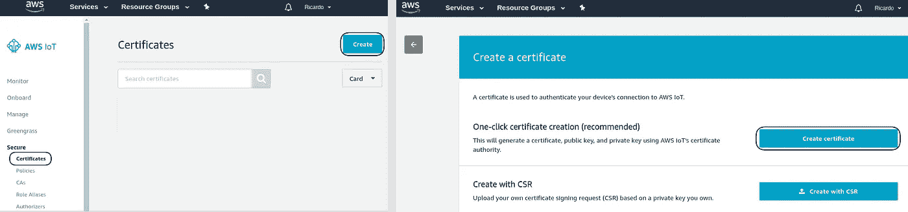

完成后，将所有证书下载到您的本地工作区文件夹中，然后单击**激活**。

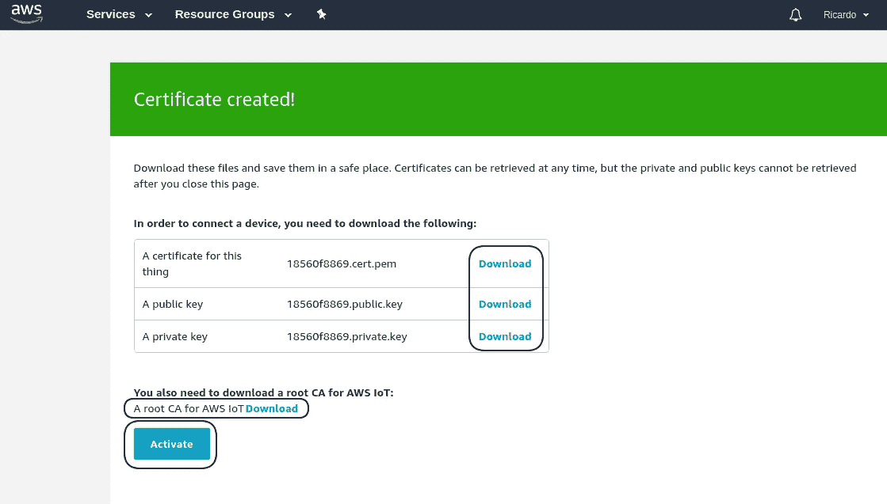

不要忘记下载通用根证书来验证 AWS 服务器的连接。AWS IoT 的根 CA[**下载**](https://docs.aws.amazon.com/iot/latest/developerguide/managing-device-certs.html#server-authentication) **。**

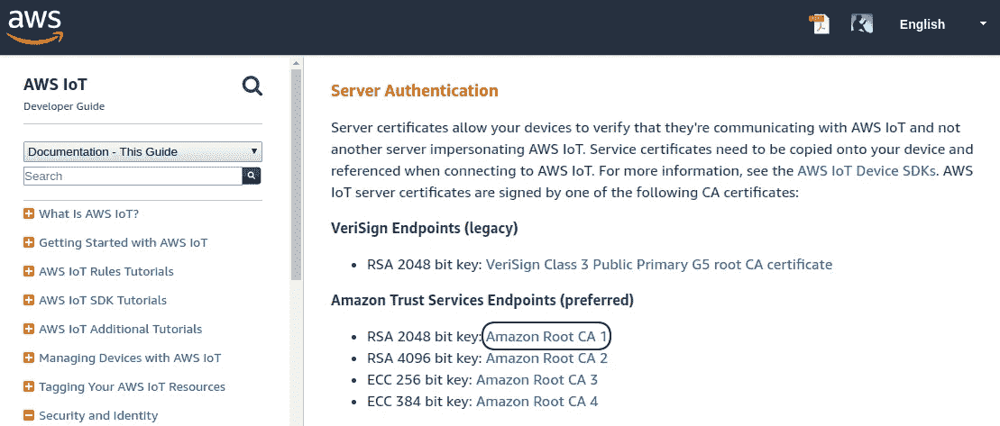

[https://docs.aws.amazon.com/iot/latest/developerguide/managing-device-certs.html#server-authentication](https://docs.aws.amazon.com/iot/latest/developerguide/managing-device-certs.html#server-authentication)

将下一个模板下载或复制到本地工作区文件夹中。我们会把它上传到云形成控制台。

在创建我们的 ClourFormation 堆栈之前，我们需要获得 IoT 证书 ID 和 EC2 实例 ID。

在物联网核心控制台上，进入**安全**->-**证书**。点击证书并复制 ID。

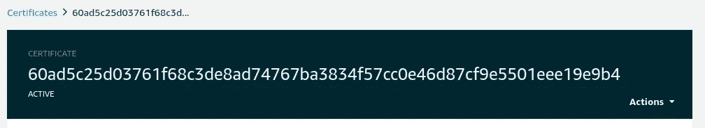

从 EC2 实例控制台，复制您的验证器的实例 ID。

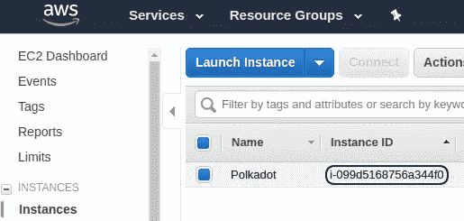

是时候构建我们的无服务器基础架构了。进入 [**云形成控制台**](https://console.aws.amazon.com/cloudformation/home) 并点击**创建堆栈**。

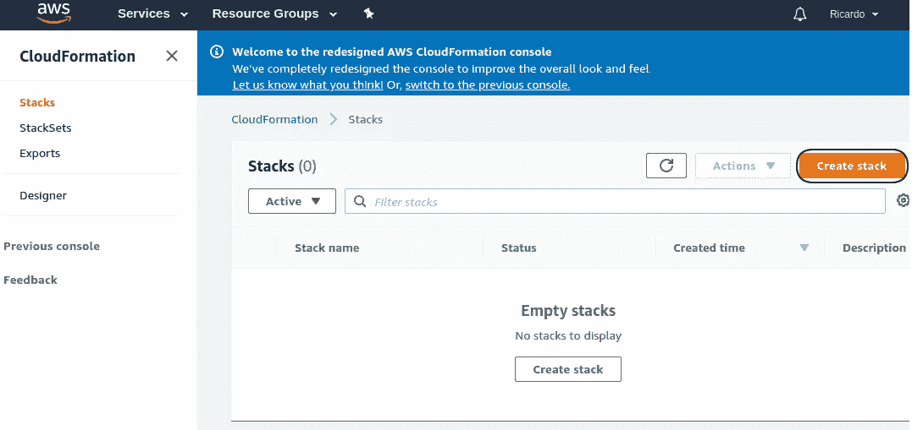

我们将被要求选择一个模板或上传一个。选择**上传模板**选项，并使用我们之前存储在本地工作区的**basicserverlessfvalidator . yml**文件。


填写所有必填字段(堆栈名称、证书 ID、电子邮件、实例 ID)。

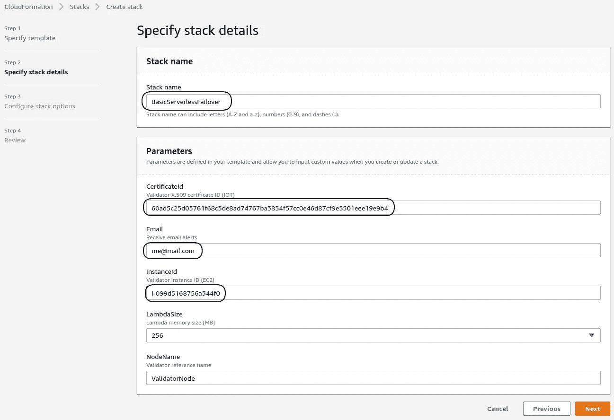

点击**下一个**两次，跳过创建堆栈定制，直到到达创建堆栈选项。勾选复选框**确认**我们的无服务器堆栈使用的角色和策略所需的 IAM 资源的创建。

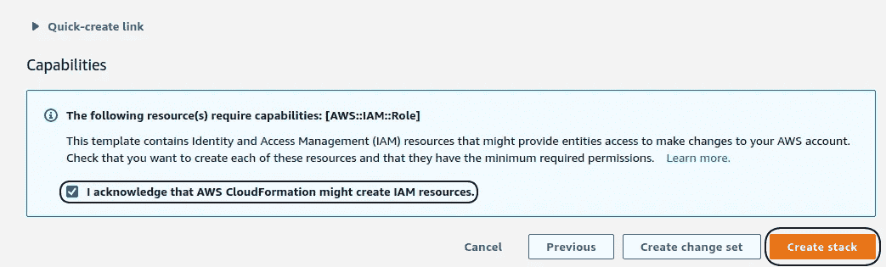

点击**创建堆栈**并等待创建完成。

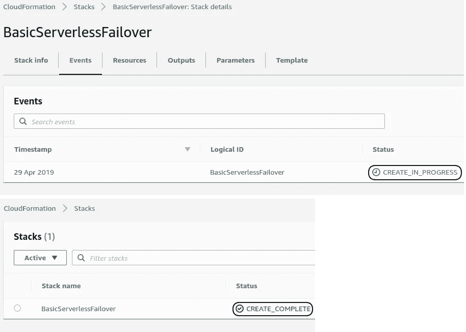

我们已经创建了无服务器云基础架构。🎉

重要提示:您需要验证触发器已经在 Lambda 函数中注册。有时，由于云形成中的竞争条件，它们不会出现在 Lambda 函数中。

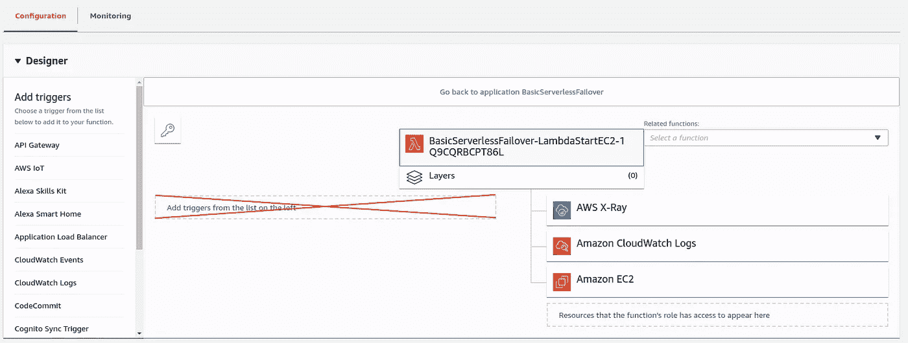

要解决这个问题，您只需要更新触发事件，而不需要做任何更改。然后它将出现在 Lambda 函数触发器上。对 3 个物联网规则重复此步骤(ValidatorNodeDisconnected、ValidatorNodeStart、ValidatorNodeStop)。

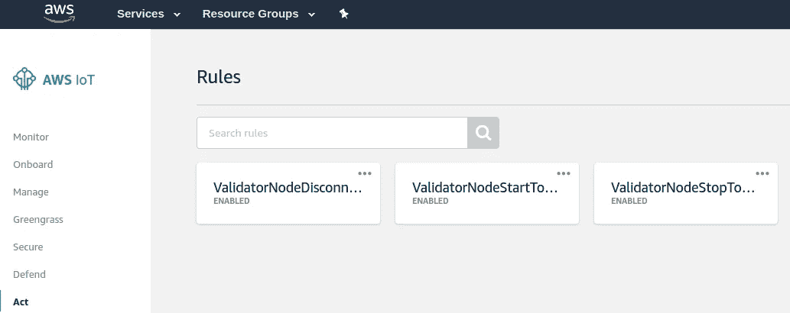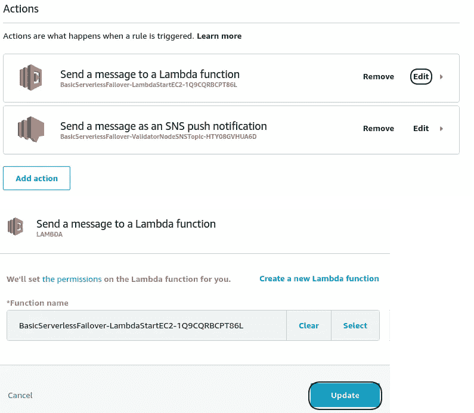

更新后，您可以验证触发器是否在 Lambda 函数上注册。

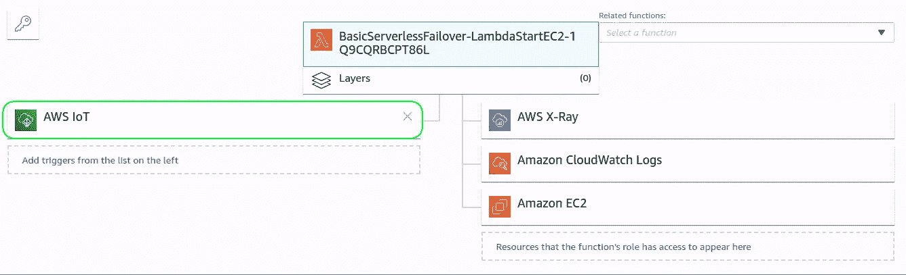

# 主验证器节点

现在，我们已经准备好了无服务器云基础架构。我们需要在我们的验证器节点(Thing)和 AWS 物联网网关之间建立数据连接。

将下一个 python 脚本下载或复制到主验证器节点中。

安装使用 Python 脚本所需的依赖项。

```
**$** python3 -m pip install AWSIoTPythonSDK pystemd
```

我们需要用我们的证书和私钥文件替换 Python 脚本上的配置参数。

在物联网核心控制台中，点击我们创建的东西“ValidatorNodeThing”。选择**交互**选项卡，复制 HTTPS 物联网 Rest API 端点地址。用此地址替换 host_name 值。

例如-“主机名”:“[a1yfesihws3xl1-ats.iot.eu-west-1.amazonaws.com](http://a1yfesihws3xl1ats.iot.eu-west-1.amazonaws.com/)”

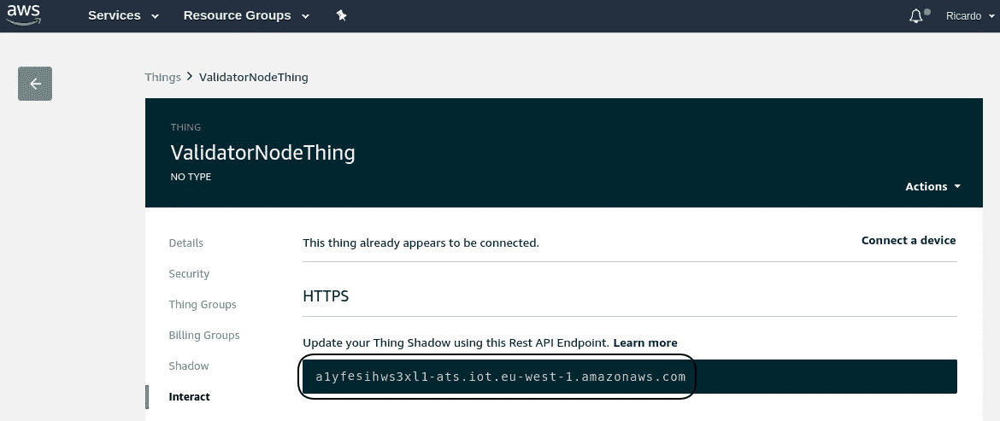

*' root _ ca ':/absolute-path-to-file/amazonrootca 1 . PEM "*

*' private _ key ':/absolute-path-to-file/yourkeyid-private . PEM . key "*

*' cert _ file ':/absolute-path-to-file/yourkeyid-certificate . PEM . CRT "*

出于安全原因，AWS 不使用具有打开权限的文件。更改文件权限以启用只读访问。

```
***$*** *chmod 440 /path-to-downloaded-files/**
```

# 将 Python 脚本注册为 Linux systemd 服务

准备好 Python 脚本后，接下来要做的事情是创建一个配置文件，告诉 systemd 我们希望它做什么。

```
**$** sudo vi /lib/systemd/system/polkadot-node-iot.service
```

该文件需要包含以下文本(替换**脚本路径**):

```
[Unit]
Description=Python script for the ValidatorNodeThing connection.
After=multi-user.target[Service]
Restart=always
ExecStart=/usr/bin/python3 /**path-to-script**/[BasicValidatorNode.py](https://gist.github.com/riusricardo/4f9143a1dd9b9ca069b36280be6e492a)[Install]
WantedBy=multi-user.target
```

将文件权限更新为 644:

```
**$** sudo chmod 644 /lib/systemd/system/polkadot-node-iot.service
```

配置系统 d:

```
**$** sudo systemctl daemon-reload
```

启动时启用服务自动启动:

```
**$** sudo systemctl enable polkadot-node-iot.service
```

> 我们的无服务器故障转移解决方案已经完成！！🎊 🎉

每当我们的主节点断开连接或 polkadot-validator.service 关闭时；我们的无服务器基础设施将负责管理辅助验证器。

关注 **Github** repo，了解更多高级解决方案的最新成果。

github:*T15[https://github.com/riusricardo/validator-failover](https://github.com/riusricardo/validator-failover)*