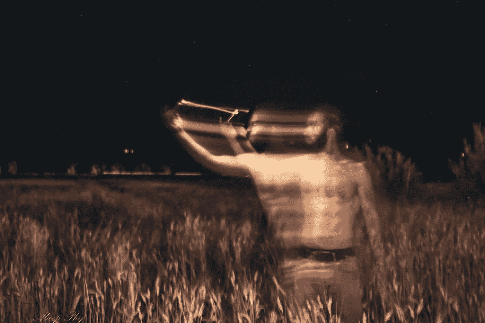

# 对现实的简短探索

> 原文：<https://medium.com/hackernoon/a-short-foray-to-reality-3e8911c08b53>

> "现实只是一种幻觉，尽管是一种非常持久的幻觉."

― **阿尔伯特·爱因斯坦**

每个人都在谈论[现实](https://hackernoon.com/tagged/reality)，然而没有人完全理解现实的真正含义。

现实描述了一种人类无法体验的状态，因为根据维基百科的说法[，“现实是所有真实或存在的事物的总和或集合，与仅仅是想象的事物相对。”我们无法观察现实](https://en.wikipedia.org/wiki/Reality)[，因为](https://en.wikipedia.org/wiki/Observation)“在生物中，观察使用感官。”

事实上，我们的感官不能接受所有真实或存在的东西。例如，螳螂虾能够用 12 种不同的颜色受体处理光刺激，不像人类或其他动物有少量不同的颜色受体。因此，螳螂虾能看到我们的感官无法感知的颜色。因此，在它感知的现实中，有比我们感知的现实更多的颜色。

然而，我们一直在谈论现实。

那么，我们怎样才能把现实变成一个更实际、更有形的术语，使我们有可能谈论现实呢？

我将现实定义为所有有意识观察的总和，因为现实是一个人的意识的大多数同意接受为现实的任何东西。举个例子，如果我有一个假想的朋友，但我周围的人都能看到这个朋友，那对我们来说，他不是真实的吗？

同样的道理也适用于色盲的人:如果你把一群色盲的人放在一个房间里，他们会把你的绿色理解为黄色，这意味着，在他们的现实中，颜色是黄色的。

如果每个人都是色盲，我们会一致认为苹果是黄色的而不是绿色的，尽管它只是因为我们的感知而呈黄色。

但是这适用于任何事物，因为如果不使用我们的感官，我们就无法观察任何事物。因此，我们的大脑决定了什么是真实的，什么不是。

而如果只是我们的大脑，那就是错觉。

我相信现实不是绝对的或恒定的，它更像是观察者和对象之间不断变化的动态关系。因此，从一个对象中添加或删除观察者可以改变它们之间的关系，这在本质上意味着它改变了现实，或者更准确地说，改变了结果。

有趣的是，[双缝实验](https://en.wikipedia.org/wiki/Double-slit_experiment)恰恰暗示了这一点。观察的结果取决于观察者。当然，这取决于解释，有许多人反对爱因斯坦的信仰，尤其是当涉及到他的相对论时。

然而，我坚信爱因斯坦的思想，因为我们的意识只有在变化的情况下才能存在，所以相对论在更高的背景下存在是一种逻辑上的必然。

吉拉德·詹姆斯博士进一步解释了意识:

> “我们绝不能用投机的怪癖来否认思想家的存在，他必须先假定一个人能够思考，然后才能找到进行否认的立足点。
> 
> 当他承认一个能够形成观点的存在时，他已经把自己确立为一个实体；因为，很明显，如果没有思想者，就不会有思想，如果没有思想，就不会有否定。
> 
> 因此，没有人能否认自己的存在；而任何正确的[哲学体系](https://hackernoon.com/tagged/philosophy)都必须从这个不可否认的前提出发。
> 
> 思想者的意识如此牢固地建立起来，是对关系的感知。
> 
> 这些关系可能是主观的或客观的，但要意识到它们，他必须能够比较它们。在没有变化、没有相对条件的地方，不可能有意识。"