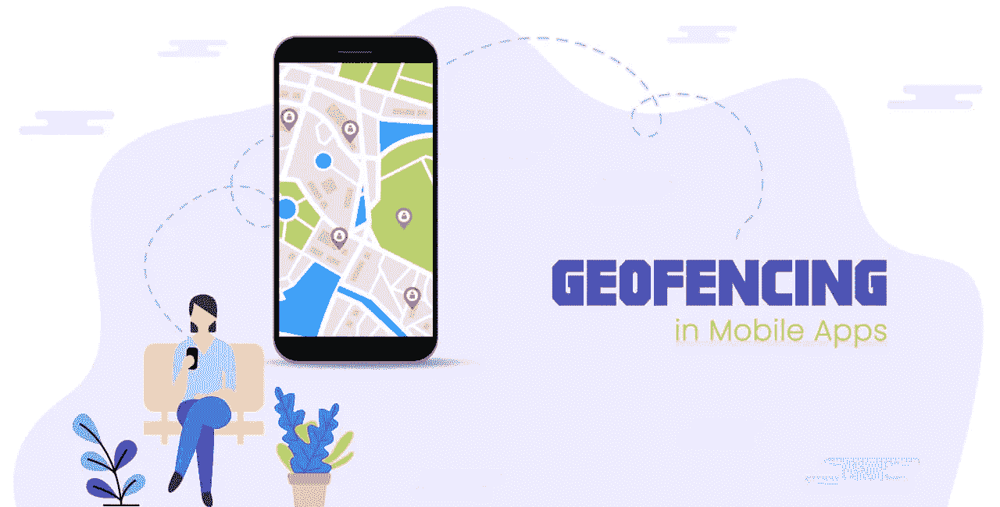
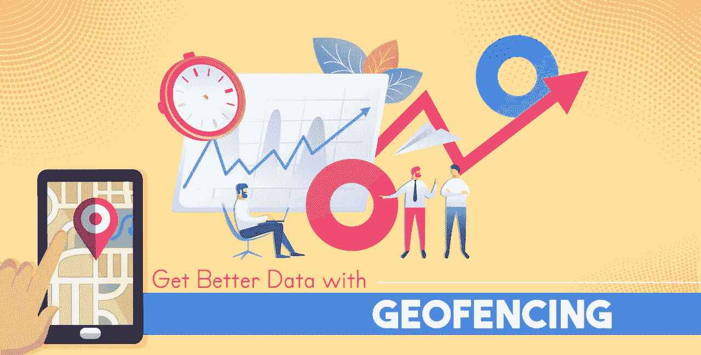
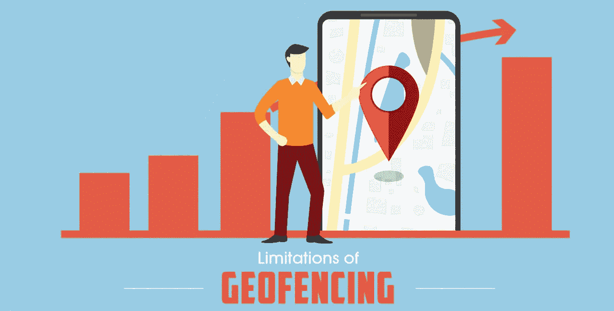
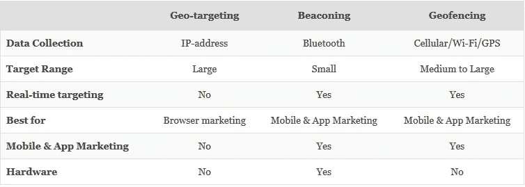

# 移动应用营销地理围栏简单指南

> 原文：<https://medium.com/hackernoon/a-simple-guide-to-geofencing-for-mobile-app-marketing-df610a0036cd>

移动营销是一个很难掌握的挑战。[平均只有 4%的移动用户会在一年后继续使用你的应用](https://www.apptentive.com/blog/2016/12/20/mobile-app-churn-causes-warning-signs-and-prevention/)。尽管实际上触手可及，但对公司来说，接触客户并不那么容易。人们的手机对他们来说是非常私人的，他们讨厌垃圾邮件。

因此，以一种相关的、更有语境的方式向客户推销你的服务是很重要的。当谈到移动营销时，位置和时间是两个最重要的因素。手机天生总是在移动，基于位置的营销在这种情况下非常有效。

因此，利用基于位置的营销的技术越来越受企业欢迎。

## 基于位置的营销有 3 种主要类型:

1.  **地理定位:**地理定位包括根据用户的位置向其提供内容。这包括国家、地区/州、城市、城市代码/邮政编码、组织、ip 地址、ISP 或其他标准。这种技巧通常用于向当地潜在客户做广告。
2.  **地理围栏:**地理围栏允许公司在进入一个独特的营销边界时，向客户发送特定的、有针对性的信息。地理围栏可以动态生成——如在点位置周围的半径中，或者甚至可以是预定义的一组边界。
3.  **信标:**在这种技术中，有时也被称为邻近信标的设备向附近的设备发送相关的和有针对性的消息。

# 什么是地理围栏？

地理围栏是使用全球定位系统(GPS)或射频识别(RFID)来标记地理边界的移动应用程序中的一项功能。使用这种技术，公司可以在移动设备进入或退出管理员定义的边界时设置触发器。这些触发通常以推送通知的形式出现。

作为地理边界创建的围栏称为地理围栏。该技术用于向通过、进入或离开地理围栏的客户发送报价。营销人员可以通过以下几种方式受益于地理围栏营销策略:

*   通过向客户发送促销优惠来增加客流量。
*   推荐相关产品
*   通过收集客户反馈来改善客户服务
*   提升品牌知名度

## **在实施地理围栏时，您应该考虑哪些最重要的事情？**

在实施地理围栏时，您应该考虑以下几点:

*   它不应该只依赖 GPS，因为 GPS 会消耗移动设备的电池寿命。
*   您使用的地理围栏软件应该针对准确性和电池使用情况进行优化。
*   您解读的数据应该用于深入了解客户体验。您还可以使用这些数据以更个性化的方式锁定用户。
*   通常，地理围栏解决方案会附带一个管理控制面板。您应该使用此控制面板来创建和优化地理围栏。
*   实施地理围栏最重要的一点是**不要给客户发垃圾邮件**。

# 地理围栏的基本要求是什么？

地理围栏有几个关键的基本要求:

## **1。适当的权限**

每个使用地理围栏的应用程序都需要获得应用程序用户的位置许可。通常情况下，公司会要求获得用户在应用程序界面之外的位置信息。当用户第一次打开应用程序时，通过请求提示获得权限。管理员会收到有关每次权限更新的通知，这使他们能够密切关注其受众。

## **2。定义每个地理围栏**

您定义的每个地理围栏都应定义以下参数:

*   地理围栏边界的纬度、经度和半径(对于圆形)。
*   地理围栏的 ID。
*   管理员希望得到通知的事件种类。
*   时间值定义了用户在收到推送通知之前必须停留在地理围栏中的时间。
*   开始时间，确定地理围栏监控的开始时间。
*   时间长度，表示地理围栏监控应持续多长时间。

# 为什么应该选择地理围栏？

## 以下是您应该选择地理围栏的一些原因:

## **1。吸引顾客**

移动应用中的地理围栏可用于当客户在您的业务区域附近移动时，直接向他们的智能手机发送广告、销售和促销信息。地理围栏可以大幅提高应用程序的使用率。地理围栏的点击率远高于普通推送通知。

## **2。成本效益**

地理围栏为你节省了一大笔钱，否则你会花在付费广告上。如果你没有很多钱做广告，地理围栏是一个发展业务的好方法。

## **3。智能营销**

移动应用中的地理围栏比向你所在领域的消费者发送普通的推送通知要聪明得多。在设置地理围栏区域时，您不局限于使用自己的位置，您还可以在与您的业务相关的创意位置锁定消费者。

# 地理围栏在移动应用中是如何工作的？

地理围栏环境有以下三个中介:

*   管理员——企业所有者
*   地理围栏编程应用程序
*   使用设备的用户——客户

首先，管理员必须在 GPS 或 RFID 软件中的指定位置周围建立一个虚拟边界。

为了识别地理围栏区域内的用户设备，移动应用程序中的地理围栏采用蜂窝三角测量、Wi-Fi 塔三角测量或 GPS。基于蜂窝和 Wi-Fi 的解决方案因其可靠性而受到推荐，因为基于 GPS 的解决方案被证明会很快耗尽电池。

地理围栏不需要特殊的硬件，它只是一种可以集成到移动应用程序中的软件形式。

地理围栏对有大范围户外营销需求的人更有利。地理围栏在 50 到 50，000 米的半径范围内效果最佳，例如，购物中心或特定的社区。

每当用户进入地理围栏的边界时，就会触发一个响应来向用户发送通知。

# 地理围栏的好处是什么？

## **1。增强本地销售**

如果你想提高本地业务的表现，你需要认真研究地理围栏。由于这是一个基于位置的系统，因此您可以将目标锁定在特定地理区域的本地客户。您可以轻松地每天更换活动或推出限时优惠，从而增加当地客户的销售额。

## **2。订婚**

如果你的应用程序在合适的时间为他们提供相关的优惠，客户更有可能在移动设备上接触你的品牌。地理围栏可确保更好地吸引消费者，并提高品牌忠诚度和宣传力度。

## **3。效率**

由于基于位置的解决方案是高度个性化和有针对性的，它们可以显著提高效率。通过根据人们的位置向他们提供特定的优惠，您可以提高您的沟通对购买者产生的影响。

## **4。更好的数据**

一旦你实施了基于位置的营销，你就能接触到大量的数据。您可以使用这些数据，通过应用程序深入了解顾客的体验和购物旅程。这些洞察包括各种数据，如哪些商店表现更好，哪些目标细分市场更容易接近，哪些地点更适合扩大业务等。

智能手机上装有 Vouchercloud 应用程序的人，只要在参与商店的 200 米范围内，就会收到一张优惠券。Vouchercloud 报告称，仅通过地理推送通知，点击率就达到了 45%。

# 汉堡王如何利用地理围栏进行独特的营销活动

为了对抗他们的对手麦当劳，汉堡王以 0.01 美元的价格出售它的巨无霸汉堡，但只卖给麦当劳 600 英尺半径范围内的顾客。为了让“巨无霸绕道”活动奏效，汉堡王在全美用地理围栏隔离了 14000 多家麦当劳门店。该应用程序在 48 小时内被下载了 200 多万次，仅这一次活动就兑换了 15 万个一美分的巨无霸！

这应该足以让您了解它可以给业务带来的巨大影响，以及它们可以对其范围和规模产生的影响。

# 地理围栏的局限性是什么？

## **1。权限**

地理围栏是一项需要用户批准或参与的技术。出于隐私和防止监控的考虑，人们可能不会授予您的应用程序访问设备位置的权限。

## **2。独立性**

当来自其他来源的客户数据被统一调动时，地理围栏是有效的。因此，地理围栏并不是获取高质量商业情报的独立技术。

## **3。电池寿命**

大多数移动设备中的地理围栏对电池寿命的要求过于苛刻，这使得用户关闭了该功能。因此，许多用户甚至倾向于避免使用具有地理围栏功能的应用程序。

# 地理围栏、地理定位和信标的比较

# 地理围栏如何入门？

如果您希望采用地理围栏技术，以下是开始的几个步骤:

1.  收集所有讨论的要求，并确保地理围栏满足您现有营销策略的要求。
2.  选择合适的地理围栏软件在您的应用中实施。
3.  落实到 app 里。
4.  测试应用程序。
5.  设计您自己的推送通知活动。你可以用这些通知来激发创造力。

# 结论

地理围栏是一个有利可图的工具，可以更好地联系消费者。通过使用地理围栏技术开发应用程序，您可以为您的企业带来竞争优势。如果操作得当，地理围栏可以建立忠诚度，产生实时参与，并最大限度地提高购买途径的转化率。

将[地理围栏功能](https://www.appypie.com/mobile-push-notifications)添加到你的应用程序非常简单，尤其是当你在 [Appy Pie](https://www.appypie.com/) 上有一个应用程序的时候。什么阻止了你？现在就开始！

*原载于 2019 年 5 月 6 日 https://www.appypie.com***。**