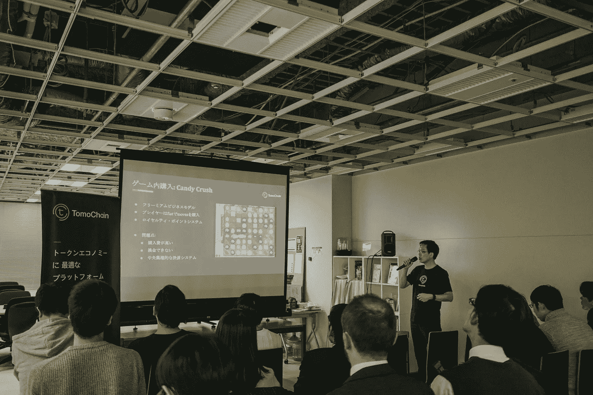
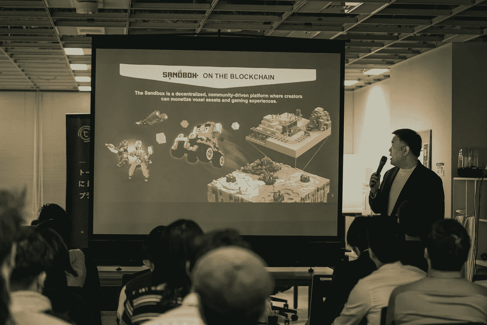
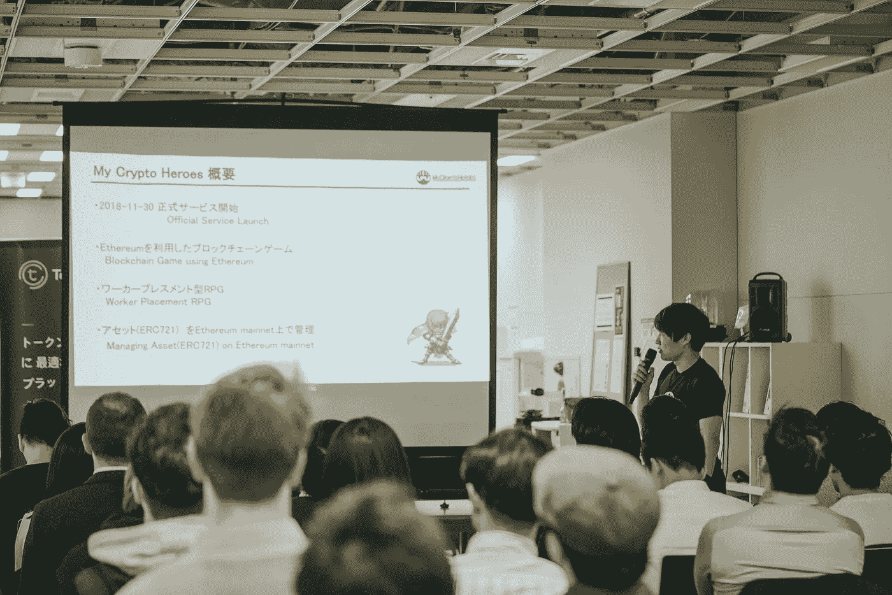
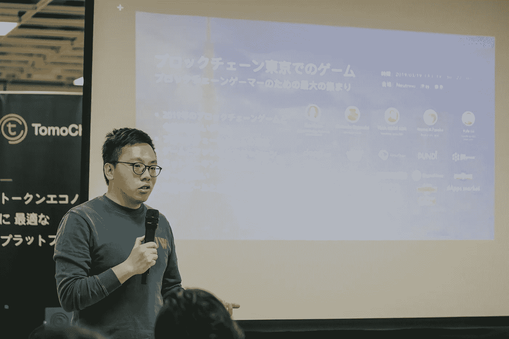

# 日本区块链游戏市场一瞥:遥遥领先于其他市场

> 原文：<https://medium.com/hackernoon/a-sneak-peek-into-the-blockchain-gaming-market-in-japan-way-ahead-of-the-others-3546afbbfd3d>

日本是数字游戏的前三大市场之一，2018 年的收入超过 192 亿美元。它还引领着区块链游戏市场——My Crypto Heros(MCH)，自 2018 年第四季度推出以来，MCH 已成为世界上最大的区块链游戏，主网用户超过 17，000 人。当地社区也在迅速赶上——大型游戏公司、游戏工作室和独立开发者也加入了这一趋势。

日本如何成为区块链博彩业的领导者？Dapp.com 在东京进行了一次深度潜水，目的是找出秘密，并与主要的去中心化应用的建造者和玩家会面。

# 识别区块链游戏的巨大机遇

“虚拟物品的所有权和流动性是当前的问题，” [TomoChain](https://tomochain.com/) Japan 的首席执行官 Tran Ngoc Son 说。根据 Tran 的说法，游戏领域的区块链为开发者开辟了新的领域，因为:

*   游戏中的区块链实现了玩家和游戏虚拟物品的互操作配置文件；
*   加密货币启用游戏内经济学——激励机制；
*   基于区块链的游戏允许玩家真正拥有自己的游戏内资产，并对自己喜欢的游戏拥有更大的控制权。

玩家可以在区块链上与开发者合作改进游戏。以 TomoChain 为例，开发者或游戏公司可以使用 TomoWallet dapp 浏览器制作手机友好型游戏。

Tran Ngoc Son

Animoca Brands 的战略合作伙伴关系总监 Gen Kanai 表示:“日本是最大的游戏市场之一，并且正在迅速将区块链应用到游戏中，我们今天可以看到许多正在开发的游戏，我们希望在今年晚些时候可以享受到这些游戏。我们很高兴看到人们对[沙盒](https://www.sandbox.game/)的兴趣，并期待通过这款游戏和我们未来开发的游戏来扩大区块链游戏社区。”

Gen Kanai

# **克服可用性挑战:汽油费、UX 和可扩展性**

来自 [My Crypto Heroes](https://mycryptoheroes.net/) 的渡边俊介(Shunsuke Watanabe)介绍了团队在游戏开发过程中面临的挑战。“当你建立一个 dapp 时，你必须处理与区块链相关的 UX 难题，如汽油费、可扩展性、交易时间等等”，俊介说，“区块链游戏与‘普通’社交游戏竞争的是可用性。”他继续解释说，如果我们想要真正的用户采用，我们需要达到当前浏览器/移动游戏的水平，同时增加区块链游戏的积极方面:资产所有权，收入民主化，项目的互操作性等。

Shunsuke

俊介提到，他们的团队解决了与以太坊相关的 UX 挑战，具体如下:

1-战斗系统测试版运行在侧链上，以避免汽油费和长时间的交易，并提供更流畅的游戏流程。混合链上/链下基础设施由 MCH 团队制作，它连接了中间的网关，以确保无信任的游戏体验，这是真正的资产所有权和英雄和扩展的稀缺性。

2-由团队构建和实现的以太坊代理 API，用于显著加快数据传输，最终实现更好的用户体验。

“用户希望在享受区块链好处的同时，获得堪比‘正常’游戏的愉悦游戏体验。作为开发商，我们的任务是构建系统，在保证用户在区块链的资产安全的同时，实现良好的 UX”，俊介说。

# 促进分散的生态系统:工具和基础设施

Nana H.Tanaka， [Pundi X Labs](https://pundix.com/) Japan 的国家经理讲述了 Pundi X 生态系统如何促进 Dapps 的发展。他介绍了 XPOS 的主要功能，允许支付以及允许任何人购买 ETH。XPOS 肯定会解决人们开始使用 dapp 的一个主要痛点，这有助于人们尽可能容易地获得加密。

[Kyber Network](https://kyber.network/) Japan 的布道者 Taisuke Horitsugi 向观众讲述了 Kyber 如何解决游戏内交易的问题，并提供了一个为 dapps 提供流动性的链上协议。Kyber 将多个交易合并为一个，给游戏玩家一个简单而轻松的体验。

特别感谢[我的密码英雄](https://www.dapp.com/dapp/My-Crypto-Heroes)、 [TomoChain](https://tomochain.com/) 、 [Pundi X](https://pundix.com/) 、 [Kyber Network](https://www.dapp.com/dapp/Kyber-Network) 、 [Animoca Brands](https://www.animocabrands.com/) 、[中微子日本](https://www.neutrino.global)、 [Dapps Market](http://dappsmarket.net) 、[区块链游戏资讯](https://blockchaingame.jp)、[亚洲区块链评论](https://www.asiablockchainreview.com)以及来自东京的一些即将推出的新游戏[密码法术](https://www.dapp.com/dapp/Cryptospells)、NovaBlitz、密码我们在东京举办了最大规模的区块链游戏玩家聚会。

Dapp.com Sharing our vision for future of dapps

没有什么比看到建筑者不断地为日常使用的长期项目工作更好的了。这就是日本人正在做的事情。

干杯