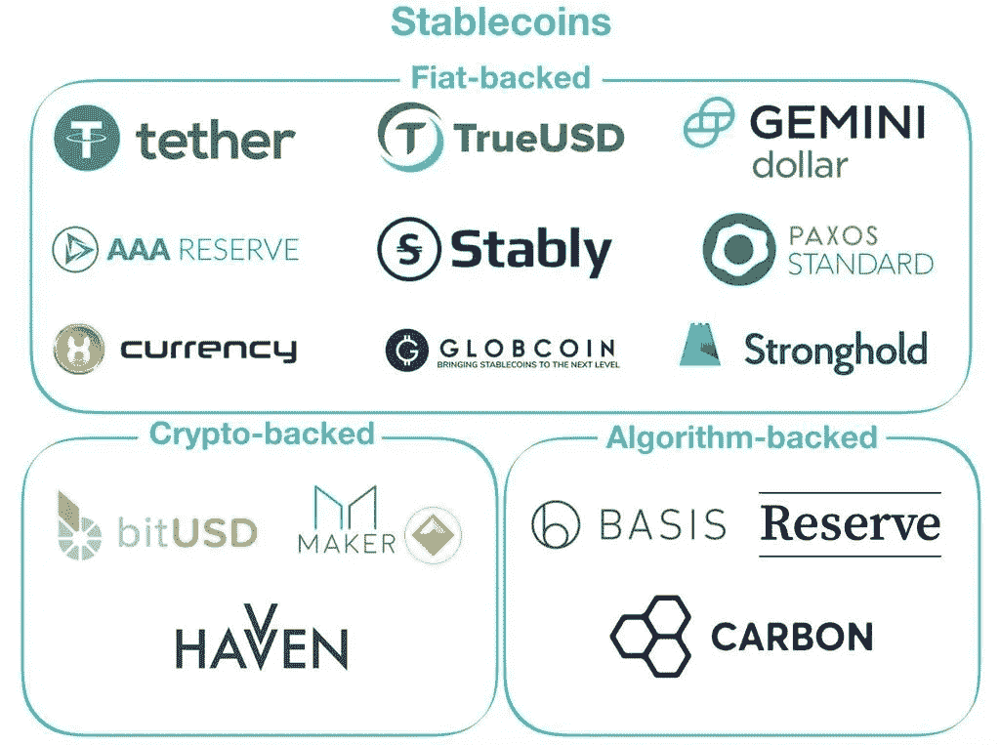
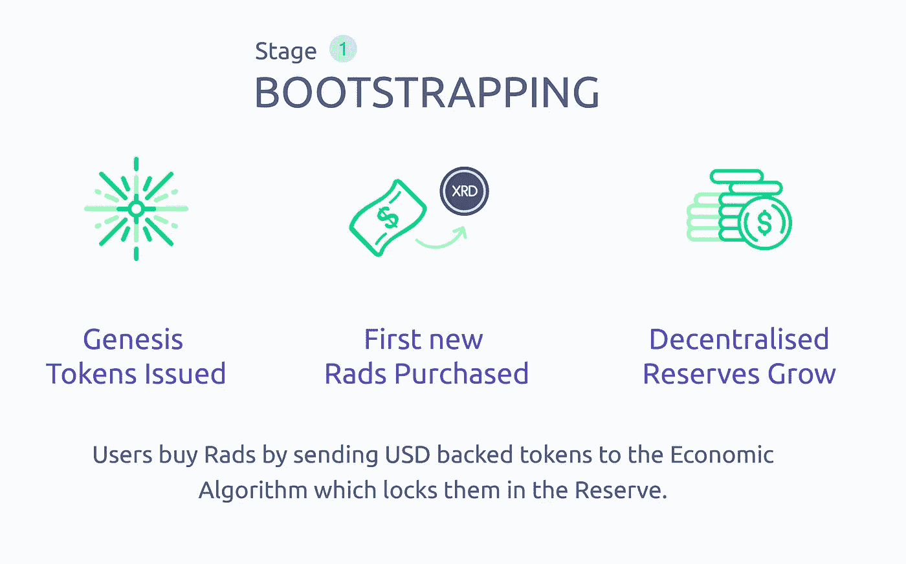
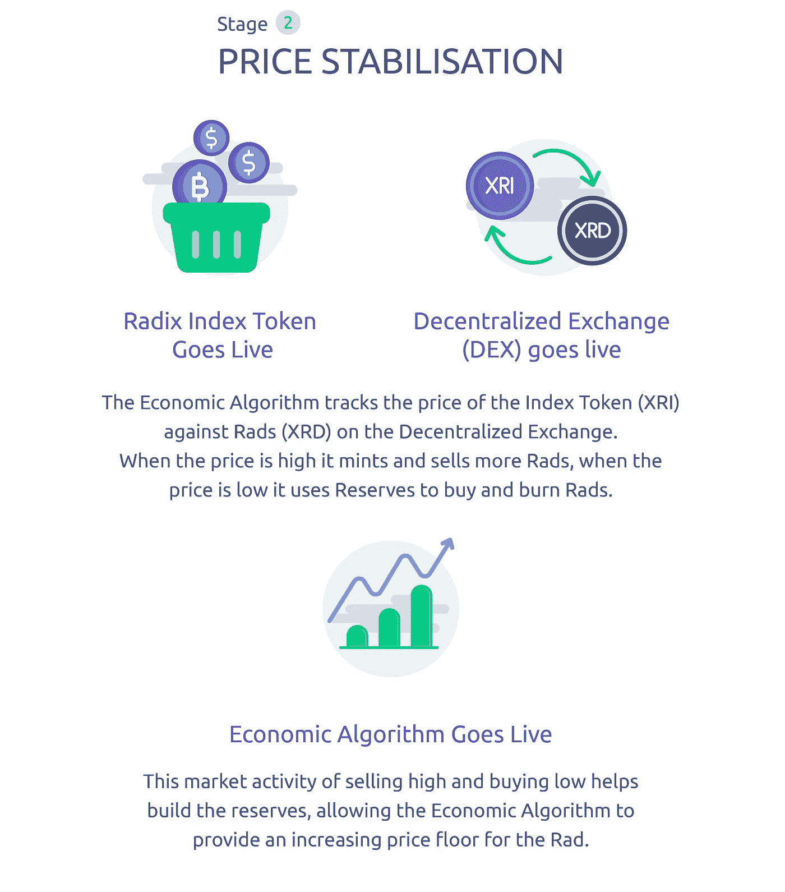
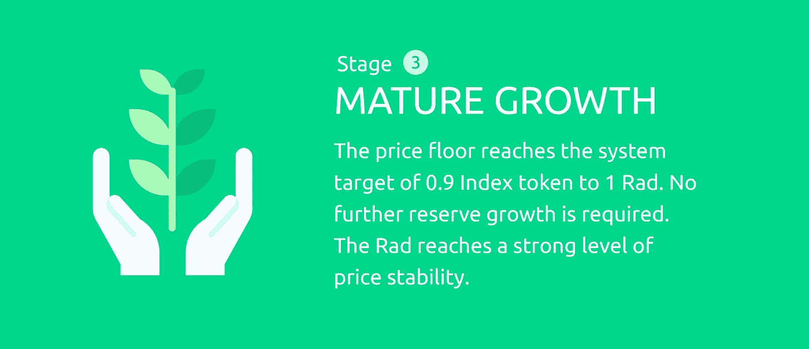

# 在可扩展和分散的 DLT 之上建立稳定的货币:可行吗？

> 原文：<https://medium.com/hackernoon/a-stable-currency-on-top-of-a-scalable-and-decentralized-dlt-can-it-work-cc47624b632d>

## Radix 不是区块链。基数是不可信的和分散的。Radix 支持智能合约。基数是一种低波动性货币。

> 我对 Radix 没有既得利益，我只是对这个项目着迷。

Radix 是区块链和 DAGs 的一种快速且可扩展的替代方案。是 **6 年研发**的成果，是**可扩展性**和**去中心化**问题的解决方案。请阅读我的文章“[Radix 是目前加密领域最酷的东西吗？](https://hackernoon.com/is-radix-the-coolest-thing-happening-in-crypto-right-now-ca1596cf7307)“如果你想了解 Radix tech。

毫无疑问，这是一个非常雄心勃勃的项目，不仅因为 Radix 团队希望提供一个真正去中心化和可扩展的 DLT，还因为他们希望在这个平台上创建一个低易失性令牌 Rad (XRD ),它将通过**算法铸造并燃烧**,以维持关于**加权资产篮子的大约 s **表值**。**
这个项目的目标是**确保**使用 Radix 网络的**成本是可预测的**并创造一个随着采用而变得更安全的价值存储。

经济白皮书是机构群体非常期待的，在 Radix 项目几乎已经开发了很长时间，并且经过大量的迭代和反馈之后，该白皮书终于出版了。

# 但是，我们真的需要稳定的价值吗？

**实际上是的**，原因很多。对于希望在应用程序中使用 DLT 网络的普通企业来说，他们只是想知道他们可以为下一季度的网络使用成本做预算。对普通人来说，他们只想知道当他们拿到它时，是否能用它来付房租。因此，对于大众市场的采用，价值稳定性是一个强烈的要求。

还有其他与[区块链](https://hackernoon.com/tagged/blockchain)开发和去中心化应用(DApps)使用相关的问题。一方面，对于开发者来说，在当前的区块链平台上构建 DApps 是非常昂贵的。另一方面，人们使用 DApps 也很贵:如果你想使用分散的 Twitter，你可以根据你使用 DApp 的日期或时间支付不同的费用:现在可能是 0.02 美元，明天是 1 美元，后天是 0.01 美元。

最后，你需要一个稳定货币的另一个重要原因是**价格波动使得**，在某些情况下，**智能合约变得无用**。让我解释一下。智能合约的酷之处在于，它以透明和安全的方式实现了一种新的业务方式。您可以使用**简单托管服务**，其二进制结果(完成或未完成)可以由代码单独确定(即不需要仲裁/意见输入)。您可以将资金放入智能合同，任何人都可以在公共区块链上查看资金是否可用，以及他们如何赚取/赢得部分/全部资金。
**然而，有一个问题**:要将资金放入智能合约，我需要在加密资产中为合约提供资金。现在价值的不确定性来了。不仅我**希望资产不要崩溃**，所有考虑接手这个项目的人也是如此。正是这种**价值稳定性对于智能合约的广泛采用至关重要**；消除价值的不确定性，从根本上拓宽加密货币在现实世界中的应用。

# 稳定的崛起

为了应对这种价格波动，加密货币的某个子集开始出现，即稳定的硬币。由瑞士金币首席执行官布里吉特·卢金布尔定义:

> “与比特币等高度不稳定的加密货币不同，稳定的硬币为人们提供了加密货币的实用、有益的好处，而不必担心令人沮丧的价格变化，因为它们植根于现实世界。”

稳定的硬币被设计成在一段时间内具有稳定的价格或价值，因此波动性较小。

这些硬币一方面旨在模仿法定货币的相对价格稳定性，另一方面仍保持加密货币的核心价值，如去中心化和安全性。

Fig.1: Some stablecoins out there.

市场上有许多所谓的稳定硬币试图实现这一点，并取得了不同程度的成功。所有这些都属于三大类中的一类(见图 1)。

要了解更多关于稳定硬币的信息，请阅读"[稳定硬币分析:未来有可行的解决方案吗？](https://cointelegraph.com/news/stable-coins-analysis-is-there-a-viable-solution-for-the-future)作者 **Chrisjan Pauw。**

虽然 stablecoins 处于加密爱好者的最前沿，并受到了 [Tether](https://tether.to/) 的成功支持，但这并不是一个新想法。目前有 66 个国家的货币与美元挂钩，25 个国家的货币与欧元挂钩。

# Radix:再见价格波动？

当你想让任何一种货币保持价格稳定时，你需要决定**它将对什么保持稳定。**政府使用消费价格指数。在 Radix 中，使用了**索引令牌(XRI )** 。

索引令牌将由建立在 Radix 上的第三方令牌的“篮子”或集合**支持**。指数权标不是仅对美元保持稳定，而是将几种权标化的货币组合在一起，以帮助降低这种风险。****

当基数平台的本地货币值 **Rad** 相对于该篮子**发生变化时，经济算法**使系统**采取行动**:

*   当拉德对这一篮子**的**价格上涨**时，系统自动**生成新的拉德代币，并在分散交易所**出售。它将收到的任何指数代币放入其储备中。**
*   如果分散交易所**的**Rad**价格触及价格下限，例如**Rad 需求下降或用户廉价出售了大量 Rad，那么经济算法会触发系统**使用其储备的指数令牌**购买 Rad，然后**烧掉其购买的 Rad**，为 Rad 创建价格下限。

因此，该平台运行一种经济算法**，该算法**被设计为**随着储备的增加**使系统趋于稳定，建立储备并慢慢将价格下限提高到价格上限，减少任何价格波动的范围。这个过程预计是一个长期的过程(大约 10 年)。

你可以看到 T42 有 5 个重要的功能来创造这种稳定的货币，它们是:

## 1)分散式交换

分散式交换机是 Radix 网络的一部分。它允许愿意的买方和愿意的卖方被匹配在一起，以便可以为 Radix 系统中创建的任何代币/硬币/资产找到**市场价格****。**
由于 Radix tech，它应该有非常好的性能，在白皮书中，他们说对于单个令牌对，吞吐量为**每秒 80，000 次交易。**

## 2)索引令牌

在 Rad 上，经济算法使用指数令牌作为分散式交易所 Rad 的价格参考。这一目标可以表述为:

> 将索引令牌中的 rad 价格保持在大约 1:1

其中指数令牌的**值由支持它的资产篮子**的内容决定。例如，让我们假设篮子包含三个已被选择包含在索引令牌篮子中的令牌:

> 篮子(B ) = 50%( A 1 ) + 25%( A 2 ) + 25%( A 3)

然后，该篮子被令牌化以创建索引令牌，该索引令牌表示篮子上的部分声明:

> XRI = X /篮子，其中 X 是指数令牌的总供应量。

**索引令牌管理**将成为分散治理机制的一个非常重要的组成部分，**将在未来的文章中讨论。**

## 3)经济算法

**经济算法的目标**是**在分散交易所**(所有外部市场被忽略)自动执行 Rad 的买入&卖出指令，以试图稳定 Rad 相对于指数令牌的**价格。它在可调整的价格下限和价格上限之间进行干预。**

**拉德的供应由经济算法**控制，并且将根据相对于指数令牌的 DEX 上的拉德价格而上升或下降:如果价格高，将印刷更多的拉德，如果价格低，将购买并烧毁拉德。

这并不阻止买家和卖家在价格上限和下限之间操作，但它旨在**建立一个稳定增长的价格下限**，**减少 Rad 价格随时间的波动**，并确保 **Rad 以合理的价格立即提供给所有需要它的用户**。

算法的规则写在用户节点的代码中，每次有人想要改变规则时，都需要所有节点的一致同意。

## 4)储量

经济算法的核心是储备。这是经济算法存储所有索引令牌的地方。

平台从出售 rad 中获得的任何指数代币将**作为储备**持有，并可能被经济算法用于在未来购买 rad。平台**收到的任何 rad 都将被烧毁**。

储备中持有的指数代币**未被任何实体或组织持有或控制；**它们由经济算法在分布式账本**上控制。**所有交易和储备都是**公开可见、可审计和透明的。**

## 5)价格上限和价格下限

An approximative draw of the Economic Algorithm objective.

经济算法将有买卖订单**边界:**价格上限**价格上限**(总是相同)**价格下限**价格下限**价格下限**将从一个非常低的值开始，然后逐渐上升。在价格上限和价格下限之间，无论发生什么情况，都将由市场决定(T21)。经济算法只是创造了越来越窄的边界，因为它用指数令牌填充储备，并可以提高价格下限。

目标是建立 0.9 的**价格下限和 1.1 的**价格上限。

# 基数经济阶段

基数经济模型的行为可能会随着成熟度、效用、流通中的 rad 数量以及交易数量的增加而变化。一开始**储量为零**，经济算法对市场的支撑能力很小。随着网络的力量和价值的增长，经济运行的方式需要调整。这些调整分为三个阶段:

## 阶段 1:引导

Bootstrapping 旨在尽可能方便地登录网络和购买 Rad。这是通过美元支持的代币认可的铸币商网络实现的。
在引导期间，这些经批准的铸币厂发行的美元支持代币直接流入储备。
虽然用户将能够立即使用这些 rad，但是**在第 1 阶段，分散的交易和价格下限不可操作。**

## 第二阶段:价格稳定

在阶段 1 结束时，经济算法将在储备中创建第一个指数令牌。
第二阶段的目标是将分散式交易所的价格下限提高到 0.9 指数令牌比 1 Rad，以 Rad 交易在价格上限 1.1 和价格下限 0.9 之间结束该阶段。

## 第三阶段:成熟成长

一旦 Rad 对指数令牌的价格稳定在 0.9 和 1.1 之间。系统切换到成熟的生长阶段。这是为了长期维持这一网络，并实现从外向型经济向内向型经济的转变。

# 真的能管用吗？

我们以前是如何看到的在密码球中有许多稳定的硬币，它们中的许多失败了，并且许多其他的可能在未来失败。你可以在这里阅读 Preston Bryne 写的一篇关于 stablecoins 为什么注定失败的文章。

稳定资本/风险失败的**最常见的原因**是:

1.  如果每个人都在抛售，他们**没有 100%的现金来担保系统。**
2.  算法稳定器使用第三方数据进行买卖，这使得它们变得脆弱和集中。
3.  与另一种加密货币(如以太币)挂钩的稳定币存在风险，在以太币**黑天鹅事件**中，基础抵押品的价值以及稳定币的价值也将**化为乌有**。
4.  它们**完全不透明**(例如系绳)，这使得它们非常危险，因为你真的不知道是否每一枚稳定的硬币都与真实的美元挂钩。

Radix 似乎注意到了这些问题，并且**找到了不同的解决方案:**

1.  他们解决了 100%抵押代币的问题，从储备和底价 0 开始，这种方法在算法建立储备的同时，也慢慢创建了一个**底价，它肯定能够处理流通中的所有代币。**
2.  所有的**买入&卖出指令都将只在 Radix 之上的分散式交易所**进行，规则是公开透明的。
3.  从长期来看，Rad 的价值不是针对单一货币，而是针对一篮子货币，这将通过货币、供应商和资产类别的多样化来不断降低风险。
    随着时间的推移，预计指数代币将**扩展到商品等其他外部资产**，如果 Radix 经济足够大，将开始从 Radix 生态系统内的代币构建自己的消费篮子，最终**完全取代菲亚特支持的代币**。
4.  经济算法和储备的交易是公开可见、可审计和透明的。

基数经济模型**看起来不错，理论上**。当经济算法和分散式交易所推出时，我们将拭目以待事情将如何在**经济上线**上进行。

如果 Radix 成功了，他们将能够交付整个包:**你会得到一个稳定的货币，消息，DEX，DApps。一切都快速轻便。**

目前，批准的制造商的概念在 Radix 平台中引入了治理的概念，这既不是负面的，也不是正面的。在一个分散的系统中治理是一件**很难做好的事情**:它必须确保在做决策时考虑所有的利益相关者，并且没有一个利益相关者或组织在没有对这种权力或影响进行制衡的情况下拥有太多的影响力。但是我们必须等待治理白皮书，以便客观地判断它，希望去中心化仍然是这个项目的关键点。

当然，Radix 是一个非常雄心勃勃的非典型项目，是一种 DAO(分散的自治组织)，由一种自治的经济算法驱动，基于一种惊人的可扩展和分散的技术。所以祝 Radix 团队好运。

你可以在这里找到经济白皮书[，团队欢迎每一个批评和建议，所以如果你认为你可以对他们的经济模式提出一些改进建议，让他们知道他们的](https://papers.radixdlt.com/economics/latest/economics.pdf)[电报](https://t.me/radix_dlt)组。

## 资源

[基数经济白皮书](https://papers.radixdlt.com/economics/latest/economics.pdf)
[基数经济常见问题解答](https://docs.radixdlt.com/alpha/learn/faq/economics)
[价值稳定的重要性](https://www.radixdlt.com/post/value-stability) — Piers Ridyard
[稳定硬币分析:未来有可行的解决方案吗？](https://cointelegraph.com/news/stable-coins-analysis-is-there-a-viable-solution-for-the-future) —克里斯扬·波
[稳定的硬币注定要失败](https://prestonbyrne.com/2017/12/10/stablecoins-are-doomed-to-fail/) —普雷斯顿·伯恩
[稳定的硬币](/@bob.mcelrath/on-the-in-stability-of-stablecoins-517b7d17c3ee) — [鲍勃·麦克尔拉斯](/@bob.mcelrath)