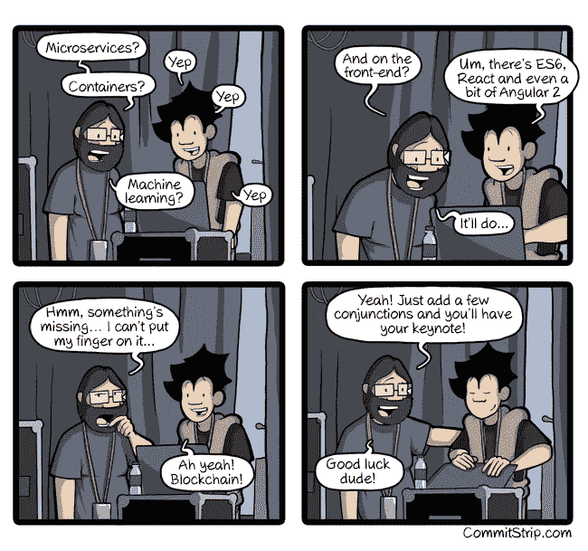
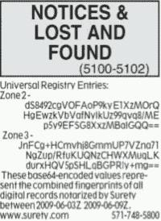
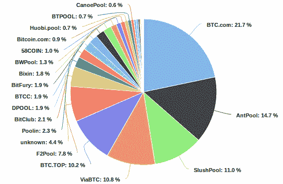
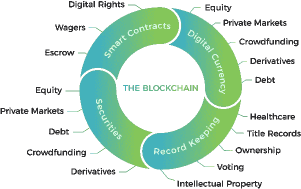
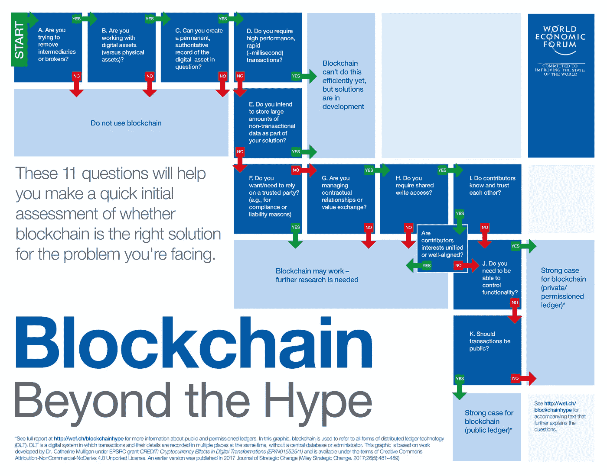

# 最先进的去中心化网络——第三部分

> 原文：<https://medium.com/hackernoon/a-state-of-the-art-of-decentralized-web-part-3-7d901e09d06f>

## 3.**区块链和智能合约**

本文是关于 web 去中心化系列文章的第三章。在这里，我们将关注今年最热门的流行语之一:**区块链**。虽然它具有真实和不容置疑的潜力，但它也有很大的局限性。我们将看看主要的公共区块链(意味着每个人都可以使用)，看看它在项目中什么时候是一个聪明的选择。

[Coder bingo, CommitStrip](http://www.commitstrip.com/en/2016/06/20/coder-bingo/)

# 系列文章

1.  [简介 ](https://hackernoon.com/a-state-of-the-art-of-decentralized-web-part-1-54f70fdb7355)
2.  [**文件存储**](https://hackernoon.com/a-state-of-the-art-of-decentralized-web-part-2-ea630917332a)
3.  ***区块链和智能合约***
4.  [**数据库**](https://hackernoon.com/a-state-of-the-art-of-decentralized-web-part-4-212732f74894)

在继续之前，如果你不知道什么是区块链，看这个 2 分钟的视频来了解主要原则:

# 区块链简史

## 1995 年——第一个迹象

关于这件轶事，第一个已知的区块链诞生于 1995 年，它的分类账是…一份报纸。两位密码学研究人员 Stuart Haber 和 Scott Stornetta 决定使用纽约时报的*的通知和失物招领部分来标记时间戳和认证数据。如今每个人都在谈论的与区块链的联系是什么？嗯，它有相同的特征:信息被加密并存储在一个有时间戳的块中(这里是报纸的一个版本，并将被分发给网络(报纸读者)。这个过程使得伪造数据几乎不可能。事实上，人们可以打印一份过期的报纸并改变其内容。但是，通过查看许多档案来验证一个版本是否是伪造的是非常容易的。*

准确地说，存储在报纸中的信息只是一个散列，它允许验证“离线”存储的数据的完整性。否则，他们将需要更多的报纸空间！你可以在这里阅读更多关于过程[的内容。](http://surety.com/digital-copyright-protection/prove-ownership)

## 2009 年——上帝创造了比特币

比特币是一种去中心化的数字货币，由一个名叫中本聪的人在 2009 年创造。它的真实身份仍不为人所知，也像街头艺术家班克斯一样饱受争议。[在谷歌上搜索“中本聪身份”来阅读最好的阴谋论。但可以肯定的是，他现在可能非常富有，因为他一开始就开采了大约 100 万个区块(汇率波动很大，但使他成为了亿万富翁)。](https://www.google.com/search?q=Satoshi+Nakamoto+identity)

比特币的革命性在于它是去中心化的:它不属于任何银行或组织，任何人都可以成为网络的一部分。交易由网络节点通过加密进行验证，并记录在一个称为区块链的公共分布式账本中。您可能想知道，没有一个集中的可信实体，我们如何达成共识？为了实现这一点，矿工(又名完整节点，他们被奖励写数据)必须提供一个**工作证明** (PoW)，以便将新数据添加到区块链中。功率是复杂计算(耗时耗力)的结果，很容易验证。综上所述，单个节点会花费资源向区块链追加数据，其完整性可以被任何节点验证。比特币使用 [HashCash](https://en.wikipedia.org/wiki/Hashcash) PoW，不断适应计算难度。

工作证明一致性算法的两个主要缺点如下:

*   由于计算的复杂性，采矿会消耗大量的能量。尽管这种货币完全是虚拟的，但它消耗的能源比 159 个国家还多(虽然没有加起来)。这是不可持续的，也是不可取的，更令人遗憾的是，这些计算完全没有用(例如，它们对科学没有帮助)。

*   事实上，比特币全节点并没有那么分散，因为大型矿池比个体矿工有更多机会获得工作回报。以下是去年的泳池分布情况:

[Mining pools distribution](https://btc.com/stats/pool?pool_mode=year) — Last year 58% of the blocks were mined by only 4 mining pools

*   它容易受到 51%的攻击。简单来说，如果一个组织能够控制大多数的挖掘节点，他们就能够破坏整个系统的完整性。当然，这是一种非常昂贵的攻击，但鉴于目前的发行版，黑客将“简单地”必须控制一些组织才能使其成为可能。

我不会在比特币上花太多时间，它主要限于金融交易(尽管[它有一种脚本语言](https://en.bitcoin.it/wiki/Script)和[它在技术上可以编写智能合约](https://bitcoinmagazine.com/articles/yes-bitcoin-can-do-smart-contracts-and-particl-demonstrates-how/))。

## 2015 —以太坊拓展了区块链的潜力

对比特币感兴趣的程序员 Vitalik Buterin 看到了这种加密货币背后的技术的更广阔的潜力。他和他的团队引入了一种新的区块链，旨在创建**去中心化应用**。以太坊不像比特币的脚本语言那样坚持一套基本的操作，而是提供了一种图灵完整的语言。简单来说，这意味着理论上你可以在一个**智能契约中解决任何计算问题，**假设你有足够的计算资源。让我们明确一点，你将比在大多数语言中更快地面临计算限制，因为在以太坊中执行代码是有成本的(称为 **gas** )，并且将花费更多的时间。因此，保持程序的低复杂性(避免嵌套循环或大量迭代的循环)取决于开发人员。

智能合同可以用各种语言编写，最流行的是 [Solidity](https://solidity.readthedocs.io/) 。然后它们被编译成以太坊特有的字节码，并在**以太坊虚拟机** (EVM)中执行，类似于 Java。智能合同的概念在你的头脑中可能仍然是抽象的。如果你对智能合同很好奇，这里有一些例子。

在编写智能合同时，安全性是一个首要问题，因为你是在和钱打交道，一个小小的漏洞可能会产生巨大的影响。一个好的做法是重用已经审计过的库，而不是自己写所有的东西。看一看 **OpenZeppelin** ，可能是最受欢迎的一个:

 [## OpenZeppelin

### OpenZeppelin 是一个构建安全智能契约的开源框架。降低您的…中的漏洞风险

openzeppelin.org](https://openzeppelin.org/) 

此外，在处理以太坊时，开发管道可能会很麻烦。Truffle Suite 提供了一些可以让你的生活变得更简单的工具:一个 IDE，一个测试管道，一个升级你的合同(包括迁移)的简单方法，以及一个为你的测试创建一个新的区块链的工具。是以太坊开发者的瑞士军刀。

 [## Truffle 套件|智能合约的绝佳工具

### Truffle 工具套件使得 dapp 开发更加容易和一致。

truffleframework.com](https://truffleframework.com) 

所以，以太坊看起来很神奇！你可以在上面编码任何东西，这使得理论上分散任何应用程序成为可能！现在让我们来看看**的主要限制**:

*   **环境灾难**。至于比特币，以太坊使用了一种**工作共识算法**，并且由于其电力消耗而具有相同的环境影响问题。好消息是，他们计划在 2019 年转移到**股权证明** (PoS)(项目名称:Casper)。这是什么？好吧，与其解决耗时耗力的计算，矿工(这里称为验证者)将不得不存放一定数量的令牌，只要他们在采矿，这些令牌就会被持有。然后，他们将根据两个因素得到一些区块进行验证:**赌注的数量**(你输得越多，你就越被认为是值得信任的)和**一定程度的机会**(否则只有最富有的人才能验证区块)。
*   **缓慢**。处理一笔交易大约需要 [15 秒。对于某些特定的用例来说，这可能是可以接受的，但是不要分散已经存在的应用程序。但是 PoS 应该通过将时间减少到 1 秒来解决这个问题。](https://etherscan.io/chart/blocktime)
*   **可扩展性**。目前，以太坊每秒最多可以支持 15 笔交易(每天 130 万笔交易)。与它的潜在用途相比，这实在是太低了。相比之下，VISA 系统每秒可以处理 24000 笔交易(理论上)。好消息是，以太坊的目标是通过结合两种技术解决方案将这一限制提高到 100 万 TPS:**分片**和一个名为**等离子**的项目。第一种方法是将网络分割成只处理某些事务的片段(而不是处理所有事务)，第二种方法的目标是在侧链上进行一些事务，从而释放主链。Casper 计划在 2019 年到来，而我们必须等到 2020 年或 2021 年才能看到 sharding。
*   **成本**。每笔交易都有一个价格，叫做**气**，具体多少取决于合同的复杂程度。用户已经习惯了免费和无限制的互联网，所以必须为你日常生活应用中的每一笔交易付费可能是一个严重的障碍。[的平均油价几乎是 0.01 美元](https://ethgasstation.info/)。在一个聊天应用程序中，每条发送的消息都是一个交易，使用以太坊的成本会很高！

虽然以太坊还有很多问题需要解决，以允许他们的愿景，但他们已经为几乎所有事情制定了计划。但是必须等待 1 或 2 年才能看到这些问题得到解决，如果一切顺利，将他们置于危险的境地。

## 2018 — EOSIO，类固醇上的以太坊？

EOSIO(或简称 EOS)的目标与以太坊非常相似。因此，我将重点介绍它的不同之处，而不是完整的描述:

*   智能合约正在 [**WebAssembly**](https://webassembly.org/) (缩写为 Wasm)虚拟机内执行。简而言之，它是一种新的 web 标准，允许网站在沙箱内的浏览器中运行本机代码。Wasm 可以成为 Javascript 的并行前端开发。理论上，你应该能够用这些语言中的任何一种来编写 EOS 智能合约(但是目前 C、C++和 Rust 似乎是最受支持的)。
*   EOS 使用**委托利益证明** (DPoS)作为共识算法。它与 PoS 非常相似，除了块生产者的数量有限(21)。尽管将所有权力交给 21 actors 似乎非常冒险，但它依赖于可以投票解雇不受信任的制片人的社区。这是一种新的范式，因为共识算法是民主和 21 名代表(真实身份已知)之间的确定性算法的混合体。有趣的事实:EOS 有一个[社区写的宪法](https://github.com/EOSIO/eos/blob/37ce45c0b60d2710569c2d1a9229945cc0e855a9/governance/constitution.md)(任何改变都可以应用于 15/21 的投票者)。
*   最后一点可以让 EOS 获得**好得多的性能**:高达 6000 TPS，一次交易只需要 1 秒左右。
*   EOS 提出了一个**免费的经济模式**(不需要支付天然气来进行交易)，天然气生产商将获得每年通货膨胀 1%的奖励。
*   EOS 还带来了一些更高级的功能，如帐户/密码恢复、人类可读的用户名(而不是一些长的十六进制地址)和文件存储解决方案。这些功能通常由第三方服务提供，将它们集成在一起是一个有趣的尝试。

对 EOS 最大的批评之一是它是**太集中**。他们肯定在做一个有趣的权衡，现在知道这个选择是否可行还为时过早。另一方面，它可能会使 **EOS 进化得更简单**。在许多区块链，一些重要的演变需要突破性的改变，这导致社区分裂成两部分:那些想继续旧制度的人和那些接受演变的人。拥有一些代理应该理想地提供更多的灵活性。你可以在这里阅读更多关于不同种类叉子的信息[。](https://vitalik.ca/general/2017/03/14/forks_and_markets.html)

EOS 背后的公司已经关闭了一个 40 亿美元的 ICO 来开发生态系统。这个项目背后的团队也很有名(首席技术官丹尼尔·拉里默曾创建过 BitShares 和 Steemit)。他们的项目非常雄心勃勃，因为他们的主要并行已经是许多区块链项目事实上的解决方案。2019 年肯定会是有趣的一年，这两个平台可能都必须激励用户和开发者加入其中。

还有许多其他竞争对手，如 [HyperLedger](https://www.hyperledger.org/) 或 [Lisk](https://lisk.io/) ，我可能忘记了一些主要的。欢迎在评论中分享你的想法。

# 什么时候应该使用区块链？

首先，即使我们关注**公共(或无权限)区块链**，因为它们旨在分散应用程序的逻辑，您也应该知道还有另一种:**有权限(或私有)区块链**。它们在一个不是任何人都可以参与的项目中是有用的。这两种之间的界限并不明显，也有半发射区块链。

总而言之，区块链的主要好处如下:

*   **无中心权威**:使用系统时，不需要信任第三方，一切都是可验证的、透明的。
*   **数据不变性**:一旦写在链上，理论上是不可能更改的(除非遇到攻击)。
*   **真实的单一来源**:由于区块链的结构，你可以可靠地知道一个令牌是属于一个用户还是另一个用户。

这些特性使得区块链对构建可追溯系统特别感兴趣(例如在供应链中)。但是你也可以用它来构建一个去中心化的应用程序的逻辑:它帮助你摆脱通常在你的服务器上运行的代码。

这是区块链应用程序的前景:

[Source](https://www.quora.com/What-are-the-coolest-blockchain-projects-as-of-January-2018/answer/Diana-Maltseva-1)

那么你应该什么时候使用它呢？你会发现很多决策树帮助你决定是否应该在项目中使用区块链。我发现这一个特别相关:

[More details](http://www3.weforum.org/docs/48423_Whether_Blockchain_WP.pdf)

然而，我有点不同意第五个问题:

> 您是否打算在解决方案中存储大量非事务性数据？

如果你读了《T2》关于文件存储的第二章，你就会知道存在以分散方式存储大量数据的解决方案。然后就有可能在区块链上存储交易和一些离线的加密文件。

# 区块链也带来了很多复杂性

虽然区块链有巨大的潜力，但不要忘记它会使你的应用变得复杂:

## 进化将是复杂的

升级你的智能合约并不容易。拥有一个好的架构并从第一天开始就考虑要实现的所有特性是非常重要的。

## 安全是重中之重

正如我们之前所看到的，一个简单的错误可能会造成巨大的损失，并且您无法像使用集中式服务器那样轻松地修复它。这就是为什么安全性必须是首要任务，并且您应该在部署智能合同之前对其进行审核！

## 更复杂的架构

由于性能和成本问题，您无法在智能合约中处理应用程序的所有逻辑。您还需要经常从第三方 API 收集数据。为了用区块链实现这种事情，你将不得不使用**神谕**:

> 在区块链世界中，oracle 是一个单向数字代理，它查找和验证真实世界的数据，并以加密方式将这些信息提交给查询智能合约。oracle 不是数据源本身*，而是与数据源&区块链*交互的层；它是由第三方 API 提供的信息的翻译器，将被添加到区块链中。有了 oracles，智能合约就有了与区块链环境之外的数据进行交互的途径。
> — [区块链甲骨文:它们是什么&为什么它们是必要的](/@jesus_notchrist/blockchain-oracles-af3b216bed6b)

# 一堆很酷的区块链项目

## 有气泡的

[嘶嘶](https://fizzy.axa/)是一款**航班延误险**。如果你订阅了它，它会自动从航空公司收集航班数据，并在你的飞机延误时立即补偿你。我喜欢这一条，因为它给通常极难破解的保险合同带来了透明度。如果你对技术实现感兴趣，可以看看[这篇文章](/@humanGamepad/fizzy-axa-smart-contract-explaind-740df52894fd)。

## 泡沫

[FOAM](http://foam.space/) 正在引入一个基于**位置证明**的**加密映射**解决方案。我们已经有 GPS 了，还有什么意义？嗯，GPS 是一种设备知道自己位置的方法，但另一个参与者没有办法验证设备提供的坐标是否真实(它很容易伪造它们)。FOAM 依靠信标网络，通过验证设备位置来获得令牌。当与 IOT 一起使用时，这可能特别有趣。

## 放射本能

是一个**对等能源网络**。它允许你在一个微电网中以安全和透明的方式从你的邻居那里购买和出售能源。有趣的是，去中心化也可以应用于互联网以外的其他网络。