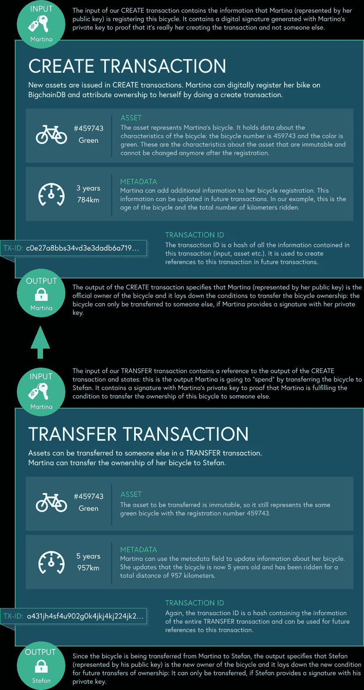
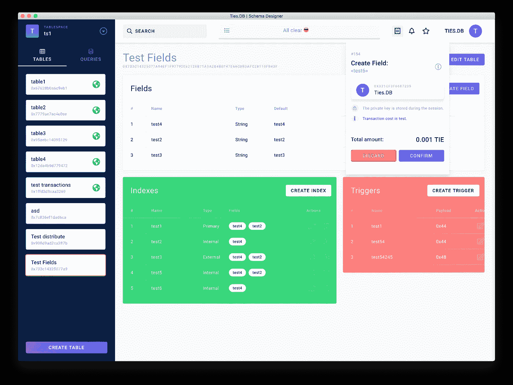

# 去中心化网络的艺术状态——第四部分

> 原文：<https://medium.com/hackernoon/a-state-of-the-art-of-decentralized-web-part-4-212732f74894>

## 4.数据库

这是关于 web 去中心化系列的第四章，也是最后一章。正如我们在[上一章](/@christophe.bougere/a-state-of-the-art-of-decentralized-web-part-3-7d901e09d06f)中所看到的，区块链和智能合约非常适合存储某些特定用例(如金融交易)的记录，但它们不会取代您的整个数据库。在这里，我们将重点关注**分布式和分散式数据库**:当前的候选数据库是什么，它们如何相互比较。然后，我们将结束这一系列并回顾我们所学的内容。

[SQL, that good old friend!](https://xkcd.com/327/)

# 系列文章

1.  [简介 ](https://hackernoon.com/a-state-of-the-art-of-decentralized-web-part-1-54f70fdb7355)
2.  [**文件存储**](https://hackernoon.com/a-state-of-the-art-of-decentralized-web-part-2-ea630917332a)
3.  [**区块链和智能合约**](https://hackernoon.com/a-state-of-the-art-of-decentralized-web-part-3-7d901e09d06f)
4.  ***数据库***

# 介绍

这一次，让我们从一个定理开始——**上限定理**:

> CAP 定理指出，分布式数据存储不可能同时提供以下三种保证中的两种以上:
> - **一致性**:每次读取都接收到最近的写入或错误
> - **可用性**:每个请求都接收到(无错误)响应，但不能保证它包含最近的写入
> - **分区容差**:尽管节点之间的网络丢弃(或延迟)了任意数量的消息，系统仍会继续运行

这个定理并不完美，但它很简单，让你一目了然地了解设计的权衡。这将有助于我们对不同的候选人进行分类。

此外，如果你不知道我们在谈论什么，这里有一个很好的介绍:

 [## 分散和分布式数据库，解释

### 1.数据库是信息或数据的有组织的集合。如今有大量的信息流，而且…

cointelegraph.com](https://cointelegraph.com/explained/decentralized-and-distributed-databases-explained) 

一切都好吗？现在让我们来看看这 5 种解决方案:

1.  [枪](#1ee5)
2.  [通量](#4c1f)
3.  [Bluzelle](#eed1)
4.  [BigchainDB](#b57e)
5.  [领带。DB](#d3aa)

# 1.枪

[https://gun.eco](https://gun.eco/)

枪是:

*   一个**实时**，**分散**，**离线的第一个**，**图形**数据库。
*   **AP** :保证**可用性**，**分区容差**，但只有**最终一致性**。它让实时应用变得特别有趣(聊天、在线游戏、IOT 上的实时传感器可视化等)，但在一致性至关重要的时候，比如在银行业，你可能应该避免使用它。在这里阅读更多。
*   **存储无关**。当前的适配器包括文件存储、本地存储(在浏览器中)、IPFS 和 S3。
*   用 **JavaScript** 编码，超级好用(见 [API 文档](https://gun.eco/docs/API))。
*   **高可伸缩性**:每秒能够完成 2000 万次以上的 API 操作。
*   风投支持的[2018 年融资 150 万美元](https://techcrunch.com/2018/05/23/gun-raises-more-than-1-5m-for-its-decentralized-database-system/)。

路线图可在[此处](https://gun.eco/docs/Roadmap)获得。

请注意，GUN 可以在没有任何服务器的情况下使用(对等方发现除外)，但数据将只保存在浏览器本地存储中。因此，如果您需要数据持久性，您应该始终保持几个节点运行。

> 宇宙并不是强烈一致的

GUN 通过关注实时和离线能力进行了有趣的权衡。如果你想理解为什么[这个演示](https://gun.eco/distributed/matters.html)以简单有趣的方式很好地解释了利弊。枪可能不适合每一个应用，但它绝对值得一看！

# 2.神秘的影响

 [## 有效的分散式数据处理。

### 开发人员可以使用 Fluence network 在区块链上创建一个无信任的查询层，使区块链数据…

流量.网络](https://fluence.network/) 

Fluence 最初是一个分散的数据库网络，[最近转变为以太坊区块链上的**无信任查询层。**](/fluence-network/fluence-new-direction-and-the-first-proof-of-concept-cced6e4656e9)

> Fluence 创建了一个独立的网络，对于每个查询、安全模型和密码经济学设计都有自己的分散共识。该网络经过优化，可在不牺牲安全性和性能的情况下检索和处理来自分散来源的数据。数据库、查询语言和任意算法可以被创建和部署到 Fluence 网络，并且可以在 Fluence 虚拟机上完全分散地运行。

借助 Fluence，您将能够使用 SQL、GraphQL 或自定义查询语言从区块链和冷存储(以太坊群，IPFS)中查询数据。

注量为 CP ( [见此处](https://www.reddit.com/r/Fluence/comments/99cvwb/fluence_first_ama/e53bm1k))。主网络应该很快就可以使用了([路线图](/fluence-network/fluence-new-direction-and-the-first-proof-of-concept-cced6e4656e9#041e))。

同样，您可能会对 [**EthQL**](https://github.com/ConsenSys/ethql) 感兴趣，这是一个以太坊的 GraphQL 接口(这里我就不详述了，因为它依赖于一个集中式服务器)。

# 3.布鲁泽尔

 [## Dapps 的分布式数据库

### 将 Bluzelle 添加到您的技术堆栈中，它是基于以太坊区块链技术构建的分布式数据库；由开放的……

bluzelle.com](http://bluzelle.com/) 

Bluzelle 提供了一个 **NoSQL 键值存储分散数据库**和一个 **CRUD API** 。与[许多文件存储解决方案](https://hackernoon.com/a-state-of-the-art-of-decentralized-web-part-2-ea630917332a)类似，节点可以因托管数据而获得 **BLZ 令牌**。如果你是消费者，你在 swarm 中使用相同的加密货币租用数据存储。Bluzelle 也是[开源](https://github.com/bluzelle/swarmDB)。

您可以[创建自己的客户端](https://devel-docs.bluzelle.com/client-development-guide/)通过 WebSockets 与数据库通信，或者使用[现有的 Node.js 客户端](https://devel-docs.bluzelle.com/bluzelle-js/quickstart)。可用操作与其他 NoSQL 数据库非常相似。

Bluzelle 仍处于测试阶段，你可以在 TestNet 上免费试用。

# 4.BigchainDB

 [## 区块链数据库。

### 凭借高吞吐量、低延迟、强大的查询功能、分散控制、不可变的数据存储和…

www.bigchaindb.com](https://www.bigchaindb.com/) 

> BigchainDB 具有高吞吐量、低延迟、强大的查询功能、分散控制、不可变的数据存储和内置的资产支持，就像一个具有区块链特征的数据库。

BigchainDB 在数据库中引入了一个新的范例。它以资产为中心(而不是以表或文档为中心),支持两种事务:创建和转移:

[Key concepts of BigchainDB](https://www.bigchaindb.com/developers/guide/key-concepts-of-bigchaindb/)

BigchainDB [现在由](https://blog.bigchaindb.com/the-next-evolution-for-bigchaindb-software-a104185a8763) [IPDB 基金会](https://ipdb.io/)在管理，该基金会提供测试网并维护开源代码库。一堆驱动程序有不同的语言版本，还有一个 [GraphQL 接口](https://github.com/bigchaindb/js-bigchaindb-graphql)。

现已推出 [v2.0.0b9](https://github.com/bigchaindb/bigchaindb/releases/tag/v2.0.0b9) 。如果你想更进一步，看看这个介绍。

# 5.领带。分贝

 [## dApps 的首个分散式公共数据库

### 世界上第一个分散的公共智能数据库

tiesdb.com](https://tiesdb.com/database) 

> 一个公共的、分布式的、去中心化的数据库，有一个共同的主线:信任。通过集成容错、激励机制和智能合同来实施。

就像布鲁泽尔领带一样。DB 通过向节点支付**绑定令牌**来激励节点处理查询和托管数据。目前，该网络与以太坊整合，但他们计划在未来与其他区块链整合。领带。DB 是 [AP](https://github.com/TiesNetwork/ties-docs/wiki/Where-do-decentralized-applications-store-their-data%3F#distributed-databases) 。你可以在这里试试 alpha 版[。](https://github.com/TiesNetwork/ties.db/releases/tag/0.1.2-ALPHA)

您可以使用 [Node.js 客户端](https://github.com/TiesNetwork/ties-docs/wiki/Usage-examples-%28NodeJS%29)(带有一些类似`putField`的功能)或者使用 [TiQL](https://github.com/TiesNetwork/ties-docs/wiki/TiQL) (一种类似 SQL 的查询语言)获取数据。

提供[用户友好的 GUI](https://github.com/TiesNetwork/ties.db-explorer/releases/tag/v0.1-alpha) 的加分点(类似于 MySQL 的 phpMyAdmin):

[Ties.DB explorer](https://github.com/TiesNetwork/ties.db-explorer)

# 结论

我们已经了解了去中心化网络的 3 个最重要的组成部分:

*   如何存储文件
*   如何取得共识
*   如何存储关系数据

那么这些技术的现状如何呢？你应该以分散的方式开始你的新项目吗？

在我看来，这取决于你的项目。我们仍然处于网络去中心化的非常早期的阶段，与当前的网络相比，这是一个全新的范例。

如果你正在做一些实验性的东西，那就去做吧，选择这些技术中的任何一种。你会学到很多东西。尽管有些工具暂时还不稳定，但随着时间的推移，它会变得越来越好，你将成为其中的一员！

如果你的项目不以创收为目的，但你需要存储大量数据，我会建议在 IPFS 上分散存储层。您将节省大量资金，并且仍然拥有极其可扩展的东西。你可以要求你的社区托管一些 IPFS 节点。此外，如果你的项目因为某种原因终止，用户仍然可以访问他们在 IPFS 上的数据。

如果您的项目需要实时数据，但不需要很强的一致性(比如聊天)，您应该考虑使用 GUN。它真的很好用，看起来相当稳定，已经被大型 dApps 使用。

关于区块链， [2018 年见证了许多真正有趣的项目死去](https://www.technologyreview.com/s/612507/ethereum-thinks-it-can-change-the-world-its-running-out-of-time-to-prove-it/)。大多数时候，原因并不是“区块链适合这个目的吗？”但是“为此付出区块链带来的所有复杂性值得吗？”。我坚信，在未来几年里，区块链将会继续发展，变得越来越好。然而，开始将它用于各种用途可能还为时过早。仍然有一些很好的理由使用区块链来开始一个项目，这取决于每个人的平衡。但是如果你愿意使用区块链只是为了可追溯性的目的，类似 BigchainDB 的东西或许可以以更简单的方式提供你所需要的东西。

此外，我建议您关注一些项目，这些项目正在开发一个抽象层，使开发人员更容易与分散技术集成。他们还很年轻，但是如果他们能够实现他们的承诺，构建一个 dApp 就像开发一个普通的应用程序一样简单！以下是我最喜欢的三个:

*   [DADI](https://dadi.cloud) :分散式云提供商。他们的路线图包括存储、计算层、CDN、API、队列，以及您需要的一切。
*   [Blockstack](https://blockstack.org/) :类似于 DADI，但仅限于身份和存储。
*   [纺织](https://github.com/textileio/):在 IPFS 的基础上构建他们的[照片 dApp](https://www.textile.photos/) 时，他们面临许多问题，比如身份管理、将文件锁定在 IPFS、通知、如何让它在移动设备上工作……所有这些都可以在他们的 [go-textile 框架](https://github.com/textileio/go-textile)中找到。他们还提供了一个 [React Native SDK](https://github.com/textileio/react-native-sdk) 。

以上就是我的全部内容，感谢阅读！欢迎在评论中分享你对网络去中心化的想法和实验。