# 在 Mainnet 上购买 ENS 域名的逐步指南

> 原文：<https://medium.com/hackernoon/a-step-by-step-guide-to-buying-an-ens-domain-on-mainnet-5109572ef2bf>

[ENS domain manager](https://manager.ens.domains/)

## ENS 最近发布了其[永久注册服务商](https://docs.ens.domains/permanent-registrar-faq)。随之而来的是在获取顶级 ENS 域名的过程中的一些重大变化。在这篇文章中，我将带你通过购买域名，设置域名，以及如何通过他们的新过程，一步一步地创建子域。

不太清楚 ENS 是如何工作的？看看[这个介绍](https://youtu.be/FPpSZyWRMFg)ens 的快速视频。想从测试网开始吗？看看这个[测试网](/@vonnie610/a-step-by-step-guide-to-ens-domains-on-testnets-mainnet-3f549fcf1f1f)的操作指南。

# 索引:

1.  准备:[开始前需要的一切](/p/5109572ef2bf#b9f4)
2.  步骤 1: [检查名称可用性](/p/5109572ef2bf#2dd4)
3.  第二步:[购买 ENS 域名](/p/5109572ef2bf#7ea8)
4.  步骤 3: [设置您的域名](/p/5109572ef2bf#cb81)
5.  第四步:[子域](/p/5109572ef2bf#518f)
6.  [在 dApp 中实施 ENS](/p/5109572ef2bf#e8ef)

# 准备:开始前你需要的一切

开始之前，有几件事你应该知道并准备好:

*   您的域名。在某个地方输入，拼写检查，当你需要的时候，复制+粘贴。
*   您希望您的域名解析到的地址，即您的域名将“等于”什么地址。
*   您希望成为其域名所有者的地址。这应该是您用来进行所有交易的帐户，尽管您可以轻松地转移所有权。你还需要在这个账户里有乙醚，我想说至少 0.1，但这取决于你想拥有这个名字多久。

# 步骤 1:检查名称可用性

确保元掩码指向 mainnet。前往官方 [ENS 域名管理器](https://manager.ens.domains/)，搜索你想要的域名。如果您的域名不可用，您可以尝试请求域名(为域名所有者提供资金)。否则应该是这样的。

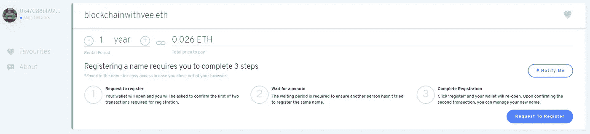

An available searched name

# 第二步:购买域名

选择您想要租用名称的时间长度。新的永久注册商的设立方式意味着购买域名比以前便宜得多。

一旦您选择了租赁期，请单击“请求注册”。第一个事务是连接到 ENS dApp 并请求注册名称。这不应该是一笔昂贵的交易。可爱的绿色加载栏代表等待期，这可能是检查该名称没有在旧的注册商注册。

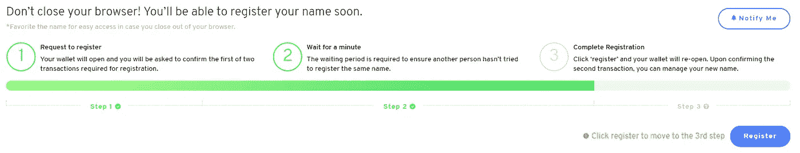

The waiting period is now over, and you can continue with the registration.

点击“注册”将触发另一个交易。该交易将支付您之前选择的租赁费用。如果你的交易失败，增加你的汽油。

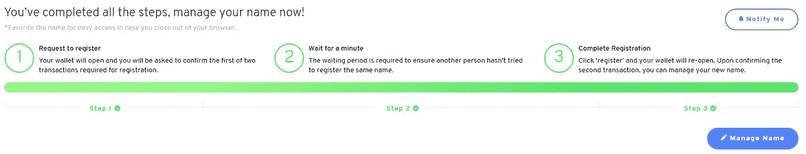

A successfully purchased domain

**注:**注册或转让给新的永久注册服务商和 NFTs 的名称。这意味着你要转移 NFT 的域名。这也意味着你可以通过检查你的钱包来确认你的名字。

# 步骤 3:设置您的域

在您刚刚进入的同一个页面上，单击“管理名称”。

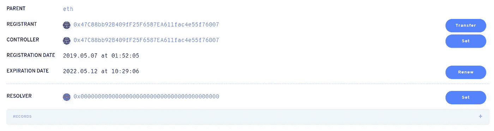

The name manager interface

我们要做的第一件事是设置解析器地址。点击空白解析器地址对应的“设置”按钮。

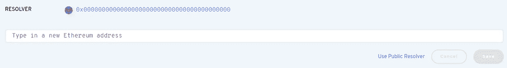

Setting the resolver address

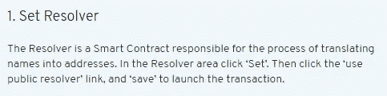

Learn how to manage your name

我们想点击“使用公共解析器”。如果你想让[做一个自定义的解析器](https://docs.ens.domains/contract-developer-guide/writing-a-resolver)，这个可以在以后修改。这应该会触发一个交易。如果您的解析器地址与下面的不同，请不要担心。

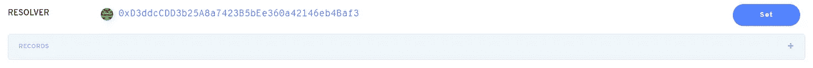

现在，我们将添加一条记录。当您点击“+”时，您应该会看到下面的截图。在下拉列表中选择“地址”，然后复制粘贴您希望您的域解析到的地址(您希望您的域“等于”的地址)。然后点击“保存”。这应该会触发一个交易。

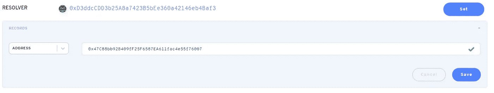

Adding an address as a record.

一旦你的交易成功挖掘，它会要求你设置你的反向记录。您在上一步中输入的地址应该是灰色的，其下有您的域名。这是设置您的域名反向解析到的地址。一旦你非常确定这是你希望你的名字解析的地址，点击“保存”。这也应该触发一个交易。

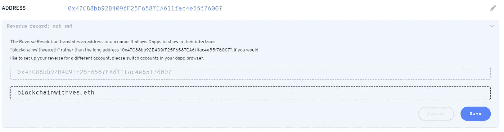

Setting the address your ENS domain name will resolve to

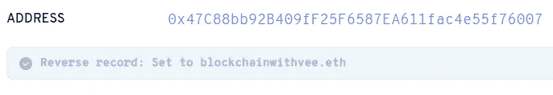

Your ENS domain is all set up!

当事务成功挖掘时，您应该得到一点确认。

# 步骤 4:子域

切换到子域选项卡(在顶部，域名的对面)。

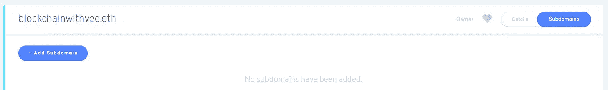

The subdomain tab

继续“添加子域”。您为子域输入的标签后面不需要跟着您的域名。

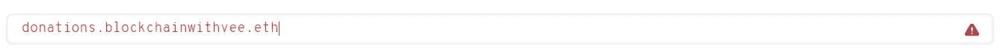

Don’t: add your domain after the subdomain

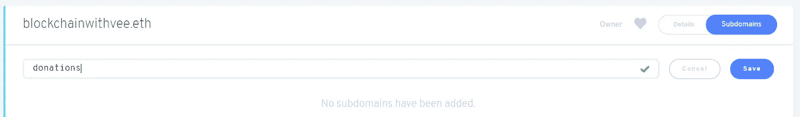

Do: just write down the subdomain

点击保存。这将触发一个交易。当你的交易开矿时，子域应该出现在“添加子域”按钮下面。点击你的新子域名。

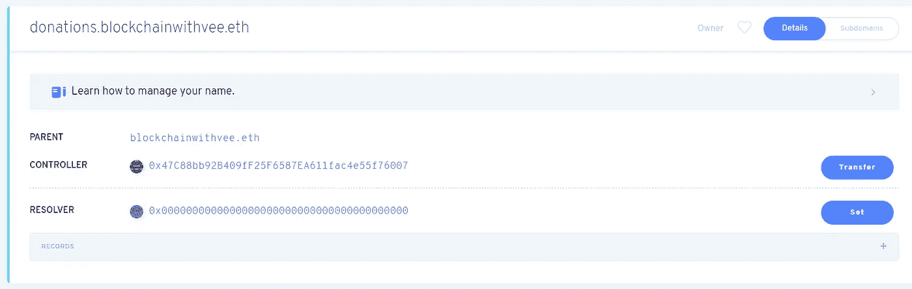

Manager page for your subdomain

我们需要设置解析器，再次使用公共解析器(这是相同的过程)。设置好解析器后，我们将添加一条记录，这与您为您的域添加记录的过程完全相同。

"+"添加记录>在下拉菜单中选择"地址" >粘贴您希望本子域解析的地址>保存"，批准交易。那么您应该会收到下面的消息:

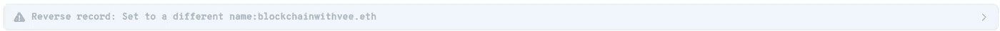

Message drop down

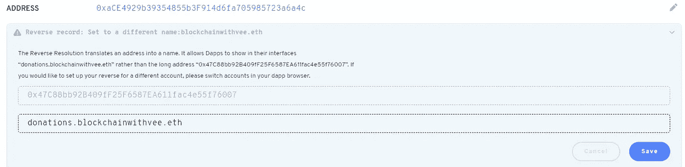

The message dropped down

点击“保存”，批准交易，然后您就完成了！

# 在 dApp 中实施 ENS

想知道如何在 dApp 中实现 ENS 吗？看看我做的这个[repo](https://github.com/Nicca42/Ethereum/tree/master/Educational/SimpleBankWithENS)，展示了 ENS 实现的基础，创建子域和如何使用 javaScript 的好处。

**Endnote:如果你想获得我正在介绍的下一个工具的更新，或者如果你只是想联系，我在 Twitter 上活跃着******，或者** [**在 Medium 上关注我这里**](/@vonnie610) **。****