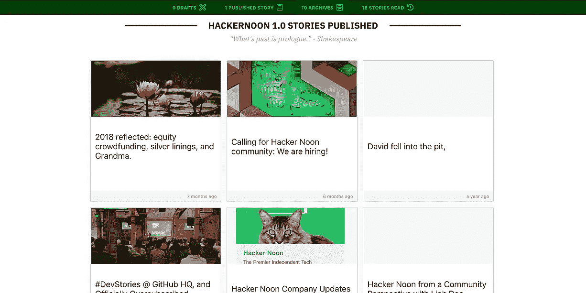

# 一步一步的指南，以连接您的媒体帐户到您的黑客中午帐户

> 原文：<https://medium.com/hackernoon/a-step-by-step-guide-to-connect-your-medium-account-to-your-hacker-noon-account-889fe68a190d>

## 这是[如何从](https://hackernoon.com/tagged/how-to-hackernoon)[黑客中午支持](https://hackernoon.com/@support)系列的一部分。

你好！所以你到了 hackernoon.com 的 T4，可能会对我们的新软件感到有点不知所措。你可能想知道所有过去的故事都在哪里，为什么你在你的新作家个人资料中看不到它们。放心吧！我们支持你。阅读本指南，了解如何轻松地将您的 Medium 帐户连接到您的 Hacker Noon 帐户，并在一个地方查看您的所有故事。

**第一步**

*   [注册](http://auth.hackernoon.com)一个黑客正午账号([更多帮助](https://hackernoon.com/a-step-by-step-guide-to-connect-your-medium-account-to-your-hacker-noon-account-j02fo32rw))，或者，
*   [如果您已经在](https://help.hackernoon.com/app/page/1WCN6t2qyL7hwyvayz0Di3XxYJvMxZYPb1MaJwItPbd0)[社区](http://community.hackernoon.com/)或我们的测试版网站拥有账户，请登录进入 Hacker Noon。

***注意:*** *你不用你的介质账号登录。你把你的介质账户和你的黑客中午账户连接起来。*

**第二步**

用你的名字、头像&更新你的个人资料。

**第三步(可选):**

利用我们的作家广告专题发出自己的[行动号召](https://hackernoon.com/how-do-i-optimize-my-hacker-noon-profile-hackernooncta-6g8hx3z1e)

**第四步(重要)**

[更新你的社交链接](https://help.hackernoon.com/app/page/19idJB9GT0BTmdTGLMJcHQH_6NYCm3F_Tv0C8fJoHABQ)。请务必在此处输入您的媒体句柄(@)后的所有内容)

**第五步**

刷新页面，看看您是否看到类似于[您的仪表板](http://app.hackernoon.com/)中的特征图像。

如果您的部分或全部故事缺失，请填写下表:[https://hackernoonstorymissing.paperform.co/](https://hackernoonstorymissing.paperform.co/)。我们会尽快回复你。

您的电子邮件可能尚未在我们的系统中验证。这个表格会帮到我们。你也可以发邮件给我们:【Support@HackerNoon.com】T2。

**第六步:**

如果您想提交草稿，请随意[提交](https://help.hackernoon.com/app/page/1-wg7bxonxAFWdTYl5G4gJwvWLo0iWfBi-XKbdjcYva0):)我们的编辑最多会在 3 天内与您联系:)

就是这样，伙计们:)迁移是艰难的，我们要求你们在这段时间里对我们有耐心。关于 Medium 的更多问题，请查看我们的另一个故事:[你需要知道的关于 Hacker Noon 从 Medium 软件转型的所有事情](https://hackernoon.com/all-you-need-to-know-about-hacker-noon-vs-medium-t0fg3zz4)。

> [最初发表于 Help.HackerNoon.com](https://help.hackernoon.com/app/page/1lDCt9BDTNOQDV7XsOchDBXsmnicvdwa8hw5EFopkDS4)