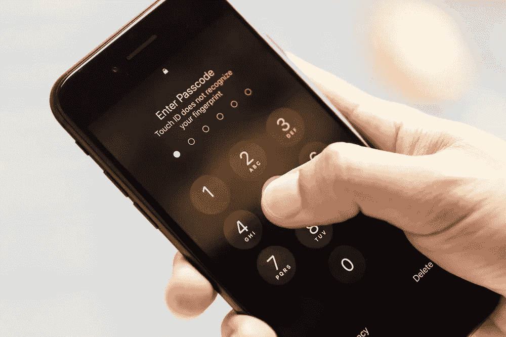
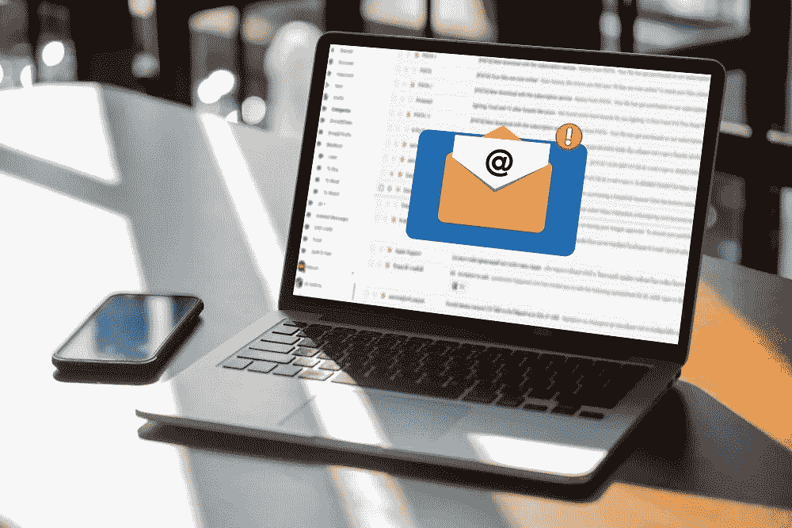
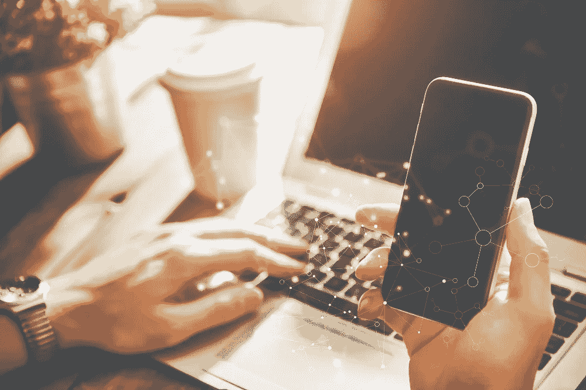
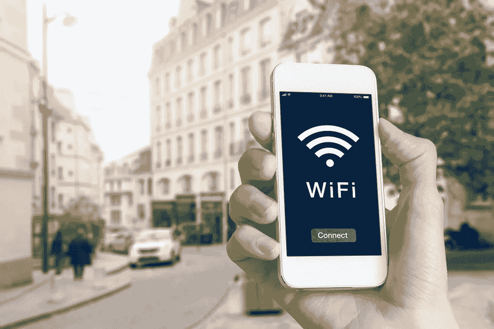

# 保护智能手机数据安全的简单指南

> 原文：<https://medium.com/hackernoon/a-straightforward-guide-to-keep-your-smartphone-data-safe-6b8f6b5fddc0>

Photo: polymanu / Adobe Stock

很明显，智能手机对人们来说已经变得相当重要。如今，很难找到一个没有智能手机的人，而且这个数字还在继续增长。

随着拥有量的增加，人们对这些设备的依赖也在增加，使它们对其他人来说变得[有价值](https://www.cnet.com/news/your-smartphones-are-getting-more-valuable-for-hackers/)。您的设备包含个人数据、密码、信用卡号码等更多信息。你们中的一些人甚至可能在手机里有加密货币钱包。

如果您不采取这里指出的适当的安全预防措施，所有这些数据都可能在任何时候被窃取。

# 智能互联网使用

Photo: adiruch na chiangmai / Adobe Stock

重要的一步是学会如何安全地使用互联网。为了确保网上安全，你可以做很多事情，比如确保不要打开来自陌生地址的电子邮件。恶意软件有时会出现在电子邮件中，所以屏蔽你的电子邮件有助于保护你的安全。

重要的是，当你在网上浏览时，一定要访问声誉好的网站。您应该远离提供可疑材料的网站，例如盗版文件，这可能会使您遭受恶意软件或病毒的攻击。尽你所能坚持流行的网站，因为他们通常有更高的机会是安全的网站。

# 下载一些保护

你的电脑上可能有一个很好的恶意软件和病毒扫描程序。这些程序有助于在您使用计算机时保护您的安全，并且可以对您的智能手机执行同样的操作。如前所述，有一些邪恶的人开始意识到入侵你的智能手机是多么的有价值，而你并不希望这样。

你能做的最好的事情是下载软件，帮助保护你免受恶意软件、病毒和其他可能将你的数据暴露给黑客的攻击。一些应用程序提供收费保护，但也有一些是免费的。最后，你必须决定是否花钱保护自己，因为这是你的个人数据。

有加密货币的肯定要下载最好的安全软件，因为你的加密货币钱包里的钱没有保险，所以如果被盗了，那就根本没了。

# 智能手机服务很重要

Photo: Konstantin Yuganov / Adobe Stock

下一件需要注意的事情是你的手机服务。每种服务都提供一定程度的安全，有助于保持你的个人数据完整，但没有一家公司是相同的，这就是为什么你需要寻找符合你需求的[最佳手机服务](https://budgetboost.co/best-cell-phone-service-provider-and-carrier-comparison/)。

重要的是要注意每个服务公司提供给客户的电子邮件验证机制的种类以及它们的 SSL 强度。您可能还想关注每家公司的安全违规历史，这将有助于您了解他们的安全性有多好。好消息是，每家公司保护客户的能力实际上是由一个名为 CSTAR 的评分系统来评定的，在这个系统中，一家公司可以得到的最高分是 950 分。

平均分在 533 左右，任何高于这个的分数对你来说都是好事。一些得分最高的公司包括 Sprint 和 Telstra，尽管还有其他一些公司。

# 公共 Wi-Fi 很危险

Photo: NicoElNino / Adobe Stock

出于一些原因，一个人将他或她的电话连接到公共 wi-fi 网络是很常见的。首先，这些网络是免费的，当你无法使用 wi-fi 连接时，它们可以保存你可以使用的数据。问题是，当你使用公共数据时，有许多人也连接到你正在连接的同一个互联网，你永远不知道是否有人在连接以监视他人。

如果你要使用[公共 wi-fi](https://lifehacker.com/top-10-ways-to-stay-safe-on-public-wi-fi-networks-1791800347) ，安装安全系统是很重要的。你也应该确保你没有使用公共 wi-fi 做任何重要的事情，比如登录你的银行账户。本质上，当您使用公共互联网时，您不希望传输任何敏感信息，如密码或其他帐户信息。

如果你在旅行时需要连接到互联网，最好的办法可能是携带一个专用的热点，这样你可以保持隐私，这应该会使你的在线活动更加安全。不使用 wi-fi 时，请务必在公共场合将其关闭，因为精明的黑客可以利用这一功能锁定你的手机。

显而易见，保护手机安全比几年前重要得多，这种保护将继续至关重要。不要掉以轻心，因为你的数据可能会被用于各种各样的事情，如数字勒索或身份盗窃，这可能会对你的生活产生不利影响。