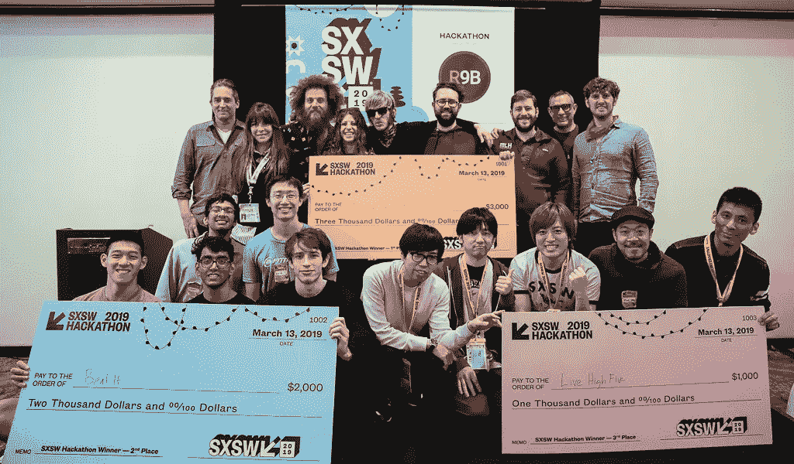
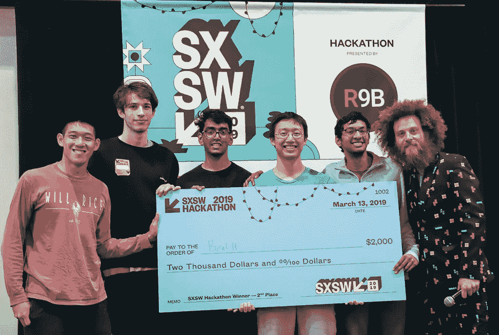
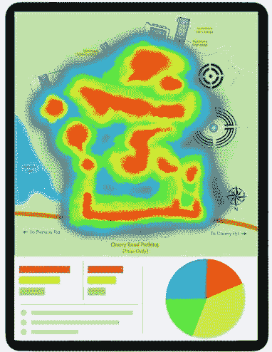
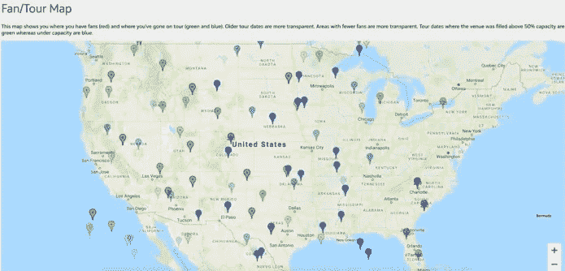
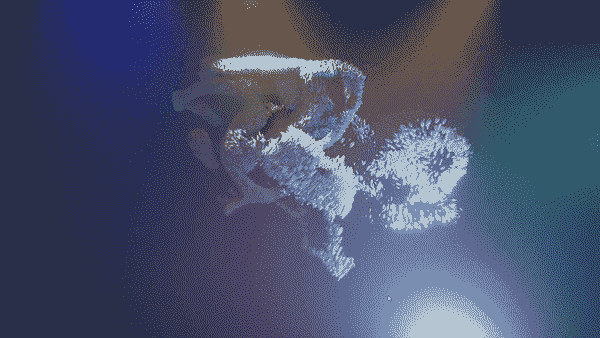
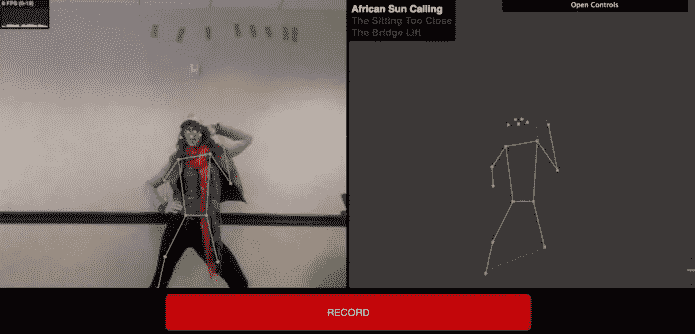
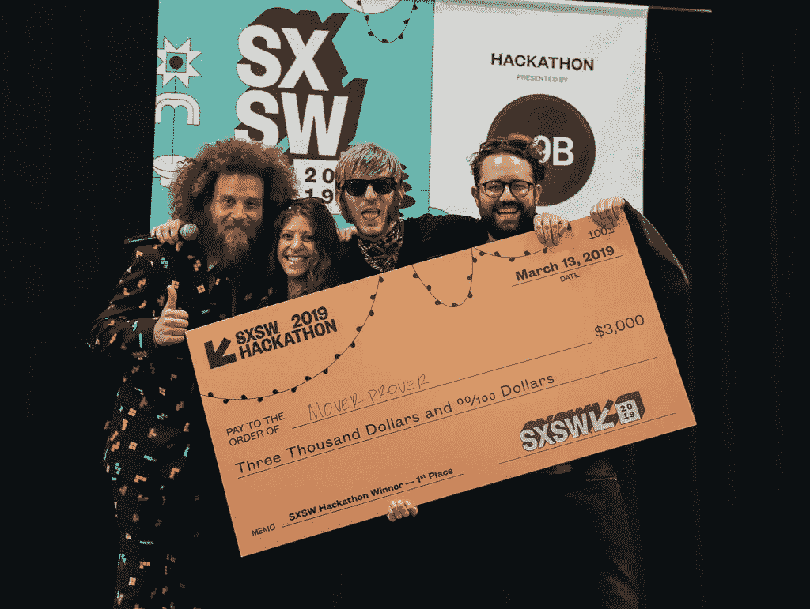

# 2019 SXSW 黑客马拉松上的人才舞台-合作与艺术相遇

> 原文：<https://medium.com/hackernoon/a-tableau-of-talent-at-the-2019-sxsw-hackathon-where-collaboration-artistry-meet-d599975db8a1>

## SXSW 的年度黑客马拉松为冠军加冕

The Notable Winners of SXSW’s 7th Annual Hackathon — Credit: Kenneth Eke

在 SXSW 的黑客马拉松中，达到新的高度从来都不是问题，尤其是在连续第六次举办之后。该活动从 3 月 12 日持续到 3 月 13 日，历时 24 小时，带来了大量创造性和创新性的想法，没有一个项目不令人印象深刻。

比赛由 ShowSparker.com 的 Travis Laurendine 和 SXSW 的 Luann Williams 主持，由 T2 的 root9B 和 R9B 主持，共有 29 份参赛作品。随着黑客项目从交互式手机应用到引人入胜的软件，像环球音乐集团(UMG)、本地仪器、Eluvio 和其他赞助商都受到了所有项目的积极影响。

# 竞争

出席今年黑客马拉松的所有赞助商都希望从参赛团队中寻找一些独特的东西。R9B、环球音乐集团、科尼、Buzz Angle Music、Eluvio、Miro、Native Instruments、R3、Qloo、Cox Automotive 和 ShowSparker.com 都有不同的期望，这导致了同一个目标:*团队* *要有创意*。

> “我们在这里创造音乐产业的未来”——特拉维斯·劳伦丁，ShowSparker.com

在介绍了今年黑客马拉松的所有赞助商和评委后，团队开始创新和创造。在 24 小时不间断的黑客闪电战中，参与者获得了赞助商提供的 API、R9B 提供的按摩、管理团队提供的茶点以及介于两者之间的一切。

3 月 13 日，团队受邀向评委和所有与会者展示他们的创作。评委包括**斯科特·巴伯**、[索尼影视娱乐](http://www.sonypictures.com/)的副总裁制作&创新； **Josh Constine** ，TechCrunch[的自由编辑](https://techcrunch.com/)； **Louise-Marie Marguet** ， [EmoJam](http://www.emojam.com/) 的 CEO **Lauren Vitek** ，TravelBank[的创始员工](https://travelbank.com/)；**乔恩·戈特弗里德**，[美国黑客大联盟](https://mlh.io/)的联合创始人；**安德鲁·杜伯**，[音乐科技节](https://musictechfest.net/)的导演；以及 **Tuhin Roy** 、**UMG[新数字业务和创新高级副总裁。所有人都准备好了观看音乐和娱乐业被这些 24 小时项目所彻底改变。](https://www.universalmusic.com/)**

# **获胜者**

**顶级团队将获得总计 6000 美元的现金奖励，因此在最终的颁奖典礼上竞争异常激烈也就不足为奇了。**

****

**Beat IT, allowing novice rappers to produce beats based on their lyrics — Credit: Kenneth Eke**

**所有的参赛作品都引起了赞助商的兴趣，尤其是 UMG 选出的冠军和总第二名，由队友 Andy Prevalsky、Kevin Tang、Sashreek Bhagavatula 和 Aman Gottumukkala 组成的 [**击败了**](https://devpost.com/software/beat-it) 。他们的项目受到了能够利用人工智能根据用户需求创建内容的启发。这是为数不多的探索人工智能如何支持年轻和未来艺术家进行内容创作的想法之一。**

****

**“Making high fives more meaningful by enabling users to share music preferences with gesture motion sensing” — Credit: Kenneth Eke**

**黑客马拉松的第三名由来自日本东京的团队 [**Live High Five**](https://devpost.com/software/highfive-jpsh48) 获得。简而言之，他们的项目是为了“让击掌更有意义”**

****

**Thermal map of “high fives” — Credit: Live High Five**

**他们由佐佐川由纪、马克·威克、相叶マナブ·双田、伊藤·岩崎和高之东组成，他们的想法受到 SXSW 音乐节本身的启发。他们的应用程序可以感知用户的击掌手势，并记录他们与谁互动的时间、地点。用户以后可以浏览他们与谁互动，知道他们的联系喜欢听什么曲目和艺术家。**

**荣誉提名包括 ShowSparker.com 选出的获胜者， [**Soundex**](https://devpost.com/software/soundex) ，这是一款为消费者提供的门票专辑应用程序，帮助他们发现新音乐。由克里斯蒂·施耐德(Christi Schneider)开发的这款移动应用程序可以让音乐会观众与观看过同一场演出的观众中的其他粉丝联系，根据用户观看过的演出聆听推荐的艺术家，等等。**

****

**Soundex’s website for tour managers to determine the route of locations artists should perform at**

**使用 [Qloo 提供的 API](https://qloo.com/api-info/) ，该软件本身对于巡演经理来说是完美的，他们可以查看数据点，让管理层决定哪些地点的艺术家可以最好地表演。**

****

**Synaptic’s example of Virtual Reality music videos during the Final Presentations & Awards**

**Eluvio 的获胜选择通过 [**Synaptic**](https://devpost.com/software/synaptic) 引入了视觉和区块链技术，利用人工智能生成虚拟现实音乐视频，艺术家可以编辑、分发并拥有区块链的使用权。他们由队友 Iris Rodriguez、Anthony Pekearo、Yuma Yanagisawa 和 Sky Nite 组成，计划开发一款软件来接受 Spotify 的歌曲，并使用该品牌的歌曲指标来制作更智能的视觉效果。**

> **“我们一直在赞助各种黑客马拉松，从最大的大学黑客马拉松到一些最负盛名的硅谷活动，但这是我们第一次参加 SXSW。我对探索与创意社区的联系很感兴趣，尤其是在音乐方面。我想出了一个奇妙的故事来告诉我们的团队，并与我们在活动中遇到的黑客建立了一些关系和想法。参与者的专注和素质产生了巨大的影响，对我们来说，参与者在音乐和艺术方面的‘不同’背景点燃了几个非常令人兴奋的新想法。”serban Simu——elu VIO 公司的联合创始人。**

**总的来说，团队能够通过他们的灵感展示他们的技术，成功实现他们的最终目标。然而，只有一个团队可以获得 SXSW 黑客马拉松的胜利，这个团队就是 [**Mover Prover**](https://devpost.com/software/mover-prover) ，“将舞蹈动作输入注册，以便它们可以被注册商标，买卖。”**

****

**“Our database also lets the general public know which moves are for sale” — Mover Prover**

**Mover Prover 由 CJ Carr、Leila Noone 和 Julien Heller 创建，邀请用户创建自己的舞蹈动作，他们的软件通过机器学习程序以视频形式捕捉这些动作，并将其注册到 Mover Prover 数据库中。这个平台给每一个创意取了一个与众不同的名字，这样它们就可以被它们的创造者(也就是用户)注册商标和拥有。团队的经纪人系统使舞蹈动作能够被买卖，分配所有权并授权创作者享受对其创作的控制，消除个人或公司未来可能发生的任何后果。移动者可以选择他们的移动应该如何被使用，谁可以购买它，出售它，以及如何复制和传播它的相似性。**

**电影制作人安雅·拉扎和 T2 制作了一部真实而有趣的短片，讲述了 Mover Prover 的 24 小时冒险经历，展示了该团队在平台创建过程中的工作和娱乐道德。**

****

**Mover Prover taking the grand prize — Credit: Kenneth Eke**

# **最后**

**在一场令人难以置信的创新、合作和创意展示之后，黑客马拉松在 CU29 结束了一场由 R9B 主办的会后派对，所有刚刚花了 24 小时为音乐、AR/VR、AI 和区块链构建新技术的开发人员、编码人员和艺术家庆祝了他们的成就和胜利。**

**感谢 Luann Williams、Travis Laurendine、所有评委、SXSW 工作人员、赞助商和参赛团队，他们又迈出了一步，展示了在黑客马拉松中展示的才华以及推动个人和团队革新技术的动力。**

**查看所有黑客马拉松项目的完整列表[点击这里](https://sxswhackathon2019.devpost.com/submissions)！**