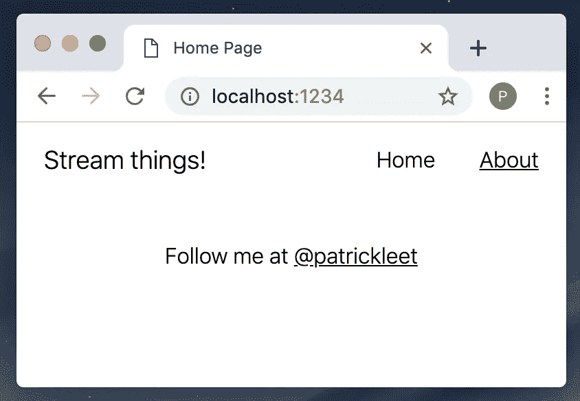
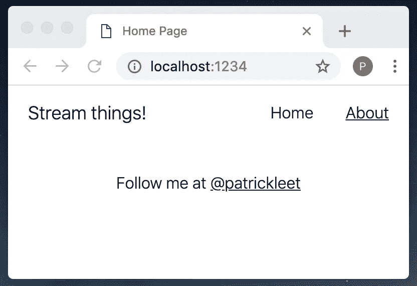

# 两层(Docker 多阶段构建)的故事

> 原文：<https://medium.com/hackernoon/a-tale-of-two-docker-multi-stage-build-layers-85348a409c84>

## 使用 SSR 或 Nginx 的 Node.js 的生产就绪 docker 文件


Licensed from Adobe Stock Photos

在本系列的最后一篇文章中，我们完成了向我们的项目添加单元测试，以达到 100%的代码覆盖率。测试就绪后，下一步是为项目的部署做好准备。

让我们的应用程序为生产部署做好准备的最后一件事是 docker 文件。

docker 文件也是运行我们的单元测试的好地方，这就是为什么我决定先写测试。

我们的构建有几个目标:

1.  应该是安全的
2.  它应该尽可能的苗条
3.  如果没有达到质量标准，就不应该建造

有了目标，我们就开始吧。

Docker 本质上是一个供您的代码运行的隔离环境。就像配置服务器一样，您可以配置 docker 容器。正如在[用 Docker 开发 Node.js 的更好方法](https://hackernoon.com/a-better-way-to-develop-node-js-with-docker-cd29d3a0093)中所讨论的，大多数流行的框架/语言都有来自 Docker Hub 的构建版本。似乎我们如何使用 Node，我们需要一个运行`node`的环境。我们将以此开始我们的文档。

但在此之前，我们先来讨论一下运行命令`docker build`时会发生什么。首先发生的是 Docker 决定了构建运行的“上下文”。它从你当前的目录中吸收所有内容作为上下文，除了列在`.dockerignore`文件中的文件或文件夹。

我们只想要构建过程所需的最低限度，所以让我们从创建一个`.dockerignore`文件开始，忽略其他所有东西。

```
.cache
coverage
dist
node_modules
```

您的项目中的任何其他不需要成功构建/测试的重文件夹也应该被忽略。

下面是使用和不使用`.dockerignore`文件运行`docker build . -t ssr`的区别:

```
➜  docker build . -t ssr
Sending build context to Docker daemon  166.6MB
➜  docker build . -t ssr
Sending build context to Docker daemon  1.851MB
```

如你所见，这是一个非常显著的差异。

# 构建层

现在让我们逐行创建`Dockerfile`:

```
FROM node:11.10.0-alpine AS build
```

首先，正如我提到的，这是一个节点应用程序，所以从官方的节点映像开始是有意义的。这是生产，在生产中我们想要不可变的、可重复的构建，因此我使用了特定的节点版本`11.10.0`。根据您的要求，您可能希望选择 Node 10 的最新 LTS 版本。我只是选了最新的。你可以在这里找到最新标签的列表:[节点标签— Docker Hub](https://hub.docker.com/_/node?tab=tags) 。

接下来，请注意`AS`指令。这表明这不是 Dockerfile 文件的最后阶段。稍后，我们可以将这个阶段中的工件`COPY`放入我们的最终容器中。这样做的原因是为了产生具有最少伪像的图像。我们可以在第一阶段运行更昂贵的命令，它们结果的膨胀将在下一层被剥离，只留给我们运行应用程序的必需品。

除了生成小得多的映像之外，使用多阶段构建也是一种很好的安全措施，因为所有的构建工具都是如此，因此，开发工具的安全漏洞被从最终层剥离出来。

我还决定使用 node 的`alpine`版本。这意味着基本操作系统是 Alpine Linux，一个大约 5MB 的最小 Linux 发行版，用于容器化。

接下来，因为我们使用的是`alpine`,并且它没有附带很多构建工具，所以我们应该安装`node-gyp`工具集。

```
RUN apk add --update --no-cache \
    python \
    make \
    g++
```

这样，我们就有了运行构建和测试的所有工具。如果您所依赖的包不需要通过跳过上一步使用 gyp 编译它们的任何依赖项，那么您可能会节省大约 10 秒的构建时间。然而，它将被从最终层中剥离出来，所以这不是一个巨大的节省，并且许多节点依赖关系*确实*需要它。

我们的代码还不在容器内部，这对运行它非常有帮助！让我们将它复制到一个简单命名的`src`目录中，并将该目录设置为我们的工作目录。该层中的所有未来命令都将在指定的工作目录中运行。

```
WORKDIR /src
COPY ./package* ./
```

接下来，让我们安装节点依赖项。

```
RUN npm ci
```

`npm ci`的工作方式与`npm i`类似，但是跳过了昂贵的依赖项解析步骤，而是只安装在`package-lock.json`文件中指定的依赖项。它基本上是在 CI 环境中使用的更快的`npm i`。

我们在项目的其余部分之前复制包文件的原因是为了缓存优化。现在,`npm ci`的结果将被缓存，直到它上面的层发生变化，这将是包文件，而不是所有的代码。

现在我们可以复制其余的`src`并继续。

```
COPY . .
```

现在，我们可以运行质量检查和构建。如果它们没有通过，新的映像将无法成功创建，构建将会失败。这对于作为持续部署管道的一部分运行的构建来说非常好。

```
RUN npm run lint
RUN npm run build
RUN npm run test
```

我的目标通常是尽可能快地失败，并且通常将`test`放在`build`之前，但是我们的服务器端测试依赖于构建一个应用程序来服务它，所以在这种情况下，我只是翻转了它们。

最后，对于这一层，我们现在要做的最后一件事是消除任何开发依赖，因为过了这一步就不再需要它们了。

```
RUN npm prune --production
```

第一层就这样。为了便于阅读，这是第一层的全部内容:

```
FROM node:11.10.0-alpine AS buildRUN apk add --update --no-cache \
    python \
    make \
    g++WORKDIR /src
COPY ./package* ./RUN npm ciCOPY . .RUN npm run format
RUN npm run build
RUN npm run testRUN npm prune --production
```

现在在第二层我们有一个选择。

我们使用一个节点服务器来构建我们的应用程序，以进行流服务器端渲染。至此，在我们的 docker 文件中，我们已经构建了客户端应用程序。我们不一定*也需要*来使用服务器。我们可能决定只需要一个静态服务的客户端应用程序。在本文的下一部分，我将向您展示如何使用原始节点 SSR 服务器构建最终层，或者将应用程序打包到 Nginx 部署中。

# **最终层选项#1:节点流 SSR 渲染应用**

首先，让我们从 Dockerfile 的 Node SSR 版本开始，因为这是本系列到目前为止一直关注的内容。

在第一阶段的正下方，我们现在要添加第二个`FROM`语句。这一次，我们不会使用`AS`，因为它是最后一层。我们还想继续操作，公开应用程序运行的端口，并像前面一样设置工作目录。

```
FROM node:11.10.0-alpine AS build// ...RUN npm prune --production**FROM node:11.10.0-alpine****ENV PORT=1234
EXPOSE $PORT****WORKDIR /usr/src/service**
```

同样，请注意，我们从特定版本的相同 alpine 节点图像开始。当我们创建一个新的层，没有什么是从以前的层自动复制。这是一个新的开始。我们需要将工件，在我们的节点应用程序中，一些文件和文件夹，复制到我们的最终层。让我们接下来这样做:

```
COPY --from=build /src/node_modules node_modules
COPY --from=build /src/dist dist
```

最后，我们可以使用`node`运行我们的应用程序，但是我们希望在这样做之前将用户设置为非 root 用户。官方节点映像为此创建了一个名为`node`的用户。

```
USER nodeCMD ["node", "./dist/server/index.js"]
```

在部署时，我们应该依靠 orchestrator 来管理应用程序的重启和扩展，比如 Kubernetes 或 Docker Swarm，所以没有必要使用像`pm2`或`forever`这样的工具。

仅此而已！

这是最终的 Dockerfile 文件:

```
FROM node:11-alpine AS buildRUN apk add --update --no-cache \
    python \
    make \
    g++COPY . /src
WORKDIR /srcRUN npm ciRUN npm run format
RUN npm run build
RUN npm run testRUN npm prune --productionFROM node:11.10.0-alpineEXPOSE 1234WORKDIR /usr/src/serviceCOPY --from=build /src/node_modules node_modules
COPY --from=build /src/dist distUSER nodeCMD ["node", "./dist/server/index.js"]
```

构建和运行应用程序:

```
➜  docker build . -t ssr
➜  docker run -p 1234:1234 ssr
{"level":30,"time":1551155555272,"msg":"Listening on port 1234...","pid":1,"hostname":"d5b0db2acfbc","v":1}
```



如果你正在关注或者之前读过其他 Docker 文章，你可能会注意到我还没有定义一个`HEALTHCHECK`。`HEALTHCHECK`是在某些 orchestrators 中运行时调用的命令，比如 Docker Swarm。在 Kubernetes 中运行时，我们依赖于 Kubernetes 的活性和就绪性探测。

有关编写节点健康检查的更多信息，请查看[有效的 Docker node . js 健康检查](/@patrickleet/effective-docker-healthchecks-for-node-js-b11577c3e595)。为了完整起见，我们的 SSR 节点服务器非常简单，所以在这种情况下使用 curl 之类的东西就可以了。

这里有一个最后阶段的修改版本，定义了一个使用`curl`的`HEALTHCHECK`。

```
// ... first layer ...FROM node:11.10.0-alpine**RUN apk add --update --no-cache curl**EXPOSE 1234WORKDIR /usr/src/serviceCOPY --from=build /src/node_modules node_modules
COPY --from=build /src/dist dist**HEALTHCHECK --interval=5s \
            --timeout=5s \
            --retries=6 \
            CMD curl -fs** [**http://localhost:1234/**](http://localhost:1234/) **|| exit 1**USER nodeCMD ["node", "./dist/server/index.js"]
```

# 最后一层选项#2: Nginx 服务静态客户端应用

现在，让我们创建第二个 docker 文件，这是完成最后阶段的另一种方法。

我们将从相同的构建层开始，但这一次，我们的最后阶段将使用`nginx`静态地服务应用程序，而不是使用 Node 在服务器端呈现。

在此之前，我们需要在 package.json 的`script`部分创建一个新条目。添加以下脚本:

```
"build:nginx": "rimraf dist && npm run generate-imported-components && npm run create-bundle:nginx","create-bundle:nginx": "cross-env BABEL_ENV=client parcel build app/index.html -d dist/client **--public-url .**",
```

与 SSR 构建的不同之处在于，我们在运行构建时将公共 url 设置为`.`，因为在这种情况下我们希望它相对于`index.html`文件。

现在，创建`./nginx/Dockerfile`:

```
FROM node:11.10.0-alpine AS buildRUN apk add --update --no-cache \
    python \
    make \
    g++WORKDIR /src
COPY ./package* ./RUN npm ciCOPY . .RUN npm run format
**RUN npm run build:nginx**
RUN npm run testRUN npm prune --production**FROM nginx:1.15.8-alpine****RUN apk add --update --no-cache curl****WORKDIR /usr/src/service****COPY --from=build /src/dist ./dist
COPY --from=build /src/nginx ./nginx****HEALTHCHECK --interval=5s \
            --timeout=5s \
            --retries=6 \
            CMD curl -fs** [**http://localhost:1234/**](http://localhost:1234/) **|| exit 1****RUN ["chmod", "+x", "./nginx/entrypoint.sh"]
ENTRYPOINT [ "ash", "./nginx/entrypoint.sh" ]**
```

这里没有多少新东西，除了我们没有使用命令，而是使用了一个`ENTRYPOINT`。这允许您运行脚本而不是命令。我们还想确保用`ash`调用它的 alpine linux 版本的`sh`。上面的`RUN`行只是简单地更改 linux 权限，使文件可执行。

我们稍后制作的脚本将使用一个配置文件启动 nginx，我们也需要创建该文件并将其存储在`nginx`文件夹中。

让我们从`entrypoint.sh`脚本开始。我将在里面包含两个有用的片段，帮助使用注释掉的环境变量。我们在这个项目中不需要它们，但是这是一个常见的需求，比如当您想要使用 nginx 作为后端的代理，或者可能在 JS 包中包含一个分析令牌或键。

```
#!/bin/bash# This script can be used when you have webpack or parcel builds that 
# insert env variables at build time, usually as build args. 
# Just set the build args to an a unique string for replacement,
# and do it post build instead. Uncomment `echo` through `done` and modify
# to match your env variables
# --- Start Insert ENV to JS bundle ---
# echo "Inserting env variables"
# for file in ./dist/**/*.js
# do
#   echo "env sub for $file"
#   sed -i "s/REPLACE_MIXPANEL_TOKEN/${MIXPANEL_TOKEN}/g" $file
# done
# --- End Insert ENV to JS bundle ---# And if you need env variables in Nginx, use this instead of `cp`
# --- Start Insert ENV to Nginx---
# echo "Injecting Nginx ENV Vars..."
# envsubst '${GRAPHQL_URL}' < nginx/nginx.conf.template > /etc/nginx/nginx.conf
# --- End Insert ENV to Nginx---
cp nginx/nginx.conf.template /etc/nginx/nginx.confecho "Using config:"
cat /etc/nginx/nginx.confecho "Starting nginx..."
nginx -c '/etc/nginx/nginx.conf' -g 'daemon off;'
```

基本上我们所做的就是将 Nginx 配置复制到`/etc/nginx`文件夹，然后启动它。

这是 nginx 的配置——保存为`./nginx/nginx.config.template`。如果取消上面的`envsubst`行的注释，就可以在其中使用环境变量。

```
events {
  worker_connections 1024;
}http {
  server {
    include /etc/nginx/mime.types;
    listen 1234; root   /usr/src/service/dist/client;
    index  index.html; gzip on;
    gzip_min_length 1000;
    gzip_buffers 4 32k;
    gzip_proxied any;
    gzip_types text/plain application/javascript application/x-javascript text/javascript text/xml text/css;
    gzip_vary on; location ~* \.(?:css|js|eot|woff|woff2|ttf|svg|otf) {
      # Enable GZip for static files
      gzip_static on; # Indefinite caching for static files
      expires max; add_header Cache-Control "public";
    }
  }
}
```

让我们试一试吧！

```
➜  docker run -p 1234:1234 nginx-server              

Starting nginx...
```



# 结论

在本文中，我在前面的样板文件的基础上添加了两个不同的 order 文件，用于生产。根据您的使用情况，在某些情况下，一种可能比另一种更有用。

这部分到此为止！

如果您还没有确定，请查看本系列的其他文章！这是第五部分。

[](https://hackernoon.com/move-over-next-js-and-webpack-ba367f07545) [## 第 1 部分:讨论 Next.js 和 Webpack🤯

### 简单流服务器端渲染(SSR)反应+样式-组件与包裹

hackernoon.com](https://hackernoon.com/move-over-next-js-and-webpack-ba367f07545) [](https://hackernoon.com/a-better-way-to-develop-node-js-with-docker-cd29d3a0093) [## 第 2 部分:用 Docker 开发 Node.js 的更好方法

### 并保持您的热代码重载

hackernoon.com](https://hackernoon.com/a-better-way-to-develop-node-js-with-docker-cd29d3a0093) [](https://hackernoon.com/enforcing-code-quality-for-node-js-c3b837d7ae17) [## 第 3 部分:加强 Node.js 的代码质量

### 使用林挺、格式化和带有代码覆盖的单元测试来实施质量标准

hackernoon.com](https://hackernoon.com/enforcing-code-quality-for-node-js-c3b837d7ae17) [](https://hackernoon.com/the-100-code-coverage-myth-900b83d20d3d) [## 第 4 部分:100%代码覆盖率的神话

### 现在互联网上有很多建议说 100%的覆盖率不是一个有价值的目标。是吗？

hackernoon.com](https://hackernoon.com/the-100-code-coverage-myth-900b83d20d3d) 

所有这些文章都致力于构建这个样板文件:

[](https://github.com/patrickleet/streaming-ssr-react-styled-components) [## Patrick let/streaming-SSR-react-styled-组件

### 流式 ssr 反应风格组件与包裹。贡献给 Patrick let/streaming-SSR-react-styled-components…

github.com](https://github.com/patrickleet/streaming-ssr-react-styled-components) 

所以，如果你觉得这个有用，一定要给它打个星！

下次见！

~ [李雅达·斯科特](https://twitter.com/pat_scott)