# 关于从 Hackernoon.com 移除介质

> 原文：<https://medium.com/hackernoon/about-removing-medium-from-hackernoon-com-7c72353ba6e>

## [看视频](https://www.youtube.com/watch?v=Hy4Lduu9CKg&t=1915s)(你也可以在 [iTunes](https://itunes.apple.com/us/podcast/why-is-hackernoon-com-leaving-medium/id1436233955?i=1000431854486&mt=2) 或 [Google](https://play.google.com/music/m/Dtae7ck4fdsfwrpy5hjy64l6rsq?t=Why_is_Hackernooncom_leavingMedium-Hacker_Noon_Podcast) 上听这个故事)

## TL；DR:这两个实体的商业利益已经改变。Hacker Noon 不得不拆除并更换其软件基础设施，以使其土地再次成为可行的业务。这是对数字出版的状态、URL 的价值、初创公司的依赖性以及平台增长策略的影响的重要讨论。点击下面的主题向前跳转:

关于大卫在 Wordpress 上的过去

*   [哈克农的崛起](#9265)
*   [社区内容所有权](#b863)
*   [Medium.com 优先转移](#9e76)
*   [哈克农在哪里](#de16)
*   谁拥有 Hackernoon？
*   [中型电子邮件所有 Hackernoon 贡献者](#c6f4)
*   [焦头烂额的出版商&低价买断要约](#3547)
*   [媒体禁止在他人的域名上发布第三方广告](#6cbb)
*   [小企业依赖性](#be55)
*   [过渡提案](#69b7)
*   [媒体出版物功能折旧](#5205)
*   [链接恶作剧](#7343)
*   [社区基金 Hackernoon 2.0](#4ab3)
*   [建筑黑客正午 2.0](#31aa)
*   [两条病毒推文](#674f)
*   [Hackernoon.com 的非独家许可](#333f)
*   [介质的过渡计划](#ad6c)
*   [hacker noon 即将推出的产品的进展](#9ca4)
*   [黑客营收和未来](#6c0e)
*   [通过破坏帧创建床](#a10b)
*   [结论:黑客的状态](#c8a2)

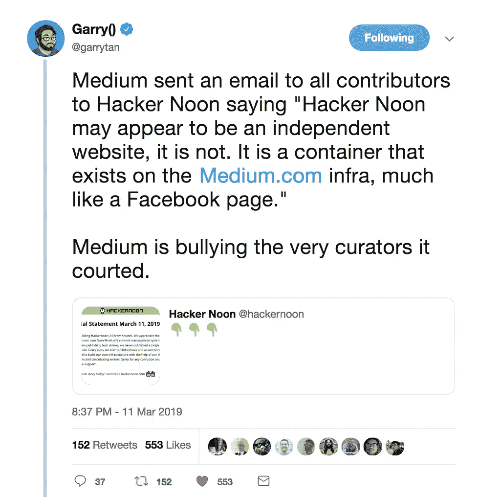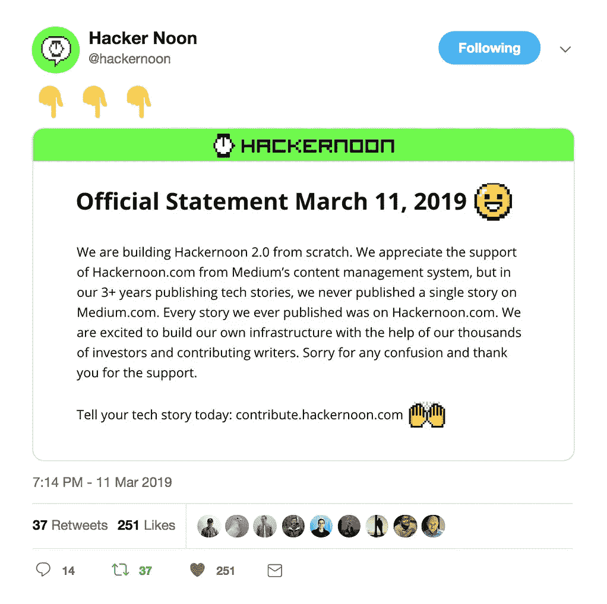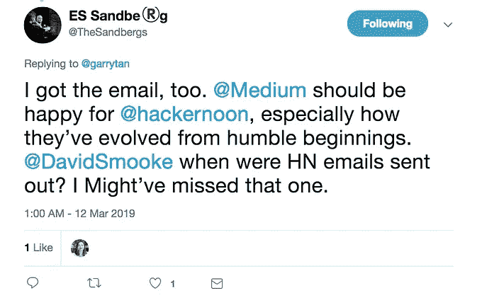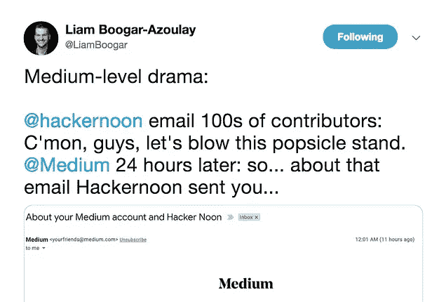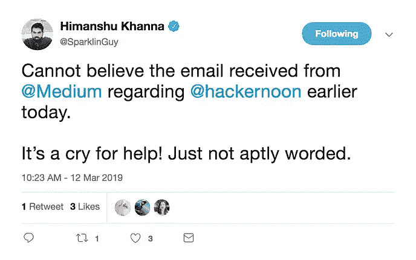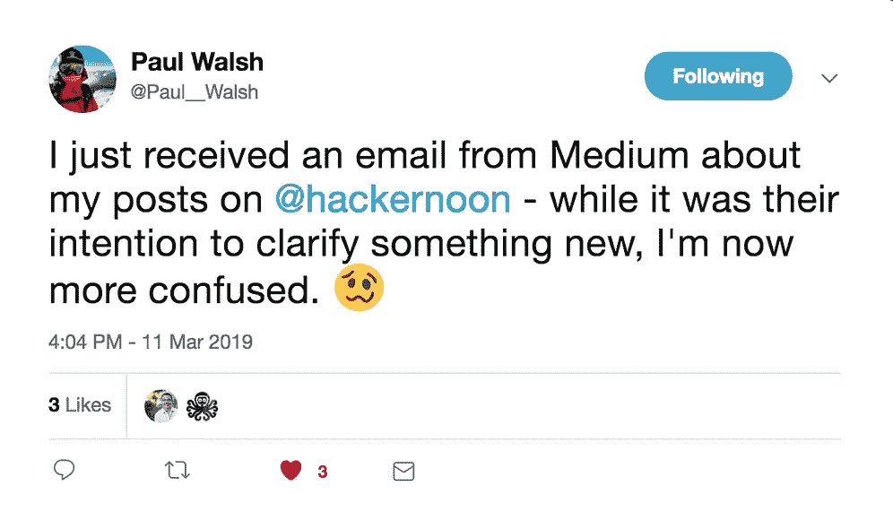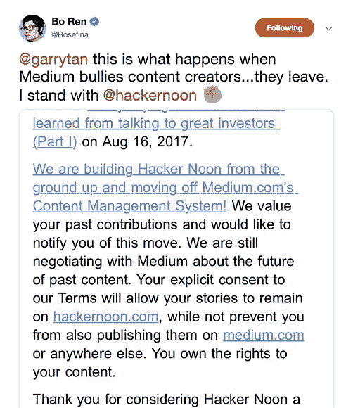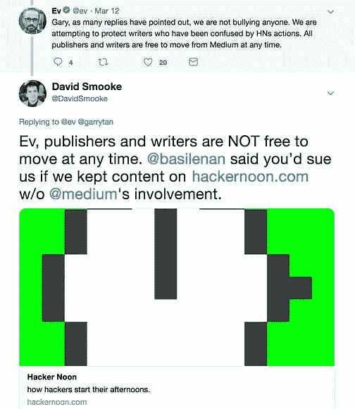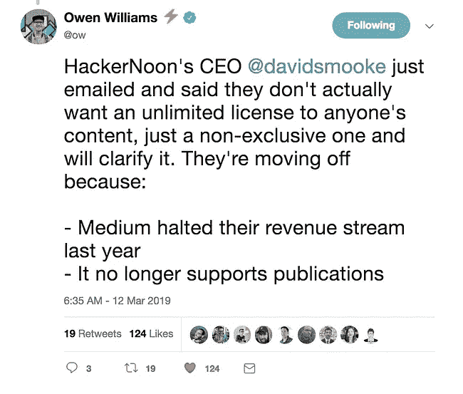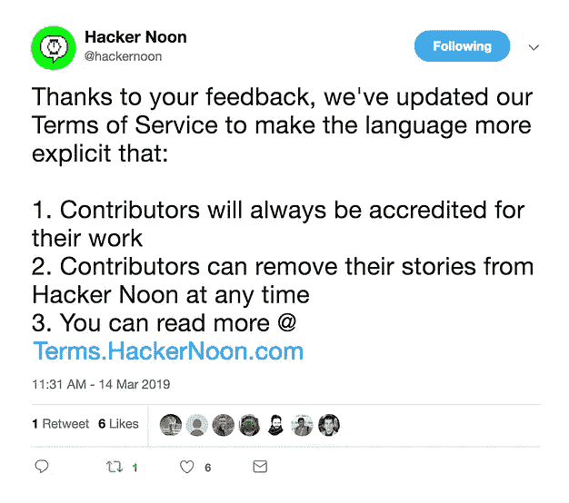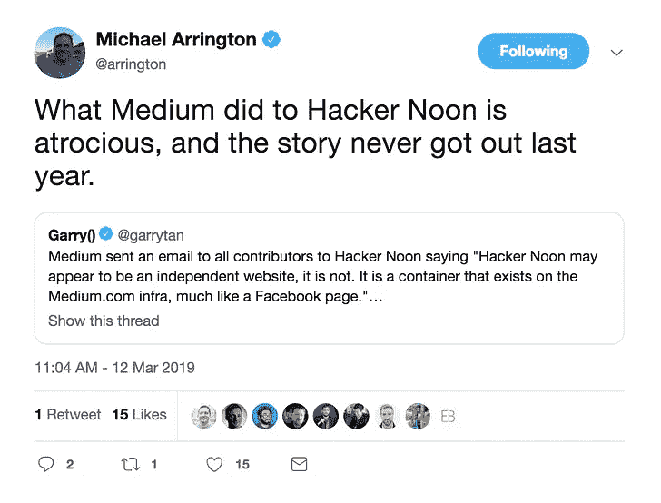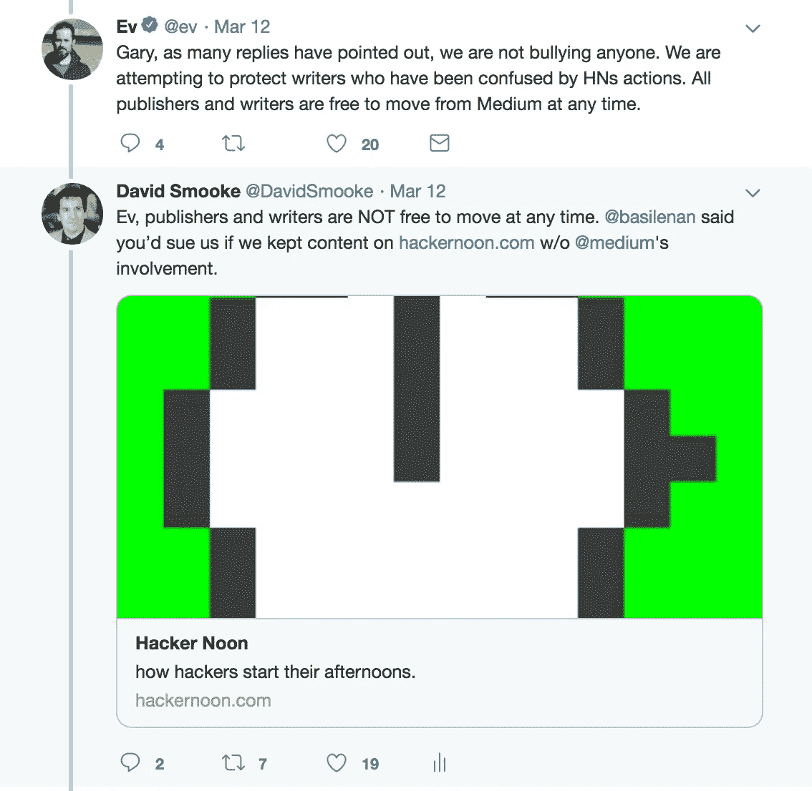

## [下面是视频](https://www.youtube.com/watch?v=Hy4Lduu9CKg)(你也可以在 [iTunes](https://itunes.apple.com/us/podcast/why-is-hackernoon-com-leaving-medium/id1436233955?i=1000431854486&mt=2) 或者 [Google](https://play.google.com/music/m/Dtae7ck4fdsfwrpy5hjy64l6rsq?t=Why_is_Hackernooncom_leavingMedium-Hacker_Noon_Podcast) 上听这个故事)，下面是文字稿:

特伦特:好吧。欢迎来到黑客正午播客。这是非常特别的一集，所以我们有一位非常特别的嘉宾。他实际上是 Hacker Noon 的首席执行官和创始人，在这一集里，我们将谈论一些与我们习惯的稍有不同的东西。所以，我们在《黑客正午》中遇到了更多的情况，我们想直接与我们的观众交谈，让他们直接从[大卫](https://twitter.com/davidsmooke?lang=en)和我的口中知道发生了什么，我想，但主要是大卫关于这种情况在 Medium 中发生了什么，离开 Medium 并推出《黑客正午 2.0》。

Hacker Noon 最近做了一个[成功的众筹](https://www.startengine.com/hackernoon)并且有很多不同的事情正在进行。所以，我要把球传给大卫。David，您能告诉我们一些关于我们如何走到这一步的背景，以及您为什么选择 Medium 作为内容管理系统吗？

大卫:嘿，特伦特。上[黑客正午播客](https://podcast.hackernoon.com/)真的很酷。

特伦特:对吗？

大卫:我真的没打算开始写这个科技博客。我一直在技术领域工作，我真的很喜欢出版，但在我职业生涯的早期，我在写作和营销方面获得了更多的报酬，而不是发展自己的网站。我想全押在自己的网站上，但我不知道网站会是什么样。我知道我喜欢建立社区，我喜欢阅读和直接听人们讲述他们的故事。因此，我们开始了 16 种不同的媒体出版物。关于 Medium，在他们内容管理系统的早期，他们真的删除了很多其他内容管理系统的废话。

阅读时总是有左右栏的想法对我来说是疯狂的。太让人分心了。很难把注意力集中在这些左右栏的文本上，大多数 WordPress 网站都有，互联网上的大多数网站也有。所以，他们做的一件事真的很棒。如果你看着屏幕，你想阅读，你不想要别的东西。你只想要那里的故事。

所以，我认为这真的很酷，他们真的让人们很容易进入并开始他们自己的出版物。你可以带来你自己的朋友，然后他们背后有一个网络，然后他们招募了大量的出版商:太平洋标准，认为进步，林格…就像“好吧，所有这些很酷的出版商都在这里。也许像我这样的年轻出版人应该关注新闻，并从中吸取教训。”

在此之前，我还在 SmartRecruiters 博客上做了一个非常类似的模型，我完全开放给任何招聘专家来发布招聘信息，我提供策展、分发和编辑，这是用 WordPress 做的大量手工工作。创建用户帐户:你是否管理他们的用户帐户？这就是 WordPress 和 Medium 的恼人之处，就像“不，用户管理他们的帐户，他们可以在所有这些不同的网站上发布。”他们只需与网站达成协议，然后在出版物上发表。

> 在此之前，在 [SmartRecruiters 博客](https://www.smartrecruiters.com/blog/)中，我做了一个非常类似的模型，我完全开放给任何招聘专家来发布招聘信息，我提供策展、分发和编辑，这是用 WordPress 做的大量手工工作。

所以，在早期，这是一种更开放的看待网络的方式。如果你是一个作家，你可以通过开一个账户在许多不同的地方发表文章，这很酷。所以，这就是最初吸引我的地方，另外，博客、推特、媒体……只是对 Ev Williams 和他所创造的东西的尊重。我不认为他对我有同样的想法。

特伦特:嗯，好吧。所以，让我们在这里设置一些背景。对于普通听众来说，我不确定他们是否知道 Ev Williams 必然是这三个项目的幕后推手。所以，他是 Twitter 的联合创始人，他创建了 Blogger，然后，现在，他的最新项目是 Medium。他在硅谷有一个很长的有趣的职业生涯，这是导致这一点的原因，就像我说的，我不确定是否每个听众都知道他…他是 Twitter 的创始人之一。

大卫:是的，我看过很多…他早期的视频很有趣。他就像“我是 Ev Williams，这是一家互联网公司”，他就像在内布拉斯加州销售一些互联网服务，我就像…我记得我在 SmartRecruiters 的第一张名片。起初，我是一名没有报酬的实习生，后来我去了市场部，但我的第一张名片上，我只写了“互联网爱好者”我当时 20 岁，住在旧金山，就像“哦，是的，我非常热衷于互联网。”

就像“你是做什么的？”比如“我开发网站”

特伦特:嗯，然后你在这里种植了黑客正午。让我们在这里稍微赶上现在，我的意思是，现在 Alexa 的排名是多少？太疯狂了。我们不是在谈论机器人，我们是在谈论一个排名网站，在这里，它对所有的顶级网站进行排名。

> 很多时候，公司只有我一个人，然后是兼职人员，然后是我和我的妻子 Linh，现在我们有 4 个人和一个完整的 8 人兼职团队，但要进入全球排名前 5000 的网站，每天都有很多工作要做。

大卫:但是 Alexa 归亚马逊所有。Alexa.com 排名网站，但没错，不是机器人，但没错。我们大约是世界前 5000 名。所以，我认为这是非常重要的，对于大多数人来说…很多时候只有我为公司工作，然后是兼职人员，然后是我和我的妻子 Linh，现在我们多达 4 人，整个兼职团队有 8 人，但要进入世界排名前 5000 的网站，很多时间只是每天出现在工作中。

这就像搞清楚什么有效，每天早上无论如何都要花上半天时间钻研故事，这就是每天四个小时。只是获得故事提交，达到高质量故事的基线，并试图提高质量，这是一个相当大的挑战，但在很大程度上，黑客中午是一个技术专业人士发布他们的故事并会见社区中其他优秀人士的地方。

所以，这方面的社区实际上是什么增长了它，因为所有的内容都是由社区拥有的——个人社区成员——我们有一个非排他性的许可在这里发布。所以，我们现在的处境有点像赫芬顿邮报(Huffington Post)只面向技术专业人士，或者 Linkedin publishers 只面向技术专业人士，但有一点点不成熟，我们真的不想要这些正式的东西。

> 就像，如果你想全部小写，我没问题。好像我不会引导你的风格。如果那是你当时的语气，诚实地用你的声音发表，用你的语气发表，我不会上去说“嘿，这是美联社风格指南。让我们把这个清理干净，伙计。”

特伦特:嗯，这就是我个人被《黑客正午》吸引并开始为它写作的原因，因为它就像“嘿，…”一样，所以对我来说，作为一名作家，我想接触更多的观众，《黑客正午》是我实现这一目标的一个很好的方式。当我写作时，我是在写作，这样我就能接触到人们。我不接线是因为我想赚钱。

因此，能够将我的出版物，我正在写的内容，添加到您的出版物中，这真的很强大，突然间，我的一些文章获得了 10，20，000，50，000 次阅读，这真的很强大。就像如果我把它发布到我的个人资料上，它会进入黑洞，大概有 10 个人会阅读它。

因此，能够获得这种曝光率并接触到观众是一件很棒的事情，我认为多年来为《黑客正午》撰稿的许多作家可能都与我的经历有关，但与此同时，这是一种不同于 Medium 现在所采取的模式。你能谈谈 Medium 是如何从一个真正开放的发布平台和内容管理系统发展到现在这个样子的吗？

大卫:是的。是的，我的意思是我认为这很大程度上归结于激励，当你拿了很多钱，你说你将改变整个世界，你必须采取大人物。所以，他们做了一个很大的转变，说“贡献者，与其让你的故事免费公开，我们更希望你的故事在付费墙后面，我们会付费给你，我们的付费墙读者会阅读它。”

因此，他们从说“让我们授权成千上万的人来发展他们的网站并引入他们的社区，让读者和作者创建媒体账户来这样做，”转变为“我们唯一希望作者做的事情就是在 medium.com 上发布，我们不希望任何其他网站真正发展，如果你想在 medium.com 上管理内容，你可以这样做。”

> 当你拿了很多钱，你说你会改变整个世界，你必须采取大人物。

我是说，我知道这有什么意义了。我的意思是，首先，网址。就像那有多酷？他们真的有一个超级有价值的网址，你不会想放弃的。所以，他们现在采取的这种商业模式，他们试图成为文本的康卡斯特，他们试图让世界上任何人每月付给他们 5 美元来阅读故事。除了那些故事，而不是由 TNT 或 ABC 这样的频道创造，他们希望它由像你我这样的个人创造，把我们的东西放在付费墙后面，讲述写得好的故事。他们每天发布数以千计的故事，因此网站内的质量差异很大。

我们现在每天看 20 个故事，随着我们进入自己的基础设施，我们为社区编辑提供支持，我认为我们每天会看到更多的故事。这是一个艰难的转变。它改变了我的一生。我的意思是，我把我的生意押在这个内容管理系统上，并相信该技术领域得到了关注，我可以专注于发展网站，获得更好的内容，建立更好的社区，举办活动，建立社区论坛，只是…

不用担心内容管理系统会做什么真是太好了。

> 这是一个艰难的转变。它改变了我的一生。我的意思是，我把我的生意押在这个内容管理系统上，并相信该技术领域会得到妥善处理…

特伦特:对。

大卫:然后-

特伦特:以及它背后的基础设施。

大卫:是的，当然。当然，我做了权衡。我的意思是，他们为我们的主机服务付费，但是他们拿走了我们所有的读者数据，现在他们拥有我们的电子邮件列表。所以，我在开始成长时所做的这些权衡，当时，我没有想到“哦，天哪，你会偷这个？”这不是窃取，但这是所有的读者数据。不是我的。"

特伦特:好的。给现在正在听的人一些背景，谁拥有 hackernoon.com？让我们把它弄清楚。

> 我们拥有该网站，内容由贡献者所有，我们拥有它的非独家许可。

大卫:我们有。因此，我们的正式名称是艺术地图公司，这就是我们开始。这是我们的…然后我们的数据库管理员是黑客中午，黑客中午是大家关注的焦点。所以，我们拥有网站，内容由贡献者所有，我们拥有非独家许可。

特伦特:好的，那么最近 Medium 到底发生了什么事？因为他们发了封邮件。你能谈谈这个吗？

大卫:是的。因此，周一下午 4 点，人们开始转发我…所有这些贡献者都从 Medium 向他们转发了这封电子邮件，邮件中讨论了 Hacker Noon 正在做或没有做的事情。基本上，这可以归结为我们的整个网站只是一个容器，该公司的所有工作都是一个容器，这是非常令人困惑的。

[发布的第一条推文](https://twitter.com/Paul__Walsh/status/1105243072273637377)是这样的，Medium 给我发了一封电子邮件来澄清关于黑客正午的事情，但我不知道他们在说什么。

> ...归根结底，我们的整个网站只是一个容器，该公司的所有工作都是一个容器…

特伦特:对。

我认为许多贡献者甚至没有…也许他们甚至没有注意到 Hacker Noon 正在开发 2.0，并且有可能退出 Medium。有些人，他们没有读过那些文章。他们可能知道群众基金，但可能他们没有注意所有的细节…

大卫:我的意思是，我们吸引了很多人，他们中的很多人喜欢“哦，我们每年要写几篇博客。Hacker Noon 是一个发布它的好地方。所以，我会去那里，我有时会阅读，”但我们的一些最佳贡献者，他们并不是每天都在发表文章，我也不希望他们这样做。

我希望人们在我们的网站上发布他们在日常生活中做的伟大的事情，当他们有故事时，他们来找我们，他们想扩大这个故事。他们可以带着这个故事来到很多网站，因为这是一个非独家许可，我们相信作家应该在很多地方发表。比如说，如果作家到处都是，他们的故事在很多地方，这对他们来说会更好。它只是更好地让你的故事流传出去，让像你这样的人或应该阅读这个故事的人流传出去。

> 我希望人们在我们的网站上发布他们在日常生活中做的伟大的事情，当他们有故事时，他们来找我们，他们想扩大这个故事。

把它藏在一个地方没有意义。

特伦特:在这一点上，我不同意你的看法。他们认为现在它应该在付费墙后面。他们认为你应该付费阅读这些内容，而且他们对出版商也不太友好，因为很明显，你现在只是一个容器。

大卫:是的，我是说，很多出版商都损失惨重。我想我等的时间更长了。看到有些像锥子一样的家伙现在已经死了。就像他们不能处理好转变，这扼杀了公司，坦率地说，这可能也扼杀了我们的公司。我们收到了 Medium 的低价收购要约，所以他们在这种情况下试图不给我们其他选择，并迫使我们接受低价，坦率地说，这一出价低于他们支付给营销专业人员和广告负责人一年的工资，这就像“伙计”

> 我们收到了 Medium 的低价收购要约。坦率地说，这个报价比他们支付给市场营销专业人员一年的工资还要低。

特伦特:这难道不好笑吗？此外，让我们再次为听众设置一些背景，因为我们需要确定在…发生了什么？去年六月？你只是随机从 Medium 那里听说你不能再在网站上做广告了。你能谈谈这个吗？

大卫:所以，我们发现，就支付两个人的工资和运营网站的可持续业务而言，我们会做每周一次的赞助，我们根本不会跟踪读者。这只是在顶部的联合品牌。“黑客正午”由 PubNub 赞助。去 PubNub 看看。”像这样简单的事情。

所以，这是一件非常好的事情，我们没有占用读者更多的空间。我们保持在我们的同一地区，我们只是把我们的标志，所以它并没有真正影响我们的体验，这是一个稳定的业务增长，我们预订了整个 2018 年，然后，在夏天，他们告诉我，他们希望我停止这样做，这必须在 9 月 1 日发生。

> 对我来说，这是疯狂的，因为我拥有 hackernoon.com，我在它上面做广告。

现在，在这个时候，好吧。作为一个自举业务，我们必须找到一个新的收入来源，或者有人购买我们，并把他们自己的标志放在顶部，因为这样一来，这将是一个第一党的广告。他们在第一方和第三方之间划出了非常明显的界限，区分什么是广告，什么不是。对我来说，这是疯狂的，因为我拥有 hackernoon.com，我在它上面做广告。

所以，他们是我的第三方。所以，我对他们说“这是怎么回事？我怎么能两者兼得呢？”这就是当你努力转向时，在开始时，你是一个帮助所有其他网站成长的内容管理系统，然后你不是，有一些残余的东西对你现在如何做生意没有意义，因为你告诉人们你过去是这样做生意的。

所以，这是一个相当艰难的时刻，我刚刚伤了膝盖，所以当我得到这一切的时候，我正在努力工作。所以，我做了手术，只是需要一段时间来恢复，所以这就像…这是情感上的困难。你知道，我和我的妻子一起工作，所以她是首席运营官。

所以，我们全家都靠这个生意。所以，要么-

特伦特:你也有一个孩子。

大卫:是的。是啊。我有…

特伦特:或者两个，对吗？

大卫:是的(她两岁)。因此，这是一个很大的依赖，但他们说…这是什么？创新是必然之子还是必然是发明之母？其中一个。

特伦特:嗯，责任很大。你经营的网站一个月的访问量大概有 800 万吧？

大卫:800 万页面浏览量。更像是每月一两百万人。所以，这是一个很好的…很大的社区。我很自豪它已经发展到了这一步，而且它现在遇到了一些大的社区问题。

> 当我还是个孩子的时候，在乡下长大，我总是想成为一个容器。

特伦特:对。但是你有责任经营它。你有一个家庭的责任。你有很多事情要做，基本上，你所建立的基础设施突然就像“哦，等等，不，我们实际上拥有你。”你能解释一下吗？这里有什么好的类比？

大卫:当我还是个孩子的时候，在乡下长大，我总是想成为一个容器。

特伦特:我们不都是吗？

大卫:你知道，所以……我的意思是这很不人性化。他们就是这么叫我的。他们称我为容器。随便啦。

特伦特:在给每位撰稿人的电子邮件中。所以，这是，什么？几千名撰稿人都为《黑客正午》撰稿？这封邮件发给了他们所有人。

大卫:是的。所以，我的意思是，这真是一个咄咄逼人的惊人之举。这是一个令人惊讶的星期一。真正令人惊讶的是，我一直在朝着我认为最好的过渡计划努力；那就是在黑客中午有一个子域。比如 archive.hackernoon，甚至 medium.hackernoon.com，把所有的内容都放在那里，打开新环境的根域——hackernoon.com。

这种转变是最有意义的，因为当绝大多数链接都指向 hackernoon.com/storytitle.时，我们是通向这些故事的门户。媒体的内部链接去 medium.com。所以，这些链接会断开，我不想断开任何链接。所以，我在努力先服务好作者，持续给他们带来流量。

> 如果你真的想首先为作者服务，你需要不断增加他们过去故事的流量。因此，这将是一个共同努力的承诺，让我们双方继续推动这些故事的流量

我们取得成功的部分原因是，我们已经成为主题领域的权威，而社区有助于增强这种权威，进而帮助下一个社区成员获得更多读者。所以，因为我们以前发表过关于机器学习的文章，下一篇文章将会更好地传播机器学习，如果那是他们正在写的东西的话。

所以，这有点像……如果你真的想首先为作者服务，你想不断增加他们过去故事的流量，这就是服务的目的。因此，这将是一个共同努力的承诺，我们双方将继续推动这些故事的流量，在我们这边，我们将停止在媒体上发布，他们将在 URL 上更多地打上品牌，因为如果第一个词是 medium.hackernoon.com，人们会首先看到媒体，我给他们这个品牌礼物，他们现在没有，我以为他们会接受这个。他们最近的电子邮件-

特伦特:听起来很合理。

大卫:这非常合理，一个月前的最新邮件是“我们对此持开放态度。”然后，他们切断了联系，我跟进了多次，我从他们那里听到的下一个信息是所有这些作家转发给我的电子邮件，他们给所有作家发了电子邮件。这就像…然后在那之后，在周一晚上，他们找到我，说了一些关于改变我们的条款的事情，我们只是改变了我们的条款，以更清楚地表明贡献者拥有他们的故事，如果他们愿意，他们可以随时删除它。

我们不想在我们的网站上为那些不想在我们网站上的人提供任何故事。从来没有，将来也不会，我不感兴趣。然后我们也更清楚地表明，无论我们对内容做什么，我们都会适当地认可你，我认为这是我们一直在做的事情。我们总是在每份时事通讯中标记人们，我们尽可能在 Twitter 上标记人们，在 2.0 中，我们将有更好的自动化来分发推文，并确保我们每次都标记作者。

所以，就好像把作家放在第一位是我们走到今天的原因，也是它帮助 Medium 成长的原因，我认为这个子域妥协很好，它给了我们一个干净的休息，我们没有所有这些困惑的作家抱怨，但这不是…他们选择给所有的作家发电子邮件，说“不要这样做。”

特伦特:他们还做了其他一些决定。这封邮件又不是突然出现的。显然，这是出乎意料的，但是，自从我以更官方的身份参与 Hacker Noon 以来，我一直在观察 Medium 中的特性被贬低的情况。能够访问从时事通讯到策划故事的所有内容。甚至只是加载必要的窗口，以便能够在设置中管理和做某些事情。

就好像他们已经关闭了缓存或什么的。事情经常发生，黑客 Noon 已经失去了使用多年的功能。

> 我一直在观察 Medium 中的功能是否会贬值…..就好像他们已经关闭了缓存或什么的。

大卫:是的。是啊。我的意思是，现在困扰我的是，很多价值是…写一个好的标题会改变一个故事的整个轨迹。这完全改变了它。什么是标题是如此重要的决定，我们正在重写我们的大多数标题，他们知道这一点，因为他们希望我们的行为，我已经告诉他们这一点，现在，如果你重写标题，然后你点击发布按钮，他们会保留旧标题的 SEO 设置，并保留旧标题的 URL。

> 无论内容是什么，都应该是 URL，应该是搜索引擎的 H1。这就像完全的常识，但是(当)你把那个特性拿走的时候，你现在从编辑那里偷走了更多的时间。

无论内容是什么，都应该是 URL，应该是搜索引擎的 H1。这就像完全的常识，但是你只是去掉了那个特性，你现在从编辑那里偷走了更多的时间。

Trent:让我们先讨论一下链接。所以，当你链接到“黑客正午”时，它出现在每一个社交网络上，它出现在互联网上，推特上，脸书上，或者任何来自“黑客正午”的链接。现在，当你试图这样做，它显示为一个媒体链接，并通过媒体重定向你之前，你甚至得到黑客中午。

你能谈一点关于链接的变化和发生了什么吗？

大卫:我的意思是，并不是所有地方都这样。他们已经与 Twitter 建立了最牢固的关系，在嵌入 URL 方面，然后有一个丰富的嵌入，并试图让它从 Twitter 到 Medium 到 Hacker Noon，即使当用户在 hackernoon.com/storytitle 键入时，这也是你必须成为一个更强大的人，你必须与这些社交网络互动，你必须改变嵌入的工作方式，与他们交谈并这样做。

所以，我过去常常为此烦恼。我记得有一天他们改变了我网站上的推文按钮…所以，如果你想推文一个黑客中午的故事，你点击推文按钮，现在，他们自动做 Medium.com/something.的文本，所以，你在 hackernoon.com 点击一个按钮，他们想把它发送回媒体，这是如此低挂的水果，使一个更好的网站。

这就像“哦，你怎么做一个更好的分享按钮？”你不要把链接发送到不同的网站。比如你还能减少多少误导？是的，你把它发到你所在的网站上！这很简单。这就像你是撕掉创可贴还是试图让病人失血过多？

我认为，其中一部分原因是，从内部来看，他们似乎没有太大的权力。就像我与他们交谈时，就像“好吧，如果你要取消定制域，告诉我，我会适当地发展和前进”，但就像“哦，不，我们只是要停止向新用户提供它”，然后“不，不，会好的”，他们打电话给每个人，要求他们将他们的定制域转移到 medium.com，他们会给他们一些其他的好处，这就是他们试图收购我们的原因。所以，这是一个艰难的…

当我回过头来看他们的时候，就好像如果他们一直沿着这条更好的文字新闻之路走下去会更酷，让数百万的网站在互联网上变得更好，减少大部分噪音，有一个简单的方法来赚钱，这对我来说是一件更好的事情。如果你打算完全专注于帮助所有这些人在所有这些不同的网站上发布，只是在我的网站上发布，那就开一家新公司。

不要把你在这种很酷的商业模式中创造的美好愿望都带走，但是一种很酷的商业模式仍然可能失败。如果它会失败，让它失败，然后开始新的东西，而不是试图改变，这样每个人现在都有不同的行为，所有这些与你一起发展业务的人现在都处于困境。

但这并不是小企业独有的现象。就像第一次当这个消息发生时，我对此感到不安，但后来就像“好吧，也许我做了错误的依赖。也许我是问题的一部分，如果我的企业不够强大，无法生存下去，这就不是一个好企业，我应该做一个不同的企业，如果这不是一个足够好的企业，我会。我会杀了它，去做别的事情，因为它是不同的东西。”

所以，这里-

特伦特:但是社区团结起来了。我是说，一千多个投资者投资了黑客正午。据我所知，在出版界还没有人这样做过。这很重要，你一夜之间就筹集了一大笔资金。这并不容易-

大卫:不，不是一夜之间。我的意思是，拥有一个大社区的好处之一就是有很多人有兴趣收购我们。我解释了我的故事。我跟他们谈过了。有人对投资我们感兴趣，我交谈过的每个人都清楚，解决办法是获得更多资源，然后离开。

> “老兄。每天有 20 万读者希望这个东西继续存在。成千上万的作家都依赖着你。问问他们就知道了。”

没有人听说过我谈过的这个故事，他们说“是的，想办法和他们一起工作。”所以，这是一个挑战，你如何做到这一点？所以，我们得到了一些可靠的收购要约；一对夫妇是 10x Medium 的出价，坦率地说，我们考虑得非常强烈，但我们交谈的人越多，我们就越了解我们的情况以及如何从中发展，Howard Marks 是 Start Engine 的首席执行官，他已经在我们的网站上写了一年，每当他听到这个故事时，他就像“伙计。每天有 20 万读者希望这个东西继续存在。成千上万的作家都依赖着你。问问他们就知道了。”

因此，我们与 Start Engine 一起发起了一个股权众筹活动，我的妻子 Linh 做了大部分工作，因为这是一个巨大的工作量。幕后有太多你看不到的工作。与第三方会计师、第三方律师一起审查，获取你的所有信息，这是一个小型公开募股。所以，我不用经历和 IPO 一样的关卡。当时，我们是两个人的公司，所以很明显这没有意义，但我们发布了数百页的内容，并努力讲述我们的故事，这也迫使我们思考更大的问题，计划如何成为一家更好的公司，并将其模型化。

所以，这是…

特伦特:但你是在运营《黑客正午》的时候做的，那已经是全职工作了，你被 Medium 左右削弱，他们好像切断了你的收入。

大卫:是的。没错。所以，收入被切断了，然后…是的。这太难了。

特伦特:当我们-

大卫:你知道更难的是什么吗？所以，他们在 9 月份就取消了，我们 12 月底之前都被预订了。所以，我在那边拿起电话“嘿。很高兴你信任和我们一起工作。很高兴我们签了那份合同。很高兴您是第三次续订客户。你猜怎么着？我不能为你服务。我们不能赞助。我只能宣传我自己，我只能宣传媒体，这些是他们在给我开低价报价试图获得资产时强加给我的规则。”

所以，这是一个非常艰难的时刻。我是说，真的，如果我妻子不跟我一起工作的话，公司早就倒闭了。她领导了大众融资，写了大部分的信息，做了大部分的工作，这很简单。这是一个故事，我们将建立一个小的技术团队来建立我们自己的基础设施，并拥有建筑。我们拥有土地，URL 是位置，土地是位置。我们拥有土地，但不拥有建筑。

> 当人们说“由读者资助…”

他们有基础设施。如果他们想进来说“你这里没有卫生间”，而你说“哦，我要尿尿。”就像是“很难，伙计。”所以，经历了很多起起落落。真的是。一些困难的事情，你知道，但是像看到社区相信我们，因为我们……活动的营销是如此简单；把它放在我们的网站上。将众筹活动放在我们网站的顶部，这是 90%的流量……88，90%,无论最终结果如何，这是所有页面流量的来源。

因此，当人们说“由读者资助”时，人们来自我们的网站，说“我们希望这个网站变得更大更好，我喜欢你的计划，你将如何做到这一点。”所以，这是一件非常有力量的事情，现在我们有这个 1200 人的社区准备为我们而战，给我们提供大量关于如何发展它的想法和介绍…

是的，众筹并不适合每一个人，但是如果你有一个大型的在线社区，或者你的商业模式没有搞清楚，或者你的商业模式受到了更大公司的威胁，这是非常合理的，因为现在你得到了喜欢你的网站的人，他们相信拥有它会更大。

所以，当你向网飞支付订阅费时，你并不拥有网飞的部分股份。你不是在买股票。我们将保持我们所有的内容免费，我们可以做到这一点，如果我们在每个页面上有一个赞助商，有人赞助该页面，这不是一个侵入性的广告。它就在那里，希望它符合内容。我们已经拒绝了许多我们认为不符合内容的公司，如果你不是一家好的技术公司或好的区块链公司，或者对技术如何改变世界有所了解，你就不是我们网站的好赞助商。我对卖派对用品或气球不感兴趣。那会是一个糟糕的网站。

赞助商应该与社区相关。当你去参加活动时，如果你去听音乐会，那里的赞助商…他们更适合社区，你不会说“我不敢相信他们会问我要钱。”你会说“不。这很好。我想要一个芝士汉堡。这是我会吃芝士汉堡的地方，所以我会付钱给他们。我会从演唱会去芝士汉堡摊买芝士汉堡。”

所以，我认为这个模型会运行得很好。我认为我们可以在秋季恢复盈利，因为这是一个非常艰难的举措。我们依赖大量的免费技术。我们会继续免费托管。谷歌给了我们 10 万美元的信用额度。所以，这将是我们最大的非人力支出。所以，这无疑降低了很多风险。

特伦特:嗯，你带来了一个新的产品负责人。戴恩最近被冠以什么头衔？我都不确定了。

大卫:他从临时首席技术官开始，然后他真的进入了状态，真的很喜欢和他一起工作。我曾在他以前的创业公司为他工作，现在我们算是回到了原点。Dane Lyons 是 cer 的主要产品，Austin Pocus 是我们的全栈开发人员，这是我们的四人团队。然后，我们在编辑、设计、前端和播客方面有兼职人员。

特伦特:我也包括在内。所以，对听众来说，是的，我加入了黑客正午，因为它是一艘正在下沉的船。

大卫:聪明人。

特伦特:不知道你是否已经在这里听到了完整的故事，但我们希望写这个东西。我们做这个播客的原因是…这是另一种方式来推进黑客 Noon 的意图。我已经在运行你的加密播客了。这很有意义。我的大部分流量来自《黑客正午》,因为我在《黑客正午》上发布了我所有的剧集。我就像“为什么我要做我自己的事？”加入 Hacker Noon 并完成这项工作，然后继续与您合作并完成这一过程是完全有意义的。

我们距离黑客正午 2.0 还有几周的时间？

大卫:对，对。

特伦特:对。所以…

大卫:事情发生得很快。

特伦特:是的，我们需要让我们的首席执行官离开 Twitter，不再与前 Twitter 联合创始人争论正在发送的电子邮件。所以，我不想重提这个话题，但是让我们来谈谈过去的三四天吧。我是说——怎么说呢？

大卫:我的意思是，很多事情都是从两条病毒式的推文开始的:一条是来自 Initialized Capital 的 Garry Tan，他投资了我们的众筹活动，谈到他们发给我们的贡献者的这条消息是疯狂的，这确实引起了很多人的共鸣，然后是 OW on Twitter 的[欧文，他收到了这条消息，他非常困惑，认为我们试图获取他们的内容并拥有它，并拥有我们并不打算拥有的许可证。](https://twitter.com/ow/status/1105462220517969920)

> 我们不久前写的，坦率地说，我们没有花很多钱，因为我们没有太多的钱，这表明，有钱人会为好的文书工作付钱。

但事实是，社区站出来说“我们没有把我们的非排他性许可写得像我们应该的那样干净。”我们不久前写的，坦率地说，我们没有花很多钱，因为我们没有太多的钱，这表明有钱人会为好的文书工作付钱。这就是这里的教训。

因此，我们正因为这些我们根本不想做的事情而受到攻击。所以，第二天，我们给律师发电子邮件，和他们通电话，清理条款和条件。我们就像“嘿。您可以随时删除您的内容。你将永远被认可。我们只是想出版那些想留在这里的人。”这就是我们的意图。一个简单的非排他性许可，这不是一件简单的事情。听起来是这样，但实际上不是。

所以，写声明是相当有压力的，因为当我们看到他们发来的邮件时，我们的反应是“我们必须对此做出回应。”所以，我写了[我自己的声明](https://twitter.com/DavidSmooke/status/1105520864043261953)，我们有[一份公司声明](https://twitter.com/hackernoon/status/1105290961100259328)，所以我在 Twitter 上是@DavidSmooke，而 Hacker Noon 在 Twitter 上是@HackerNoon，所以如果你想的话，你可以在那里看到，但他们本质上是在说“不，我们没有试图获取任何内容。我们试图让它保持在它所在的土地上，在 URL 上，在所有链接指向的位置上。我们为作家服务，作家现在有一个选择。你可以选择在 hackernoon.com 上保留你的内容，也可以选择删除它，你的故事的一系列链接将会断开，这取决于你。”

> 我们的成功不取决于过去故事的转变。

他们是过去的故事。我们的成功不取决于过去故事的转变，但这些故事是所有作家都想在《黑客正午》上发表的，他们现在在 hackernoon.com。这是一个艰难的过程，我和多位律师谈过，因为这些威胁仍在继续，许多人认为没有理由从这些作家那里获得另一个许可证和另一份协议。

特伦特:我就是这些人中的一员。你能谈谈这个吗？因为我认为这真的很重要。你为什么不能把每个人提交给 hackernoon.com 的内容当作自己的、本质上独立的网站……你为什么不能把这些内容搬到 hackernoon.com 去呢？

大卫:我的意思是，简短的回答是我相信我可以，但是律师有不同的观点，他们之间也有不同的观点。所以，我认为最好是掩盖我的错误，并获得更多的协议，这也意味着我将与更多相信我们的作家合作，这也是我想做的。因此，就与社区中最好的作家交流而言，这个过程真的很有趣也很公正。

所以，简短的回答是，如果你同意在 hackernoon.com 上发布，而 Hacker Noon 改变了它的主机提供商，或者改变了它在前端从 react 到 vue 的任何东西。它仍然在同一个网址上，从来没有在不同的网址上。所以，对我来说，这很简单，但绝不简单。这就像如果它影响到另一个企业，另一个企业会有所反应，他们会有自己的观点。

> 网站上没有一个作者不同意在网站上发表，但最好是彻底的，作为一个小人物，彻底比花钱请律师要好。

因此，我们正在投入额外的工作，我们正在与数千名作家进行一对一的交流，这是一项繁重的工作。我希望我们只是把所有的劳动力投入到网站的发展中，并想办法提高质量和发展社区。在已经完成的事情上浪费时间是令人沮丧的。网站上没有一个作者不同意在网站上发表，但最好是彻底的，作为一个小人物，彻底比花钱请律师要好。

我更愿意参与社区活动，我也更愿意这样做，但这肯定比一个更有风险的人做的工作要多。一个风险更大的人会保持 hackernoon.com 的现状，继续他们的生活，但我认为这样更好，真的，我只是希望过渡计划顺利，我不会得到是，不，是，不，是…安静，安静，安静，发生了什么事？跟进，跟进。没什么。

所以，是的，这段时间很艰难。

特伦特:你可能会认为灵媒会把某种过渡术语放在一起，或者弄清楚这是什么

大卫:是的。“不要做别的。接受我们的低球报价。”

特伦特:对。

大卫:那是他们理想的过渡条款。

特伦特:那不对。

> “不要做别的。接受我们的低球报价。”这是他们理想的过渡条件。

大卫:我的意思是，这不是真的对或错。我不会那样做生意，我不同意那笔交易，但其他人同意，你知道吗？粗斜体现在不再是粗斜体了。因此，对一些人来说，这是正确的决定，但对我来说，我会从 1 美元中拿走 2 美分的想法令人愤怒，这是对我、我的团队、社区以及人们为此投入的大量时间的侮辱。

特伦特:是的，现在那些人正从媒体收到带有贬低性言论的电子邮件，有点把水搅浑了。我不知道还能怎么说。我的意思是，从系统上来说，这不仅仅发生在黑客中午和媒体，这是发生在 Twitter 上，这是发生在脸书。实际上，很快会有另一集播客，我会和克里斯蒂安·沃伦谈话。她是 Mashable 和 Gizmodo 的正式成员，我会详细介绍这一点，所以我现在不会谈论太多。

当那集出来的时候，一定要听一听。这很棒，但这发生在硅谷。所有这些主要的社交媒体网站都是如此。他们改变了他们的算法，他们改变了与出版商合作的方式，他们改变了与用户合作的方式。就在几天前，我认为，脸书正在接受刑事调查，他们是如何处理用户数据的。

所以，现在在硅谷，在这个技术领域，有很多不同的事情正在发生，黑客正午发生的事情是现在所有这些社交网站上发生的相同疾病或障碍的症状，这有点令人难过，但另一方面，这也有一线希望，因为黑客正午 2.0 有一个未来。你能谈谈你现在要去哪里吗？黑客正午的未来是什么样子的？这个团队正在做的一些事情是什么？

大卫:是的。是啊，这些社交媒体网站，伙计，它们随着时间的推移变化很大。令人沮丧。有了 Hacker Noon 2.0，我们想提高内容的质量，这从编辑开始。所以，我们已经引进了更多的兼职编辑，我们将对他们在每个故事上花费的时间有一个最低的基线，然后我们也……我们希望获得伟大的专业知识，引领编辑路线，这就是比特币的权威，现在因为他们已经在比特币上写了这么多，他们已经证明了网站的权威，他们现在有权力发表其他人的文章。

所以，我们希望保持…如果你愿意，还有第二个人来审查你的故事，社区里总有人帮助你制作更好的故事，简单的质量控制使…它变得更好。这和编辑花三个小时重写你的故事是不一样的，但是这比你直接点击发布按钮要好得多。

> (我们可以)加强沟通，授权给投稿人和编辑，(这样)投稿人就知道他们的草稿何时公开，知道编辑做了什么修改，知道故事何时安排。

因此，有许多功能是社区想要帮助的，但由于软件设计的方式，他们无能为力。Medium 设计软件的方式是只有一个编辑器，他们可以编辑网站上的每一页，仅此而已。通信是私人的，不…很难得到历史。因此，着眼于加强沟通和授权给投稿人和编辑，投稿人知道他们的草稿何时公开，知道编辑做了什么修改，以及知道故事何时安排。

有一些简单的交流点是我们目前的软件做不到的，编辑器是一个入口。他们是贡献者发表文章的门户，现在，我们有太多的贡献者，提交的数量太多了。所以，在编辑量和提交的故事量之间总会有一个平衡。

所以，这是出版方面的比率。在读者方面，我们希望保留在当前环境和内容管理系统中有效的内容。让它只是一堆它的文本，永远不会用任何其他东西打断故事是我们的血液，我们会坚持下去，我们不会…

因为我们的模式是赞助，一个没有登录的眼球对我们来说还是有价值的。如果你的模型不是这样，那就不是真的。所以，我们不会有一个弹出广告，当你到故事为我们创建一个帐户。是你的内容。当你或其他人给故事带来流量时，Hacker Noon 不会在你的内容上放一个弹出广告。因此，每当流量来自其他地方，然后有人在它前面放一个弹出广告时，这种流量就令人恼火。

> 因为我们的模式是赞助，一个没有登录的眼球对我们还是有价值的…当我们的读者想采取行动时，他们会创建帐户。

当我们的读者想采取行动时，他们会创建帐户。如果你想对这个故事有所反应，如果你想评论这个故事，如果你想建立一个书签列表。如果你想做这些事情，你可以在你想做的时候创建一个账户。你不会为了获取免费内容而创建一个账户。所以，这就是我们想要坚持的，我认为它会很好，因为我们减少了人们阅读的障碍。

如果你放一个广告，或者你放一个暂停，或者你放一个提示，或者你想称之为人们阅读方式的任何东西，人们阅读会更少，我已经看到，在我们的跳出率中，我在监控 hackernoon.com 故事中媒体账户创建的频率。所以，这是一个艰难的平衡，它对我们来说没有意义，因为我不想读所有这些。

当你在构建类似“我会使用它吗？”的东西时，也有这个层次如果我不支持它，我就不能让其他人参与进来。

特伦特:嗯，希望在这里，这将很快改变黑客中午 2.0，从用户的角度来看，你所要做的就是继续去黑客中午。他们没什么别的事可做。他们可能不得不重新注册一个帐户，或者可能经历类似的一些过程，但是除了潜在的更好的体验之外，用户还能期待什么呢？

大卫:我想我们在果岭上会更柔和一点。有了 Medium，我们对设计没有太大的控制权。我们现在基本上只是选择一种颜色，我们的绿色在 RGB 尺度上是 0 红色，255 绿色和 0 蓝色。这使得它是绿色的；非常环保。有些人抱怨，我认为我们会有更好的设计。我们永远不会失去绿色。只是它没有那么多像素，但我认为我们会创建一个伟大的社区。

我们真的想有…这些第一人称的故事是我个人最喜欢的，就像真正进入你的工作的专业知识或你的领域的方向而言，但有很多很好的如何和如何建立它们，我们有很多加密货币内容和很多区块链内容，因为我相信加密货币是技术最有可能改变世界的地方，在这些机构中 和中间人，让点对点的人们在不支付交易费用的情况下进行决策和互动。

有一个真正的-

特伦特:有一些相似之处。

大卫:是的，我的意思是，从长期来看，我坚信最高的……在短期内，我们将通过顶级导航赞助商和我们已经发布的品牌来赚钱，如[阿里科技](https://hackernoon.com/@alitech_2017)和[安琪拉](https://hackernoon.com/@angellist)，我们一直在免费做这些，但在未来，如果你想让这个品牌成为作者，这将是一笔很小的费用。

所以，这将是我们的一组小额付款和订阅费，如果它是很好的内容…那仍然会经过相同的编辑过程，只是如果你希望实际的作者认证是一个标志而不是一个人，这是人们会付费的，这就是我认为谷歌开发者博客和所有这些顶级技术公司的博客是技术专业人员应该阅读的内容，他们可以在黑客中午阅读，而不是去谷歌开发者的博客。

所以，我认为这是一个很好的服务于读者的快乐的媒介，让他们得到他们通常不会阅读的内容，而且，如果品牌希望他们的标志在那里，有一点点费用。所以，我认为，这两种方式将带我们走向盈利，但这家公司的最长期(最高上限)路径是所有对加密货币的贡献，而加密货币是有价格的，可以在其他地方买卖。每当你撞上一块里程碑，你就创造了一天的阅读时间。就像你写了一个好故事，人们会在成千上万的读者中花上一天的时间，我认为这是一个可以赚钱的里程碑。

> 我认为这家公司的最长期(最高上限)路径是所有对加密货币的贡献，而加密货币是有价格的，可以在其他地方买卖。

所以，这是我们拥有的最高未来，但我们可能无法实现。我们可能只是成功地拥有了这两三个收入流、活动、播客，并从 4 人发展到 8 人，发展到 10 人，为贡献者服务，发展他们的社区，但我只是认为…你已经看到了这个社区。1200 人拥有公司的股份并且想要拥有它。现实是，这个社区可以变得更大，技术正在渗透到一切，关于技术如何构建、为什么构建、在哪里构建、何时构建的故事，这些故事将在未来获得更多读者，无论是在我的网站上还是在其他地方。

在我看来，这是必然会发生的事情。所以，我认为我们最终会有一个比现在更好的网站。我肯定有更好的人在上面；比我优秀的人。当只有我一个人的时候，这是我的错，所以现在我也要责怪其他人，这真的没用。所有的责任最终还是落在我身上，但这很有趣。有一个团队太酷了，我真的很兴奋去工作。我很高兴能超越 Medium，不再使用他们的内容管理系统，让它成为过去，因为我很感激他们帮助我们成长。我很感激他们提供了一个即插即用的 CMS，像我这样的人可以开始使用，看看他们的事情是不是真的，因为我在其他 15 个出版物中失败了。

他们中的一些人会有高峰，一些人会赚一些钱，有时会工作，但现实是它不够强大，它不像 Hacker Noon 那样作为一个阅读的地方和足够多的人真的…超过 1000 名真正的粉丝，所以一家公司可以…就像我在开始所说的那样，我没有打算建立 Hacker Noon。我开始尝试出版方面的东西，做一些有用的东西，如果赚了更多的钱，就再做一次，如果吸引了更多的流量，就再做一次，就像通过这个迭代过程，我结束了这一点。

是同一个问题。你遇到一个问题，你是干掉它还是迭代？我们只是要不断迭代这个东西，所以当 Hacker Noon 2.0 在三月底或四月推出时，它不会是完美的。网站会有比现在更好的关键之处，但它是由四个人在四个月内制作的，我们试图喜欢…它不会尽善尽美，我对此完全满意，因为它有一些关键之处会在社区互动方面变得更好，我认为网站周围正在发生很多活动…

最棒的部分是贡献者之间的互动。这是发生在脸书集团，或 WhatsApp 集团，或话语实例。它正在各地发生，我认为我们可以将它整合在一起，并创建一个有思想、智能和尊重的技术社区。

特伦特:那么，大卫。我要坚持传统，所以我要问你，在你的生活中，有什么时候你不得不黑掉一些东西？我知道你大概列出了十个例子，但我还需要一个。

大卫:哦，还有一个。一个很好的黑东西的例子。我是说，让我想想…我想我应该对这个问题有所准备，嗯？

特伦特:我认为，实际上，你最初提出这个问题，并告诉我应该在每集结束时开始问所有的客人这个问题。

大卫:是的，我确实这么做了。

特伦特:所以，我把它扔还给你。

大卫:所以，这听起来可能有点傻。

特伦特:去吧。

大卫:我女儿在那个年龄，我们几乎要从婴儿床搬到床上，现在，在她的房间里，我们设置的方式是有婴儿床，然后有这个客房，基本上，在她旁边有一张客房床，我想“好吧，我们要给她一张儿童床吗？我不想让她从床上掉下来”我破解的方法是我把床架拆开，扔掉，然后把床垫放在地板上。

所以，现在，她在地板上有一个巨大的床，没有滚下来的威胁，而不是买一个两到五年的床或那些小童床之一，我只是破坏了客人的床，在地板上有一个床垫。所以，少即是多。她喜欢它。有足够的空间放这些毛绒动物玩具，这就是我扔掉一张床的故事。

特伦特:但同时也得到一张床。

大卫:是的，是的，我没有。如果她在一张真正的床上摔下来，那就太可怕了。我降低了很多风险。

特伦特:我们走吧。让我们为观众总结一下这种。简单回顾一下中型企业的情况，以及 Hacker Noon 2.0 现在的发展方向。

大卫:所以，我们建立在他们的内容管理系统上，我们正在脱离他们的内容管理系统，在 hackernoon.com 上建立我们自己的基础设施。在过渡期间，作者可以保留他们的故事，也可以删除它们，如果他们愿意，他们可以随时删除他们的故事，他们也可以随时让编辑审查他们的故事。

他们不能总是和我们一起出版。这取决于它的质量，但我相信它会是一个更好的网站。我认为这将是一个更开放的网站，阅读障碍更少，我认为更多的专家管理内容将为你的下一个故事创造更好的体验，而不是机器管理或像我这样的人管理。我不是区块链问题专家，我不应该管理区块链的页面。

因此，我认为授权社区来策划和发布其他内容将会提高网站内容的质量，并让读者不会…比如不要碍事。那就像是首要工作。你在网上找到了我们的网站，并从中获利，我不会妨碍你。这是我要努力的主要事情，然后，希望随着社区管理的改善和社区被授权管理，读者将获得更好的下一个故事，当他们看到一组故事时，他们将有一个更相关的收藏。

> 你在网上找到了我们的网站，并从中获利，我不会妨碍你。

所以，我认为这会是更好的阅读体验。我想我们会发布更多的人，我期待着黑客正午 2.0，我希望你只是给它一个机会。

特伦特:是的，我们会继续邀请许多撰稿人参与播客，我们会继续推进这个节目，继续-

大卫:哦，我们设立了 contribute.hackernoon.com，任何人都可以提交故事。因此，这是一个非常简单的工作流程，如果你想分享你正在创建的酷东西，我们很乐意审核、改进、分发并发布你的故事。

特伦特:太棒了。人们还能在哪里找到黑客正午？

大卫:[Hackernoon.com](https://hackernoon.com/)是它曾经在的地方，也是它将会在的地方，所以这是人们应该记住的首要事情……但是[脸书](https://www.facebook.com/hackernoon/)，[推特](http://twitter.com/hackernoon)， [Reddit](https://www.reddit.com/domain/hackernoon.com/) ，所有那些有趣的东西。

特伦特:或者在 YouTube 上也可以看到这个视频。所以…

大卫:哦，是的。你可以输入 [hackernoon.video](http://hackernoon.video) 然后你就会出现在我们的 YouTube 频道或者 YouTube 上，如果你听说过的话，他们有视频。

特伦特:嗯，谢谢你来参加节目，伙计。我们希望在更好的环境下让你更频繁地出现，但我认为让你出现并向 Hacker Noon 社区澄清正在发生的事情非常重要，希望我们已经完成了这一点，并且事情会随着 Hacker Noon 2.0 继续向前发展。

大卫:谢谢你鼓励我这么做，特伦特。很有趣。

特伦特:好吧。

大卫:回到互联网。