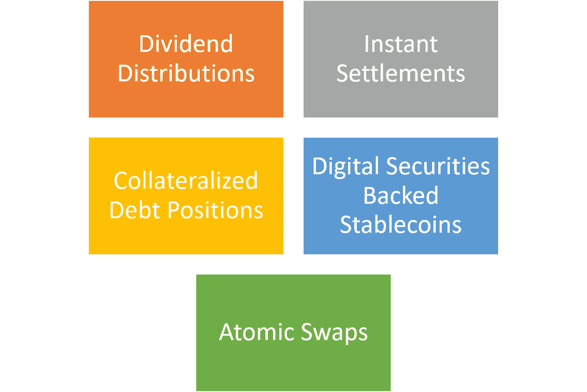
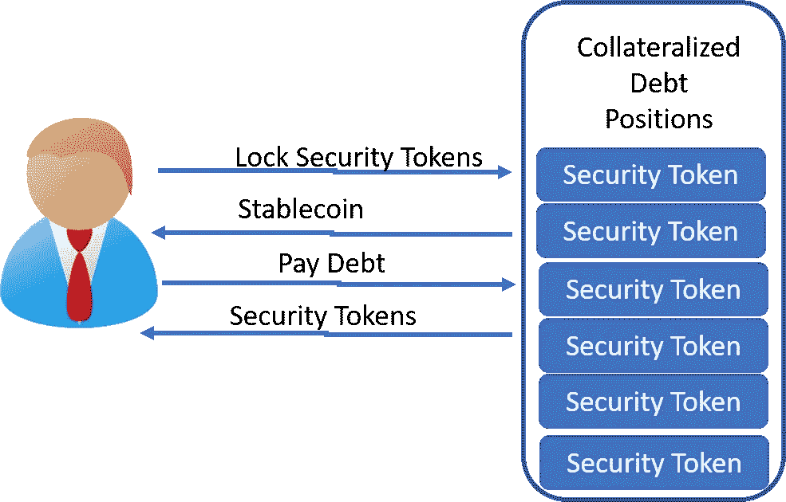

# 关于 Stablecoins 和安全令牌的关系

> 原文：<https://medium.com/hackernoon/about-the-relationship-between-stablecoins-and-security-tokens-a26e43f15d9a>

上周，新闻头条主要是摩根大通宣布有意推出自己的稳定货币“JPM 币”。我对这个消息的最初反应是复杂的。一方面，JPM 硬币代表着对稳定的硬币市场的强有力的认可，并将为新银行加入这一趋势铺平道路。然而，我们不能忘记这样一个事实，即商业银行支持的稳定币可能会导致空间的碎片化，基本上是一个临时的解决方案，直到央行决定发行自己的稳定币(在未来的帖子中会有更多相关内容)。JPM 硬币的发行让我思考了一个我最近一直在探索的关于稳定硬币和安全代币之间关系的论题。随着 stablecoins 迅速巩固为加密生态系统的重要组成部分，探索它们将如何影响下一代数字证券非常重要。

稳定币，而非实用代币，才是数字证券的合法前身。从功能的角度来看，stablecoins 解决了任何证券结构的一个基本问题:支付。事实上，stable 加入了一种我们从未见过的新的价值转移形式:稳定的可编程支付。到目前为止，证券代币依赖于任何形式的红利分配的离线、基于菲亚特的支付方式。在安全令牌中利用稳定的可编程支付提高了许多传统证券场景的效率，为我们从未见过的新证券形式打开了大门。

# 稳定密码和安全令牌

stablecoins 和安全令牌之间的关系不仅仅是为数字证券提供支付基础。从概念上讲，我喜欢把 stablecoins 和安全令牌之间的联系看作是一种双向的联系:stablecoins 支持新形式的安全令牌，而这些安全令牌又可以组合起来，在一种只受底层编程模型限制的关系中构建新形式的 stablecoins。在传统金融市场，创造由特定资产支持的新法定货币是非常具有挑战性的，这种限制在加密领域不一定存在。在一个非常有趣的循环中，新形式的无抵押或加密抵押的稳定硬币可以从安全代币中出现。

由结合了安全代币和稳定硬币的可编程模型创造的金融工具非常迷人，但我们需要从某个地方开始。务实地说，数字证券和 stablecoins 的结合可以在不久的将来打开密码市场的几个关键场景。

# 股息分配

想象一下，一个债务证券代币每小时向代币持有者派发股息，或者一个抵押头寸每天派发利息？虽然智能合约的可编程性实现了传统市场中不可能实现的股息分配模型，但我们需要一个稳定的会计单位来封装股息支付。使用 fiat 车辆在安全令牌智能中实现红利分配极其麻烦，而且耗时太长。Stablecoins 提供了一种加密本机的、编程上高效的机制，使股息分配成为安全令牌的一等公民。

让我们来看一个令牌化债券的场景，其中令牌持有者将在一天内定期获得股息。在这种情况下，债券发行人可以在钱包中存放 MakerDAO 的 Dai，债券智能合约将使用这些 Dai 向代币持有人分配红利。像戴这样的稳定债券的可编程性使得股息支付能够基于与债券或债券持有人的市场行为相关的各种条件而被动态地触发。

# 即时结算

许多大宗证券交易需要几天才能结算。我们都知道区块链可以将结算时间缩短到几分钟，但如果部分交易依赖于菲亚特汽车呢？想象一下，一个投资者从一个银行账户中电汇了 1000 美元 2M，去投资一种特定的加密证券？我们的投资者当然可以将他的$2M 转换成密码，但这个过程也需要一些努力。利用 stablecoins 作为支付机制可以大大减少结算时间，并简化加密证券的相应流程。

# 抵押债务头寸

想象一个场景，一个投资者被允许以他持有的特定加密证券为抵押借款。这种情况在金融市场中并不新鲜，债务抵押债券(CDO)等臭名昭著的例子与这种动态类似。加密空间有自己的 CDO 版本，被称为抵押债务头寸(CDP)，由 MaketDAO 等协议开创。从概念上讲，CDP 允许加密投资者锁定加密资产池，并获得加密贷款作为回报。在 MakerDAO 的案例中，该平台利用 Dai stablecoin 作为基础支付机制。

CDP 之类的概念看起来很适合安全令牌，但它们需要稳定的令牌。在应用于安全令牌的 CDP 模型中，投资者将注册一组加密证券作为抵押品，并获得一个稳定的硬币作为回报，该硬币可用于任何活动。如果投资者有兴趣提取他们的加密证券，他们只需将 stablecoin 付款发送回 CDP 智能合约，资产就会被释放到原来的钱包中。

# DS 支持的 Stablecoins

如今，大多数稳定货币都与美元等法定货币挂钩。然而，我们可以设想其他形式的稳定或半稳定的硬币，它们在下面使用稳定的加密安全。我最喜欢的一个例子是由美国国债担保的稳定货币。在这种情况下，稳定币利用足够稳定的基础资产，可以用作记账单位，同时还具有相对稳定的股息分配的好处。诚然，这个模型不太符合稳定硬币的定义，但这个概念仍然非常有趣。有一点是肯定的，随着安全令牌的发展，它们肯定会为我们以前没有预见到的新形式的稳定令牌提供基础。

# 原子互换

我仍然对安全令牌的分散转移的潜力非常好奇。在不同的分散交易机制中，我认为在不久的将来，稳定债券和加密证券之间的原子互换是一种很有潜力的机制。在这种模式下，投资者将能够通过直接“交换”另一个投资者持有的稳定硬币来交换加密证券池。这种交换将在没有任何中介或经纪人的情况下进行。鉴于合规性规则将在令牌级别上表达，分散原子交换的潜力似乎非常可行。

这些只是 stablecoins 和安全令牌之间的关系可以实现的一些有趣的加密工具。Stablecoins 释放了数字证券的支付能力，为各种新场景提供了基础。与此同时，安全令牌的发展可以间接促成新形式的稳定货币，这些货币不属于传统的固定货币模型。