# 文本摘要变得简单(2)，文本表示

> 原文：<https://medium.com/hackernoon/abstractive-text-summarization-tutorial-2-text-representation-made-very-easy-ef4511a1a46>

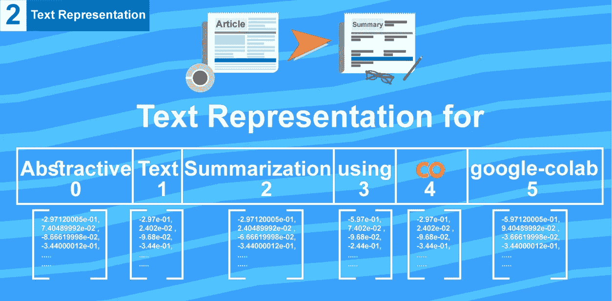

这个故事是如何轻松构建一个抽象文本摘要器的系列文章的延续，(查看本系列文章的 [github repo](https://github.com/theamrzaki/text_summurization_abstractive_methods) )，今天我们将讨论如何构建一个能够理解文字的****摘要器，因此我们将通过向摘要器表示文字****

**我在这个系列中的目标是以一种简单的方式呈现抽象文本摘要的最新方式，(你可以查看我的概述博客**

1.  **注意使用 seq2seq 模型的方法**
2.  **使用指针生成器**
3.  **将强化学习与深度学习结合使用**

**我们将使用 google colab，因此您不必使用功能强大的计算机，也不必将数据下载到您的设备，因为我们会将 google drive 连接到 google colab，以获得完全集成的深度学习体验(您可以查看[我对免费深度学习生态系统平台的概述](https://hackernoon.com/begin-your-deep-learning-project-for-free-free-gpu-processing-free-storage-free-easy-upload-b4dba18abebc)**

**所有代码都可以通过 [my github repo](https://github.com/theamrzaki/text_summurization_abstractive_methods) 在线找到**

> **本教程基于 https://github . com/董军-李/text-summarying-tensorflow 的工作，他们在简化使用 tensor flow 应用摘要所需的工作方面做了大量工作，我构建了他们的代码，将其转换为 python 笔记本以在 google colab 上工作，我真的很钦佩他们的工作**

**所以让我们开始吧！！**

****

**EazyMind free Ai-As-a-service for text summarization**

**我在一个网站上添加了一个文本摘要模型 [eazymind](http://bit.ly/2VxhPqU) ，这样你就可以实际尝试自己生成摘要(看看你能构建什么)，它可以通过简单的 api 调用来调用，并且通过一个 [python 包](http://bit.ly/2Ef5XnS)，这样文本摘要就可以很容易地集成到你的应用程序中，而不需要设置 tensorflow 环境的麻烦，你可以免费注册[，并享受免费使用这个 api 的乐趣。](http://bit.ly/2VxhPqU)**

# **1-设置**

## **首先，我们首先创建一个 google colab 笔记本**

**1-前往[https://colab.research.google.com](https://colab.research.google.com)**

**2-选择 google drive 选项卡(将新的 google colab 保存到 Google Drive)**

**3-选择**新的 Python 3 笔记本**(也可以选择 python 2 笔记本)**

**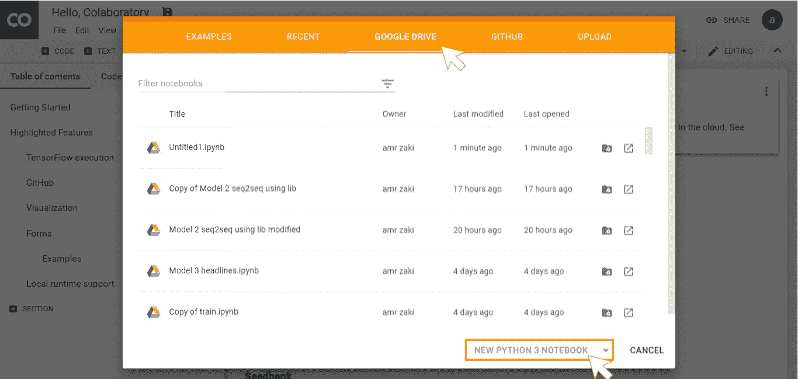**

**一个空白的笔记本会被创建到你的 google drive 中，看起来像这样**

**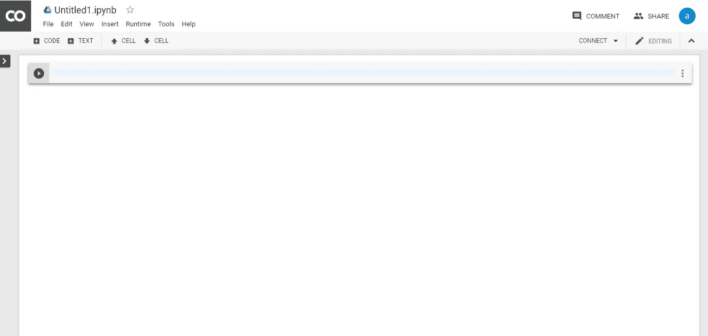**

**您可以通过选择顶部菜单中的运行时间按钮，将笔记本的运行时间更改为**

1.  **更改您正在使用的 python 版本**
2.  **从(GPU，TPU)中选择硬件加速器**

**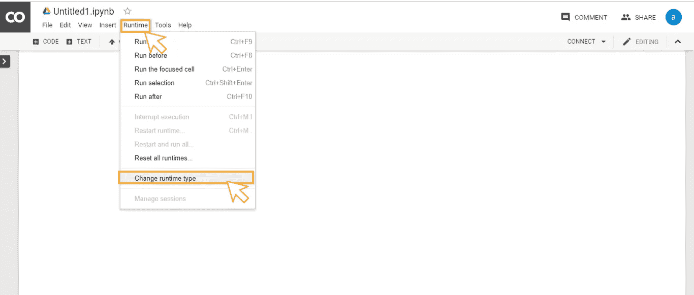****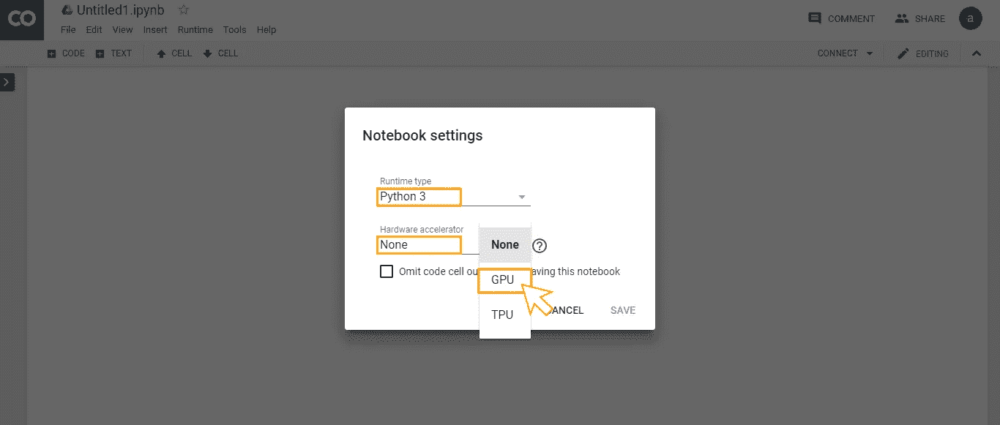**

## **1-A-A 或者你可以直接从我的 github repo 中克隆代码**

1.  **转到 https://colab.research.google.com 的，但这次我们会选择 github 标签页**
2.  **然后我们只需粘贴这个[链接](https://github.com/theamrzaki/text_summurization_abstractive_methods/blob/master/Implementation%20A%20(seq2seq%20with%20attention%20and%20feature%20rich%20representation)/Model%202/Model_2.ipynb)，并点击上传**

**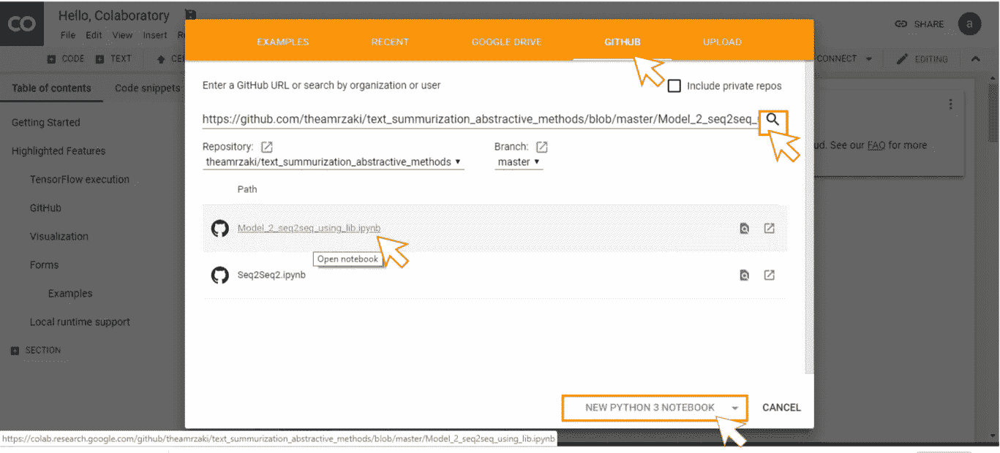**

## **1-B 现在，我们已经创建了我们的谷歌实验室，让我们连接到谷歌驱动器**

**在新创建的笔记本中，添加一个新的代码单元**

**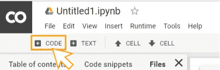**

**然后把这段代码粘贴进去**

```
#[https://stackoverflow.com/questions/47744131/colaboratory-can-i-access-to-my-google-drive-folder-and-file](https://stackoverflow.com/questions/47744131/colaboratory-can-i-access-to-my-google-drive-folder-and-file)!apt-get install -y -qq software-properties-common python-software-properties module-init-tools
!add-apt-repository -y ppa:alessandro-strada/ppa 2>&1 > /dev/null
!apt-get update -qq 2>&1 > /dev/null
!apt-get -y install -qq google-drive-ocamlfuse fuse
from google.colab import auth
auth.authenticate_user()
from oauth2client.client import GoogleCredentials
creds = GoogleCredentials.get_application_default()
import getpass
!google-drive-ocamlfuse -headless -id={creds.client_id} -secret={creds.client_secret} < /dev/null 2>&1 | grep URL
vcode = getpass.getpass()
!echo {vcode} | google-drive-ocamlfuse -headless -id={creds.client_id} -secret={creds.client_secret}!mkdir -p drive
!google-drive-ocamlfuse drive
```

**这将连接到你的驱动器，并创建一个文件夹，你的笔记本可以访问你的谷歌驱动器**

**它会要求您访问您的驱动器，只需点击链接，并复制访问令牌，它会问这两次**

**编写完这段代码后，您可以通过单击单元格(shift enter)或单击代码单元格顶部的 play 按钮来运行代码**

**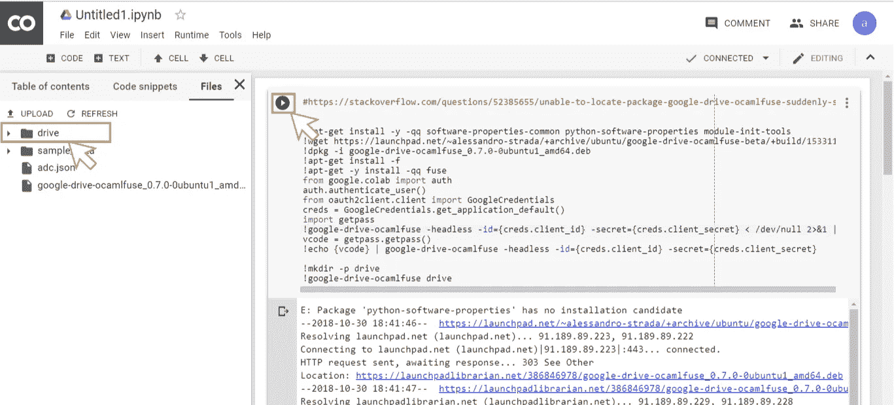**

**然后，您可以简单地通过文件的路径以**

```
path = "drive/test.txt"
```

## **1-C 现在让我们获取我们要处理的数据**

**我们要处理的数据集是以**新闻**和它们的**标题的形式。****

**输入将是**新闻内容**，所需的输出将是其摘要，或者在这种情况下将是**标题****

**对于这项任务，有两个流行数据集**

1.  **亚马逊产品评论**
2.  **CNN/每日新闻数据集**(我们将在我们的案例中使用)****

**你不需要下载数据，你只需要把它拷贝到你的谷歌硬盘(T21)上，只需要几秒钟的时间。**

**这是包含数据的文件夹的[链接](https://drive.google.com/drive/folders/1Izsbg_p1s52dFNh8NmSG5jmDtRgHcLUN?usp=sharing)。**

**这里我们将使用 [Copy，Google Drive 的 URL](https://softgateon.herokuapp.com/urltodrive/)，这使您能够轻松地在不同的 Google Drive 之间复制文件**

****

**首先你要粘贴上面的[链接](https://drive.google.com/drive/folders/1Izsbg_p1s52dFNh8NmSG5jmDtRgHcLUN?usp=sharing)**

****

**paste your link , name it , then save to google drive**

**然后你只需点击保存，复制到谷歌驱动器(认证后你的谷歌驱动器)**

**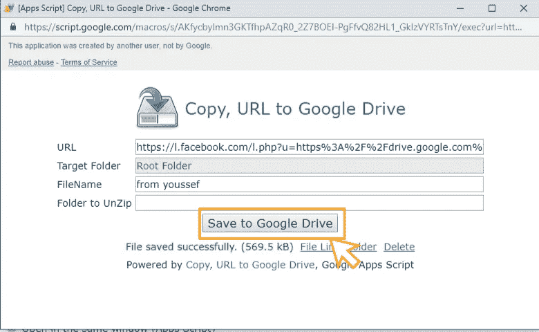**

**after authenticating , you just click save to google drive**

**现在在设置过程之后，我们可以开始我们的工作了，所以让我们开始吧！！**

# **2 -依赖和路径**

## **2-首先让我们安装所需的依赖项**

**在 google colab 中，您可以使用 pip 进行安装，只需简单地！皮普，**

**在你点击的每个代码段中**

****

**然后开始写你的代码**

```
!pip install gensim
!pip install wget

import nltk
nltk.download('punkt')
```

## **2-b 然后让我们设置所需的依赖关系**

```
from nltk.tokenize import word_tokenize
import re
import collections
import pickle
import numpy as np
from gensim.models.keyedvectors import KeyedVectors
from gensim.test.utils import get_tmpfile
from gensim.scripts.glove2word2vec import glove2word2vec
```

## **2-c 然后让我们定义在哪里可以找到数据**

```
**#default path for the folder inside google drive**
default_path = "drive/Colab Notebooks/Model 2/"**#path for training text (article)** train_article_path = default_path + "sumdata/train/train.article.txt" **#path for training text output (headline)** train_title_path   = default_path + "sumdata/train/train.title.txt" **#path for validation text (article)** valid_article_path = default_path + "sumdata/train/valid.article.filter.txt"**#path for validation text output(headline)** valid_title_path   = default_path + "sumdata/train/valid.title.filter.txt"
```

# **3-建立字典**

**要使文本摘要工作，您必须用字典格式表示您的单词**

**假设我们有这样一篇文章**

> **周三，五届世界冠军关颖珊退出了#美国花样滑冰锦标赛，但她将向美国滑冰官员申请参加#都灵奥运会#的机会**

**每个单词在字典中都有一个代表**

**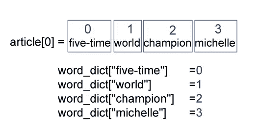**

**我们还需要反向操作，比如**

**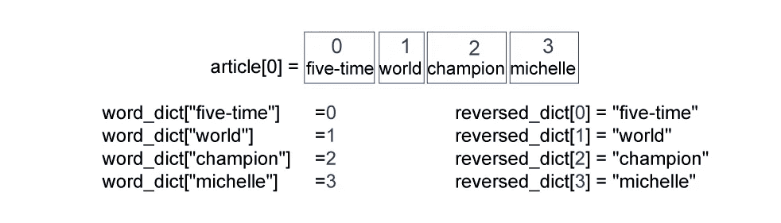**

**为了应用它，我们需要一些辅助函数，比如**

## **3-简单的清理数据功能**

**这个函数的目标是简单地清理数据，只需用#替换一些不需要的字符**

```
def clean_str(sentence):
    sentence = re.sub("[#.]+", "#", sentence)
    return sentence
```

**这种字符替换相当简单，您当然可以添加多个替换步骤**

## **实际返回文本的 3-B 函数**

**并应用上述清洁功能**

```
def get_text_list(data_path, toy):
    with open (data_path, "r", encoding="utf-8") as f:
        if not toy:
            return [clean_str(x.strip()) for x in f.readlines()][:200000]
        else:
            return [clean_str(x.strip()) for x in f.readlines()][:50]
```

**该函数将在多种情况下调用**

1.  **如果需要加载培训数据**
2.  **或者测试数据**
3.  **或者，如果你只是需要一个以上的例子，只需简单地设置**玩具=真****

## **3-C 现在让我们构建实际创建所需字典的函数**

**在这里，您会看到我们添加了 4 个内置单词，它们对于 seq2seq 算法至关重要，它们是**

1.  **<padding>这将用于制作相同长度的序列</padding>**
2.  **<unk>这将用于识别在字典中没有找到该单词</unk>**
3.  **这将被用来确定一个句子的存在**
4.  **这将用于识别一个句子的结尾**

> **从 github 中复制代码[，因为这里的填充由于媒体的编辑而不正确](https://github.com/theamrzaki/text_summurization_abstractive_methods/blob/master/Implementation%20A%20(seq2seq%20with%20attention%20and%20feature%20rich%20representation)/Model%202/Model_2.ipynb)**

```
def build_dict(step, toy=False):
    if step == "train":
  **#First lets load the training data**
        train_article_list = get_text_list(train_article_path, toy)
        train_title_list = get_text_list(train_title_path, toy)**#then lets collect all words from the training data 
  #by simply tokenizing each text sample to its words
  #here we would use the built-in function imported from nltk toolkit
  #which simply return a list of words from a sentence**
  words = list()
        for sentence in train_article_list + train_title_list:
            for word in word_tokenize(sentence):
                words.append(word)**#we would only select the most common words**
  word_counter = collections.Counter(words).most_common()
  **#first lets set the 4 built-in words**
    word_dict = dict()
    word_dict["<padding>"] = 0
    word_dict["<unk>"] = 1
    word_dict["<s>"] = 2
    word_dict["</s>"] = 3**#then lets build our dict , by simply looping over word_co**
        for word, _ in word_counter:
            word_dict[word] = len(word_dict)**#then lets save this to a pickle**
  with open(default_path + "word_dict.pickle", "wb") as f:
     pickle.dump(word_dict, f)**#all of the above was for the training step
#when you are in the validation you can simply load the pickles that
#you have just saved**elif step == "valid":
    with open(default_path + "word_dict.pickle", "rb") as f:
     word_dict = pickle.load(f)**#for both of the 2 cases (training , or validation) 
#we would create a reversed dict** reversed_dict = dict(zip(word_dict.values(), word_dict.keys()))**#then we would simply for the 2 cases (training , or validation)
#define a max len for article and for the summary** article_max_len = 50
   summary_max_len = 15
return word_dict, reversed_dict, article_max_len, summary_max_len
```

# **现在让我们建立我们的数据集**

**在为我们的数据构建 dict 之后，我们将开始构建将在我们的算法中使用的实际数据集**

**使用上述文章的例子，**

> **周三，五届世界冠军关颖珊退出了#美国花样滑冰锦标赛，但她将向美国滑冰官员申请参加#都灵奥运会#的机会**

**算法需要用这个来表示**

**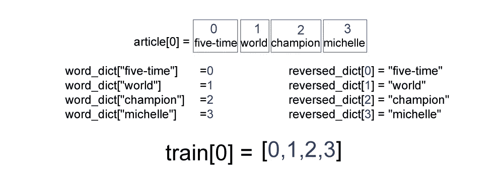**

**就是简单地获取给定句子中单词的单词字典集合**

**测试数据也会出现同样的情况**

```
def build_dataset(step, word_dict, article_max_len, summary_max_len, toy=False):
**#---case of train 
#---we would load both (article , headline) for training
**    if step == "train":
        article_list = get_text_list(train_article_path, toy)
        title_list = get_text_list(train_title_path, toy)
**#---case of valid
#---we only load articles
**    elif step == "valid":
        article_list = get_text_list(valid_article_path, toy)
**#---if step is neither (train nor valid) raise error
**    else:
        raise NotImplementedError
**#---(for each aricle) get list of words 
#--- so now x (article) contains list of words
**    x = [word_tokenize(d) for d in article_list]**#---(for each aricle) get index of word from word_dict for each article
#---if not found , use "<unk>" tokken
#---so now we have our train dataset**
    x = [[word_dict.get(w, word_dict["<unk>"]) for w in d] for d in x]**#---(for each aricle) limit x to article_max_len
**    x = [d[:article_max_len] for d in x]**#---(for each aricle) if x was less than article_max_len
#--- pad the x by using "<padding>" tokken
**    x = [d + (article_max_len - len(d)) * [word_dict["<padding>"]] for d in x]

    if step == "valid":
        return x
    else:      
**#-------if step = "train"
#-------we must do the same steps on headline
#-------but here we don't use the concept of padding
**        y = [word_tokenize(d) for d in title_list]
        y = [[word_dict.get(w, word_dict["<unk>"]) for w in d] for d in y]
        y = [d[:(summary_max_len - 1)] for d in y]
        return x, y
```

**所以让我们简单地调用两者(构建字典和构建数据集)**

```
print("Building dictionary...")
word_dict, reversed_dict, article_max_len, summary_max_len = build_dict("train", False)print("Loading training dataset...")
train_x, train_y = build_dataset("train", word_dict, article_max_len, summary_max_len, False)
```

# **5 字嵌入**

**但是我们还不能给我们的神经网络提供一个包含单词索引的列表，因为它可以理解它们。**

**我们需要用一种我们的神经网络能够理解的格式来表示单词本身，这就产生了单词嵌入的概念**

**这是一个简单的概念，用一个数字列表代替字典中的每个单词，(在我们的例子中，我们用一个 300 的浮点数列表来模拟每个单词)**

**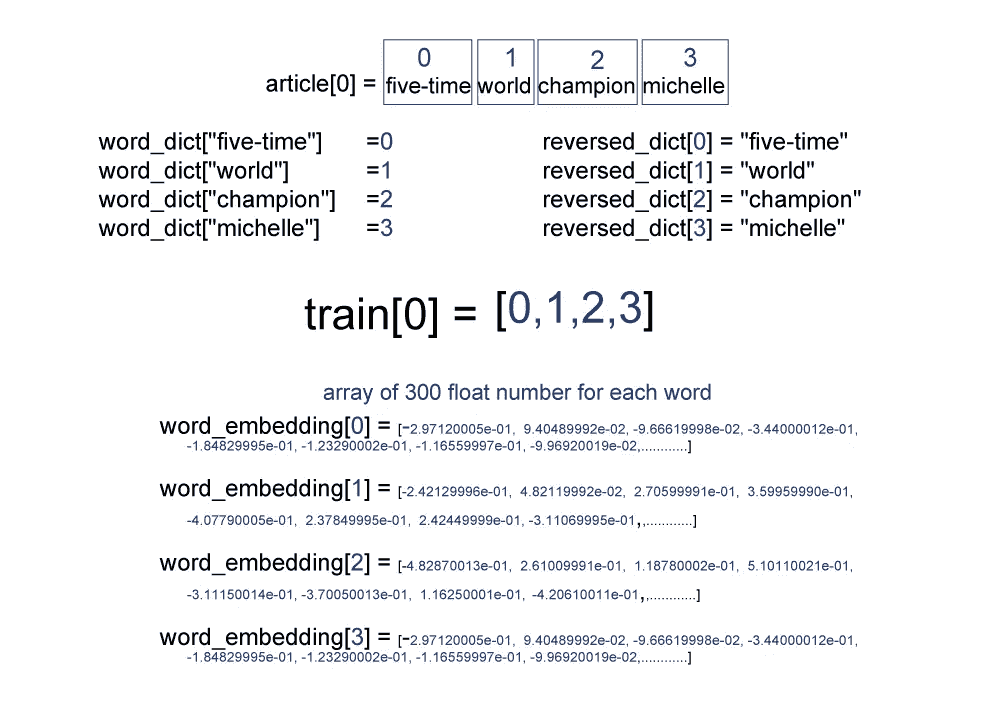**

**已经有经过训练的模型，这些模型已经经过数百万条文本的训练，可以正确地对单词进行建模，一旦你能够正确地对单词进行建模，你的神经网络就能够真正理解文章中的文本。**

**在使用单词嵌入之后，识别算法理解文本的程度的一个非常公知的测试是对给定单词应用单词相似度**

**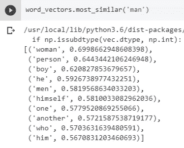****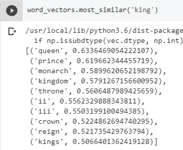**

**正如你所看到的，输出告诉我们，模型现在能够理解单词之间的关系，这是我们神经网络成功的一个极其重要的因素**

## ****5-A 让我们得到我们工作的训练模型****

**斯坦福提供了一个非常有名的预训练模型叫做[手套预训练向量](https://nlp.stanford.edu/projects/glove/)，你可以从 https://nlp.stanford.edu/projects/glove/[下载](https://nlp.stanford.edu/projects/glove/)**

**或者你可以像我之前解释的那样从我的 google drive 中简单地复制它，这里是 pickle 格式的手套向量的[链接](https://drive.google.com/drive/folders/1qxBKLczcqA5Y682SpZhWX6Z_COrNjMDj?usp=sharing)**

## **5-B 构建一个函数来获得单词嵌入数组**

```
def get_init_embedding(reversed_dict, embedding_size):print("Loading Glove vectors...")**#---Load glove model which is in a pickle format 
**    with open( default_path + "glove/model_glove_300.pkl", 'rb') as handle:
        word_vectors = pickle.load(handle)

**#---Loop through all words within the reversed_dict  
**    used_words = 0
    word_vec_list = list()
    for _, word in sorted(reversed_dict.items()):
        try:
**#-----------if the word i found in the dict , 
#-----------save its value**
            word_vec = word_vectors.word_vec(word)
            used_words += 1
        except KeyError:
**#-----------else , generate an array of zeros 
#-----------of length = embedding_size
#-----------which in this case would be 300
#-----------this is the case also for <padding> and <unk>
#-----------where <s>, </s> token would be zeros
#-----------like seen below**
            word_vec = np.zeros([embedding_size], dtype=np.float32) #to generate for <padding> and <unk>**#-------add it to the array
#-------remember that we are looping in sorted reversed_dict
#-------so the index of the element inside word_vec_list 
#-------would be the same as  index of word
#-------no need of a dict , an array is sufficient**
        word_vec_list.append(word_vec)**#---just print out the percentage of knwon words
**    print("words found in glove percentage = " + str((used_words/len(word_vec_list))*100) )

**#----Assign random vector to <s>, </s> token
**    word_vec_list[2] = np.random.normal(0, 1, embedding_size)
    word_vec_list[3] = np.random.normal(0, 1, embedding_size)**#----then return the array** return np.array(word_vec_list)
```

**来调用我们简单调用的函数**

```
word_embedding = get_init_embedding(reversed_dict, 300)
```

# **总而言之**

**因此，我们可以说，我们现在已经正确地表示了文本摘要任务的文本**

**总而言之，我们已经构建了代码来**

****

**只需拨打电话**

```
word_dict, reversed_dict, article_max_len, summary_max_len = build_dict("train", False)train_x, train_y = build_dataset("train", word_dict, article_max_len, summary_max_len, False)word_embedding = get_init_embedding(reversed_dict, 300)
```

**在接下来的教程中，如果上帝愿意，我们将介绍如何构建模型本身，我们将使用 LSTM 构建一个 seq2seq 编码器解码器模型，我们将介绍使用 tensorflow 构建这样一个模型的详细信息，这将是该系列下一个教程的基础，将介绍解决该问题的最新方法**

1.  **使用指针生成器模型**
2.  **将强化学习与深度学习结合使用**

**不要忘记从我的 [repo](https://github.com/theamrzaki/text_summurization_abstractive_methods) 中克隆本教程的代码**

**你可以看一下[之前的教程](/@theamrzaki/text-summarizer-using-deep-learning-made-easy-490880df6cd)关于文本摘要的概述**

**你也可以查看这个[的博客](https://hackernoon.com/begin-your-deep-learning-project-for-free-free-gpu-processing-free-storage-free-easy-upload-b4dba18abebc)谈论一个免费深度学习平台的生态系统**

> **我真心希望你喜欢这个教程，我在等待你的反馈，如果上帝愿意，我在下一个教程里等着你**

# **后续教程**

*   **[什么是 seq2seq 文本摘要，为什么(教程 3)](https://hackernoon.com/tutorial-3-what-is-seq2seq-for-text-summarization-and-why-68ebaa644db0)**
*   **[多层双向 LSTM/GRU 使文本摘要变得简单(教程 4)](http://bit.ly/eazysum_tu4)**
*   **[波束搜索&注意让文本摘要变得简单(教程 5)](http://bit.ly/2G4XCo3)**
*   **[在 Tensorflow 的 94 行中构建一个抽象的文本摘要器！！(教程 6)](http://bit.ly/2ZeEmvO)**
*   **[用于文本摘要的抽象提取方法的组合&(教程 7)](http://bit.ly/2EhcRIZ)**