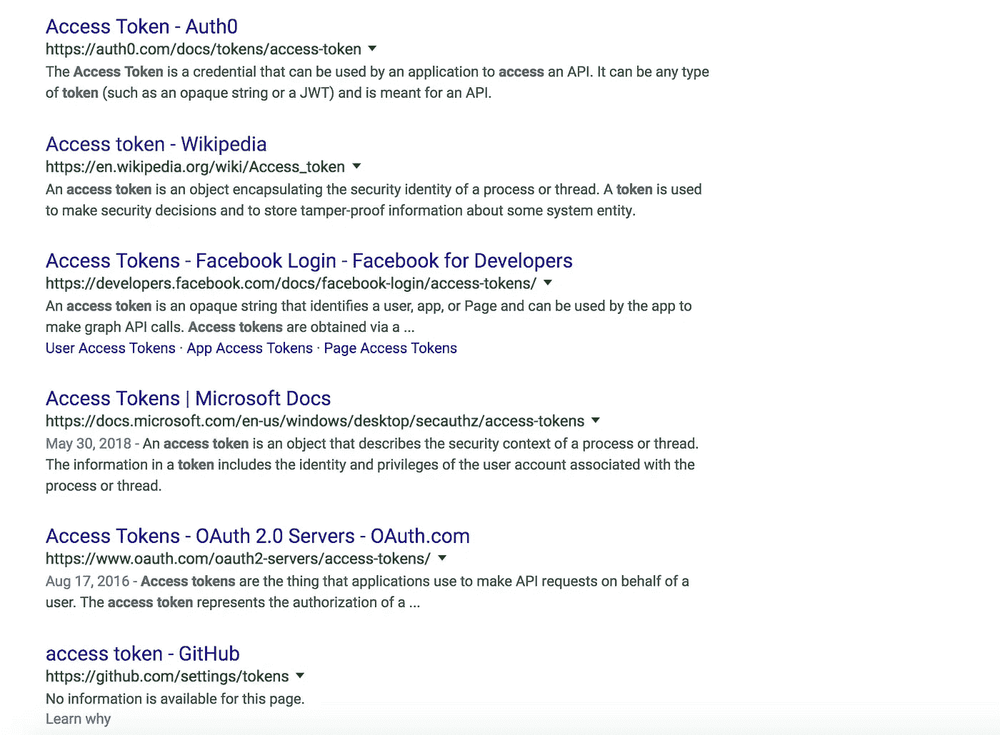
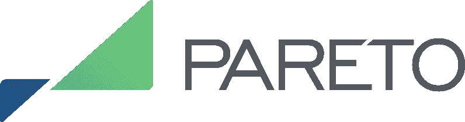

# 接入令牌与 GDP: SaaS 消费市场令牌化。

> 原文：<https://medium.com/hackernoon/access-tokens-and-the-gdp-saas-consumer-market-tokenization-61e6c28c2f15>

访问令牌允许计算机和软件服务区分用户及其访问级别。它们的使用和术语早于加密货币和区块链，谷歌快速搜索显示它们目前的使用在很大程度上与“代币经济”无关。

多年来，为了尽可能多地收集用户，访问令牌一直是免费动态生成的。基于云的软件即服务(SaaS)也依赖于访问令牌，用户通常支付订阅费来访问服务，而访问令牌是免费或以可忽略不计的计算资源生成的支持性技术细微差别。

访问令牌具有独立的价值，它们可以提供对底层服务价值的定价。目前，访问令牌是一种货币化不足的资源，就像一个藏着稀土金属的土堆。经过打磨和提炼后，这种资源将为国家或世界经济的 GDP(国内生产总值)做出贡献。

有了分布式账本技术——如区块链——我们就能证明这一点，主要是因为他们有能力进入一个无许可的自由市场，允许所有各方在中央发行人不知情或不同意的情况下进行交易。这与在游戏中拥有可撤销的虚拟货币或信用形成了直接的对比，其单位保存在公司的中央数据库中。

我帮助管家开发了一款名为[帕累托网络](https://www.pareto.network)的 SaaS 产品，使用该网络需要一个名为帕累托奖励的访问令牌($ [帕累托](https://coinmarketcap.com/currencies/pareto-rewards/))。具体来说，单个帕累托奖励包含与不可替换的访问令牌相同的属性:

*   它是一个加密散列
*   它可以唯一地链接到用户
*   它的存在或不存在可以被用来进入 SaaS 产品
*   它遵循统一的模式

PARETO 是一个访问令牌。通过限制接入令牌的数量，对要接入的服务的需求反映在接入令牌本身的市场价值中。在这个系统之外，访问令牌是随机生成的，是免费的，导致市场效率低下，比如不知道所提供的软件服务的价值。

PARETO 坚持 ERC20 标准，该标准于 2017 年第四季度获得区块链以太坊的批准。

[为什么我们需要一个区块链？](https://blog.pareto.network/why-do-we-need-a-blockchain-for-this-44f5cddf68e2)

SaaS 提供的服务将用户身份、用户状态管理和计费卸载到称为以太坊区块链的公共资源上。成员还可以累积访问令牌，区块链是一个预建的结算图层，一些成员可以在批发市场转售他们的访问令牌。在之前的文章中阅读更多细节[。目前，GDP 不包括转售商品。](https://blog.pareto.network/why-do-we-need-a-blockchain-for-this-44f5cddf68e2)

New markets and the GDP

令牌化消费产品继承了可转让性，允许任何消费者或潜在消费者参与充满活力的批发市场。

你可以在任何一个[以太坊方块浏览器上看到所有帕累托奖励的转移。](https://etherscan.io/token/0xea5f88e54d982cbb0c441cde4e79bc305e5b43bc)

这些市场享有比本地和在线消费市场更高的相对效率，并且旨在变得比股票市场更有效率。

可自由替换的接入令牌的市场价格可以代表网络或服务的当前市场价值。这使得能够以一种透明的方式来理解所销售的商品和服务的价值。

根据定义，GDP 是一个衡量国内经济活动的指标。随着全球经济变得相互交织，这变得越来越难以统计，并且在理解实际经济活动时变得不相关。

令牌化和令牌化资产在全球支付网络上结算，不受任何国家的特定公司或任何政府的控制。因此，符号化也是 GDP 走向无关紧要的进一步催化剂，同时也使得在特定标准允许将其纳入 GDP 时更容易计算。

通过区块链重新设计的准入令牌，累积了去中心化和透明度的好处，有望释放巨大的市场和财富。它们完全符合推动经济增长的云和 SaaS 模式。这将最终增加 GDP，提振全球国家和超国家经济体的表现基准。也就是说，只要我们对国内生产总值的概念仍然足够灵活，能够识别新的、有意义的经济活动形式。

*我希望你喜欢阅读，我写的是货币政策、金融科技问题、编程、区块链和分布式账本技术之间的相互关系。关注我的最新项目和研究* [*推特*](https://www.twitter.com/1blockologist)

*真诚地，*

埃里克·拉米森-怀特