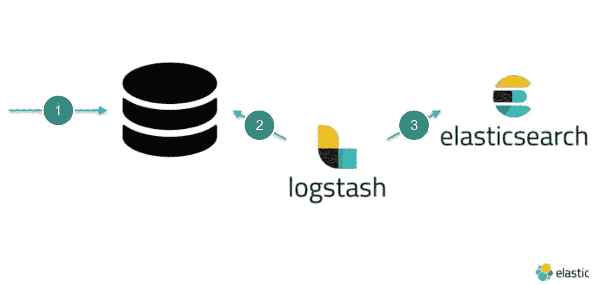
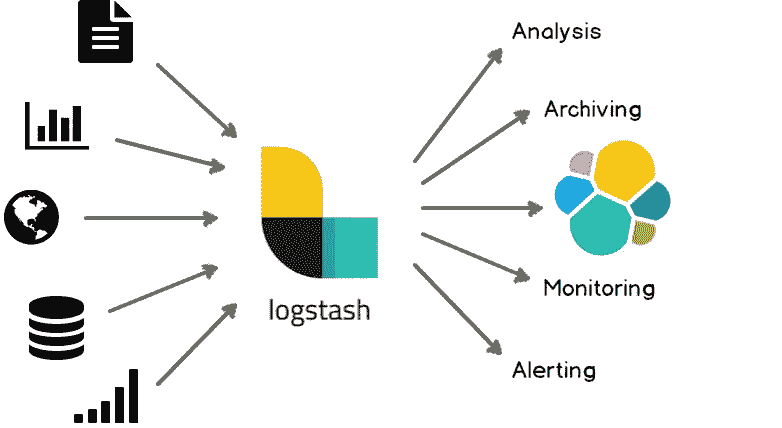
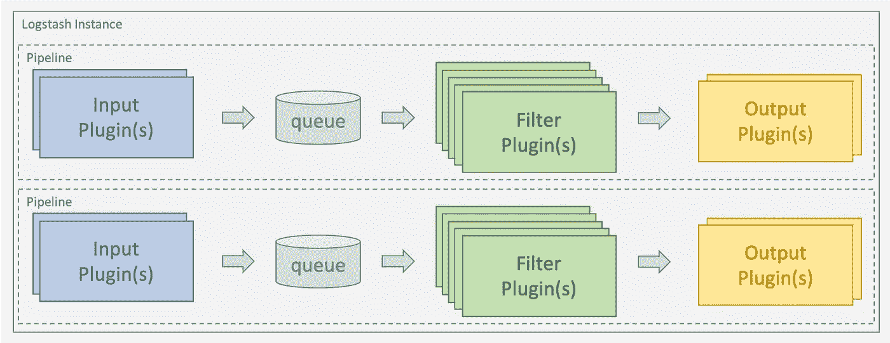

# 使用 Logstash 向遗留应用程序添加 ElasticSearch

> 原文：<https://medium.com/hackernoon/adding-elasticsearch-to-legacy-application-using-logstash-98c19ac2f0fb>


ElasticSearch 凭借其近实时存储、扩展、执行全文搜索和分析海量数据的能力，在市场上创造了繁荣。ElasticSearch 是开源搜索和分析引擎，通常用于具有复杂搜索功能的应用程序。

在本教程中，我们将考虑一个场景，我们希望将 ElasticSearch 添加到我们的遗留应用程序中，作为辅助数据源。假设我们有一个使用 MySQL 数据库的遗留应用程序，现在我们有一个需要大量搜索的需求，我们决定迁移到 ElasticSearch。我在这里的想法仍然是将关系数据库作为**主数据存储**，将 ElasticSearch 作为**辅助数据存储**，以满足我们需要大量搜索的需求。

> 因此，我们的关系数据库将是一个真实的单一来源，我们可以随时扁平化的表格和索引的数据弹性搜索。为了执行繁重的搜索，我们将查询 ElasticSearch 并使用关系数据库，就像通常的应用程序数据库事务一样。

所以现在我们脑海中可能出现的问题是，

*   如何将我的所有数据从结构化数据源(MySQL)迁移到非结构化数据源(弹性搜索)？
*   能否在不停机的情况下完成迁移？
*   我如何保持两个数据源同步？

解决方法之一是使用 **Logstash 输入插件。**



Replication of data from Relational database to ElasticSearch using Logstash

Logstash 是一个基于插件的数据收集和处理引擎。它带有各种插件，可以轻松地配置它，以便在许多不同的架构中收集、处理和转发数据。



处理被组织到一个或多个流水线中。在每个管道中，一个或多个*输入插件*接收或收集数据，然后放入内部队列。默认情况下，它很小，保存在内存中，但是可以配置为比*大，并保存在磁盘*上，以提高可靠性和弹性。

处理线程以微批处理的方式从队列中读取数据，并通过任何已配置的[过滤器插件](https://www.elastic.co/guide/en/logstash/current/filter-plugins.html)按顺序处理这些数据。Logstash 开箱即用，带有大量针对特定处理类型的插件，这就是数据被解析、处理和丰富的方式。

处理完数据后，处理线程会将数据发送到适当的输出插件，这些插件负责格式化和向前发送数据，例如发送到 Elasticsearch。



**Sample Logstash Pipeline**

让我们考虑一个简单的电子商务网站，其中我们维护与客户及其订单相关的数据。现在，我们希望将我们的客户相关数据索引到 ElasticSearch，以便执行广泛的搜索操作。

**1。MySQL 数据库创建**

创建一个名为 **ecomdb** 的示例数据库，并确保我们使用的是同一个数据库

```
CREATE DATABASE ecomdb;
USE ecomdb;
```

**2。现在用下面的查询创建一个客户表，并插入样本数据**

```
CREATE TABLE customer (
id INT(6)  AUTO_INCREMENT PRIMARY KEY,
firstname VARCHAR(30) NOT NULL,
lastname VARCHAR(30) NOT NULL,
email VARCHAR(50),
regdate TIMESTAMP
)
INSERT INTO `ecomdb`.`customer` (`id`, `firstname`, `lastname`, `email`, `regdate`) VALUES (1, 'Roger', 'Federer', '[roger.federer@yomail.com](mailto:roger.federer@yomail.com)', '2019-01-21 20:21:49');
INSERT INTO `ecomdb`.`customer` (`id`, `firstname`, `lastname`, `email`, `regdate`) VALUES (2, 'Rafael', 'Nadal', '[rafael.nadal@yomail.com](mailto:rafael.nadal@yomail.com)', '2019-01-22 20:21:49');
INSERT INTO `ecomdb`.`customer` (`id`, `firstname`, `lastname`, `email`, `regdate`) VALUES (3, 'John', 'Mcenroe', '[john.mcenroe@yomail.com](mailto:john.mcenroe@yomail.com)', '2019-01-23 20:21:49'); 
INSERT INTO `ecomdb`.`customer` (`id`, `firstname`, `lastname`, `email`, `regdate`) VALUES (4, 'Ivan', 'Lendl', '[ivan.lendl@yomail.com](mailto:ivan.lendl@yomail.com)', '2019-01-23 23:21:49'); 
INSERT INTO `ecomdb`.`customer` (`id`, `firstname`, `lastname`, `email`, `regdate`) VALUES (5, 'Jimmy', 'Connors', '[jimmy.connors@yomail.com](mailto:jimmy.connors@yomail.com)', '2019-01-23 22:21:49');
```

**3。创建我们的 Logstash 配置。**

```
input {
  jdbc {
    jdbc_driver_library => "<pathToYourDataBaseDriver>\mysql-connector-java-5.1.39.jar"
    jdbc_driver_class => "com.mysql.jdbc.Driver"
    jdbc_connection_string => "jdbc:mysql://localhost:3306/ecomdb"
    jdbc_user => <db username>
    jdbc_password => <db password>
    **tracking_column¹ => "regdate"**
    **use_column_value²=>true**
    statement => "SELECT * FROM ecomdb.customer where regdate >:sql_last_value;"
**schedule³ => " * * * * * *"**
  }
}
output {
  elasticsearch {
    **document_id**⁴**=> "%{id}"**
    document_type => "doc"
    index => "test"
    hosts => ["[http://localhost:9200](http://localhost:9200)"]
  }
  stdout{
  codec => rubydebug
  }
}
```

> **tracking_column :** 要跟踪其值是否有任何更改的列。这里我们将跟踪`*regdate*`列，因为每当我们的数据库中有新条目时，它都会被更新。
> 
> **使用列值:**设置为`*true*`时，使用定义的`*tracking_column*`值作为`*:sql_last_value*`。当设置为`*false*`时，`*:sql_last_value*`反映最后一次执行查询的时间。
> 
> jdbc 插件将以元数据文件的形式保存`*sql_last_value*`参数，该文件的默认位置是`*c:/users/<yourUser>*`。在执行查询时，该文件将被更新为当前值`*sql_last_value*`。下次管道启动时，将通过读取文件来更新该值。`*sql_last_value*`将被设置为 1970 年 1 月 1 日，如果`*use_column_value*`为真，则设置为 0
> 
> **schedule** :这将定期运行语句，值以 Cron 格式定义，例如:“* * * * *”(每分钟执行查询，在分钟)。在这里，我们将每秒执行一次该语句，因此，即使对我们的数据进行了任何更新或插入，我们也能够在下一次执行查询时将其迁移，并且我们的数据将保持同步。
> 
> ⁴ **document_ID:** 索引的文档 id 对于覆盖 Elasticsearch 中具有相同 id 的现有条目非常有用。如果 logstash 实例失败，这将解决**重复**问题。

上面的配置文件可以分为两个主要部分。

*   输入插件(JDBC 插件):在这里我们定义哪个数据库 URI 连接，用户凭证和查询，这将为我们提供所需的数据。
*   output plugin(ElasticSearch plugin):这里我们定义 elastic search 主机 URL 和索引名称，数据将被索引到这个名称。

将上述代码保存在名为***logstash-sample . conf****的文件中，该文件的位置应该在您的 log stash 安装的 **bin 文件夹**中。*

***4。从 Logstash 安装**的 bin 文件夹中用下面的命令运行 Logstash*

```
*logstash -f logstash-sample.conf*
```

*Logstash 会从你的数据库中获取你的数据，并发布到 ElasticSearch。*

***5。通过执行下面的命令**来验证我们在 ElasticSearch 上的数据*

```
*curl -X GET "localhost:9200/test/_search"*
```

*上述命令的输出将是*

```
*{
  "took": 0,
  "timed_out": false,
  "_shards": {
    "total": 5,
    "successful": 5,
    "skipped": 0,
    "failed": 0
  },
  "hits": {
    "total": 3,
    "max_score": 1,
    "hits": [
      {
        "_index": "test",
        "_type": "doc",
        "_id": "4",
        "_score": 1,
        "_source": {
          "firstname": "Ivan",
          "id": 4,
          "email": "[ivan.lendl@yomail.com](mailto:ivan.lendl@yomail.com)",
          "lastname": "Lendl",
          "[@version](http://twitter.com/version)": "1",
          "regdate": "2019-01-23T17:51:49.000Z",
          "[@timestamp](http://twitter.com/timestamp)": "2019-02-02T06:20:12.413Z"
        }
      },
      {
        "_index": "test",
        "_type": "doc",
        "_id": "2",
        "_score": 1,
        "_source": {
          "firstname": "Rafael",
          "id": 2,
          "email": "[rafael.nadal@yomail.com](mailto:rafael.nadal@yomail.com)",
          "lastname": "Nadal",
          "[@version](http://twitter.com/version)": "1",
          "regdate": "2019-01-22T14:51:49.000Z",
          "[@timestamp](http://twitter.com/timestamp)": "2019-02-02T06:20:12.411Z"
        }
      },
      {
        "_index": "test",
        "_type": "doc",
        "_id": "1",
        "_score": 1,
        "_source": {
          "firstname": "Roger",
          "id": 1,
          "email": "[roger.federer@yomail.com](mailto:roger.federer@yomail.com)",
          "lastname": "Federer",
          "[@version](http://twitter.com/version)": "1",
          "regdate": "2019-01-21T14:51:49.000Z",
          "[@timestamp](http://twitter.com/timestamp)": "2019-02-02T06:20:12.389Z"
        }
      }
    ]
  }
}*
```

*让我们给上面的用例增加一些变化。假设我们希望在同一个文档中索引每个用户的订单细节以及用户细节。*

1.  ***在 MySQL DB 中创建一个订单表。***

```
*CREATE TABLE orders (
orderid INT(6)  AUTO_INCREMENT PRIMARY KEY,
product VARCHAR(300) NOT NULL,
description VARCHAR(300) NOT NULL,
price int(6),
customerid int(6),
ordertime TIMESTAMP,
FOREIGN KEY fk_userid(customerid)
REFERENCES customer(id)
)INSERT INTO `ecomdb`.`orders` (`orderid`, `product`, `description`, `price`, `customerid`,`ordertime`)
 VALUES (1, 'Tennis Ball', 'Wilson Australian Open', '330', '5','2019-01-22 20:21:49');
INSERT INTO `ecomdb`.`orders` (`orderid`, `product`, `description`, `price`, `customerid`,`ordertime`)
 VALUES (2, 'Head Xtra Damp Vibration Dampner', 'Dampens string vibration to reduce the risk of pain', '500', '4','2019-01-23 02:21:49');
 INSERT INTO `ecomdb`.`orders` (`orderid`, `product`, `description`, `price`, `customerid`,`ordertime`)
 VALUES (3, 'HEAD Wristband Tennis 2.5" (White)', '80 % Cotton, 15% Nylon, 5 % Rubber (Elasthan)', '530', '3','2019-01-21 21:21:49');
 INSERT INTO `ecomdb`.`orders` (`orderid`, `product`, `description`, `price`, `customerid`,`ordertime`)
 VALUES (4, 'YONEX VCORE Duel G 97 Alfa (290 g)', 'Head Size 97', '4780', '2','2019-01-22 14:21:49');
 INSERT INTO `ecomdb`.`orders` (`orderid`, `product`, `description`, `price`, `customerid`,`ordertime`)
 VALUES (5, 'Wilson Kaos Stroke - White & Black', 'Wilson Australian Open', '9000', '1','2019-01-25 03:53:49');*
```

*现在，一旦我们准备好数据库，并且我们希望在同一个文档中索引订单细节作为嵌套的 JSON 对象以及用户细节，我们将利用 Logstash 提供的[过滤器插件。Logstash 支持各种插件，我们可以根据需要选择一个。我们将使用**红宝石滤镜** *。有了 ruby 过滤器，我们可以执行任何随机的 ruby 代码。*](https://www.elastic.co/guide/en/logstash/current/filter-plugins.html)*

*我们可能会想到的问题是*

*   *我们如何使用 JDBC 输入插件从两个不同的表中获取数据？我们将使用**连接查询。***

```
*select c.id as customerid,c.firstname ,c.lastname ,c.email, c.regdate ,
od.orderid ,od.product ,od.description , od.price ,od.ordertime
from customer as c left join  orders as od on c.id = od.customerid;*
```

***2。按照我们的要求编写 Ruby 代码。***

*操纵我们文档的 Ruby 代码如下*

```
*# the filter method receives an event and must return a list of events.
# Dropping an event means not including it in the return array,
# while creating new ones only requires you to add a new instance of
# LogStash::Event to the returned array
def filter(event)
orderid =event.get("orderid")
product = event.get("product")
description = event.get("description")
price = event.get("price")
ordertime = event.get("ordertime")
orderDetails ={
   "orderid" => orderid,
   "product" => product,
   "description" => description,
   "price" => price,
   "ordertime" => ordertime
}
event.set('orderDetails',orderDetails)
event.remove('orderid')
event.remove('product')
event.remove('description')
event.remove('price')
event.remove('ordertime')
return [event]  
end*
```

*将 ruby 文件命名为 **sampleRuby.rb *。*** Ruby 过滤器有一个强制的**过滤器方法**，它接受一个 Logstash 事件并且必须返回一个事件数组。在上面的代码中，我们通过创建订单详情的*散列来操纵事件，并将该散列设置为事件中的新字段。我们还删除了添加订单详细信息散列后不需要的字段。**

***3。将 ruby 过滤器添加到 logstash 配置文件中。***

*新版本的 **logstash-sample.conf** 文件将如下所示*

```
*input {
  jdbc {
    jdbc_driver_library => "<pathToYourDataBaseDriver>\mysql-connector-java-5.1.39.jar"
    jdbc_driver_class => "com.mysql.jdbc.Driver"
    jdbc_connection_string => "jdbc:mysql://localhost:3306/ecomdb"
    jdbc_user => <db user name>
    jdbc_password => <db password>
    tracking_column => "regdate"
    use_column_value=>true
    statement => "select c.id as customerid,c.firstname ,c.lastname  ,c.email, c.regdate ,od.orderid ,od.product ,od.description , od.price ,od.ordertime from customer as c left join  orders as od on c.id = od.customerid where c.regdate>:sql_last_value;"
schedule => " * * * * * *"  
}
}
filter{
ruby{
**path¹ => 'sampleRuby.rb'**
}
}
output {
  elasticsearch {
    document_id=> "%{customerid}"
    document_type => "doc"
    index => "test"
    hosts => ["[http://localhost:9200](http://localhost:9200)"]
  }
  stdout{
  codec => rubydebug
  }
}*
```

> *实现`*filter*`方法的 ruby 脚本文件的路径。**ruby 文件的位置应该与 logstash-sample.conf 的位置相同***

***4。使用下面的命令**运行上面的配置文件*

```
*logstash -f logstash-sample.conf*
```

*上述脚本的输出如下所示*

```
*{
  "took": 0,
  "timed_out": false,
  "_shards": {
    "total": 5,
    "successful": 5,
    "skipped": 0,
    "failed": 0
  },
  "hits": {
    "total": 5,
    "max_score": 1,
    "hits": [
      {
        "_index": "test",
        "_type": "doc",
        "_id": "5",
        "_score": 1,
        "_source": {
          **"orderDetails": {
            "orderid": 1,
            "description": "Wilson Australian Open",
            "product": "Tennis Ball",
            "ordertime": "2019-01-22T14:51:49.000Z",
            "price": 330
          },**
          "[@version](http://twitter.com/version)": "1",
          "email": "[jimmy.connors@yomail.com](mailto:jimmy.connors@yomail.com)",
          "[@timestamp](http://twitter.com/timestamp)": "2019-02-02T14:13:46.754Z",
          "regdate": "2019-01-23T16:51:49.000Z",
          "firstname": "Jimmy",
          "customerid": 5,
          "lastname": "Connors"
        }
      }
    ]
  }
}*
```

*正如上面所强调的，我们可以看到我们已经在现有的文档中添加了一个嵌套的 JSON。*

*Logstash 插件可以帮助我们将遗留系统迁移到 ElasticSearch。这样，我们将应用程序的搜索部分迁移到了搜索引擎，而不是使用数据存储提供的搜索功能。我们将我们的真实来源保存在 SQL 数据库中，但是您也可以想象从传统数据存储迁移到 NoSQL。*

> ***注意:JDBC 输入插件无法跟踪数据库中的删除事件(硬删除)。您可以考虑用 isdeleted 标志修改数据库表，并将该列用作跟踪列。***