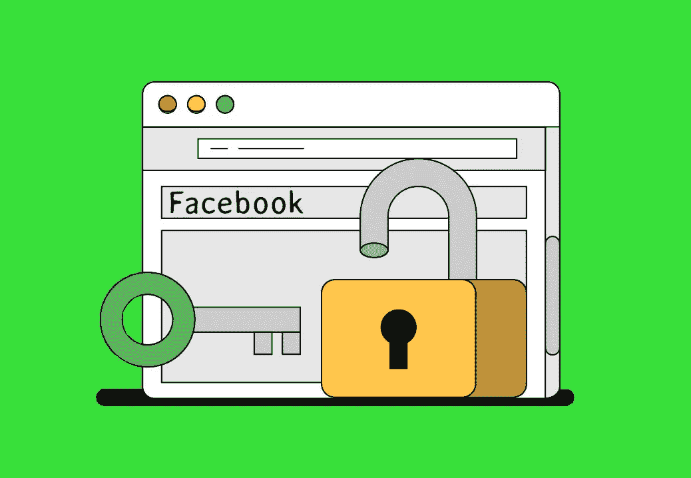
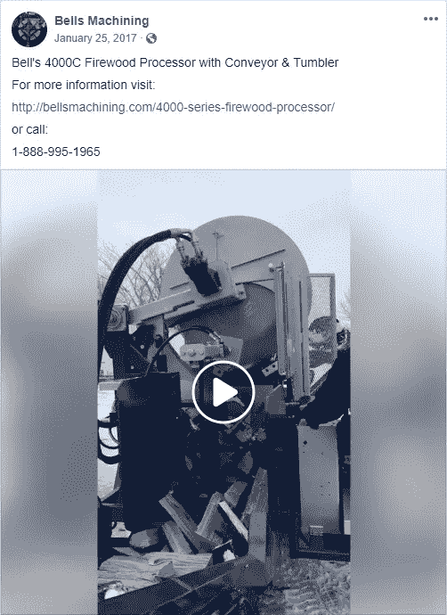
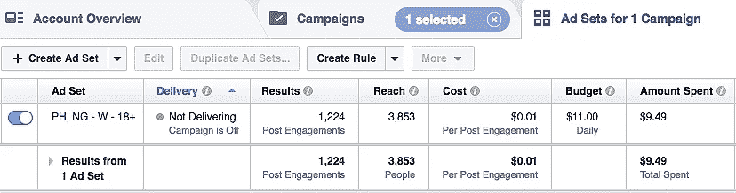

# 运行脸书广告的高级技巧

> 原文：<https://medium.com/hackernoon/advanced-trick-for-running-facebook-ads-a6bd21e7bb2a>

在这一点上，在脸书投放广告的需求是相当普遍的。

所以，你需要优化，超越基础。

更好的定位。引人注目的创意。隐藏的诡计，很管用。

如果你已经在脸书上投放广告，但想超越你的结果，我有好消息告诉你。在这篇文章中，我将分享我微调广告以最大化投资回报率的关键技巧。

就这样，让我们开始吧！

我注意到，在一个帖子获得了一定数量的社交证明(喜欢、评论、分享)后，我开始从我的广告中获得转化。有一天，我在脸书邮报上看到了贝尔斯机械加工公司的招聘广告:木柴加工机。它非常受欢迎，但页面是全新的。所以，我开始研究不同的脸书广告，它们的页面，评论和在那里发表评论的人。

奇怪的是，一些受欢迎的广告帖子(基于大量评论)发布在只有少量追随者的页面上。在研究了这些评论后，我意识到许多最初的评论不是美国人做的，而是主要来自菲律宾、越南、尼日利亚等国家的人。在那之后，我完全理解了这个计划，并开始寻找如何使用它的方法。

## **铃铛加工:木柴加工机**

**493K 股** | **42K 评论** | **38M 浏览量**

[脸书邮报](https://www.facebook.com/bellsmachining/posts/1430991456913867/)

脸书有几种类型的广告活动。他们每个人都有自己的任务。

# 脸书算法根据您的活动目标优化您的广告:

**参与**需要与岗位互动。脸书针对那些更有可能参与帖子的人(如，评论，分享，观看视频)调整广告。但是这些人不会关注脸书以外的链接，也不太可能购买。

**网站点击**将显示给那些更有可能去网站、熟悉网站内容的人，但这些人并不总是准备执行目标动作(注册、订阅、购买等)。).

**网站转化**优化型是最贵的一种。脸书向那些更有可能改变信仰的人展示广告。脸书像素必须安装在网站上通知脸书算法转换发生。

一个“*网站转化*”的活动听起来很有吸引力，但无论脸书 pixel 有多聪明，你的广告有多棒，人们都不会急于购买有 10 个赞但下面没有评论的广告。人们愿意想要别人想要的东西。它就像一个队列:只要几个人来到同一个地方，所有路过的人都开始停下来，想知道那里发生了什么。

**外卖？如果你想要最好的结果，广告帖子应该有足够的社会证明。因此，这里有一些如何让人们购买你的脸书广告的步骤:**

# **1。** **在页面上创建帖子。**

在页面上创建一个帖子，而不是普通的广告，可以选择使用水平、方形甚至垂直的图像格式。同样，在帖子中，你可以写任意长度的文字。没有限制，只要保证图片中的文字不超过 20%即可。这里有一个工具可以帮助检查图像的适用性:[*https://www.facebook.com/ads/tools/text_overlay*。](https://www.facebook.com/ads/tools/text_overlay.)本帖将作为广告使用。

# **2。收集社交证明(赞、分享、评论)。**

创建针对“*参与度*”和目标国家(如尼日利亚和菲律宾)进行优化的广告活动。你可以试试其他的，但是这些最适合我。

首先，这些国家的广告非常便宜，其次，这些国家的人民英语说得非常好。我访问了用户档案，震惊于这样一个事实，例如，在尼日利亚，几乎所有人的帖子都是用完美的英语写的，带有美国习语。花 10 美元，我通常会得到 1000-1500 个帖子赞。这是其中一个广告活动的结果。

同样的活动，但针对美国花费了 50 美元，我甚至没有接近截图中显示的结果。大约给了我 300-400 个赞。

# **3。** **帖子评论**。

我自己评论帖子，并要求我的同事/朋友这样做。在评论中添加照片效果非常好。这有助于其他人不要第一个评论某事，并有助于确定对话的基调。在我获得了一定数量的赞和评论后，我停止了在菲律宾和尼日利亚的广告，开始在核心市场投放“*网站转换*”的广告。

**备注？使用这个方案，我推出了大约 10 种不同的产品，并且都很成功。有些活动比其他的好，有些更差。无论如何，我们必须明白广告宣传不会永远奏效。脸书像素看你的目标，并从中选择最好的，那些更有可能转换。**

随着时间的推移，你的每次转换成本将会增加。在这种情况下，只需创建一个新的广告，然后从头再来。

最重要的是，如果你第一次竞选失败了，千万不要放弃。继续尝试，你会发现你的广告活动奖励你以前的失败。

