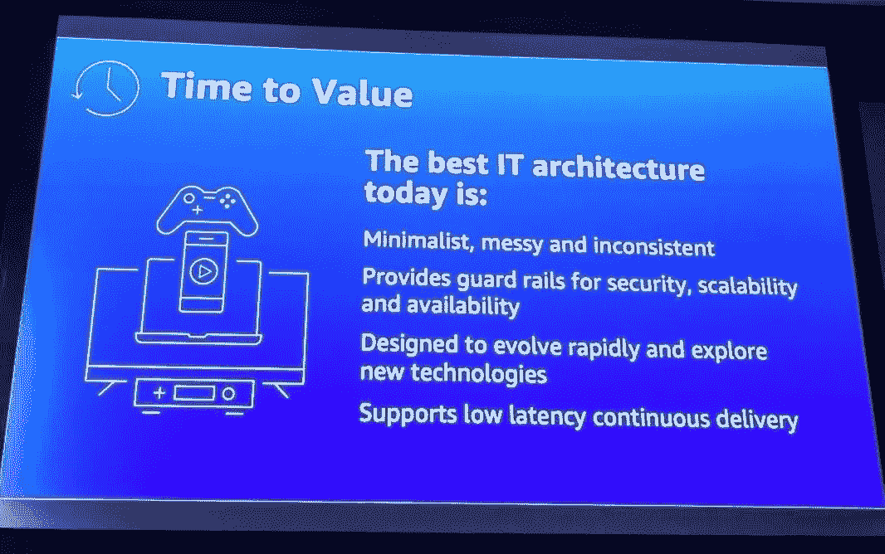
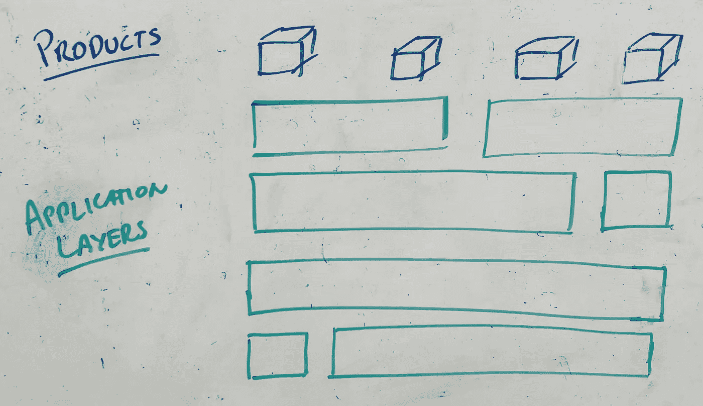
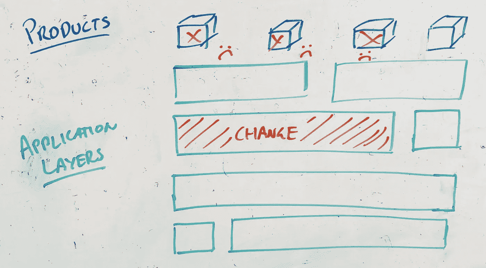
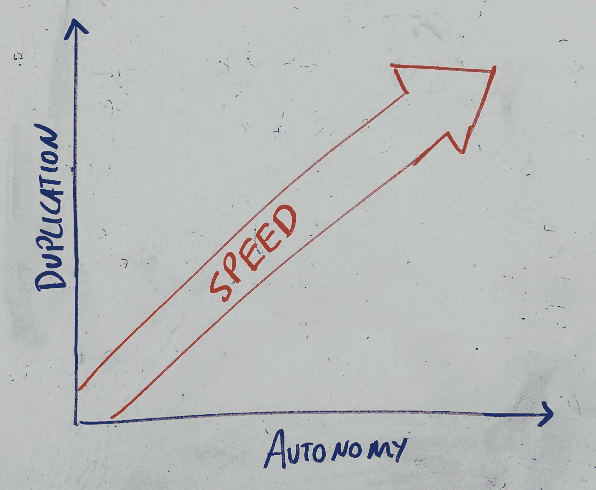
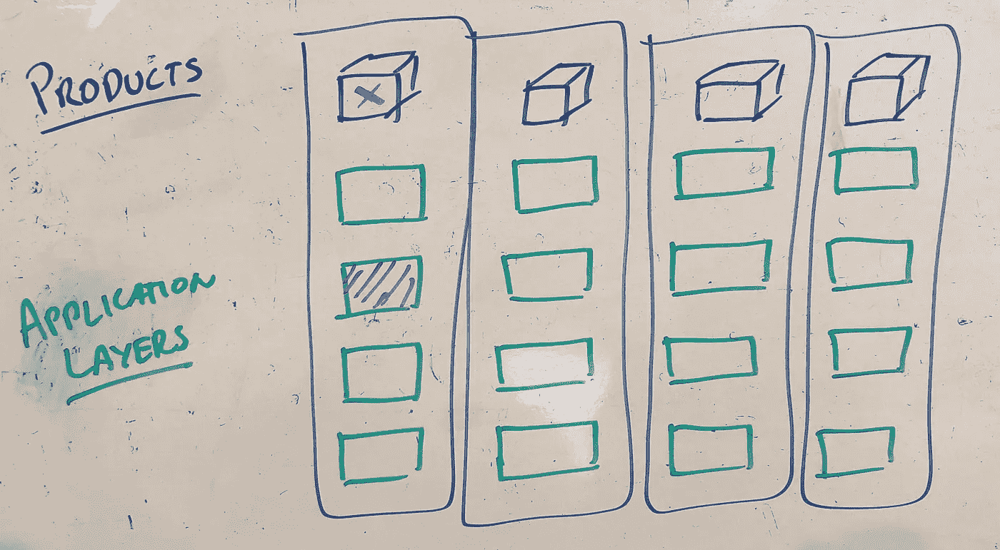
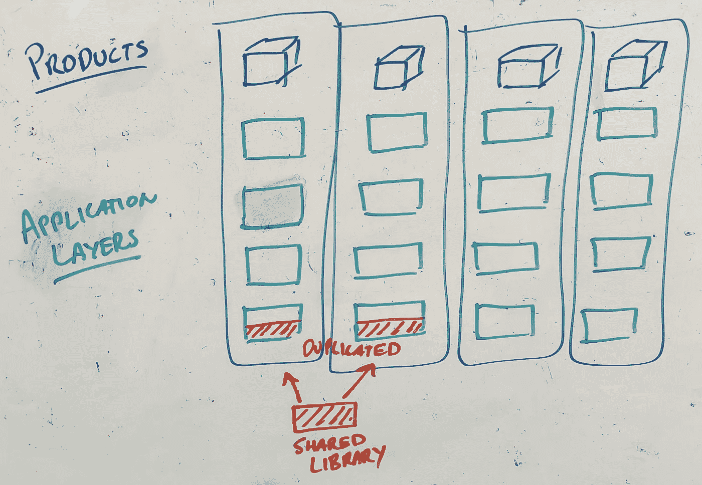

# 敏捷架构——混乱、不一致和涌现的架构的兴起

> 原文：<https://medium.com/hackernoon/agile-architecture-the-rise-of-messy-inconsistent-and-emergent-architecture-e6801ab25b61>

## 架构可以成就或毁灭团队和他们构建的产品。

Photo of [adrian cockcroft](https://medium.com/u/eed29d74b3fb?source=post_page-----e6801ab25b61--------------------------------)’s keynote at AWS Summit Developer Night in Sydney 2019

***(我在整篇文章前面加了前缀，说我绝不是这方面的专家。这纯粹是基于我自己与一些了不起的人一起工作的经历，以及在许多不同公司的无数次失败——所有观点都是我自己的。感谢阿德里安·科克罗夫特在最近于悉尼举行的 AWS 峰会*** ***开发者之夜上所做的精彩主题演讲——这个领域需要更多这样的思想领袖！)***

架构是一个我认为没有得到关注的话题，尤其是在敏捷领域，它本应该得到关注。

人们越来越需要比其他人更具适应性和响应能力，因此，重新设计我们思考和处理 IT 架构的方式的需求变得越来越普遍。

这就是为什么我对艾德里安·科克罗夫特前几周在悉尼 AWS 峰会上的主题演讲的幻灯片感到如此兴奋。就像一个孩子被告知早餐吃棒棒糖是可以的，我当时肃然起敬！Adrian 出色地提出了当今最好的架构是*“极简、凌乱和不一致的”*——这是我在过去几年中一直提倡并经常思考的。

# 休斯顿，我们有一个问题…

这艘船正在下沉——也就是敏捷之船——因为许多公司继续以他们 10 多年前的方式处理架构，目标是企业架构最大化重用、一致性并最终降低运营成本。这降低了他们中许多人的灵活性和响应能力。在过去的几十年中，许多这样的公司已经建立了整体的“企业解决方案”,这些解决方案被组织中的许多团队广泛使用和共享。从$$的角度来看很棒，但是对于上市速度和敏捷性来说，它除了让团队被相互依赖的扩散束缚住手脚之外，什么也做不了。

当公司“转向敏捷”来处理这个敏捷问题时，他们通常在敏捷教练的建议下重组自己，以拥有端到端的功能团队。在运行这个新结构几个月后，他们最终遇到了问题——经理和高管开始想知道他们哪里出了问题，以及为什么这些端到端功能团队不为他们工作。尽管出现这些问题的原因有很多，但我经常发现，在许多情况下，它们受到组织的技术堆栈的限制——就像一个孩子试图将一个方钉塞进一个圆孔，组织试图让功能团队与传统架构一起工作。

Trying to get end-to-end feature teams to work with a traditional architecture

这些高管和经理开始回忆过去项目驱动的日子和组件团队。如果回到那些日子，也许事情会变得更好？在许多情况下，我经常怀疑他们是否正确！

许多地方正是这样做的，他们退化回组件和项目风格的团队——或介于两者之间——并应用创可贴解决方案，如增加依赖性管理、大房间规划活动、scrum-of-scrum 风格的会议和巨大的依赖性委员会——但就像感冒时服用 Panadol 一样，这种廉价药片的苦味只是一种临时的补救措施。

我经常想，我们最初是怎么让自己陷入这种境地的？是不是目光短浅，盲目地推进团队结构和“必须实现特性团队 101”手册？如果没有适当的自动化测试和部署管道来支持，我们不会要求团队更频繁地发布——那么我们为什么要用结构来做这件事呢？

**这个领域非常需要像阿德里安这样的思想领袖。**

通常当我提出这种激进的想法时，比如故意让混乱、重复和不一致的架构来实现自治团队，我通常会遇到蟋蟀——茫然的脸盯着我——你可以看到他们试图处理我刚才说的话，以及它如何从根本上违背了他们迄今为止在架构和管理 101 课上学到的一切——他们就是无法理解它——*“重复？不一致？你疯了吗！”*

Management trying to understand why anyone would want duplication and inconsistency

那么为什么会有人想要不一致、重复和混乱的架构呢？

# 巨石柱的问题是

以一个典型的企业架构为例。组件很少，看起来很简单，精心挑选的组件服务于许多应用程序，每一个都是多样的，并允许广泛的重用和覆盖。

然而，所有这些都有一个隐藏的成本，这在以前的项目和组件团队时代并不明显。是的，我们在多个团队中分散的组件越多，库存成本就越低(*在这种情况下，我指的是我们的应用程序作为库存运行所需的代码行和其他资产*)，但是我们没有看到的是，这无意中增加了变更的成本。

这是因为现在组件在多个团队之间共享，每当一个团队想要对组件进行更改时，就会产生滚雪球效应。这种情况我见得太多了，一个团队做了一点小小的改变，然后就爆发了！它破坏了六个其他团队的应用程序。不久之后，我们被迫进行大规模的协调测试周期，以确保所有依赖的团队不受影响。

Changing one component which spans across multiple teams has a snowball effect.

我并不反对单一的真相来源或单一的改变点，我同意这两者确实降低了改变的成本，但它们并不是全部。是的，它们从代码层面降低了变更的成本，但是从整个组织的角度来看，这通常会导致协调和调整成本的增加，这比代码变更本身要大得多。通常，这种成本不那么明显，肯定不像物理代码更改那样有形——也许这就是它经常被忽视的原因。也许我应该重新定义变化成本，正如 Adrian 在 AWS 峰会上所说的那样，是“价值实现时间”的增加——毕竟这是我们的目标，不是我们能多快做出改变，而是改变能多快交付给客户并为他们提供价值。

想一想每次你不得不联合团队或建立共识或召开会议来建立一致的方法？这些都增加了变革成本，并最终延迟了价值的实现—我怀疑您的客户中有谁会在意为了就某一特定方法达成一致或共识而召开了多少次会议。

Consistent architecture or fast autonomous teams — you can’t have both.

事实上，我们今天知道的许多领先的技术公司都已经发现了这一问题，比如网飞、亚马逊和易贝等等，它们都是从整体架构开始的，随着时间的推移，它们逐渐演变。

# 新方法

爱因斯坦有句名言*“任何问题都不能从创造它的同一意识水平上解决。”—* 我认为这是这些情况发生的根本原因，我们正在将同样的思维应用于一种全新的问题。

如果我们想变得更快更有适应性，我们需要打破这些单一的“企业”架构。我们需要理解今天的问题需要一种新的方法和新的思维方式，一种可以接受重复，可以接受混乱和不一致，可以接受架构可能是短命的并且预期会发展的思想。

需要有一个平衡，是的，一致性和一致性很好，但它们需要与价值实现时间相平衡。这意味着，有时我们可能会考虑故意复制代码，以实现自主性，从而加快上市速度。

以下是我在过去尝试应用这种类型的架构时发现的一些很有效的实用方法——如果你愿意，可以称之为指导原则。

## 一切以客户为中心——以“实现价值的时间”为中心

如果我们从一个问题，一个客户问题开始，然后围绕这个问题构建我们自己——我怀疑我们会以今天许多公司拥有的层级和单一企业架构结束。

> 产品应该解决实际问题，团队应该围绕产品构建，架构应该支持这样的团队，而不是相反——随机理论

我的一个同事最近对我说“*我们应该围绕我们的团队来构建我们的架构，而不是反过来围绕*”，我自己说得再好不过了。

在这方面，梅尔文·康威经常被人引用，即众所周知的“康威定律”。这一切都可以追溯到 1967 年，当时梅尔文·康威(Melvin Conway)写了一篇论文，指出本质上任何试图生产某种东西的组织都将不可避免地沦为生产其内部结构的副本——听起来很熟悉吧？产品体验以类似于团队结构的方式划分的频率如何？—前端相对于后端相对于数据存储相对于客户支持团队，所有这些都是分离的，通常会导致不连贯的客户体验。

> “设计系统的组织……被限制生产这些组织的通信[结构](https://en.wikipedia.org/wiki/Organizational_structure)的复制品。”—梅尔文·康威

50 多年后，各种组织都在努力应用这条“定律”。我经常想知道原因是否是别有用心，例如降低运营成本，因为根据我的经验，应用这一法则通常不会导致运营成本降低，相反，它通常会增加运营成本，有利于实现价值。

因此，如果我们应用我的同事如此优雅地提出的以及康威先生多年前写的一篇论文中的内容，这将表明我们从我们正在生产什么“系统”(或者更确切地说是什么产品)开始？一旦建立，我们应该着眼于建立团队和我们的架构。

Broken up and possibly duplicated architecture to allow for products teams to be independent from one another.

在许多情况下，你会发现你最终会发现同一个组件被多个产品使用，在这些情况下，传统的想法会建议将其分离、集中，并最大化重用和一致性。但是我一次又一次地看到，这样做只会给团队带来依赖性。一个依赖当然很好，两个还不错，但是如果你把这种想法应用到整个技术栈中，你会发现团队被束缚住了手脚，被压得喘不过气来，停止了工作，但是相互依赖却越来越多。

## 独立、微小且有时重复

我发现有一件事很有用，可以帮助你将这种想法应用到你的架构中，那就是使用微服务。

微服务是一种现代软件架构模式，它试图将应用程序分解成更小的解耦部分，这些部分松散地绑定在一起，以创建一个完整的应用程序或产品。

就像许多事情一样，魔鬼往往在细节中，对于微服务，我发现真正的挑战是如何将他们的应用程序分成可以充当乐高积木的小逻辑块。以错误的方式分割它，你会再次简单地得到 100 个，可能是 1000 个相互依赖的微服务，而不是分割成独立发布的全部功能和产品。

回到康韦法则，围绕你的团队构建你的架构——团队理想地围绕你的产品构建——作为一个指导原则，我倾向于首先按照产品和它们的特性来划分你的服务。这有希望引导你走上独立产品的道路。在这样做的时候，我经常发现这会导致重复的服务，随着时间的推移，是的，一定程度的混乱和不一致，但这通常是你为独立和更快的价值实现所付出的代价——我想这归结于你重视什么？实现价值的成本还是时间？

这并不全是混乱，我经常发现，如果你明智地行事，你通常可以减少重复的程度——是的，有时(通常是大规模的),你可能会决定拥有一个交叉平台，然后是一个平台团队，但这通常是例外而不是规则。

> *👩‍🔬*对此的一个快速测试是问自己，在我的组织中有多少个团队是平台/组件团队，有多少个是产品/功能团队？后者应该大大超过前者。*👩‍🔬*

Rather than having one component which can perform both products needs, an option might be to use of a shared library — a common source, each team then builds upon for their specific needs.

这种模式的一个很好的例子是查看[原子设计语言系统模式](https://uxdesign.cc/atomic-design-how-to-design-systems-of-components-ab41f24f260e)，在这里我们试图将一个体验分解成它的“原子”或最小的可能的构建块。这些“原子”本身是没有用的，事实上它们甚至不是你可以部署的东西，而是像开源库一样的构建模块。仍然需要在“原子”之上进行一定程度的编排，但这正是专业化和与其他服务分离的地方。通常，我们仍然对我们的服务采取单一的方法，我们找到相似的东西，将它们放在一起成为一个单一的服务，而不是分离它，可能会有一定程度的重复。

## **版本控制是你的朋友**

除了使用微服务模式，我还让团队用版本控制来补充它——这两者在实现自治和更快实现价值方面合作得非常好。

版本化是一种不必完全复制事物的好方法，相反，我们在每个微服务的基础上构建并创建一个新版本，从而允许其他团队继续使用以前的版本，并避免变更的滚雪球效应——团队 A 已经进行了变更，现在使用 1.1 版，团队 B 继续使用 1.0 版。

通常，这又取决于您如何实现它，我看到有些地方说他们正在使用版本控制，但他们并不允许团队停留在以前的版本上，而是仍然通过只在生产中运行一个版本(最新版本)来强迫每个人进行升级。这使团队回到了单一的情形，变更滚雪球效应仍然存在——在这些情况下，我能看到的他们从版本控制中获得的唯一优势是能够轻松地将事情回滚到以前的版本，但它仍然对自治和更短的价值实现时间没有任何帮助。

同样，版本控制需要一点混乱，我们需要增加我们的运营成本并同时存在多个不同的版本——例如，为了让团队 A 使用 1.1 版，团队 B 同时使用 1.0 版，两个版本(1.1 版和 1.0 版)需要同时在生产环境中运行，而不是始终只有一个版本——如果是这样的话，还不如放弃版本控制。

> *👩‍🔬*一个简单的检查是，当你发布一个新版本时，看看有多少其他产品/应用被破坏。理想情况下，需要新版本的产品应该不超过一个。其余的应该是以前的版本，不受影响。*👩‍🔬*

## 涌现和演变

就像我们现在生产的产品一样，架构应该是迭代的和增量的——它应该是涌现的。我们没有也不应该预先寻找所有的答案，而是在前进中学习和适应。这种“原子”架构和版本控制的使用实现了模块化，而在过去，通常很难有一个具有大型单体的新兴架构。

这在今天也是特别重要的，因为新技术正在迅速变得可用，这意味着保持与时俱进，并能够尝试最新和最棒的不再是一个副业，而是一项全职工作。就像产品本身一样，架构需要不断维护、更新，并允许随着时间的推移而发展——安全环境也使得这种需求变得越来越普遍，因为黑客经常利用旧技术中的漏洞。

Credit: Gerd Altmann on [Pixabay](https://pixabay.com/illustrations/evolution-development-forward-3543775/\)

# 一种新型建筑

没有完美的解决方案，而是在你更看重的成本、重用和一致性之间进行权衡？或者，你是否乐于让事情变得有点混乱、不一致，以实现自主性、适应性和价值实现的时间？

我过去经常问客户——你想做最便宜的公司还是最好的公司？它们是相互竞争的目标，你不能两者兼得。

便宜很容易，只要继续做你正在做的事情，但如果你想更快地实现价值，反应更快，适应性更强，那么你需要以不同的方式思考和行动。这通常意味着扔掉《架构 101》这本书，着眼于更现代的模式和思想领导力，就像阿德里安·科克罗夫特在 AWS 峰会上的精彩主题演讲一样——今天最好的 it 架构将是“凌乱、不一致和极简主义”。

从敏捷的角度来看，我们经常推动小型自治团队的好处，但是我们很少为他们的成功做准备。我们经常不去管架构，让这些团队就像是一辆跑车，在相互依赖的交通堵塞中，这种相互依赖是由交叉的整体组件造成的。我们不会拥有这样的整体组件，而是将它们分解成小的、原子的部分，彼此分离——在复制和一致性之间取得平衡。

> **最终，未来需要优化价值实现时间，这与以前推动一致性和重用的更传统的方法相冲突——相反，未来将要求我们的架构通过去耦、杂乱、重复和涌现的架构实现自治。**
> 
> **—随机假设**