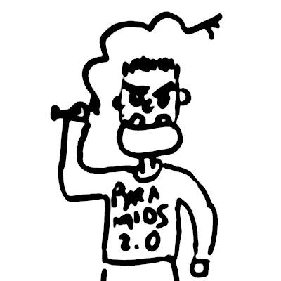
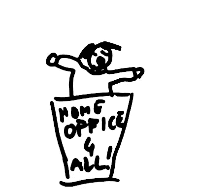
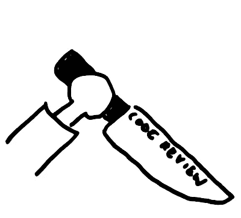
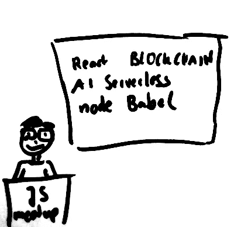
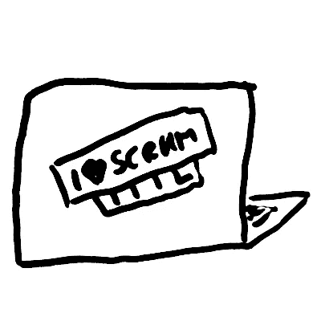

# 企业敏捷原型:幽默分类法

> 原文：<https://medium.com/hackernoon/agile-enterprise-stereotypes-55e9f2d830b1>

## 所有敏捷生物在其自然栖息地的调查

## *敏捷时代的爱好人类学*

如果你在那些做“敏捷”的大公司呆过一段时间，你可能会注意到有相当多的循环模式。人们陷入了刻板的角色，自从罗马军团被盖乌斯·马略改造以来，每一次组织时尚都是如此。让我们尝试对他们进行“敏捷”企业组织的调查！

近 20 年来，公司人类学已经成为一个严肃的研究课题，这是有充分理由的。请注意，这篇文章既不严肃，也不科学。也请注意，陷入刻板印象对我来说似乎与性别完全无关，所以我只是在这里交替使用人称代词。

# 敏捷的宫廷小丑

敏捷弄臣符合一个非常重要的生态位，当首席执行官让人们知道，从今以后，公司应该更多地采用这种“敏捷”的东西时，这个生态位就会出现。每一个至少相当狡猾的董事或副总裁都知道，现在表现出“敏捷”是很重要的。聪明的人知道假装只会让你走得更远。你需要做的是在你的法庭上留住一个真正的信徒，一个向听力范围内的每个人宣扬“敏捷”的人，产生大量的活动和嗡嗡声，这些活动和嗡嗡声碰巧被首席执行官获得。只要确保这个人不会因为试图改变事情而变得危险。这就是敏捷的宫廷小丑派上用场的地方。他喜欢站在革命的最前线(不流血)。他还喜欢这样一个事实，除了嗡嗡声和活动，没有任何有形的结果期待他。

典型语录:*“我来得太早了。”*

你能做什么？实际上，如果敏捷的宫廷小丑至少是一个体面的公众演说家，他可以做很多事情来在公司员工中传播敏捷思想。只要确保他没有传播太多的假敏捷。

# 无知的直线经理

敏捷既不是公司流程手册的一部分，也不是她的奖金协议的一部分。所以为什么要认真对待呢？她发出了与 Sprint 惯例相冲突的 1:1 约会。她给 Scrum 团队成员分配“特殊任务”,而不关心冲刺。她积极鼓励专业化。她的直接下属应该坐在靠近她角落办公室的地方，谁在乎[同处一地](https://www.martinfowler.com/articles/remote-or-co-located.html)？

典型语录:*“什么是冲刺？你们什么时候开始做运动了？”*

你能做什么？合谋将她的个人奖金目标更新为:

*   为你的团队建立一个持续的交付渠道，直到年底。
*   功能必须自行发布，平均每个工作日至少发布两次。

MWAHAHAHAHA

# 愤怒的直线经理

愤怒的直线经理对这整个“敏捷扯淡”真的很恼火。没人再对此负责了。团队陷入了无限循环的回顾讨论中。Scrum Masters 正在鼓动反对中层管理。无政府状态正在失控。他的老板买下了敏捷蛇油，却仍然让他为整个混乱负责。

典型语录:*“别跟我胡扯了！”*

你能做什么？他只想被认真对待，和其他孩子一起玩。也许邀请他参加一轮[代表团扑克](https://management30.com/practice/delegation-poker/)？

# 民粹主义的 Scrum 大师

在企业环境中成为 Scrum 大师是一项非常艰巨的挑战。一方面，必须克服许多组织上的障碍(例如，每年只有四个版本)。另一方面，团队成员的思维定势是通过多年接触公司层级而形成的。但是等等。谁说你真的要克服什么，或者改变你团队的思维定势？这是一个企业环境，你不是以结果来衡量的，而是以社会接受度来衡量的！你可以打赌，民粹主义的 Scrum Master 被她的团队所接受，这要感谢传统的民粹主义。团队不确定如何解释最近的一次失败？她会找个人来责怪。家庭办公室与冲刺仪式冲突？她将确保你可以选择退出这些仪式，而不是让这些仪式为远程参与者服务。客服抱怨 bug 太多？她会射杀信使。产品负责人让团队不舒服？她确保这是相互的。她将保护团队不受他人野心的影响，也不受他们自己野心的影响。

典型引语:*“我们真的应该今天发布吗？等到星期一怎么样？”*

你能做什么？和民粹主义一样，你必须等到崩溃。并且确保民粹主义的 Scrum 大师也不会因此责备你。或者只是躺下来，享受这种持续的幻觉。

# 无知的产品所有者

他是[彼得原则的化身，](https://en.wikipedia.org/wiki/Peter_principle)从公司的客户支持人员、UX 人或开发人员做起，然后成为周围唯一一个愿意以公司愿意支付的低工资做产品负责人的人。或者，就像通常发生的那样，他就是不能对他的老板说不。现在，他必须领导一个成熟的跨职能团队，随时准备采取行动并发挥创造力，必须驯服他那部分邪恶的企业利益相关者，甚至需要了解客户想要什么。不幸的是，他没有意识到这些挑战，也绝对没有能力迎接它们。他没有动力，也不知道如何处理这个产品。他不能澄清任何事情，因此不能将有意义的事情放入待办事项中。每当利益相关者推动某事时，他会直接将其转发给团队。团队认为他很弱，不能坚持一个计划(什么计划？)，所以他们不把他当回事。当他意识到这是一场政治橄榄球比赛，而他就是球的时候，已经太晚了。

典型引语:*“我现在不能决定。”*

你能做什么？不多。他是个无可救药的人。也许可以少介绍[一点](https://less.works/)，这样他就不再被需要了，可以愉快地回到他以前的角色，不用承担任何责任。

# 消极进取的高级开发人员

她告诉任何人，这是行不通的。当然，管理层一如既往地在做决定时忽略了她，也没有问她。她不会告诉他们，因为做出正确的决定是他们的工作。公司本可以提拔有能力的人进入管理层。比如她。当然，开的时候她没有申请团队领导的职位。如果老板把他的工作做好了，他会问她的。因为在她为公司做了这么多之后，她是自然的选择。

被剥夺了公平的机会，她至少可以确保她的团队给予她应有的尊重。在一个自组织的团队中缺乏监督给了她很多这样做的机会。如果一个新的开发人员加入，她将确保成为他的第一个大拉请求的审查者。天哪，她会让那家伙受苦吗。重要的是，他从一开始就知道谁是这里的负责人。Scrum 大师有想法？她会确保团队反对他们。现状总是对她最有利，尤其是因为你知道出了问题该怪谁。产品负责人有野心？出于原则，她会阻挠他们。

典型语录:*“好主意。不幸的是，它不会工作，因为…”*

你能做什么？试着理解她的怨恨，也许可以解决它。但更重要的是让团队意识到他们中间有一只披着羊皮的狼。

# 潮人开发者

他喜欢去聚会，谈论他最近在工作中尝试的新东西。听到一个新奇的 JavaScript 框架，却不能真正发布一些使用它的代码，这让他很痛苦。每当一些思想落后的老板谈论不要走进[云](https://devcenter.heroku.com/articles/logplex) [供应商](https://cloud.google.com/) [锁定](https://azure.microsoft.com/en-us/services/active-directory/) [陷阱](https://aws.amazon.com/lambda)时，他都把这当成对个人的侮辱。从定义上来说，每一种已经在公司存在了两年多的编程语言都不酷。幸运的是，在一个 Scrum 团队中，大多数人的意见可以转向对框架采用更进步的立场。最终，每个人都想要一份现代感十足的简历。当团队由于完全不能满足任何业务需求，更不用说客户的需求(比公司的技术路线图超前几光年)而最终解散时，这证明是有用的。

典型引语:*“我们的前端框架完全过时了。”*

你能做什么？当他在不改变架构的情况下交付用户故事时，一定要表扬他。确保整个团队能够决定每个新的依赖项。然后，永远不要忘记询问学习努力的情况——这应该会让他进入状态。

# Scrum 秘书

只要看看 Sprint 板，你就知道团队有一个 Scrum 秘书，而不是一个 Scrum 大师。所有的票上都有她的笔迹。这是她精心从 JIRA 抄来的。在积压的提炼过程中，她把每一句话都直接速记到 JIRA。她会汇编任何人要求的每周 KPI 报告，即使没有人阅读它。你可能已经猜到了，她之前一直在 PMO 工作。当每个人都抱怨公司把敏捷和过程手册一起传下去是在滥用敏捷时，她实际上对此很高兴。

典型引语:*“我们来填这个吧！”*

你能做什么？Scrum 秘书有她的长处。该团队将始终保留一个会议室用于开会。但是你仍然需要让团队摆脱她紧密的过程拥抱，这样他们就可以开始自己思考他们想要如何作为一个团队工作。

# 多余的 Scrum 大师

他在那里。除了排放二氧化碳让办公室的植物高兴之外，他并没有为团队的生产力做出多少贡献。好吧，这不公平。他正在发送 Outlook 邀请。他不愿意行动的原因是他不想妨碍团队的自组织。也许他有点害怕暴露自己是一个 Scrum 新手。但是没有表演，你学不到一门手艺，所以他没有任何进步。

典型引语:*“你会怎么决定？”*

你能做什么？向他解释适用于 Scrum 的 [Shuhari](https://en.wikipedia.org/wiki/Shuhari) 的概念。并加强他的背部，使他敢于行动。

# 雄心勃勃的 Scrum 大师

她是一名前顾问，她已经帮助了许多团队走向巅峰。当咨询公司把她的[踢出局而不是提拔](https://en.wikipedia.org/wiki/Up_or_out)时，她跳上了敏捷列车。现在她在那里帮助你！由于团队没有她聪明，他们需要听取她的想法。她不喜欢 Scrum 有两点:首先，没有像她这样聪明的人，自组织是行不通的。第二，在这整个团队的事情中，这真的很难得到应有的荣誉。不幸的是，咨询公司毒害了她的心灵，以至于她甚至不能再拼写“可持续”这个词了。

典型引语:*“我推荐……”*

你能做什么？现代临床心理疗法有办法诱导前罪犯或商业顾问产生同理心。

# 项目管理 Scrum 大师

他是敏捷浪潮的受害者。在它席卷公司之前，他勉强获得了一个项目经理的舒适职位。然后，管理层连夜将公司从 ITIL 转移到了 SAFe，每个人都试图找到新的藏身之处。他的老板让他成为新的 Scrum 大师。如果说他在公司的长时间里学到了什么，那就是忠诚。所以没有质疑老板的决定，他开始称自己为 Scrum Master，尽管在他听来并不像他以前的职位那样有声望。除此之外，没什么变化。最重要的是，他的公司汽车保持不变。也许在他的 Scrum 团队中有一点紧张，因为团队中说的每一件重要的事情都会不知何故传到老板的耳朵里。也许 Scrum 并没有真正按照书本实现。可能团队既不是团队，也不是自组织的。但是谁会想这么教条呢？ITIL 也更多地被视为一个粗略的指导(否则该公司将不会存在了)。

典型引语:*“我是来帮忙的。”*

你能做什么？快跑！他只是一个更大问题的症状。

# 一点事实

我希望你在阅读这篇文章的时候，至少有过几次开怀大笑。也许你在认出一个同事。甚至是你自己。现在退一步，问问你自己，一个人是如何完成一个刻板印象的。也许有几个是精神变态者，他们找到了自己真正的使命。但大多数人在那里是因为他们的公司文化引导他们。有些刻板印象可以用拉尔曼的悲喜剧定律来解释。但是每个人在转换新角色之前都至少应该得到一些职业咨询和培训。大多数刚接触敏捷软件开发环境的人在开始时需要一些个人指导。所以如果你有机会，给这些刻板的人一个机会！