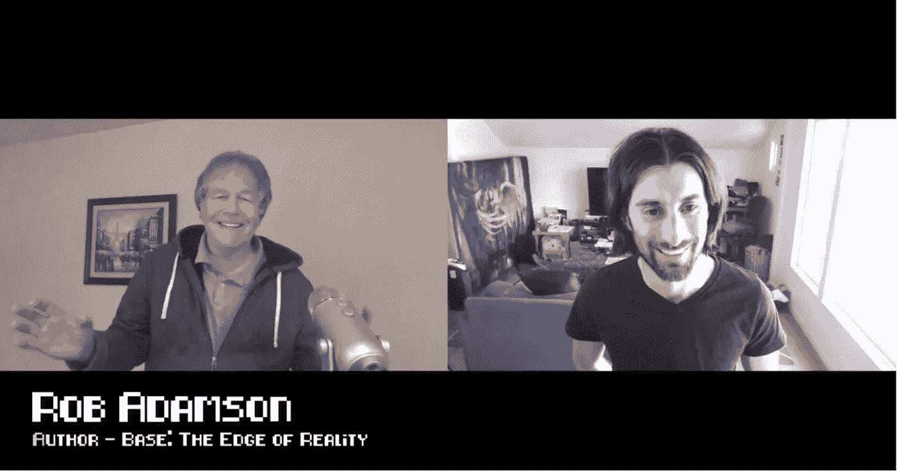

# 艾与罗伯特·亚当森的“过去再发现”

> 原文：<https://medium.com/hackernoon/ai-and-past-rediscovery-with-robert-adamson-faa15864e206>

## 黑客正午播客第 41 集:对计算机程序员和科幻作家罗伯特·亚当森的采访。

> *没有* [*数字海洋*](https://do.co/hackernoon) *就没有今天的节目。*

## 在 [iTunes](https://podcasts.apple.com/us/podcast/hacker-noon-podcast/id1436233955) 上听采访，或者[谷歌播客](https://play.google.com/music/m/Dfuna5a4pzsmjr76bxabkxdrhim?t=Product_Iteration_with_Hacker_Noon_Interim_CTO_Dane_Lyons-Hacker_Noon_Podcast)，或者在 [YouTube](https://youtu.be/W4RVMFfHp3s) 上看。

在这一集里，特伦特·拉平斯基采访了计算机编程先驱和科幻小说作家罗伯特·亚当森。你可以发现 Rob 最近的应用程序，它可以帮助你识别外星人，了解古代文明，以及我们如何使用人工智能和机器学习来重新发现我们的过去！

> “有些东西不是真实的，有些关于这整个现实的东西是不对的。所以模拟现实是一种理论，即我们生活在计算机模拟中。”
> 
> 我们所知的地球是真实模拟的，未来一些真正先进的文明是无法用计算机计算的
> 
> 虚拟现实……我们去那里的原因可能是为了学习，接受教育什么的。这就是模拟现实的理论。而且好像能回答各种问题。因为你认为宇宙是数据，而不是时间和空间中的物质。”
> 
> —罗伯特·亚当森

 [## 艾与罗伯特·亚当森的“过去再发现”

### 黑客正午播客第 41 集:对计算机程序员和科幻小说家罗伯特·亚当森的采访…

www.podbean.com](https://www.podbean.com/media/share/pb-k4ce4-afec03) 

> *没有* [*数字海洋*](https://do.co/hackernoon) *就没有今天的节目。在*[*do.co/hackernoon*](http://do.co/hackernoon)*了解更多。*

*制作和音乐德里克·伯纳德—*[*haberdasherband.com/production*](http://haberdasherband.com/production?fbclid=IwAR2d8t0cNGHRm1ajmUNWKZ-TMUMawREhvIHSy54LKcOElf7v_TOvkAjZ78Y)

*主持人:* [*特伦特·拉平斯基*](https://medium.com/u/138c86887e95?source=post_page-----faa15864e206--------------------------------)*——*[*https://trentlapinski.com*](https://trentlapinski.com/)*/*[*推特*](https://twitter.com/trentlapinski)

*附:如果你喜欢新的* [*黑客午间播客*](http://podcast.hackernoon.com/) *，考虑一下* [*在 iTunes 上给我们 5 星评价。*](https://itunes.apple.com/us/podcast/the-hacker-noon-podcast/id1436233955?mt=2)

## 还可以查看[四月头条](https://hackernoon.com/archive/2019/04)、[最新故事](https://hackernoon.com/latest-tech-stories/home)和[今日首页](http://hackernoon.com/)。