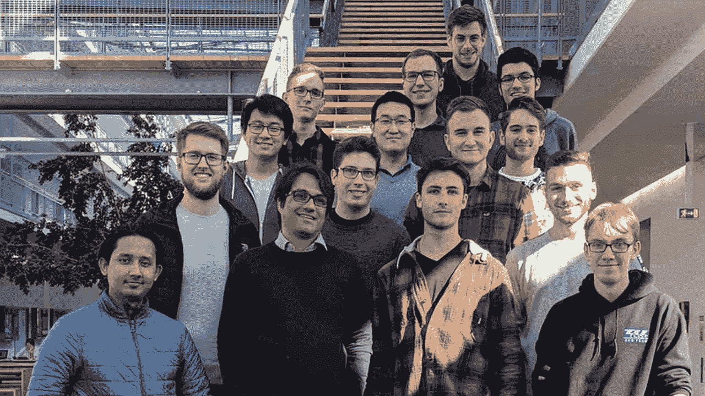
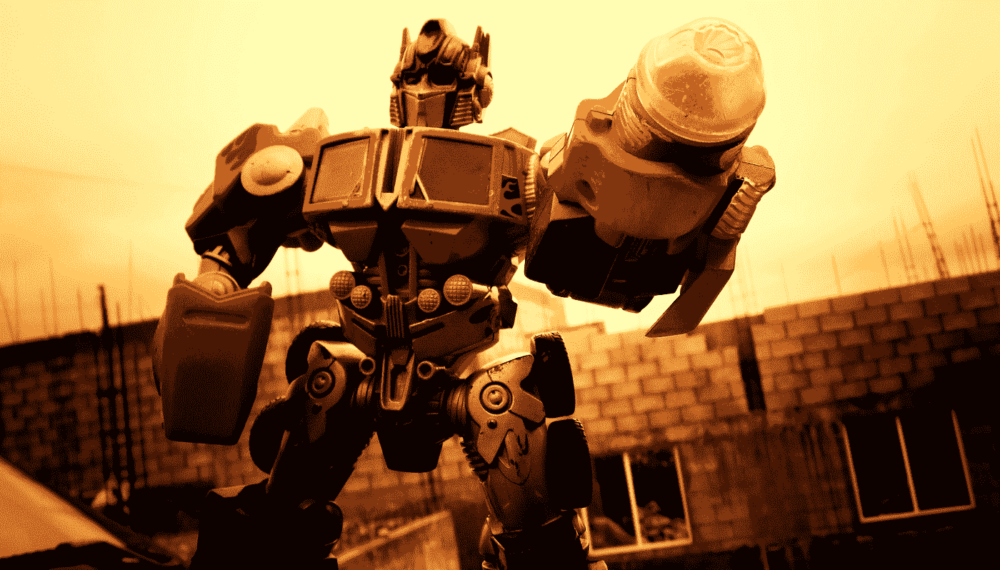
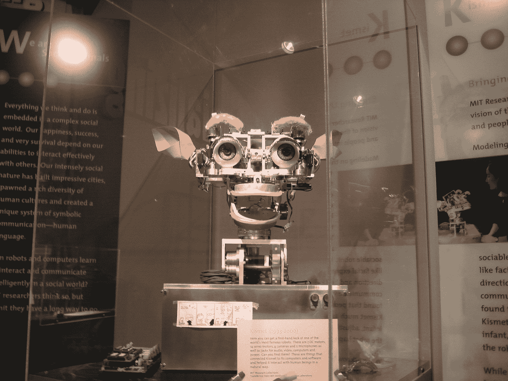

# AI 现在可以告诉你谁会坐上铁王座！

> 原文：<https://medium.com/hackernoon/ai-can-now-tell-you-who-will-sit-on-the-iron-throne-6aa1e5e1baf7>

人工智能是最初只是虚构的少数事物之一，但今天正逐渐成为现实。想想你的谷歌助手、Alexa 和其他由人工智能驱动的智能设备，你就知道我的意思了。

在人工智能的无数用例中，有一个特定的用例可能会改变你想象你最喜欢的电影和电视节目中的惊喜和乐趣——有时是悲伤的转折。这就是使用人工智能算法来预测电影结果，创作剧本，甚至讲故事！

那么 AI 算法如何革新娱乐行业呢？一个机器学习算法在预测电影上映前的表现上是否优于好莱坞精英？还有，你真的需要人工智能来增强你最喜欢的节目的故事性吗？有一些问题会在你继续阅读时得到解答。

## 预测 GOT 的下一次死亡

《权力的游戏》是为数不多的让观众对即将展开的故事感到极度焦虑的剧集之一。但是，如果你有一个比理论家更好的人工智能算法来预测另一个心爱角色的死亡，会怎么样？

The team behind the AI algorithm that predicts the next death in GOT

慕尼黑工业大学的学生在 2016 年用一个人工智能应用程序做到了这一点。人工智能程序利用机器学习算法从该剧的所有维基百科来源中获取关于《权力的游戏》的数据。

在输入所有这些数据后，人工智能算法在该剧第六季播出前成功预测了琼恩·雪诺的[复活。快进到 2019 年:该节目现在已经预测了一些死亡将发生在《GOT》的最后一季(潜在的剧透在前面！！).](https://www.tum.de/nc/en/about-tum/news/press-releases/detail/article/33047/)

由 TUM 的学生开发的机器学习算法预测波隆是最有可能在最后一季中遇到死亡的角色，其次是格雷果·克里冈、珊莎·史塔克和布兰·史塔克。

## 比专家更好地预测电影的成功

The next Transformers movie will be a success at the Box Office, and you don’t need an AI algorithm to know that. Or do you?

在离开去看最新的电影之前，你有多经常想知道这是否真的值得投资？或者如果结果是失败呢？

在一个人们需要几乎无限的娱乐资源的世界里，很难找到值得疯狂观看的好节目。也许我们正在到达这样一个时代，寻找好的节目或电影就像大海捞针一样困难。

但是让我们回到现在。如果你碰巧与娱乐圈有联系，或者碰巧密切关注它，你就会理解制作人在他们的作品发布之前所面临的焦虑。相比之下，当观众投入时间和金钱去看电影时，他们会面临同样的焦虑，因为他们不太确定电影的质量。

除非你正在发行变形金刚系列的下一部电影《星球大战》,或者打算观看另一部漫威超级英雄电影——没有万无一失的方法来确定一部电影最终是成功还是票房惨败。

也许一个 AI 算法可以解决这个问题！ [Scriptbook](https://www.scriptbook.io/) 是一种机器学习算法，可以让你只通过分析剧本就知道一部计划好的电影是会失败还是会成功。这个算法背后的开发者对他们程序的准确性做了一些夸大的声明。

Scriptbook 的机器学习算法分析了 2015 年电影《乘客》的剧本，并预测其票房收入为 1.18 亿美元。事实证明，这部电影的实际收入约为 1.18 亿美元，如果不完全符合预期的话！

这个人工智能用例的例子引出了一个问题——为什么你要依赖人工智能算法来预测电影的命运，而不是咨询好莱坞专家？答案相当简单。专家将依靠他的经验、记忆和对行业的理解来给出答案，但人类的记忆不像人工智能那样结构化和永久。

一个由人工智能算法驱动的系统，只需给自己输入大量数据，就可以发展出几乎等同于专家的经验和理解能力。

从表面上看，似乎这里的战斗是由 AI 算法赢得的。但还有一个事实。十五年前，没有专家相信以漫画书中的超级英雄为题材的电影能像今天这样受欢迎。即使是人工智能算法也不会一次做出这样的预测。

现实是，无论我们向人工智能算法提供多少数据，由于人类情绪的反复无常，它们可能仍然是不准确的。这种变化无常也许是人工智能和人类智能的最大区别。

然而，我真正认为真实的是，在未来，人工智能算法可以支持人类专家，并帮助向创作者提供关于他们剧本的反馈；过滤掉比较好的，给观众带来他们期待并为之而活的娱乐品质。

## 人工智能能在娱乐圈智胜创造者吗？

多年来，人们对人工智能的使用有许多疑虑。从马克·扎克伯格(Mark Zuckerberg)到埃隆·马斯克(Elon Musk)，再到你的老邻居使用经典的 2000 年代手机，每个人都在抱怨人工智能将如何夺走工作岗位，并使人类技能过时。

娱乐业最近与人工智能相关的发展引发了更多的怀疑。一部名为“太阳之春”的短片于 2016 年在科幻伦敦电影节上首次亮相。这么多电影都是在电影节上首映的，这次会有什么不同吗？嗯，这部电影的剧本是由一个人工智能机器人写的。

结果如何？这部电影超出了预期，在 IMDb 平台上获得了 5.5 分的评分(满分 10 分)。考虑到有成千上万部由人类创作的电影的收视率比这部电影低得多，这还不算太糟糕。

但在你对人工智能的潜力抱太大希望或感到紧张之前——让人们知道这部电影有一些突出的问题——其中一些被证明是滑稽的。例如，这部电影的对话之一是“我知道这是一个结果。无论你想知道什么样的故事，我只是一个小男孩。”我不想谈论上下文，因为对话实际上没有上下文。

***更有趣的是，这部电影有续集，还是由一个 AI 写的，你可以在 YouTube 上找到。***

但是，尽管期待人工智能算法产生奥斯卡获奖剧本可能还为时过早，但很难论证它作为人类创造者的助手的效用。想象一下这样一个未来，一个极具创造力的编剧拿出一个优秀的电影剧本，每一句台词的情绪都通过一个 AI 创作/选择的配乐被美妙地带出来！

当你把人工智能看作是一只援助之手时，它似乎并不真的是它所描述的那种坏人。这方面的一个很好的例子是麦肯锡与麻省理工学院合作创建机器学习算法和模型来分析内容并确定其情绪状态。

利用人工智能模型和人工神经网络，合作者建立了一个项目，分析任何形式的内容——视频、文本或图像——并确定它们是否传达了积极或消极的情绪。

这类工具在创建机器学习应用程序方面非常有用，可以让人类的工作变得更容易，而不是完全取代它们。

## 那么，人工智能在视觉娱乐领域的前景如何呢

截至目前，人工智能算法在很大程度上负责你在网飞和亚马逊 Prime 等平台上疯狂观看的选择。在未来，他们的角色预计将进一步渗透到这个领域，我们可能会有更多由人工智能编写剧本的奇怪电影，由人工智能驱动的过滤器辅助的颁奖典礼提名，以及更多破坏你最喜欢的节目的算法！

现在时机已经成熟，机会主义者可以投资于加速人工智能在娱乐行业应用的产品和服务。因此，如果你是一名企业家，希望打造下一个大东西，也许是像电影和视觉娱乐领域的网飞或 IMAX 一样成功的东西，现在是最好的时机[雇佣机器学习专家](https://www.valuecoders.com/hire-developers/hire-machine-learning-experts)并开始你梦想中的创业项目！

## ***也读:*** [***创业公司 20 个简单的 App 思路(AI、ML、AR/VR)***](https://hackernoon.com/30-simple-app-ideas-for-startups-ai-ml-blockchain-ar-vr-f7cab5de0def)