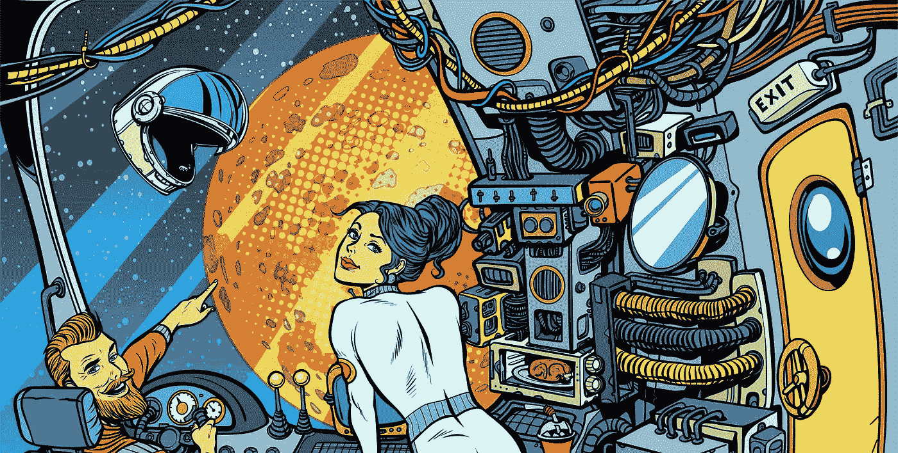
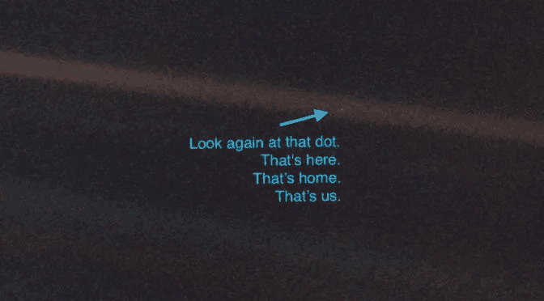
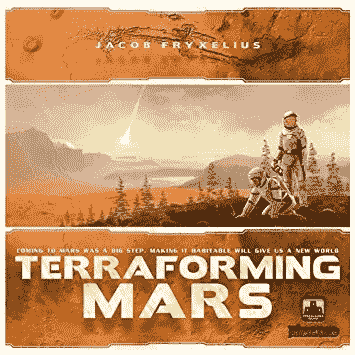
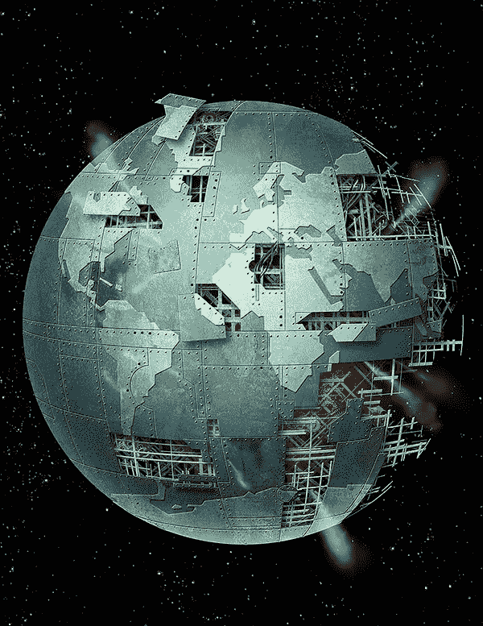
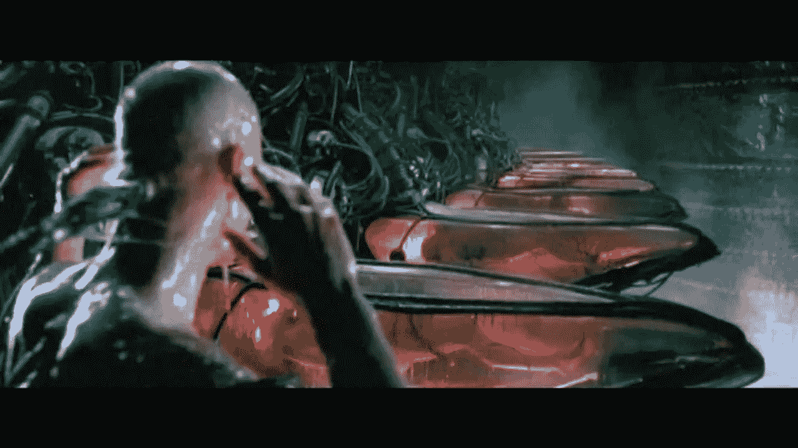
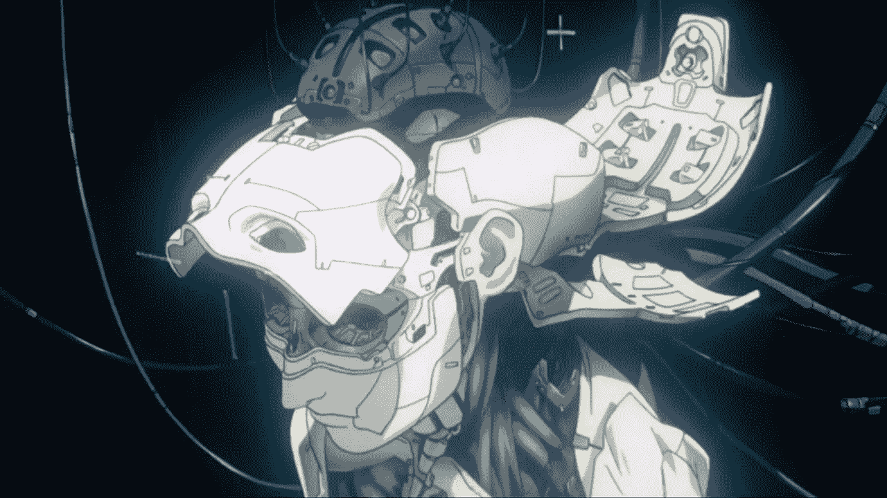
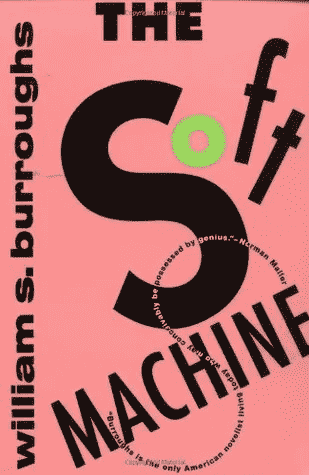
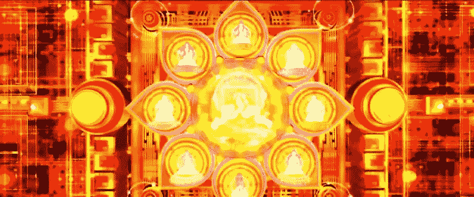
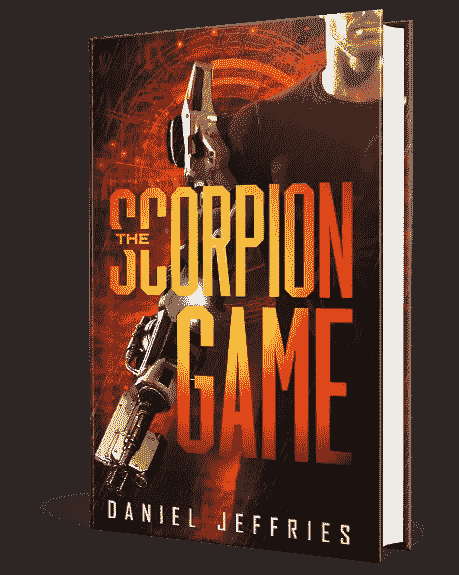

# 五年、五十年和五百年后的人工智能——第三部分——五百年

> 原文：<https://medium.com/hackernoon/ai-in-five-fifty-and-five-hundred-years-part-three-five-hundred-years-10198c00c7c7>

*查看* [*第一部*](https://hackernoon.com/ai-in-five-fifty-and-five-hundred-years-part-one-e630058b547f) *和* [*两个*](https://hackernoon.com/ai-in-five-fifty-and-five-hundred-years-part-two-fifty-years-1deeb7c5408c) *本系列前五年和五十年在 AI。在第三部分中，我们挑战现实的极限，展望未来 500 年。*

###########################################

> “很难看到。永远在运动的才是未来。”—尤达。

2519.

人类终于挣脱了那个脆弱的蓝色星球的束缚，孤独地漂流在太空中。

The [pale blue dot](https://www.nasa.gov/jpl/voyager/pale-blue-dot-images-turn-25/).

我们已经向恒星扩展，并殖民了太阳系，从环绕闪亮的土星环的定居点，到肉眼看不见的纳米昆虫在火星红色山丘上建造的蔓延的城市。

巨大的机器人船放下长长的象鼻，从木星深处吸走氦气和珍贵气体。当它们的大肚子胀得快要爆炸时，它们沿着看不见的超级高速公路飞速前进，将氦 3 输送到渴求能量的聚变微型反应堆，为星际经济提供动力。

在光环之外，深空采矿船将像小蜘蛛一样的无人机云释放到风中，它们消化在无尽的虚空中飞驰的小行星。无人驾驶飞机在几乎每一个围绕太阳的星球上引发了前所未有的建筑热潮，一个又一个城市在长期不利于有机生命的贫瘠岩石上建立起来。

最快的转变发生在火星上。曾经死气沉沉的红尘海洋现在沸腾着新的生命。

几代前移民火星的人根本不需要氧气。他们生来就是为了呼吸二氧化碳饱和的天空，尽管他们的肺可以像按动电灯开关一样容易地在氧气和二氧化碳之间来回切换。

You won’t [make it to Mars](https://amzn.to/2QrKjBL) but you can play the board game!

随着每一个标准年的过去，巨大的火星地形变得越来越快。由最大的星际联合企业 DAOs(分散自治组织)制造的巨大的[大气处理器](https://avp.fandom.com/wiki/Atmosphere_Processing_Plant)搅动致命的空气，慢慢地使其可供依赖氧气的生物呼吸。

但是改变的不仅仅是空气。摩天大楼大小的机器挖掘红色的土壤，将它撕裂成海洋，这是人类有史以来最大的尝试。

“天生的”火星人抵制地球形成的灾难性力量和它将带来的根本变化，害怕茂盛的红色会让位于绿色和蓝色的海洋。

但是没有人能否认火星的巨大转变是太空时代的第一个真正奇迹。

这是一个怎样的时代。

# **人类世时代**

欢迎来到[人类时代](http://www.anthropocene.info/anthropocene-timeline.php)。

[The Economist’s great issue: The Age of Man](https://www.economist.com/leaders/2011/05/26/welcome-to-the-anthropocene)

自从我们从广阔的原始软泥中爬上来，进化成[智人](https://amzn.to/2WdlIpt)，我们已经彻底改变了我们曾经接触过的一切。

我们在大河上筑坝，用涡轮机利用它们巨大的能量，同时不小心用重金属和垃圾毒害其他河流。我们培育了一小群滋养生命并为我们服务的植物，同时破坏了生物多样性，并引发了其他物种毁灭性崩溃的连锁反应。我们驯养了一部分我们可以宰杀或留在我们身边的动物，因为它们让我们微笑，同时让其他动物面临大规模灭绝。

现在我们的影响已经蔓延到了星星上。

我们的影响比以往任何时候都要快。

一切都在加速。文化。经济学。技术开发。

进化以令人反胃的速度前进。

整个繁荣到萧条的周期发生在几个月而不是几十年。未来的冲击会让地球文明在街上暴动，如果它们十年发生一次的话，现在被轻松地吸收了。经济崩溃就像小海啸一样袭来，复苏也同样迅速。

一个分散的星际元宇宙取代了长期停滞的互联网。元宇宙是一个活生生的、会呼吸的 AR/VR 挂毯，它用交互式化身、对象和信息覆盖整个 solsys，这些信息涌入我们的联系人和增强的眼球。

在虚拟和现实世界之外，现实世界也发生了根本性的变化。

只有大约 1%的人能够驾驶任何东西，无论是汽车还是轮船，因为从星际飞船到 ATV 的所有东西都可以通过冗余的热插拔部件进行自我驾驶和自我修复。

驾驶是非法的，即使是在海王星边缘遥远的太空边疆。狂热者的特殊许可证让那些认为自己可以驾驶跑车在太阳系新的[高速公路](https://www.german-way.com/travel-and-tourism/driving-in-europe/driving/autobahn/)上以惊人的速度飞驰的疯狂人类将他们的生命掌握在自己手中。

在政治和商业领域，为星际商业、政府和 Dao 提供动力的大量人工智能骨干以超人的速度旋转着商业的车轮。相比之下，旧世界企业和政府的决策是以慢动作进行的，痛苦的老人讨价还价，争论，妖魔化他们的敌人，最终通过了一些违法的法律。

曾经统治我们的政治精英已经让位于[直接民主](http://iamcicada.com/)，由人工智能驱动，人工智能在 99%的问题上为我们投票，因为他们已经知道我们会做什么。只需填写[几个简单的问题](https://www.isidewith.com/)，系统就已经知道你在想什么，并且随着时间的推移，当你改变和表达你的观点时，它会自动适应。我们总是可以在投票后的短时间内审计或更改投票，用[零知识证明](https://hackernoon.com/eli5-zero-knowledge-proof-78a276db9eff)记录到不可变的量子密码链中，但很少有人这样做。

然而，精英们仍在那里，一如既往，他们的影响更加微妙，隐藏在幕后。他们充当影子派系[用软实力而不是硬实力执政。](https://books.google.com/books?id=vqE8BQAAQBAJ&pg=PT262&lpg=PT262&dq=shadow+clique+schismatrix&source=bl&ots=0hIw_S1jsn&sig=ACfU3U0QFFmjyswN8WczZ1a2ajbadosEAQ&hl=en&sa=X&ved=2ahUKEwig3Y_Qxa_iAhUJv54KHVMmAKQQ6AEwBHoECAgQAQ#v=onepage&q=shadow%20clique%20schismatrix&f=false)

政治不再是国家对抗国家，而是星球对抗星球。

三场行星间的战争撕裂了脆弱的联邦，最后一场摧毁了萌芽中的火星文明，迫使新一代重新开始，这是在基因被侵入的蟑螂啃噬了来自星球毁灭夸克炸弹的致命辐射之后。

控制着新王朝和城邦的人们让地球上的旧皇帝和总统们，为了一小片泥土而争吵不休，看起来就像他们一直以来的尼安德特人，即使他们并不知道这一点。

最重要的是，掌权的人知道他们不能独自管理经济。他们让机器来做这件事，因为每件事的速度都太快，即使是增强的大脑也无法处理。

人工智能只是实时调整供求关系，提高或降低工厂产量，并触发广告冻结，以控制消费者数月内无法满足的渴望。然后，当商品从生产线上滚烫地走下来时，他们再次点燃这些广告。广告对每个人都进行了微校准，像特制的药物一样冲过血脑屏障，越过他们的防御机制。机器比我们更了解我们的需求，甚至在我们知道自己想要之前就给了我们。

AI 的崛起教会了我们，人类不过是另一种输入和输出。词语和情感是编程语言，机器可以轻松地给我们编程。

但这是*而不是*母体。我们不是奴隶。

我们想让他们给我们编程。

我们从未在任何其他时代感受到如此多的幸福和满足。几百年前我们曾经服用的原始心理药物与纳米昆虫平衡的受管制的大脑化学物质相比相形见绌，纳米昆虫由比我们自己更广阔的思维编程，以保持我们快乐和专注，就像[一位开明的古鲁](https://amzn.to/2WpK3bu)。

我们曾经想象我们是我们命运的唯一主人，是我们船上唯一的船长。我们的思想是由我们自己的自由意志决定的。

但我们现在知道这不是真的。

当我们解开我们头脑中复杂的电化学场的内在奥秘时，我们意识到我们只是另一种人工智能，一种通过地球生物群落的伟大遗传算法进化而来的智能。

带着这种理解，[人文主义](https://americanhumanist.org/what-is-humanism/edwords-what-is-humanism/)，即相信我们是特殊的生物，被一个看不见的造物主之手触摸，不同于其他动物，慢慢死去。

活着的人现在回头看我们时会想，我们曾经如何想象我们能够塑造自己的命运，我们不是被我们自己无形的程序的微妙潮流所塑造的？

“More human than human. That’s our motto.” — Tyrell

但这些人甚至能被称为人吗？

号码

他们不像我们。他们感觉不一样。换个角度思考。看起来不一样。他们就像我们和克鲁马努人一样不同。

他们不是人类。他们不仅仅是这样。

**Posthuman。**

# **人类的末日**

人工智能的危言耸听者担心人工智能会带来人类的末日是正确的。

但是他们对它是如何发生的理解是错误的。

这不是超级智能机器的噩梦。那些不过是原始民族、社交媒体时代的科学怪人的狂热梦想。不是有意识的机器突然意识到并决定像消灭蟑螂一样消灭我们。

相反，人工智能进入了我们的身体。

和我们合并了。

改变了我们。

Metamorphosis.

我们在越来越深的层次上拥抱人工智能。它变得比我们有史以来最好的爱人更亲密，在我们耳边低语，在我们想要之前就知道我们想要什么。

它从我们的手机、眼镜和智能服装中蹦出来，进入我们的头部、眼睛、手臂和腿部。就像玫瑰根的长卷须一样，它缠绕在我们大脑的树状森林中，并将它们提升到令人难以置信的新水平。

我们可以并行运行[虚拟人](https://amzn.to/2VX4XiO)，我们人格的整个虚拟副本，同时完成数百或数千项任务，打电话，计算数字，学习新技能，或者解决犯罪。

或者，当有人伤了我们的心时，我们可以产生另一种变化的自己，只是为了有一个人可以说话和陪伴我们。

我们甚至可以在沙盒中产生新的人格，看看什么样的变化会让我们变得更好、更平衡、更无情、更狡猾、更有爱心、更正派、更善良、更温柔、更有爱心。

我们变成了我们自己的人工进化。

邮政人认为提升自己没什么，就像我们过去每隔几年就更换手机一样。

Ghost in the Shell.

用一个寿命是自然手臂五倍、触觉加倍的假肢来代替你的手臂，就像买一件新衣服或一条牛仔裤一样。

将你的眼睛换成视力超过 20/10 的眼睛，可以在黑暗中看到并向你展示关于世界的丰富的元信息覆盖，对于一个出生时就拥有后 CRISPR 基因编辑 99.9999%准确性的思维升级的人来说，这是非常合理的。

母亲和父亲在孩子出生前对他们进行疾病筛查，并购买智力、运动能力和寿命方面的调整。让孩子在子宫外出生是很常见的，这样女性就不必忍受分娩的痛苦。当孩子们不再依赖母亲对冰淇淋和泡菜的渴望时，他们会获得更好的营养。

孩子们在家里就像水培植物一样成长。

越来越多的技术进入我们的内心深处，监测胆固醇和压力的生物监测器，附着在我们脊柱上的巨大阵列，让我们备份和快照我们的思想，以及微小的纳米机器群，它们不断清洁我们的动脉，修复自由基造成的损害，并在癌细胞将致命的遗传负荷传播到其他受害者细胞之前追捕癌细胞。

科技生活在我们体内，因为它不再由有毒的稀土金属制成。这是真正的“软”软件。

我们进化到使用与大自然母亲相同的基本构件。

碳。

我们的硬件变成了湿件。我们变成了我们一直以来的样子:

[软机器](https://amzn.to/2EpSHNk)。

我们现在可以轻松控制的不仅仅是碳。我们的能力延伸得更远，达到了原子水平。

3D 打印机进化到分子打印机，分子打印机又进化到原子打印机。

一旦我们可以一个原子一个原子地创造东西，面对近乎无限的丰富，地球上旧有的稀缺经济就不再有任何意义。如果你有合适的打印机和合适的基本材料，你可以从零开始打印任何物体。

[Ex nihilo](https://en.wikipedia.org/wiki/Ex_nihilo) 。

无中生有。化为乌有。

原子水平的控制改变了医学的理念。我们不再在化学层面上与疾病互动。我们可以在某个时间点对一个人的原子指纹进行快照，并将其重置为更健康的状态。

发现癌症。细胞[重置为癌前状态](https://www.youtube.com/watch?v=RyMoJHf7rCQ)。

我们可以让细胞上的时间倒流。

也就是说，如果你有能力和钱去做的话。

# **一个变成一万个**

最重要的是，人工智能将我们从自然母亲的随机进化推向了定向进化。

我们像伟大交响乐中的疯狂指挥家一样加速进化。

人工智能可以在几天或几个月内模拟数十亿年的进化，这取决于我们让它们处理多少变量。即使是最强大的智能机器也无法处理已知宇宙中的每一个变量，但有时一个精简的数据集就足够了。

由于这种超加速的进化，后人类不是一个单一的物种。我们现在是数千种不同的物种。通过激进的基因编辑和虚拟生命，我们已经分裂成一千个子物种。

密集的新部落存在。一个基因突变就能让一个群体凌驾于其他群体之上。然后，随着其他人适应并用新的更好的进步来对抗他们的进步，他们的力量逐渐消失。或者这种优势逐渐消失，被证明不过是一场失败的实验。

让人们过于聪明，他们很容易陷入疯狂和神游状态。

让人们更好地识别图案，他们会在任何地方发现它们，甚至在墙上飞溅的油漆或奇怪的地板设计中看到它们，在没有意义的地方赋予意义，让他们被随机性愚弄。

然而，最平衡的后人类生存下来并茁壮成长。他们使用尖端技术，但采取保守的方法，不太快也不太慢。

他们与人工智能一起工作，在一个共同创造的过程中，真正的马人。

我们与人工智能共舞，它们也与我们共舞。

创造力不再仅仅是一个艺术家像一个山洞里的和尚一样工作，或者是一群有创造力的专业人士在故事板上敲敲打打。科学家不会用小团队做实验，用蛮力去尝试一个又一个想法，他们会先模拟未来几千年有前途的路径。在格培多的工作室里，玩具设计师们创造着每个孩子都渴望的下一个玩具，而不是独自工作。随着大规模并行遗传算法通过数百万年乃至数十亿年的进化来帮助我们，从时装设计到材料科学的一切都发生了变化。

人工智能甚至设计了更好的人工智能，帮助我们建立自己神经网络的更好版本。我们缩小了已经很小的神经元，将其推过 1 到 4 微米的尺度，并将这些人工树突森林打包成卵石大小的阵列，注入我们的身体和大脑。

所有这些加速进化对曾经轻松统治地球这个蓝色小星球的智人来说只意味着一件事。

湮灭。

# **海浪冲击着遥远的时间海岸**

普通人消失得慢，也消失得快。

起初，激进的实验人类，原始后人类侵入了他们的思想和身体，被他们暴力无知的智人前辈击退、杀死和监禁。当人们扭动他们的身体来添加腮，或第三只手臂时，他们很容易成为偏见、警察和种族灭绝的目标。

但是随着时间的推移，波斯特曼变聪明了。

他们不再进行引人注目的激进身体改变，而是秘密地调整他们的思想和身体，在那些将自己设置为安全港或未来证明藏身之处的地方，就像新加坡将自己设置为理想的商业环境或瑞士的楚格一样。

很快，这些邮政人开始在全世界掌权。他们更聪明，更快，更漂亮，更迷人。他们对普通的智人有催眠作用，而普通智人努力抵抗他们的诱惑。

慢慢地，法律改变了。文化变了。可接受的改变了。

越来越多的智人也改变了自己的一些小事情。为什么要让孩子面对一种致命的疾病？

如果你可以吃一片药，让你的新陈代谢加快一倍，这样你就可以每天吃汉堡并保持苗条，为什么不呢？

这不是一个平稳的过渡。进化从来都不是。它断断续续地移动。有反弹，挫折:经济冲击见证了独裁主义者的崛起，他们利用激进的变革作为替罪羊，导致了可怕的种族灭绝和暴行。

早期的模式主义者被死亡遗忘了。

“They can’t stop the future.”

具有讽刺意味的是，第一次试图创造比其他人活得更长的人却被挑出来屠杀了。

但像所有暴力运动一样，狂暴的风暴最终会耗尽愤怒。进步再次向前，不受约束。

最终，智人只不过是一小群人，执着于早已被遗忘的过去。他们会反击，但就像他们之前的尼安德特人一样，他们面对的敌人在思想、行动和组织上都胜过他们。

对后人类来说，智人并不比野马聪明，如果他们决定发疯，也一样容易被屠杀。

最后的智人想象他们可以阻止未来。

但是就像日本人[曾经试图将枪支挡在岛外](https://samurairevolution.omeka.net/exhibits/show/jy/section2)以保护武力一样，他们知道最终枪支战胜了武力。

最终后人类打败了人类。

没有什么能阻挡时间的潮流。

##########################################

## 如果你喜欢我的作品，请[访问我的 Patreon 页面](https://www.patreon.com/danjeffries)，因为那是我与所有粉丝分享特别见解的地方。

## 顶级赞助人可以独享这么多东西:

*   **每篇文章、播客和私人谈话的早期链接。你比任何人都先阅读和聆听！**
*   **一个月月和我虚拟见面并问&一个。问我任何问题，我都会回答。我也分享我正在做的一切，并给你一个幕后看我的过程。**

## 访问传说中的硬币表 Discord，您会发现:

*   **市场来电**来自我和其他专业技术分析大师。
*   **投币者**只能**私聊**。
*   **私人海龟滩频道，程序员们在这里分享各种版本的** [**密码海龟交易员策略**](https://hackernoon.com/my-super-secret-crypto-turtle-strategy-revealed-ae7492fb01a6) **等信号和交易软件**。
*   **幕后**看看我和其他专业人士是如何解读市场的。

############################################

## 我有一个新的播客，[每日邮报](http://dailyposthuman.com/)，涵盖加密，人工智能，科技，未来，历史，社会等等！查看我最著名的文章和观点的扩展报道。上 RSS 频道，不要错过任何一集，请在接下来的几个月里关注一些非常特别的嘉宾！

############################################

*简单介绍一下我:我是一名作家、工程师、博客写手、播客和公共演说家。*

*你可以看看我的最新小说，* [***一部史诗般的中国科幻内战传奇***](http://amzn.to/2gAg249) *在这部小说中，中国挣脱了共产主义的枷锁，成为世界上第一个直接民主国家，运行着一个高度先进、人工智能的去中心化应用平台，没有领导人。*

## 加入我的读者群，你可以免费得到一本我的第一部小说《蝎子游戏》。读者称之为“神经癌的第一次严重竞争”和“黑色侦探会见约翰尼记忆术。”

############################################

## 最后，你可以[加入我的私人脸书小组，Nanopunk Posthuman 刺客](https://www.facebook.com/groups/1736763229929363/)，在这里我们讨论所有的科技、科幻、幻想等等。