# 五年、五十年和五百年后的人工智能——第二部分——五十年

> 原文：<https://medium.com/hackernoon/ai-in-five-fifty-and-five-hundred-years-part-two-fifty-years-1deeb7c5408c>

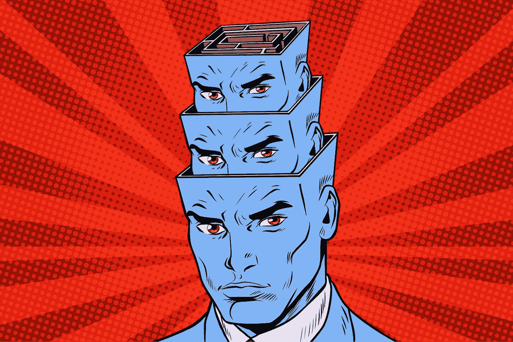

看看这个系列的第一部 *中的* [*未来五到十五年 AI 会是什么样子。在第二部分，我们得到了超级科幻，看看我们的水晶球能否到达未来 50 年。*](https://hackernoon.com/ai-in-five-fifty-and-five-hundred-years-part-one-e630058b547f)

###########################################

> 任何足够先进的技术都和魔法没什么区别
> 
> 阿瑟·克拉克

欢迎来到 2069 年。

智能渗透到我们日常生活的方方面面。

一旦哑物体被唤醒。当你女朋友去巴西做演讲时，你的衬衫随着你的墨镜咿呀学语，还和她的珍珠耳环聊天。

从我们的房子，到武器，到飞机、火车和汽车，到道路、衣服、珠宝、耳机、眼镜和眼神，一切都充满了思想。

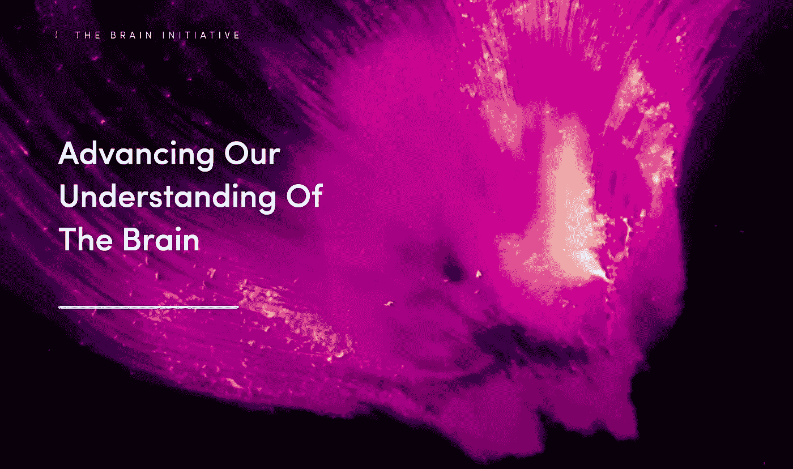

推动我们超越深度学习并推动第四波智能革命的动态新算法源于绘制人类大脑中每一个神经元和连接的全球性努力。最终，处理器和生物技术赶上了我们的雄心，科学家的成功超出了我们最大的期望。

就像之前的人类基因组计划(T21)一样，全球范围内的大脑图谱竞赛耗时数十年，耗资数十亿。但是这些突破使价格大幅下降，几十年后，你可以用世界储备货币比特币的一小部分来映射人类的思维，并将其备份到运行在雾粒上的分布式分散存储中。

它变得如此便宜，以至于从当地的勤杂工到地球上最有权力的首席执行官，每个人都开始在他们生命的不同阶段拍摄/备份他们的大脑，希望以后可以用克隆体或虚拟体来重现。

神经制图和人工智能有什么关系？

数据科学家没有发现人类心灵深处的秘密**通用学习算法，但他们可以实时观察它们，因为大脑模拟在受该项目启发的神经芯片上运行。**

****我们没有发现如何学习。我们黑了学习。****

**与 20 世纪 40 年代至 60 年代的快速学习系统相比，深度学习、符号推理和遗传算法看起来很原始。**

**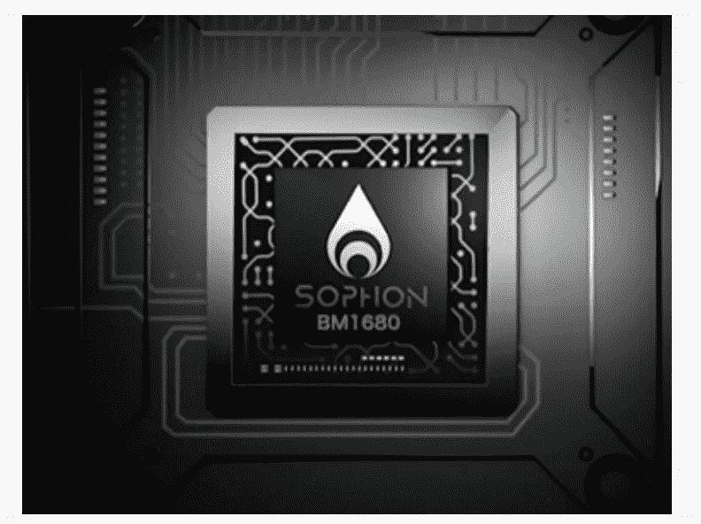**

**[Bitmain’s DL chip](https://www.sophon.ai/).**

**[中国的加密货币 ASIC 制造商](https://www.bloomberg.com/news/features/2018-05-17/china-s-crypto-chips-king-sets-his-sights-on-ai)率先制造了改变我们处理智能方式的全新芯片，将其制造和设计技能提升到了一个新的水平，主导了下一波计算浪潮。第三次世界大战期间用于加密的量子计算突破导致了第五次浪潮，这使得即使是神经芯片也显得力不从心，直到旧芯片通过使用由干细胞培养成人工神经元制成的湿件卷土重来。**

****现在，一切都是有生命的。****

**我们的[智能绷带监控我们的伤口](https://www.sciencedaily.com/releases/2018/07/180706091726.htm)并告诉我们何时更换敷料或感染是否正在愈合或恶化。绷带上的小贴片通过释放抗生素对感染做出反应。**

**药瓶提醒我们吃药，或者警告我们不要吃药，如果我们从一夜饮酒中昏昏沉沉地醒来，并试图吃两次。**

**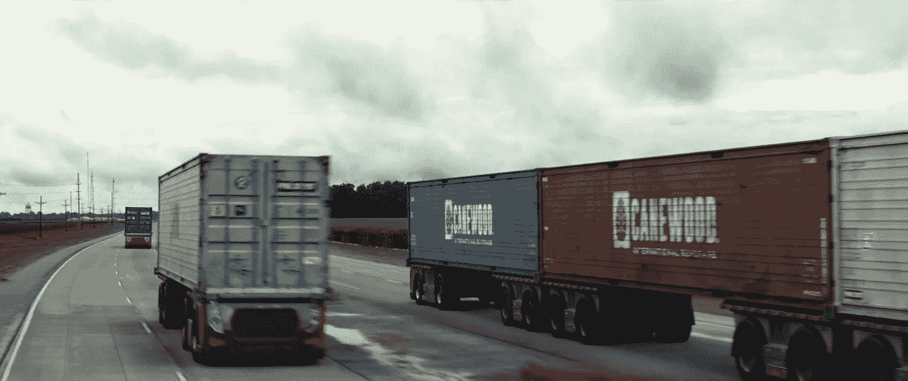**

**Self-Driving trucks in [the movie Logan](https://amzn.to/2DFKtQC), an amazing and subtle take on the future.**

**[无人驾驶卡车以每小时 200 英里的速度在中国和美国的特殊道路上行驶。它们不过是](https://www.pastemagazine.com/articles/2017/03/logans-eerie-vision-of-the-future-of-trucking.html)[被拆下来的带轮子的平板车](https://www.foxnews.com/auto/gm-developing-stealthy-self-driving-hydrogen-powered-cargo-truck-with-military-in-mind)，装载着标准的智能运输集装箱。这些容器知道里面的每一个物体，这些物体被纳米卫星扫描，并在 AR/IoT 网络上永远被跟踪。一旦盘子从工厂的工业 3D 打印机上下来，它们就会被追踪到你的房子里。**

**盘子坏了，他们自己要求更换。**

**集装箱到达[自动驾驶船](https://www.wired.com/story/self-driving-ships-boats/)。当海盗试图劫持集装箱时，船只会进行规避动作，集装箱会发出刺耳的声音，并呼叫海岸警卫队或海军。**

**一批最新最时尚的黑色夹克通过无人机送货上门。当你去柏林的 [Berghain](http://berghain.de/) 跳舞度过一天时，你的夹克会随着温度的变化调整线头，或者随着温度的升高松开线头。当你在冬天的冰天雪地中从热到冷，再到自动驾驶汽车的温暖时，不再需要穿多层衣服。**

**当然，如果你在 Berghain，你只要一进去就把它脱下来，浮动挂钩的机器人外衣检查系统会扫描你的虹膜 ID，并向你的信息项链发送认领代码。**

**我们的 [**眼镜、隐形眼镜和墨镜向我们展示了我们周围世界的元信息**](https://www.youtube.com/watch?v=GJKwHAvR4uI) ，从我们认识的人的联系信息，到历史地标的细节，到要避开的高犯罪区域的警告，到允许我们查看他们在一天特定时间的朋友和家人的位置。**

****

**[Psycho-Pass](https://randomc.net/2012/12/10/psycho-pass/) hologram AI assistant.**

**一个 [**人工智能个人助理**](https://www.youtube.com/watch?v=vGh6rwPYPR4) 生活在你的项链中，投影为全息图，在你的耳塞和你的增强现实联系人之间划分时间，在分布式 foglet 平台上处理其一半的例程，完成过去需要几个小时的各种任务。它让你早上起床很烦，安排会议，在去派对的路上找到一瓶好酒，精心制作让你进入夏季状态的致命训练，建议最新时尚，找到约会的完美餐厅，同时告诉你在约会时说什么，帮助你在激情之夜达成交易。**

**孩子们过去不得不在玩具上发挥他们的想象力。还记得军人和动作人物吗？你必须自己给他们摆姿势，给他们声音，在后院和他们上演史诗般的战争传奇。**

**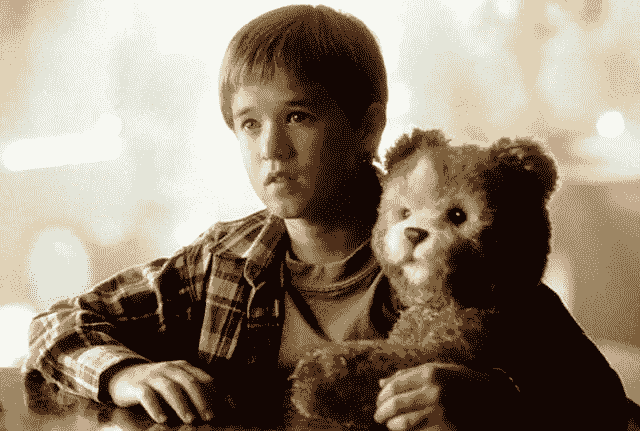**

**Teddy from the underrated [movie A.I.](https://amzn.to/2VwYTgd)**

**今天的孩子不想要一只坐在那里张着嘴盯着墙的泰迪熊。泰迪熊现在会走路和说话，让孩子们乞求他们的父母买东西。除了对那些渴望头脑有更多工作要做的简单时代的收藏者来说，那些不能奔跑、跳跃和在后院战场上尖叫的动作人偶是没有价值的。**

**玩具通常会说“不含电池”**

****今天的玩具应该是“无需想象”****

****它的** [**玩具总动员**](https://www.youtube.com/watch?v=wmiIUN-7qhE) **栩栩如生。****

**学生们不写日记，他们向一个顶嘴的人坦白，这个人给了他们关于男孩问题和在学校受欢迎的建议。**

****

**Judy Jetson talks to Di-Di, her diary.**

**自行车有摇摆检测和奇怪的外星框架，看起来很奇怪，但由机器设计，使它们更稳定。如果你想的话，你可能会兜售它们，但是如果你累了，人工智能加上毫米精确的全球定位系统会接管并为你开车。**

**[**多材质 3D 打印机**](https://www.youtube.com/watch?v=gd3FGrIDYn8) 工厂里的分子打印机，出故障、订单维修的时候就叫出来。当打印机坏了的时候，机器人会交换打印机，给它们更多的金属、木头和橡胶条。**

**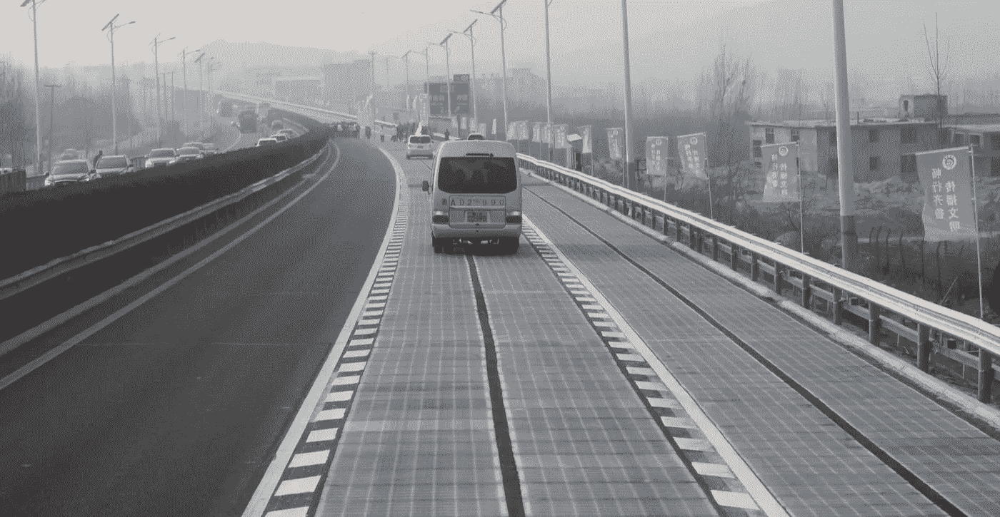**

**Solar roadway in China. Image courtesy of [Pick My Solar](https://blog.pickmysolar.com/china-drives-clean-energy-forward-with-a-solar-roadway).**

**老路由无人机用快硬混凝土修补。由工业玻璃太阳能电池板制成的智能道路显示信息，让城市电网知道何时需要维修。**

**灭火系统不仅仅是扑灭房屋的火灾，它们还会指引家庭往哪里跑，避开哪些房间，同时用舒缓的声音让他们保持冷静，并呼叫自动消防车。**

**但这一切都是从自动驾驶汽车开始的。**

# ****自治和美丽新世界****

**到 2020 年的自动驾驶，一切都已经席卷了地球。**

**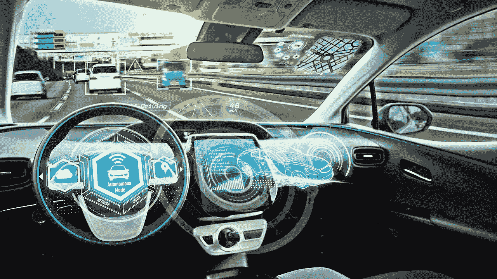**

**[Top Trending](https://www.youtube.com/watch?v=aNkKZuKbVKc) talks self-driving cars.**

**自动驾驶汽车每年拯救了数百万人的生命。**

**原来人类是糟糕的司机。**

**正确驾驶汽车需要全神贯注。这是人类在注意力持续下降时不会做的事情。**

****2019 年全球**[**125 万人死于车祸**](https://www.asirt.org/safe-travel/road-safety-facts/) **。每天有 3287 人死亡。超过 2000-5000 万人受伤或致残。****

**人类仍然有错觉，认为他们是非常非常好的司机，就像[和](https://amzn.to/2GMmW2s)一样。人类有很强的愚弄自己的能力。**

**早期，[每一起激烈的无人驾驶汽车撞车事故](https://www.wired.com/story/tesla-autopilot-self-driving-crash-california/)都成为新闻。愤怒的人们指出它们是多么危险，一些反动政府禁止它们。**

**这些政府付出了沉重的代价，就像那些禁止优步而支持人人讨厌的出租车的政府一样。你不能阻止时间的潮流。最终，与自动驾驶汽车人口迅速增长的国家相比，人类司机的死亡人数看起来很荒谬，各地的公民都要求政府撤销禁令。**

****十年后，无人驾驶汽车撞车事故不再成为新闻，因为人类因无法完全注意不断变化的路况而杀死了太多的人。****

**到 2029 年，由于先进的监控摄像头可以在几秒钟内发现撞车事故，并派遣护理人员在黑夜中尖叫以拯救司机，死亡人数大幅下降。但不仅仅是摄像机。汽车本身可以联系城市电网，告诉他们发生了什么，从他们的黑匣子中读取数据，并向交通控制发出信号，让汽车改变路线并提供帮助。**

**到 2039 年，摄像头已经从高速公路扩展到了偏僻的道路，他们召唤[自主护理人员](https://www.youtube.com/watch?v=y-rEI4bezWc)以超人的精度赶到现场，机器人从倒塌的框架中撬起受害者，并用下一波抗生素和[材料对伤口进行分类，这些材料会在 15 秒内膨胀以填充伤口](https://www.popsci.com/article/technology/how-simple-new-invention-seals-gunshot-wound-15-seconds)并阻止败血症。**

****方向盘，曾经是法律要求的东西，一起消失了。****

**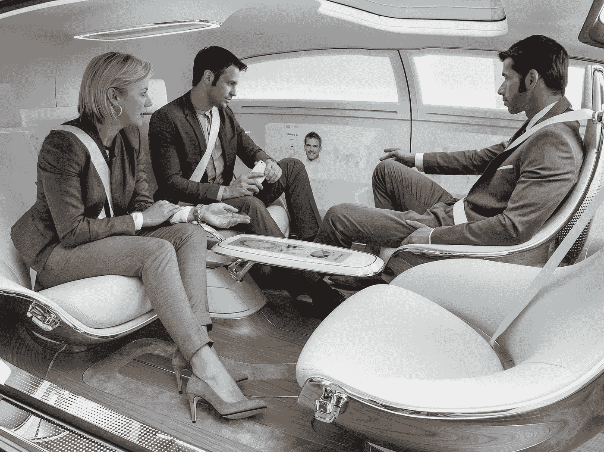**

**[Mercedes F 0150](https://www.mercedes-benz.com/en/mercedes-benz/innovation/research-vehicle-f-015-luxury-in-motion/) concept vehicle.**

**汽车内部被重新设计成 [**轮子上的迷你公寓**](https://www.mercedes-benz.com/en/mercedes-benz/innovation/research-vehicle-f-015-luxury-in-motion/) ，桌子和椅子面对面。**

**酒后驾车成了一件好事。**

**老一辈的人发誓说，人们将永远想握着方向盘，感受脚下道路的隆隆声，这种想法已经传到了遥远的未来。年轻一代不明白，当他们宁愿聊天、工作或翘起二郎腿戴着眼镜或用放大的眼睛看书时，有什么大惊小怪的。**

**到 2049 年，没有特殊许可，人类驾驶几乎是非法的，几乎没有人死于交通事故。**

**人类驾驶的汽车成为了一个蓬勃发展的利基市场，就像 CD、Napster、Apple Music 和 Spotify 兴起后唱片市场一样。**

**但也不全是好事。**

**那些拯救了那么多人生命的自动驾驶汽车也付出了十亿人的生命。**

# ****快餐国家和第三次世界大战之风****

**末日预言家是对的。**

****人工智能消灭工作岗位的速度确实快于我们取代它们的速度。****

****他们也错了，但这需要时间和灾难才能让世界再次走上正轨。****

**到 2030 年，一个致命的组合[崛起的威权主义](https://singularityhub.com/2018/11/23/digital-authoritarianism-is-rising-heres-what-that-means/)、[民主衰退](https://www.eiu.com/topic/democracy-index)、自动化 3D 和分子打印机驱动的工厂和无人驾驶汽车创造了完美风暴。**

****和** [**快餐机器人**](https://newsexaminer.net/food/mcdonalds-to-open-restaurant-run-by-robots/) **。****

**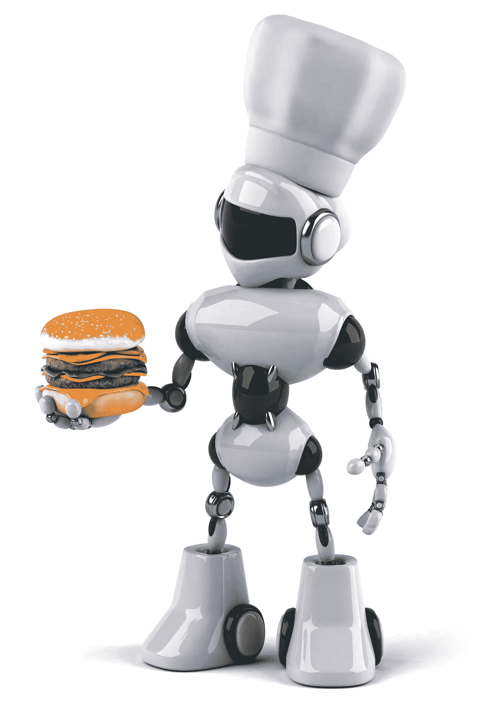**

***Twenty years ago I wrote a short story called* [***In the Cracks of the Machine***](https://amzn.to/2LjcQuc)*, where fast food bots caused a labor crisis that spiraled out of control. I did miss self-driving cars though. (Nobody is perfect.)***

**快餐行业张开双臂拥抱自动化 比任何人预期的都要快。**

**随着快餐业用机器取代了人，380 万份工作一夜之间蒸发了。**

**从门卫开始。当你可以花 10，000 美元得到一台完美清洁、永不疲劳、每年只需维护一次、能使用 50 年的机器时，为什么还要给别人支付最低工资呢？**

**很快汉堡店老板、油炸厨师和其他所有人都出去了。抵制的特许经营店倒闭了。**

**政府的反应不够快。当他们试图通过法律让人们保住工作时，他们只是加速了崩溃，因为无法利用这些漏洞的快餐连锁店破产了。**

**当共享经济公司可以在 5 秒钟内为一个大城市的大多数人提供一辆价格更低的汽车时，人们不再购买汽车。依赖食品服务工作和生产部分全球汽车供应链的经济体遭受重创。**

**随着贷款和投资的枯竭，新加坡和瑞士遭受了损失。这片广袤大陆上的十几个国家接管了中国的低成本制造业，这一非洲奇迹戛然而止。经济危机迅速蔓延到俄罗斯和欧盟，席卷了德国、法国和意大利，然后波及中国和美国。**

**就像历史上很多次一样，当人们失业时，他们会变得愤怒，在街上聚集。整理形式和极端主义团体像癌细胞一样繁殖。很快，年轻人就在街头一决雌雄，因为他们没有其他发泄精力的途径。**

**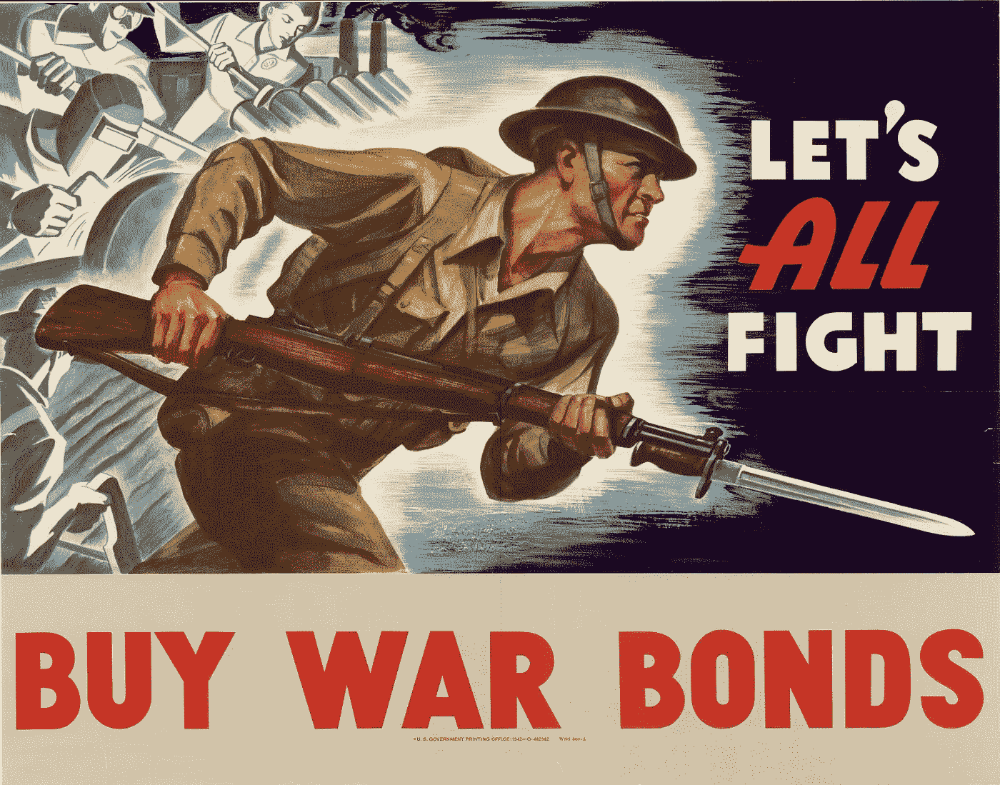**

**与过去的战争不同，当第三次世界大战[打到了](https://extranewsfeed.com/the-winds-of-world-war-iii-8bc369584f67)，这个星球上没有一个国家能够幸免。**

**它开始是一场秘密的网络战，很快爆发为对电网和通信基础设施的全面攻击，让人们处于黑暗之中，并与更广阔的世界隔绝。**

**几个星期后，世界超级大国公开宣战。**

**在这场愈演愈烈的冲突中，艾扮演了一千个不同的角色。**

**当灵巧的子弹绕过拐角，以鲨鱼般的杀手本能猛击目标时，子弹很少会错过。**

**微型无人驾驶飞机成群结队地潜入城市，它们小小的心灵之眼充满了不断变化的目标。如果他们没有得到他们的男人，他们充电，每天晚上无休止地出去，直到他们最终找到他们的目标，像飞镖一样击中它，然后爆炸。**

**而 ai 指挥了这场战争。**

**就像几十年前 AlphaGo 轻松控制世界上最好的围棋大师一样，神秘的量子计算人工智能在永久模拟中进行了数十亿次虚拟战斗，掌握了击败敌人的方法，从全面战争到游击战，再到复杂的反叛乱战术。**

**他们提供全面的全局战略分析，比任何将军都更好地指挥战斗，派遣部队在山丘和海滩上战斗和死亡。他们派人和机器去杀人，将军们越来越依赖他们来赢得战争，而不是人类的本能。**

**特种部队乘坐隐形喷气式飞机降落，他们的私人战斗助手编排好他们的每一步，在零点三十秒潜入房屋，甚至在他们起床前就杀死高价值目标。这些士兵是[半人马](https://techcrunch.com/2016/11/01/how-combined-human-and-computer-intelligence-will-redefine-jobs/)，他们的大脑用精致的[神经鞋带](https://www.techworld.com/data/what-is-neural-lace-3657074/)穿成线，让他们直接接触实时人工智能，提高他们的反应时间和神经系统，因为他们的纳米线增强肌肉以超人的速度上楼。**

**虽然人类死亡人数很高，但是每死一个人，就有十个机器人死去。**

**十几个不同的机器人士兵加入了战斗，从携带重物的骨骼[驮畜](https://www.youtube.com/watch?v=cr-wBpYpSfE)，到[自主喷气式飞机](https://www.youtube.com/watch?v=_PaEgaTZUQQ)，到自动驾驶坦克，再到除了他们的兄弟姐妹之外战斗和死亡的全尺寸机器人士兵。**

**最后，100 亿台机器和 15 亿个灵魂在最后一枪终于打响的时候毁灭了，世界退后一步看它所造成的恐怖。**

# ****凤凰与灰烬****

**但就像之前所有的战争一样，这并不是我们所知的生命终结。**

****人性从灰烬中重生。****

**这是一场结束所有战争的战争，但随之而来的是一个意义深远的和平时代。**

**人们回到家，再也不想打仗了。他们想安定下来，生儿育女，花时间和朋友一起欢笑、喝酒，摆脱过去的创伤和伤疤。**

**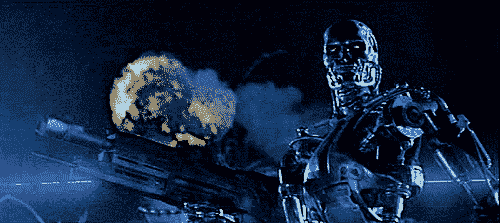**

****战争加速科技。****

**第二次世界大战以螺旋桨飞机开始，但五年后喷气式发动机划过天空，不是为了赢得战争，而是为了改变战后人们的出行方式。**

**许多在第三次世界大战期间如雨后春笋般涌现的技术，如量子计算、增强现实、数字账簿、加密投票平台、meshnet 加密通信、分子打印、支付系统、从模拟人脑逆向工程而来的通用学习算法，以及先进的医疗诊断技术，都席卷了民用世界。**

**曾经指导长着大胡子的特种部队士兵寻找猎物的人工智能，现在与孩子们谈论如何战胜恶霸并结交新朋友。**

****杀戮场被** [**公园**](https://www.fodors.com/world/europe/germany/berlin/experiences/news/10-ways-to-explore-the-great-outdoors-in-berlin) **覆盖着。****

**战斗人工智能被重新用于运行整个经济，在人们知道他们需要之前订购商品和服务，并指导工厂加速或减速。**

**机器人士兵被废弃或重新部署为警察或植树，以帮助生态系统从全面战争的毁灭性影响中恢复过来。无人机飞向烧焦的田野和天空，迅速种植树木、花卉和食物，并用紫外线和食物与营养的完美 PH 值平衡来刺激它们，旨在重建破碎的土壤。**

**自动化的独立医院舱彻底改变了护理人员，将医院带到了患者面前。**

**死亡人数也有一线希望。**

**当我们不解决自己的问题时，大自然会用最残忍、最丑陋的方式来解决它们。随着需要工作的人越来越少，就业市场进入了一个空前扩张的繁荣时代。**

**破窗是日常经济学中的一个谬误。但有时大量破碎的窗户可以重启整个世界经济。**

****

**也许疯狂的泰坦巨人灭霸终究是对的？**

**不管怎样，经济在 2040 年代和 2050 年代以狂热的速度繁荣。**

**艾创造了一个前所未有的新工作爆炸。先是毁灭，然后是创造。旧工作消失前我们无法想象的新工作开始蓬勃发展。**

**事实证明，看门机器人需要的维护比它们的创造者想象的要多得多，一个完整的行业应运而生来清理和升级它们。**

**汽车改装和模块化汽车的售后市场升级在世界各地爆发，创造了新的经济动力。**

**人工智能心理学家在复杂系统失控时追踪问题。**

**基因设计师在半人马人工智能的帮助下，创造了全新的食物、有机体、抗生素和药物。**

**新一代的孩子摆脱了债务，也懒得去拥有房子、汽车或大电视。他们拥抱了一种即时共享经济，人工智能以一种过去几代人害怕郊区中产阶级的方式指导他们的许多日常行为。他们从一个地方搬到另一个地方，当他们环游世界和远程工作时，他们的电脑在他们的大脑里。**

**越来越多的人伴随着人工智能成长，并不认为用神经带或增强的眼睛来增强他们的智力有什么了不起，这些眼睛可以以超人的完美来看东西。人们与人工智能并肩工作，因为政治家、大公司和分散自治组织(Dao)学会了如何平衡人和机器的需求。**

# ****野生的森林****

**在短短的五十年里，我们看到了智能时代黎明的芥菜种成长为一片野生的、不受控制的森林。**

**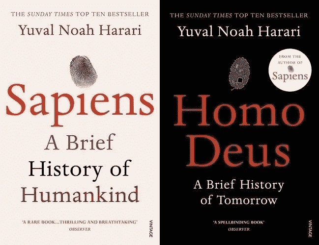**

****人类遭受了苦难，坚持了下来，并取得了胜利。****

****新的** [**最伟大的一代**](https://amzn.to/2DFMGvx) **逐渐强大，他们的思想随着智能软件和湿件而扩展，一代** [**早期后人类**](https://www.facebook.com/groups/1736763229929363/) **为** [**人【德乌斯】**](https://amzn.to/2Wb7imr) **指明了道路。****

**人工智能的普遍力量反映了人类思想中恶魔的一面，也反映了我们本性中善良的一面。**

**它帮助我们失去理智，杀死彼此，就像我们喜欢定期做的那样，它用人工智能衍生的心理治疗技术修复这些思想，如靶向电疗和快感中心刺激植入物。当这不起作用时，机器设计出快乐药丸，让过去的百忧解看起来像巨美熊。**

**它增强了我们的医疗保健和整个经济的自动化。**

**道路得到了合理的修复，被从不睡觉的无人机和摄像机追踪。人们不再死于上班路上的路上。**

**我们的衣服和手袋醒了。我们的智能手机逐渐变成了项链、隐形眼镜和增大的眼球。**

**我们脚下的街道和人行道变得聪明了。**

**一时间，人们在生与死、繁荣与萧条、幸福与悲伤的永恒循环中回归平衡与繁荣。**

**###########################################**

**在下一篇文章中，我们将跨越未来五十年，看看五百年后的世界，一个超乎想象的世界。**

**###########################################**

## **如果您喜欢这篇文章，请于 2019 年 5 月 16 日在柏林举行的[人工智能的崛起上观看我关于五年、五十年和五百年后的人工智能的演讲，并享受门票七五折优惠！](https://www.eventbrite.de/e/rise-of-ai-conference-2019-tickets-47944396982?discount=posthuman)**

**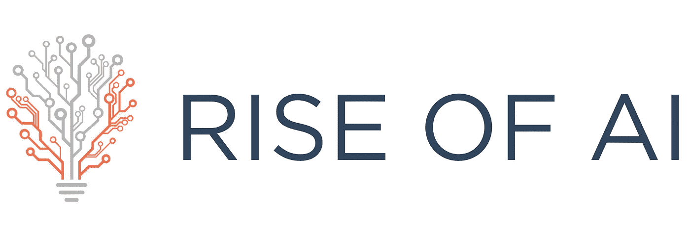**

**##########################################**

## **如果你喜欢我的作品，请[访问我的 Patreon 页面](https://www.patreon.com/danjeffries)，因为那是我与所有粉丝分享特别见解的地方。**

****

## **顶级赞助人可以独享这么多东西:**

*   ****每篇文章、播客和私人谈话的早期链接。**你比任何人都先阅读和聆听！**
*   ****一个月虚拟见面，跟我 Q &一个。问我任何问题，我都会回答。我也分享我正在做的一切，并给你一个幕后看我的过程。****

## **访问传说中的硬币表 Discord，您会发现:**

*   ****市场来电**来自我和其他专业技术分析大师。**
*   ****投币者**只能**私聊**。**
*   ****私人海龟滩频道，程序员们在这里分享各种版本的** [**密码海龟操盘策略**](https://hackernoon.com/my-super-secret-crypto-turtle-strategy-revealed-ae7492fb01a6) **等信号和交易软件**。**
*   ****幕后**看看我和其他专业人士是如何解读市场的。**

**############################################**

## **我有一个新的播客， [The Daily PostHuman](http://dailyposthuman.com/) ，涵盖加密、人工智能、科技、未来、历史、社会等等！查看我最著名的文章和观点的扩展报道。上 RSS 频道，不要错过任何一集，请在接下来的几个月里关注一些非常特别的嘉宾！**

****

**############################################**

****

**简单介绍一下我:我是一名作家、工程师、博客写手、播客和公共演说家。**

***你可以看看我的最新小说，* [***一部史诗般的中国科幻内战传奇***](http://amzn.to/2gAg249) *在这部小说中，中国挣脱了共产主义的枷锁，成为世界上第一个直接民主国家，运行着一个高度先进、人工智能的去中心化 app 平台，没有领导人。***

## **当你加入我的读者群，你可以免费得到一本我的第一部小说《蝎子游戏》。读者称之为“神经癌的第一次严重竞争”和“黑色侦探会见约翰尼记忆术。”**

**############################################**

## **最后，你可以[加入我的私人脸书小组，Nanopunk Posthuman 刺客](https://www.facebook.com/groups/1736763229929363/)，在这里我们讨论所有的科技、科幻、幻想等等。**