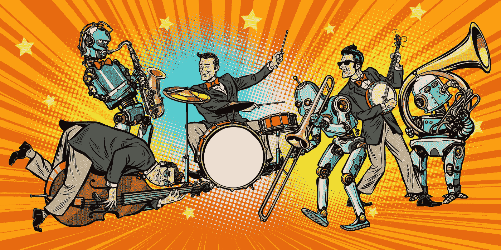

# X 年后的 AI

> 原文：<https://medium.com/hackernoon/ai-in-x-years-2fa170ded37b>

## 今天的顶级科技故事是五年、五十年和五百年内的[**——第一部分**](https://hackernoon.com/ai-in-five-fifty-and-five-hundred-years-part-one-e630058b547f) 作者 [**丹·杰弗里斯**](https://hackernoon.com/@dan.jeffries) **。节选:**

从短期来看，人工智能的前途和危险是巨大的。

人工智能将带给我们一些最灿烂的幻想和最黑暗的噩梦。

*为什么两者都有？*

*因为 AI 是通用技术。它足够灵活，可以做我们想让它做的任何事情。*

***也就是说它会反映它的创造者的善恶:***

***我们。***

尽管人们担心终结者和机器会接管，但人工智能甚至还没有接近有感知能力。它没有自己的欲望。它不会很快接管世界，尽管我们会在 500 年后探索这种可能性。

*我们现在有的是狭义的 AI。它只限于单一任务，我们让它做什么它就做什么。它在人类的控制之下。如果它做了坏事，我们只能怪自己。*

未来五到十五年，我们要去的地方是一个由狭义人工智能主导的未来。

人工智能和它的使用将会反映和放大我们的自然一千倍，包括黑暗和光明。

它将存在于你的相机、手机、电脑、眼镜以及公共和私人场所。

它将推动营销、制造、材料科学以及预防性和姑息性医疗保健。它将提升监视和武器技术。它将改变我们的工作方式、我们相互合作的方式以及这个世界的运作方式。

它会成为我们的朋友、同事和敌人。

***正如 Francois Chollet 所说，“AI 将成为我们与世界的接口。”***

***简而言之，AI 所及之外，不会有任何东西。***

欢迎来到智能时代的黎明。

现在跟我来，我将向你展示这一切是如何开始的，以及它如何带领我们进入一场智能爆炸，这将使人类过去的巨大转变，狩猎采集到农业，农业到工业革命，以及工业革命到信息时代，相形之下显得微不足道。

## 看完整个故事:[五年、五十年、五百年后的 AI](https://hackernoon.com/ai-in-five-fifty-and-five-hundred-years-part-one-e630058b547f)

## 阅读更多[人工智能故事、](https://hackernoon.com/artificial-intelligence/home) [最新科技故事](https://hackernoon.com/latest-tech-stories/home)和[黑客正午编辑精选故事](https://hackernoon.com/editors-top-tech-stories/home)。

# 回到网上！

**P.S.** 看看这个伟大的 [Reddit/r/Programming 讨论](https://www.reddit.com/r/programming/comments/bgw2a3/your_cs_degree_wont_prepare_you_for_angry_users/)关于我们最近由 Angel List 发表的一篇[文章。](https://hackernoon.com/your-cs-degree-wont-prepare-you-for-angry-users-legacy-code-or-the-whims-of-other-engineers-64a43595ec63)