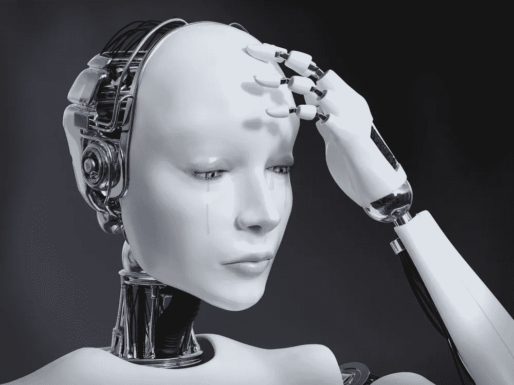

# AI 开始情绪化了。这就是为什么这对公司和消费者都是一件好事

> 原文：<https://medium.com/hackernoon/ai-is-getting-emotional-heres-why-that-s-a-good-thing-for-companies-and-consumers-alike-6ea2964e18d6>

在 HBO 热门剧集《西部世界》第二季中，公司联合创始人为投资者举办了一场派对。聚会结束时，创始人问其中一位投资者，他是否能分辨出哪个出席者是机器人。这位投资者打量着每个人，最后猜测出一个女人，她看起来太完美了，不可能是人类。但最终，所有的客人都是机器人。它们如此栩栩如生，以至于投资者看不出它们是机器。

当然，我们离生活在栩栩如生的机器人中间还有很长的路要走。但是情感人工智能——或情感识别技术——是人工智能的下一个前沿。

也就是说，这并不新鲜。早在 20 世纪 60 年代，麻省理工学院的教授们就创造了一个名为伊莱扎的计算机程序，它可以与人类互动。但是，曾经需要专业实验室和超级计算机的东西现在可以更容易地部署到云上，而且成本很低。

近年来，运行人工智能的必要硬件的民主化访问使它越来越受各种类型的公司的欢迎。

[Gartner 研究副总裁 Annette Zimmermann 说](https://www.gartner.com/smarterwithgartner/emotion-ai-will-personalize-interactions/)到 2022 年，“你的个人设备将比你的家人更了解你的情绪状态。”俄亥俄大学最近的一项[研究](http://www.pnas.org/content/early/2018/03/16/1716084115)声称他们的算法[比人](http://www.iflscience.com/technology/ai-beats-humans-emotional-recognition-test-landmark-study/)更善于检测情绪。在不久的将来，各种人工智能系统和设备将识别、解释、处理和模拟人类的情感。

并不是所有人都准备好张开双臂欢迎 AI。

许多人担心人工智能会变得有意识并试图毁灭我们。还有人担心坏演员会利用 AI 达到邪恶的目的。然而，这些对人工智能将发展意识并推翻人类的恐惧，往往基于严重的误解。

> 任何新技术看起来都令人生畏，但情感人工智能并不可怕。

随着它越来越成为日常生活和日常在线体验的一部分，它将改善客户的用户体验，并帮助公司提供最佳服务。

你需要知道的是:

# **人类基本上就是生物算法。**

被人工智能吓倒的人通常会从它无法复制人类情感的事实中找到安慰——但这并不完全正确。

在《德乌斯人》一书中，尤瓦尔·诺亚·哈拉里教授写道，人类本质上是数百万年进化形成的生物算法的集合。他说，没有理由认为非有机算法不能复制和超越有机算法能做的一切。

马克斯·泰格马克在他的《生活 3.0:在人工智能时代做人类》一书中呼应了这种观点。

这个观点认为，我们的情感和感觉是有机算法的产物，是由我们的文化历史、教养和生活经历塑造的。因此，它们可以被逆向工程。如果哈拉里教授和泰格马克是正确的，计算机最终将比人类本身更擅长操纵人类的情绪。

人们已经平均每天触摸他们的手机 2617 次，这种参与程度表明由技术控制的未来正在迅速到来。

随着人工智能变得越来越复杂，人们会很乐意让算法处理他们生活中更繁琐的部分。

# 情感人工智能是新的测谎仪。

老式的测谎仪监测身体的生理变化(血压、脉搏)，以确定某人是否在说真话。机器学习做同样的事情，但是没有所有的电线和笨重的机械。

事实上，美国国土安全部以及加拿大和欧盟当局正在测试一个名为 AVATAR 的系统，该系统使用人工智能来监控人们在过境时的谎言。圣地亚哥州立大学管理信息系统助理教授 Aaron Elkins 说:“该系统可以检测眼睛、声音、手势和姿势的变化，以确定潜在的风险。"它甚至能知道你什么时候翘脚趾."

阿凡达不是唯一的数字测谎系统。

一家名为 Converus 的公司上个月宣布，它的[眼球检测系统](https://converus.com/eyedetect/)，管理一个 30 分钟的测试，根据计算机对眼球运动的观察来判断真实性，将在新墨西哥法庭被接受为证据。

> 随着技术变得越来越复杂，普通智能手机用户将能够受益于情感人工智能。

我最近买的 iPhone XR 有面部识别软件。这意味着像支付、登录和验证这样的事情没有触摸交互。您不必记住密码和 PIN 码，这使一切更加安全。

总的来说，它使使用你的手机更快更容易。

现在有几十款手机都有面部解锁功能，比如谷歌的 Pixel 2、三星的 Galaxy Note 9 和摩托罗拉的 Moto G6。使用所谓的深度神经网络——类似人脑神经元网络的庞大硬件和软件网络——谷歌和脸书等公司正在研究类似的人脸识别技术，并已将其应用到在线服务中。

情感 AI 完全成为主流只是时间问题。

# 人工智能可以捕捉情感线索，改善你的在线体验。

消费者倾向于更多地依靠他们的情感而不是其他任何东西来做出购买决定。

当你走进一家商店，很明显你今天过得很糟糕，店员很可能看着你的脸就知道了。这将决定他们如何与你互动，如何接近你，向你推销什么。

> 但是，随着我们如此多的购买活动转移到网上，软件像商店店员一样捕捉情感线索比以往任何时候都更重要。

这就是情感人工智能的用武之地。

人工智能和机器学习允许零售商通过以人类员工无法复制的方式个性化每个交互来为消费者提供更好的体验——甚至比商店店员更好。情感人工智能可以对客户的沮丧感同身受，可以接受辱骂，并带着微笑回来。它也能抓住你的欲望，满足你精确的情感需求。

人工智能通过利用我们的在线历史做到了这一点——脸书和谷歌开发的先进学习算法已经应用于数十亿人的数据宝库。通过分析我们的通信、朋友和文化背景，这些算法已经能够识别我们的许多欲望和情感触发因素。

正如网络的早期一样，在情感人工智能能够无缝融入消费者的日常生活之前，还有许多工作要做，还有许多道德和监管对话要进行。

但与几年前的预期相比，事情比许多人预期的要远得多。情感人工智能不是成为一个人——而是让我们的在线体验尽可能像人一样。

这不是一个可以被吓倒的事情，对于科技公司(和消费者)来说，这是一个重大的机会。