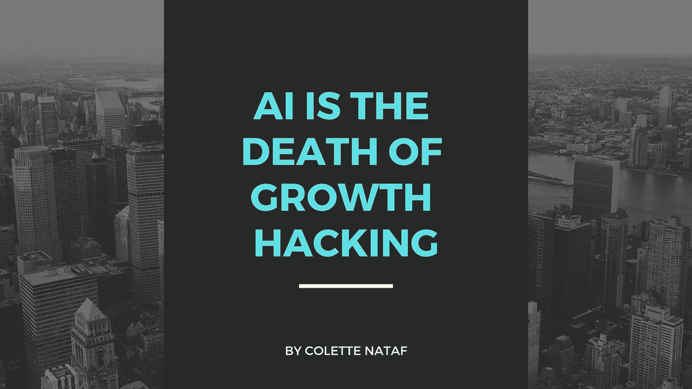

# 人工智能是增长黑客的死亡

> 原文：<https://medium.com/hackernoon/ai-is-the-death-of-growth-hacking-c4bde8394d6c>

## 适应环境的聪明营销人员将与人工智能一起茁壮成长。

众所周知，在创业的世界里，没有什么是真正稳定的。不变的是人们不断提出新的和改进的概念来发展和扩大规模。虽然似乎每个人都在不断地变得更聪明，发现下一个最好的东西，但科技行业的新故事将会持续下去。

*这是人工智能的故事。*

但首先，在人工智能出现之前，我们有增长黑客。增长黑客是一个更宽泛的术语，指的是只关注增长的营销策略。“增长黑客”一词是肖恩·埃利斯在 2010 年创立他的公司 [GrowthHackers](https://growthhackers.com/) 时创造的。这是一个常用于早期创业公司的术语，指的是公司寻求尽可能快的增长。通常情况下，这些初创公司不仅需要大规模增长，而且通常预算很少。

不同于传统的营销实践，即公司通过付费广告和赞助内容来吸引新客户，growth hacking 试图跳过这些营销策略。他们不想花费时间和金钱通过传统的营销努力来获得新客户。因此，这些初创公司寻找成长型黑客，他们找到独特的方法来利用尽可能多的小机会。这些人通常也被称为“成长型营销人员”

增长黑客的主要目标一直是在花费最少资金的同时获得尽可能多的客户。这个词已经流行了十多年，但随着科技行业的不断参与，增长黑客正在成为过去。

# 人工智能是如何工作的？

自从肖恩·埃利斯创造了“增长黑客”这个术语以来，发生了很多变化。我们已经在技术领域进行了九年的创新，从那以后，公司开始创建基于人工智能的软件，最终实现与成长型黑客相同的结果。他们不再需要人工寻找和确定大幅增长和扩展的方法，而是使用自动化策略，只需点击几个按钮。这不仅成本效益高，而且非常注重结果。

有些人认为 AI 只是一种特定的技术，但事实并非如此。它是一堆不同类型的软件，企业可以以不同的方式使用它们。关于营销和增长黑客的话题，人工智能本质上是跟踪、测量和增长广告活动的自动化工具和服务的组合。在[闪电人工智能](https://lightningai.com/)，我们的人工智能系统会自动为你的广告活动创建新的脸书兴趣小组和谷歌关键词。几个月来 A/B 分割测试活动只是为了找到你的理想受众的日子已经一去不复返了。

[人工智能(AI)](https://blog.lightningai.com/the-ultimate-guide-to-ai-in-advertising-c09273e1e137) 近年来对广告业产生了巨大影响。它改变了我们的工作方式，并为我们提供了全新的测试工具和策略。这些工具非常适合分析大型数据集、自动化系统和工作流程、运行 A/B 测试以及优化付费广告的受众。作为一名营销人员，你曾经手工做的许多事情现在可以由人工智能工具来完成。虽然人工智能有很多优点，但最大的缺点之一是围绕增长黑客的大问号。由于人工智能的丰富功能和持续改进，许多人认为传统的增长型黑客正在消亡。

# **人工智能与增长型黑客:深度观察**

人工智能的不断进步可能是增长型黑客的死亡吗？让我们看一个示例场景，并分析一个真实的情况。

场景:你在旧金山一家初创公司工作，是一名成长型营销人员。一天早上，你很早就去上班，得知脸书的广告费用下降到了你的两个广告位上。不幸的是，到那时可能已经太晚了。但是人工智能驱动的运动可以立即捕捉到这些变化和转变，这意味着你永远不会落后于潮流。在这种情况下，人工智能驱动的营销活动战胜了传统的增长黑客。人类根本无法像人工智能技术那样快速行动。

越来越多的公司正在转向人工智能，原因显而易见:

*   更具可扩展性
*   自动化是关键
*   节省时间和金钱
*   更快、更高效的结果
*   所需人力更少

随着创业公司和营销人员继续向人工智能迈进，增长黑客作为一种艺术形式将会消亡。这并不一定意味着所有的成长型营销人员都将失业，但更重要的是，他们的营销角色和能力将发生变化。聪明的成长型营销人员将把许多人工智能公司捆绑在一起，并利用每一个机会。他们将使用人工智能来推动他们的创业，因为尽管机器学习将取代许多传统的人类营销工作，但机器缺乏人类的同情心。人类*(前成长型营销人员)*仍将不得不决定使用哪些工具来解决特定的业务挑战。因此，尽管传统意义上的“增长黑客”将会消亡，但适应变化的智能增长营销人员将继续茁壮成长，并通过人工智能营销找到创新的方式来改变现状。他们将与人工智能一起扮演不同的角色，并随着事情的继续发展面临新的令人兴奋的挑战。

*人工智能的故事将会持续下去。*