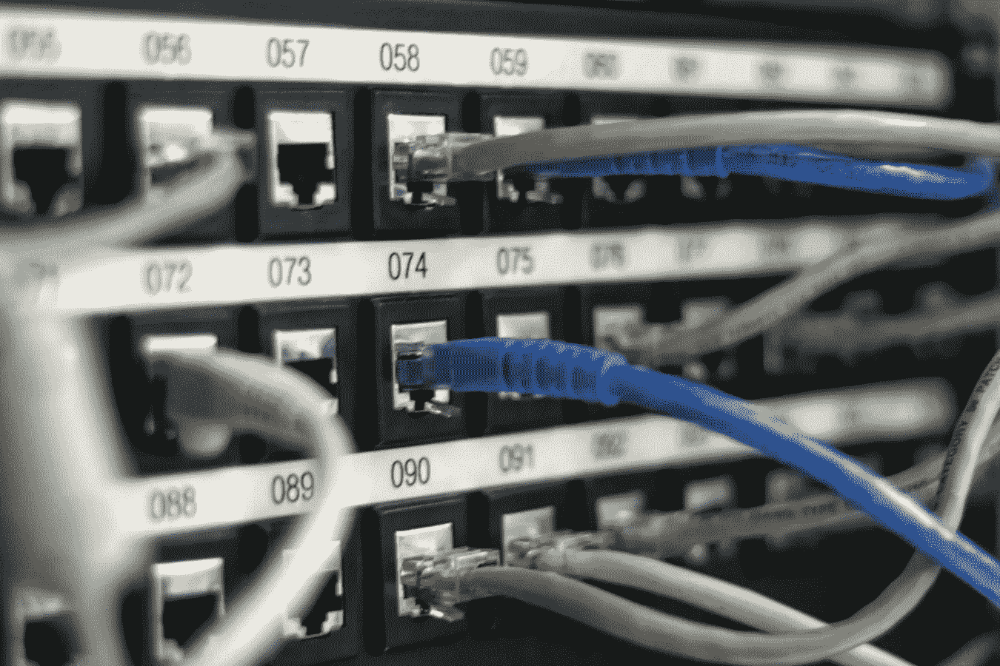
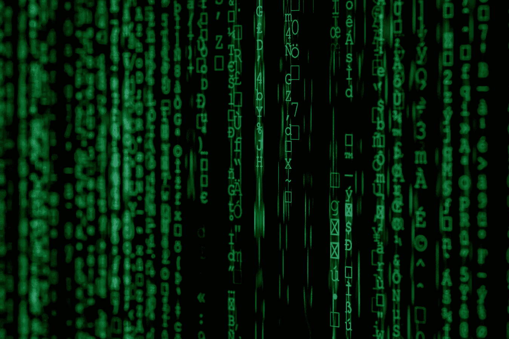

# AI +区块链？埃森哲完全搞错了！

> 原文：<https://medium.com/hackernoon/ai-plus-blockchain-accenture-is-doing-it-wrong-kepler-blockchain-lab-89defd7a7619>

区块链技术经常让人产生困惑，而这种困惑主要源于我在前面两篇文章中已经提到的几个误区(区块链[第一部分](https://keplerlab.io/8-most-common-misunderstandings-in-blockchain-discussion/)和[第二部分](https://keplerlab.io/8-most-common-misunderstandings-in-blockchain-discussion-part-2/)的 8 个最常见误区)。

这些误解阻碍了外行人，有时也阻碍了专家理解技术并在此基础上构建真正的解决方案。

知道我们犯了什么样的错误和知道如何改正它们一样重要。今天，我试图以错误百出的[埃森哲报告](https://www.accenture.com/us-en/insights/blockchain/ai-plus-blockchain)(2018 年 10 月 11 日发布)为例，探讨如何在区块链上构建一个真正的应用。

本文分为两部分；第一篇是关于论文中的错误，第二篇是关于不同行业如何挖掘区块链价值的建议。

# 1.区块链对数据共享没有帮助

*“现在想象一下这样一个世界:通过一个基于区块链的系统，搬迁过程中的每一方都可以在利益相关方(在本例中是家庭)授予适当权限的情况下，查看与端到端搬迁流程相关的数据和信息。*

*组织可以只访问他们需要的数据，因为这些信息反映了区块链增强的信任级别，各方不再需要参与消息传递和协调。随着组织广泛实施这些类型的模型，人工智能系统的可能性将显著增长”——第 4 页*

通俗地说，上面这句话是建议公司交出自己拥有(或窃取)的数据，用用户的私钥加密，上传到区块链上。之后，这些公司只有在用户允许的情况下才能访问这些数据。如果用户丢失了他/她的私钥，他/她的数据将永久丢失，因为没有人控制系统。这个系统是如何运作的不得而知，但是用区块链这个词听起来是合理的。

人们通常认为区块链有助于数据共享，因为有两个关键词:**安全**和**信任**，这也是我将在第 4 和第 5 点中解释的误解。

# 2.智能合同不是数字形式的企业合同

“在未来，通过智能合同对整个生态系统的数据进行更广泛的访问以及自动化商业逻辑的进步，可以为人工智能机器提供新的更大的访问权限，以穿越商业生态系统，并为客户提供更全面的解决方案。”—第 5 页

智能合同仅仅是区块链的一个程序。在公共区块链上运行的智能合同是一个不可改变的、抵制审查的程序。相比之下，在许可链上运行的智能契约只是另一个常规程序。

在公共区块链上运行的智能合同有时被称为去中心化应用(DApp)。分散应用程序可能会有所帮助。例如，我们可以看看去中心化的赌博应用程序(占区块链交易总量的 40%[标准开普勒研究])。

这些应用程序没有许可证；用户不了解运营商，对赌徒没有保护。然而，用户可以信任它们，因为去中心化保证了代码的不变性。也就是说，约定的程序代码不能被更改。

分散的应用程序将核心逻辑放在区块链上，并建立完全自动化的执行。因此，这些应用程序的行为就像“合同”,用户可以相信程序会交付所要求的东西。然而，仅仅在区块链上放置一个程序代码并不能分散应用程序。

此外，我们需要明白，去中心化并不是实现自动化所必需的，除非目标是创建一个任何人都无法控制或清除的应用程序或服务(例如，一个没有许可证的赌博软件或一个供朝鲜将军在纽约买卖房产时使用的应用程序)。

我在这里没有看到太多的业务用例。因此，我不会在这上面花太多时间，因为这篇文章是为企业主写的。

# 3.分散式人工智能(AI)与全自动化

*“由大量反应主体组成的多主体系统中的分散管理、进化、适应和合作的过程被研究和模拟。”—第 7 页*

去中心化的好处在于抵制审查。如果一个去中心化的人工智能将被部署在公共区块链上(给定足够的公共区块链吞吐量)，那么一个不可改变的无人控制的人工智能肯定是可以预期的。然而，一个不可控的人工智能对一个商业组织来说并不意味着什么。

与此同时，部署在许可的区块链上的人工智能程序将与任何其他私有的人工智能程序没有区别。

# 4.区块链重新定义了信任吗？

*“区块链是一种新型的数据库系统，可以维护和记录数据，以便多个利益相关方可以放心、安全地共享对相同数据和信息的访问。因此，它正在改变组织之间界限的性质。自从 20 世纪 50 年代现代数据库发明以来，与它们相关的管理业务模型一直以信任为中心。例如，甲方需要确信乙方(或任何其他人)没有单方面更改任何数据。因此，公司传统上使用基于“消息”的业务模型来构建他们可以完全控制和操作的数据系统。在这种情况下，甲方以“信息”的形式向乙方发送其对世界的看法，反之亦然。只有当双方能够协调这些观点时，他们才能完成交易。区块链正在改变数据信任的概念。通过区块链和其他类型的分布式账本技术(DLT)，公司现在可以访问他们和其他利益相关者知道他们可以信任的公共共享数据集。”—第 12 页*

这是我在上一篇文章中提到的最常见的误解之一——“就其本质而言，存储在区块链上的每一条交易数据都应该是不言自明的。但并不是存储在区块链上的所有数据都是交易数据。此外，区块链技术本身无法让一般数据不证自明(例如，咖啡来自埃塞俄比亚)。”

上面的误解让我们思考哪些数据应该和不应该记录在区块链上。

只有可以被先前存储的数据验证的数据才应该存储在区块链上。我把这种数据称为递归数据，意思是如果前面的数据是正确的，那么当前的数据一定是正确的。

> *只有可以被先前存储的数据验证的数据才应该存储在区块链上。例如交易、所有权和账户余额。*

链式特征使我们能够轻松地追溯数据的历史，直至其源头。因此，可以被先前存储的数据验证的数据可以在没有他人帮助的情况下被证明是对的还是错的。交易、所有权和帐户余额是可以通过以前的数据验证的数据。如果所有以前的交易记录都是正确的，那么帐户余额一定是正确的。

然而，这种不言而喻的能力不适用于其他类型的数据，如医疗数据、用电量和农场记录。人们不能仅仅通过检查以前的记录来确定玉米是否是有机的，即使数据是不变的。

# 5.区块链提高数据安全性。然而，你可能不想付出代价

*“安全性:保护和控制可以在数据元素级别实现，而不是在数据库或数据表级别，这使得渗透更加困难。”—第 12 页*

这个说法是对的。这意味着每个数据都是加密的，只有用户才能解密。区块链是安全的，但公司必须确保它确实需要这种级别的安全，并愿意在数据可用性方面做出相关牺牲。

这篇论文的逻辑在于人工智能对训练数据的需求和区块链促进不同方之间数据共享的能力。

大多数公司已经可以与第三方共享数据，只要他们愿意这样做。我们不需要将数据移动到区块链，仅仅是因为我们希望在不同方之间共享数据。

因此，问题如下:在区块链上存储数据能在安全性、数据真实性、数据可用性和隐私保护方面创造额外的好处吗？我们经常问一个错误的问题:区块链能做什么？而这个问题应该是“区块链能做得更好些什么？”

> 我们不应该问“区块链能做什么”，而应该问“区块链能做得更好些什么？”

埃森哲的报告列出了区块链在不同行业的六个用例，即智能能源和智能建筑、公共科学、供应链、智能设备、身份和医疗保健。在下一篇文章中，我将解释这些行业如何利用区块链技术的力量并转变其核心业务。

*原载于 2019 年 5 月 15 日*[*https://Kepler lab . io*](https://keplerlab.io/ai-plus-blockchain-accenture-is-doing-it-wrong/)*。*