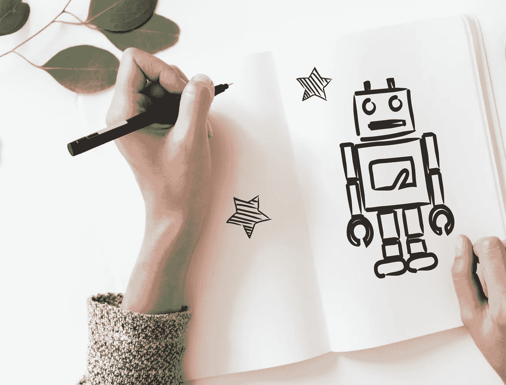

# 人工智能教育的下一步:技术创新改变我们的课堂

> 原文：<https://medium.com/hackernoon/ai-the-next-step-for-education-tech-innovations-changing-our-classrooms-851b1f297cad>

想象一下，一个没有人性缺陷的类人老师。

世界上最好的教育者有时会遭受天生的人为错误，在我们每个人身上表现出不同的形式。他们最终会变得疲惫和紧张。即使是他们中最优秀的人也不能对 30 人的班级给予个人关注。

那么，机器人呢？新技术难道不是一个显而易见的解决方案吗？

电脑从不睡觉；他们传授的知识可以跨大洲、时区和设备全天候提供。他们可以同时教数百名学生，而不会犯任何错误。算法很少这样做——问问 Siri 或 Cortana 就知道了。

根据美国教育部门报告中的 AI 市场，我们可以预计，2017 年至 2021 年，美国教育中的人工智能[将增长 47.5%](https://www.forbes.com/sites/bernardmarr/2018/07/25/how-is-ai-used-in-education-real-world-examples-of-today-and-a-peek-into-the-future/#206762e7586e)。我们快到了。是时候我们在人工智能时代重新思考教育，创造一个没有缺陷的老师了。

对吗？

## **AI 是下一步。但是从哪里来呢？**

人工智能是教育的未来。这是毫无疑问的。

大大小小的公司都在向人工智能驱动的教育技术迈进，整个国家都在投资数十亿美元进行进一步开发。而且，原谅我的双关语，他们不是在做无知的猜测——人工智能已经在这里了，像一个魔咒一样工作。

仔细看看现在的教育状况，你就知道为什么了。

今天的一代不仅精通技术。他们就是我们所说的数字原住民。在世界各地，这些孩子和年轻人可以访问互联网、智能手机和社交媒体，但只有少数教室接受了新技术。

一方面，我们有无限的连接和几乎激进的数字化，而另一方面，我们有几十年的教科书和智能手机禁令。这个结果有时让人觉得很荒谬——学生在数字助手的帮助下，比他们的老师知道得更多。

随着传统课堂的每一个方面都需要重新想象，这种变化是应该的。

## **教师和理工合作？**

当然，摆脱有缺陷的人类教师不是答案。

不仅仅是因为我们还没有准备好迎接一个将人的因素排除在非常人性化的研究领域之外的未来情景，而且主要是因为持续教育并不等同于短期的知识获取。学习和谷歌搜索事实不是一回事。

是的，我们在谈论教育的情感部分。

没有同理心就不可能有好的教育学，这是事实。帮助他人成长和成功的需要就像我们的错误一样深深植根于我们人类之中。最好的老师是这种需求、专业知识、经验和方法的罕见组合。

我们可以给 AI 编程，让它知道所有的答案，就像谷歌一样，我们可以用最有效的教学方法来喂养它的算法，但我们无法让它在乎。还没有。这就是为什么我们不应该谈论人工智能而不是教师，我们应该谈论他们的合作。谷歌的 [G 套件](https://www.startupworld.com/gsuite)就是一个例子。

不出所料，AI 在管理层面表现出色。

人工智能不会出错，也不会感到疲倦，它已经在帮助教师给考试评分、评估作业、为学生提供有用的答案等等。他们简化管理任务的能力提高了效率，节省了教师的宝贵时间。

这就是老师如何为一个 30 人的班级提供个人关注。

## **人工智能辅导**

除了完成管理任务，人工智能还可以通过在课后接手老师留下的工作来加深其对教育的影响。用于辅导的人工智能是可能的，因为称为机器学习(ML)的能力允许它在每次新的交互中变得更聪明。

作为家庭作业和考试准备的辅助工具，人工智能可以提供巨大的帮助。

由于担心自己可能会犯令人尴尬的错误，学生们往往宁愿避免向老师寻求课后咨询或[备考](https://www.startupworld.com/startup-deals/kranse-discount-code)，也不愿鼓起勇气承认自己有不懂的地方。老师可以评判，技术不行。

我们以 AI 驱动的聊天机器人为例。

在这种情况下，基于 ML 的聊天机器人可以为学生提供远比课程表或考试提醒更复杂的答案。教育聊天机器人可以非常先进，从智能校园代表到实时解决学生问题的真正课后辅导老师。

聊天机器人有各种不同的功能，可以帮助学生制定安置计划，减少学生找到课程所需的时间，提供课程反馈、助教式的建议和学习笔记，甚至向远程和自学的学生提供测试和结果。

根据校园技术，聊天机器人是 2019 年的领先技术。

## **个性化&自定进度学习**

有了人工智能，传统课堂的每一个方面都将被重新想象。

例如，未来的学生会知道四面墙教室是什么吗？

从目前的教育来看，电子学习似乎不会长期保持一种趋势。与人工智能和其他新兴技术一起，作为数字服务的学习正在改变我们获取知识的方式。现在都是个性化。

与传统教育相比，电子学习有许多明显的优势，首先是方便的新技术支持的技术，如移动学习和微学习。此外，还有其他流行的方法，如游戏化和社会学习，用来应对参与危机。

而且，学生不必等待数字学院实现现代化。

他们已经站在了现代教育的最前沿，从这里他们可以解决数字母语学生的一些最大需求。个性化学习是其中主要的一种，人工智能已经准备好为学生个人提供定制的学习路径。

这是机器学习的另一种创新用途，只是这一次它没有帮助 AI 了解更多的主题，而是了解学生自己。通过跟踪他们的学习行为和进度，人工智能正在成为单个学生的专家。

结果是一个高度个性化的学习体验，不能失败。

## **建设自我完善的教室**

但这仍然不是教育 AI 的关键卖点。

为了教育的目的，人工智能提供实时反馈的能力是无与伦比的。

教育以反馈为基础；这就是为什么我们有老师。为了学习——也为了正确地学习——学生必须有人跟踪他们的进步，指出他们的错误，解决他们的困境，并给予激励性的批评，以提高成绩。

问题是，他们不能向每个学生保证这一点。

人工智能可以。

实时反馈的意义不仅限于师生辅导。人工智能可以对教师和课程本身提供有价值的输入，从而帮助教育工作者在几秒钟内弥合知识差距并改善学习环境。没有比这更重要的了。

毕竟，改正错误是我们学习的方式。

人工智能所做的就是帮助我们以惊人的速度做到这一点。

## **教育会越来越好**

教育人工智能的可能性是巨大的。

除了能够自动化基本活动、根据个别学生调整课程以及以导师形式提供额外支持之外，人工智能、聊天机器人和其他基于人工智能的技术还可以为教育的未来做更多的事情。比如，写智能内容。

全球可访问性是其实现的另一个主要好处。

通过电子学习和混合学习，人工智能为世界上的每个学生提供了平等的学习机会，包括那些讲不同语言或有视觉或听觉障碍的学生。所有必须在家接受教育的学生都可以接受世界一流的教育。

不，现代学生不需要完美的老师。

他们需要的东西已经在这里了——可以优化、个性化、加速和增强我们当前教育工作的技术。人工智能孜孜不倦，极具洞察力，而且随着每一次新的交互变得越来越聪明，因此成为完美的候选人。