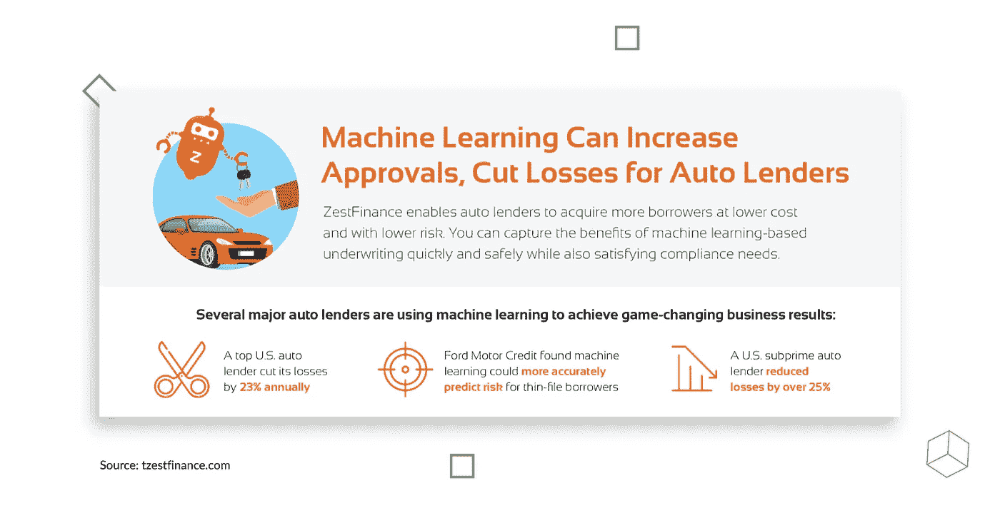
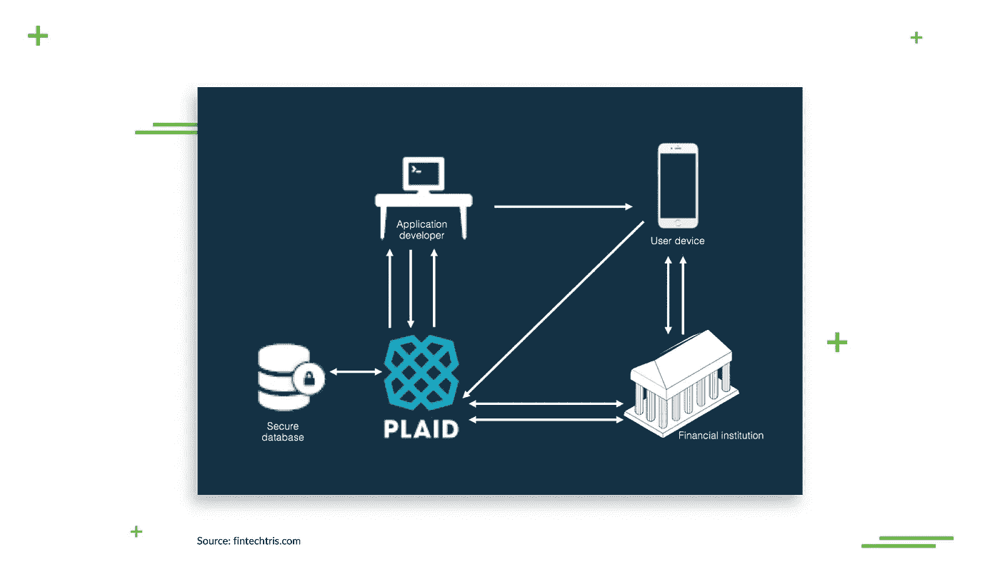
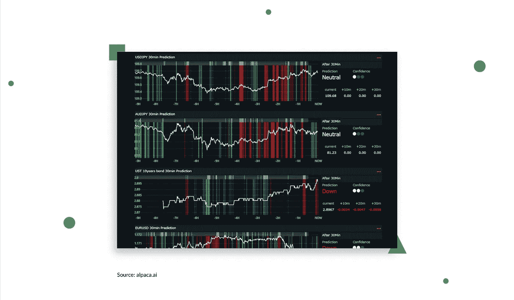
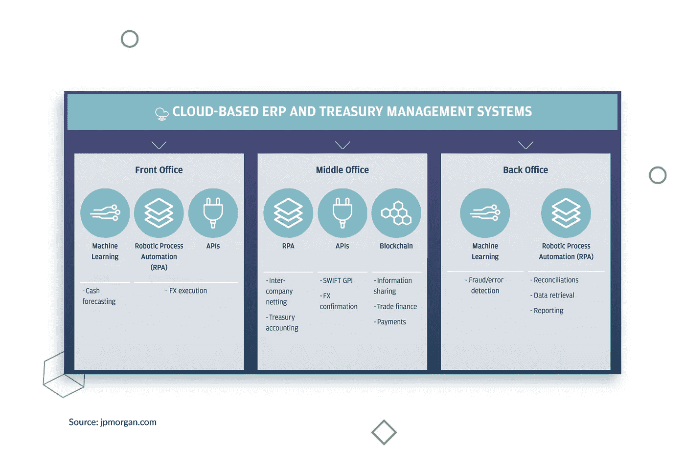

# 人工智能改变金融服务:六个例子

> 原文：<https://medium.com/hackernoon/ai-to-transform-the-financial-services-six-examples-dface3971532>

人工智能并不是一个新生事物，而是越来越多的行业中不可或缺的一部分。具有前瞻性思维的执行经理和企业主积极探索人工智能在金融和其他领域的新用途，以获得市场竞争优势。

人工智能最初主要用于计算机科学，现在已经发展到我们生活中最重要的领域，例如:

*   [交通](https://djangostars.com/industries/taxi-transportation/?utm_source=medium&utm_medium=hackernoon.com&utm_campaign=aiinfintech&utm_content=transportation)
*   教育
*   卫生保健
*   [金融服务](https://djangostars.com/industries/fintech/?utm_source=medium&utm_medium=hackernoon.com&utm_campaign=aiinfintech&utm_content=financial%20services)。

人工智能在[金融行业](https://djangostars.com/industries/fintech/?utm_source=medium&utm_medium=hackernoon.com&utm_campaign=aiinfintech&utm_content=financialindustry)的崛起显示了它获得牵引力的速度有多快，即使是在传统的保守领域，以及它改变商业格局的速度有多快。这里只是人工智能在金融领域最受欢迎的一些例子。

# 1.人工智能和信贷决策

人工智能以更低的成本对潜在借款人进行更快、更准确的评估，并考虑更广泛的因素，从而做出更明智、有数据支持的决策。与传统信用评分系统相比，人工智能提供的信用评分基于更复杂和复杂的规则。它有助于贷款人区分高违约风险申请人和那些信用良好但缺乏广泛信用记录的人。

客观性是人工智能驱动机制的另一个好处。与人类不同，机器不可能有偏见。

数字银行、贷款发放应用程序和[在线抵押贷款平台](https://djangostars.com/case-studies/molo/?utm_source=medium&utm_medium=hackernoon.com&utm_campaign=aiinfintech&utm_content=onlinemortgageplatforms)使用机器学习算法，使用替代数据(如智能手机数据)来评估贷款资格，并提供个性化选项。

美国的汽车贷款公司也报告了人工智能在满足他们需求方面的成功。例如，这份报告[显示](https://www.zestfinance.com/hubfs/Underwriting/Auto-Machine-Learning.pdf?hsLang=en)引进人工智能每年可以减少 23%的损失。

> *这篇关于*[**AI in fin tech services**](https://djangostars.com/blog/6-examples-ai-financial-services/?utm_source=medium&utm_medium=hackernoon.com&utm_campaign=aiinfintech&utm_content=aiinfintechservices)***的文章最初是为* **Django Stars 的博客而写的。****

# **2.人工智能和风险管理**

**当谈到风险管理时，很难高估人工智能在金融服务中的影响。巨大的处理能力允许在短时间内处理大量数据，而认知计算有助于管理结构化和非结构化数据，这是一项需要人类花费太多时间才能完成的任务。算法分析风险案例的历史，并识别潜在未来问题的早期迹象。**

**在分析任何给定市场或环境的实时活动时，金融科技中的人工智能是一个强大的盟友；它提供的准确预测和详细预测基于多个变量，对业务规划至关重要。**

**美国租赁公司 Crest Financial 在亚马逊网络服务平台上采用了人工智能，并立即看到风险分析方面的显著改进，没有传统数据科学方法相关的部署延迟。**

## **您可能还喜欢:**

** [## 构建金融科技产品之前你需要考虑的问题

### 我喜欢金融的一点是，这个行业和时间一样古老——然而，很少有人敢进入它。幸运的是…

djangostars.com](https://djangostars.com/blog/what-you-need-to-consider-before-building-a-fintech-product/?utm_source=medium&utm_medium=hackernoon.com&utm_campaign=aiinfintech&utm_content=youmayalsolike1)  [## 旅游业中的机器学习和数据分析

### 克里斯托弗·哥伦布是历史上最著名的旅行家之一，他一生只进行了 4 次旅行。其中一个…

djangostars.com](https://djangostars.com/blog/benefits-of-the-use-of-machine-learning-and-ai-in-the-travel-industry/?utm_source=medium&utm_medium=hackernoon.com&utm_campaign=aiinfintech&utm_content=youmayalsolike2) 

# 3.人工智能和欺诈预防

多年来，人工智能在打击金融欺诈方面一直非常成功——随着机器学习正在赶上罪犯，未来每年都在变得更加光明。

人工智能在防止信用卡欺诈方面尤其有效，近年来，由于电子商务和在线交易的增加，信用卡欺诈呈指数增长。欺诈检测系统分析客户的行为、位置和购买习惯，并在某些东西看起来不正常并与既定的消费模式相矛盾时触发安全机制。

银行还利用人工智能来揭示和防止另一种臭名昭著的金融犯罪:洗钱。机器可以识别可疑活动，并有助于降低调查涉嫌洗钱计划的成本。一个[案例研究](https://s3.amazonaws.com/cdn.ayasdi.com/wp-content/uploads/2018/04/22170635/AML_Solutions_Deep_Dive_WP_051617v01.pdf)报告称调查工作量减少了 20%。

像 [Plaid](https://plaid.com/company/) (与 CITI、高盛和美国运通等金融巨头合作)这样的聚合器对他们的欺诈检测能力引以为豪。其复杂的算法可以分析不同条件和变量下的相互作用，并建立多个实时更新的独特模式。格子[作为一个小工具](https://www.fintechtris.com/blog/2018/10/20/plaid-fintech-super-connector)工作，连接银行和客户的应用程序，以确保安全的金融交易。

# 4.人工智能与交易

数据驱动的投资在过去 5 年中稳步增长，[在 2018 年](https://inventurerecruitment.com/news/2018/10/2/quant-hedge-funds-closing-in-on-1-trillion-in-aum)接近 1 万亿美元。也叫算法、量化或高频交易。

这种交易在全球股票市场迅速扩大，理由很充分:人工智能提供了多重重大好处。

智能交易系统监控结构化(数据库、电子表格等)。)和非结构化(社交媒体、新闻等。)数据所需的时间只是人们处理数据所需时间的一小部分。“时间就是金钱”这句话在交易中最真实:更快的处理意味着更快的决策，这反过来意味着更快的交易。

[在线投资平台](https://djangostars.com/case-studies/clear-minds/?utm_source=medium&utm_medium=hackernoon.com&utm_campaign=aiinfintech&utm_content=onlineinvestmentplatforms)提供更准确的股票表现预测，因为算法可以根据过去的数据测试交易系统，并在投入使用前将验证过程提升到一个全新的水平。

人工智能根据特定投资者的短期和长期目标，为最强的投资组合提供建议；多家金融机构也信任人工智能来管理他们的整个投资组合。

商业新闻网站彭博最近推出了[羊驼预测人工智能预测矩阵](https://www.alpaca.ai/alpacaforecast_app/)，这是一款面向人工智能投资者的价格预测应用。它将彭博提供的实时市场数据与先进的学习引擎相结合，以识别价格运动模式，从而进行高精度的市场预测。

# 5.人工智能和个性化银行

当涉及到探索新的方法来为个人用户提供额外的好处和舒适时，人工智能确实大放异彩。

在银行业，人工智能支持智能聊天机器人，为客户提供全面的自助解决方案，同时减少呼叫中心的工作量。由智能技术支持的语音控制虚拟助理，如亚马逊的 Alexa，也正在迅速获得牵引力，这并不奇怪:它们拥有自我教育功能，每天都变得更聪明，所以你应该期待这里的巨大进步。这两个工具都可以检查余额，安排付款，查找账户活动等等。

许多应用程序提供个性化的财务建议，并帮助个人实现他们的财务目标。这些智能系统跟踪收入、必要的经常性支出和消费习惯，并提出优化的计划和财务提示。

富国银行(Wells Fargo)、美国银行(Bank of America)和大通银行(Chase)等美国最大的银行已经推出了移动银行应用程序，为客户提供支付账单的提醒、计划支出，并以更简单、更简化的方式与银行互动，从获取信息到完成交易。

# 6.人工智能和过程自动化

当具有前瞻性思维的行业领导者希望削减运营成本和提高生产率时，他们会将目光投向机器人过程自动化。

智能字符识别使各种单调、耗时的任务自动化成为可能，这些任务过去需要数千个工作小时，并增加工资。支持人工智能的软件根据给定的参数验证数据并生成报告，审阅文档，并从表格(申请、协议等)中提取信息。).

采用机器人流程自动化处理高频率的重复性任务消除了人为错误的空间，并允许金融机构将工作人员的精力重新集中在需要人工参与的流程上。安永公司[报告称](https://www.ey.com/Publication/vwLUAssets/EY_-_Robotic_process_automation_in_the_Finance_function_of_the_future/$FILE/EY-robotic-process-automation-in-the-finance-function-of-the-future-2016.pdf)这类任务的成本降低了 50%-70%，福布斯[称](https://www.forbes.com/sites/tomdavenport/2018/10/29/robotic-process-automation-a-gateway-drug-to-ai-and-digital-transformation/#7aa121a63a70)为“数字化转型的门户药物”。

一家领先的金融公司 JP Morgan Chase 已经成功地利用机器人流程自动化(RPA)执行了一段时间的任务，例如提取数据、遵守了解您的客户法规以及捕获文档。RPA 是摩根大通用来增强现金管理流程的五大新兴技术之一[。](https://www.jpmorgan.com/global/cib/ts/demystifying-tech)

# 对金融行业的人工智能未来有什么期待

对即将到来的人工智能在金融服务中的应用的预测是这些天的热门话题，但有一点是肯定的:人工智能正在迅速重塑金融业的商业格局。

人们对提高交易和账户安全性寄予厚望，特别是随着区块链和加密货币的普及。反过来，由于缺少中介，这可能会大大减少或消除交易费用。

各种数字助手和 app 都会因为认知计算而不断完善自己。这将极大地简化个人财务管理，因为智能机器将能够计划和执行短期和长期任务，从支付账单到准备报税。

随着自然语言处理的进步，以及从过去经验的不断扩大的数据池中学习更多，我们还可以期待看到使用复杂的自助虚拟现实系统的更好的客户服务。

更全面、更准确的“了解你的客户”报告和更彻底的尽职调查将带来更高水平的透明度，而现在这将耗费太多的人工时间。

# 结论

正如我们所看到的，人工智能在金融服务中的好处是多方面的，很难忽视。据福布斯报道，65%的高级财务管理人员预计人工智能在金融服务中的使用将带来积极的变化。

这就是说，截至 2018 年底，只有三分之一的公司采取措施将人工智能纳入公司流程。许多人仍然过于谨慎，担心这项工作需要时间和费用，而且在金融服务领域实施人工智能将面临挑战。

然而，一个人不能永远回避技术进步，从长远来看，现在不面对技术进步可能会付出更大的代价。

**