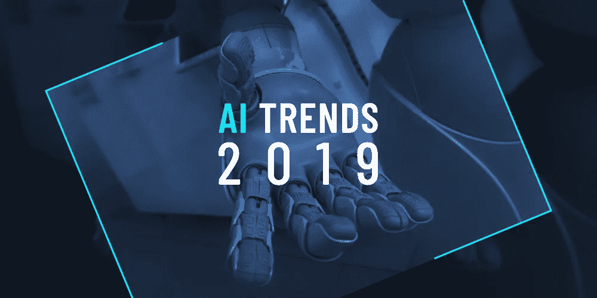
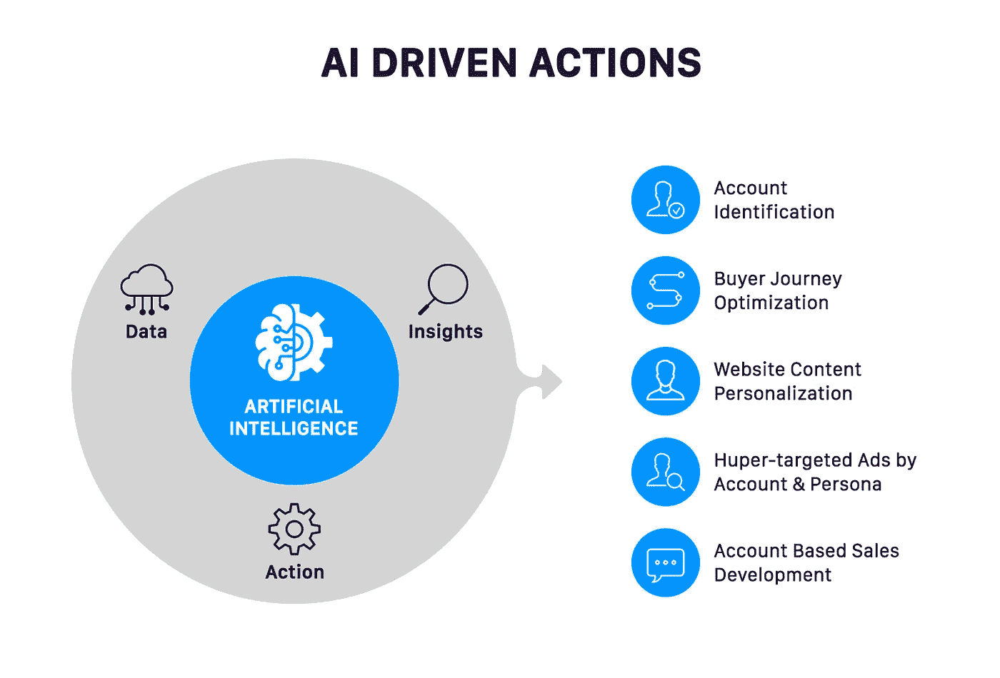
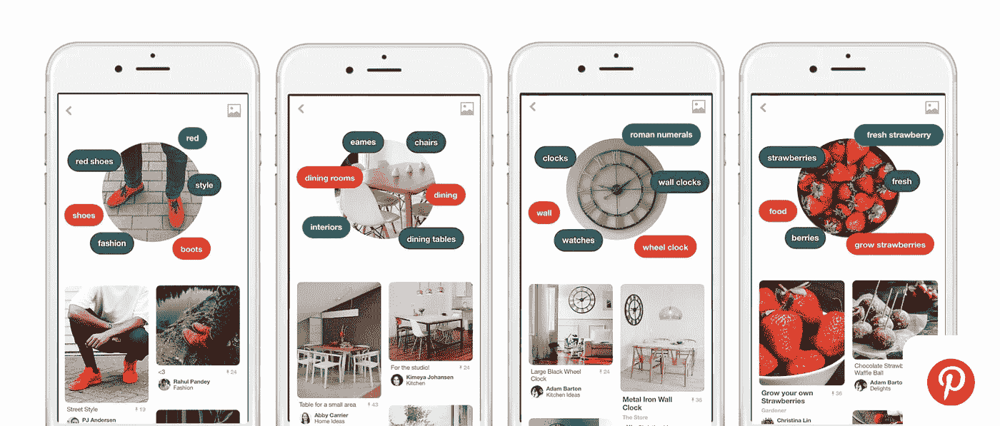
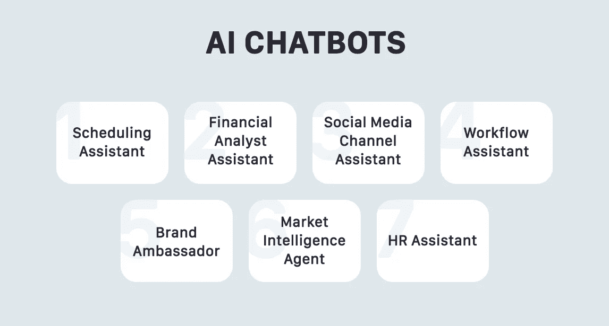
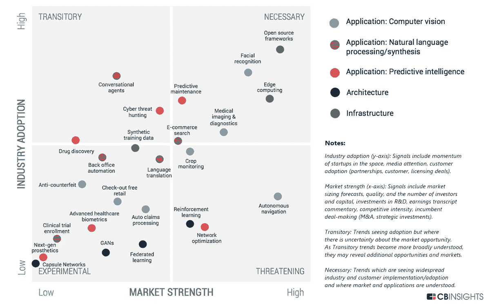

# 2019 年的人工智能趋势:我们应该期待什么？

> 原文：<https://medium.com/hackernoon/ai-trends-for-2019-what-should-we-expect-9a1034dbb8e1>

人工智能第一次被介绍到这个世界已经有很多年了。现在，这项技术不仅适用于企业，也适用于日常用户。

AI 已经成为全球所有行业的无价帮手。它能够处理庞大的数据集并将这些数据用于多种用途，这使得企业能够充分利用其性能，并为客户提供全新的服务。

我们都熟悉虚拟助手、智能家居、个性化应用和智能小工具。那么有没有办法让 AI 在未来给我们惊喜呢？阅读下面最大的人工智能趋势。

# 高级个性化

用户想要个性化，这是事实。56%的购物者[愿意](https://www.invespcro.com/blog/online-shopping-personalization/)回到网站，如果网站推荐了产品，并且个性化展示广告的点击率是非个性化广告的 10 倍。

基于人工智能的工具可以收集和处理客户数据，并在此基础上为特定的人推荐产品或服务。这对电子商务行业来说非常有价值，因为电子商务行业的一切都是围绕客户及其购物习惯而构建的。

然而，基于人工智能的个性化不仅与电子商务相关。人工智能也为如今如此流行的健身应用提供了动力。通过分析用户的习惯，该应用程序可以建议一种饮食或某些体育锻炼。因此，基本上，任何希望将个性化融入客户体验的企业都可以使用人工智能。

# 视觉搜索

这种趋势并不新鲜，但仍在发展。

去年，Pinterest 推出了[Pinterest Lens](https://about.pinterest.com/en/lens)——被称为“物品的沙赞”。镜头背后的想法是，用户可以用相机扫描任何物体，然后服务将在 Pinterest 上搜索类似的物体。

谷歌和微软等其他行业巨头也推出了视觉搜索选项，这一趋势似乎已经确定下来。

视觉搜索允许用户执行即时和高度精确的搜索。通过已经知道他们正在寻找什么样的项目，用户将收到更好的结果，将 100%符合他们的要求。这项服务适用于任何行业，但对电子商务尤为重要。

# 聊天机器人和助手

在不久的将来，虚拟助理和机器人将变得更加普遍和“智能”，将员工从回答简单问题或执行日常任务等平凡工作中解放出来。

机器人的实现大大节省了用户的时间，因为对请求的回答几乎是立即给出的。这也有助于更好的用户体验，因为客户不必等待并接收高度准确的信息。

机器人帮助人们购物，根据个人需求选择不同的服务和产品，并能够接受订单和跟踪他们的状态。至于助手，亚马逊已经推出了 Alexa 购物——我们可能会看到更多这样的虚拟助手，通过编程来完成特定范围的任务，让我们的生活变得更轻松。

# 预测分析

在现代数字世界中，一切都依赖于数据。客户数据是重要洞察的无价来源，如客户购物行为、未来决策等。

然而，预测分析不仅仅是预测你的客户下一步会买什么。在医疗保健行业，预测分析已经有助于识别疾病发展的可能性，在金融行业，预测分析用于评估借款人的可信度。

在不久的将来，预测分析将会因其给行业带来的价值而积极发展。这将有助于企业建立更加稳健可靠的战略，并大幅增加收入。

# 人工智能和移动应用程序开发:未来是什么样子的？

今天是移动开发者的黄金时代，因为移动正在获得难以置信的普及。人们已经习惯了大部分的服务和流程可以通过手机进行，而企业也必须跟随。

至于移动开发中的人工智能，技术正在变得非常广泛。一些行业领导者认为，人工智能很快将成为任何移动开发公司的必备技术，并将像云服务一样普遍。

考虑到客户对基于人工智能的服务的需求，看起来的确是这样。因此，对移动开发公司的最终建议将是:投入时间和资源在你的服务中实现人工智能，并找到人工智能如何为你带来价值的最佳方式。

**号外:** [**CB 洞察 2019 年 AI 趋势**](https://www.cbinsights.com/research/report/ai-trends-2019/)

[*纳塔利娅·库库什金娜*](https://www.linkedin.com/in/natalia-kukushkina-b62397132/)