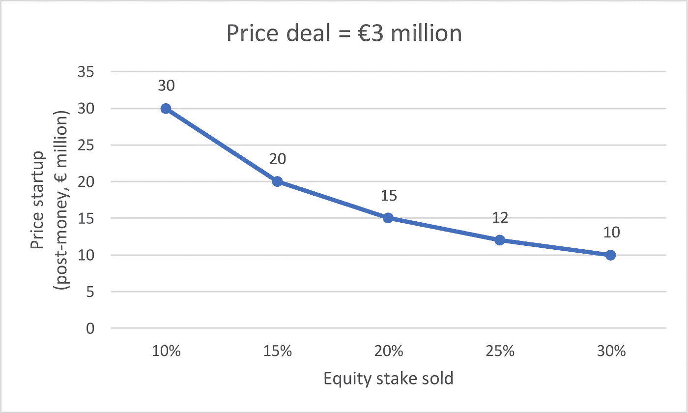
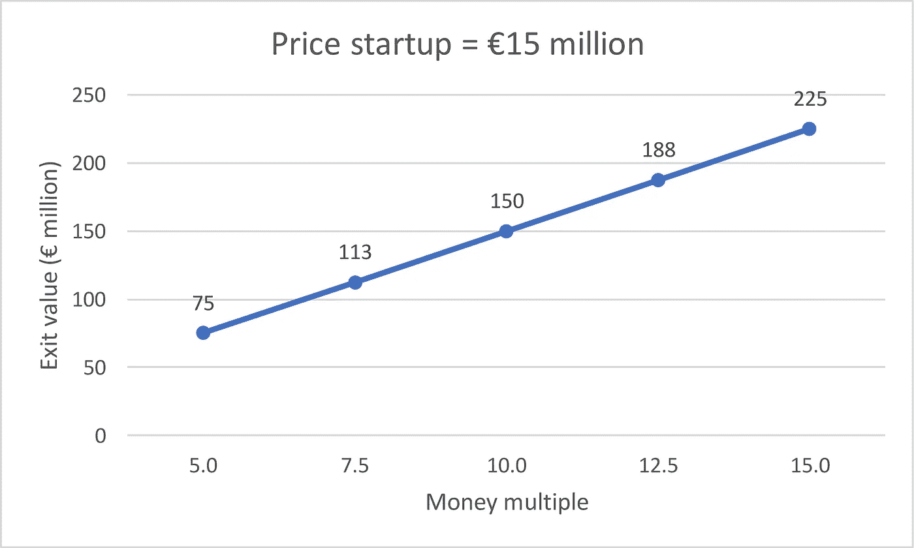
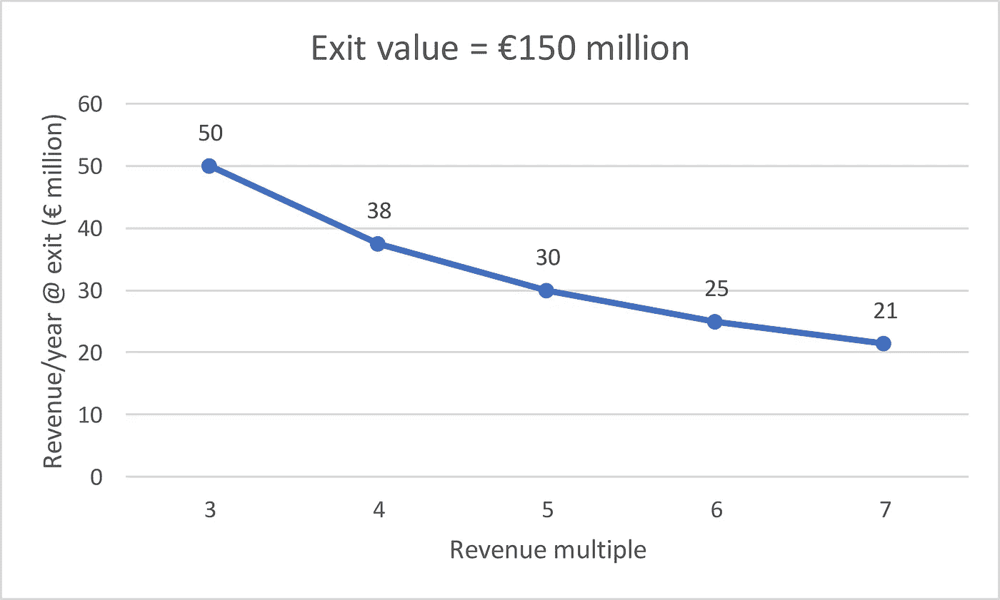

# Aifora 在€融资 300 万英镑，需要€营收 3000 万英镑

> 原文：<https://medium.com/hackernoon/aiforas-3m-raise-requires-30m-in-revenue-b226635f5e4>

德国企业软件[初创公司](https://hackernoon.com/tagged/startup) [aifora](https://www.aifora.com/?lang=en) 刚刚从 [Capnamic](https://capnamic.com/) 融资[€300 万](http://vc-startups.com/aifora-3-millionen-euro-fuer-die-revolution-des-einzelhandels)。

# 价格

基于可比交易，假设 aifora 向 Capnamic 出售了其公司 20%的股权。

启动价格=交易价格/出售的股权。

那么 aifora 的定价是€300 万/20% =€1500 万后钱。

# 出口

基于可比交易，假设 Capnamic 希望获得 10 倍的投资回报。

退出价值=价格启动*资金倍数。

那么 aifora 在€筹集的 300 万英镑需要€1500 万英镑* 10 =€1.5 亿英镑的退出价值。

# 收入

基于可比公司，假设 aifora 在退出时的交易价格为 5 倍收入。

出口年收入=出口价值/出口收入倍数。

那么 aifora 在€筹集的 300 万英镑需要€1.5 亿英镑/5 =€3000 万英镑的年收入。

*原载于 2019 年 2 月 4 日 venturevalue.com***。**