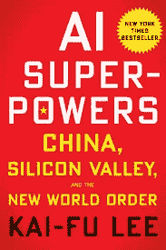
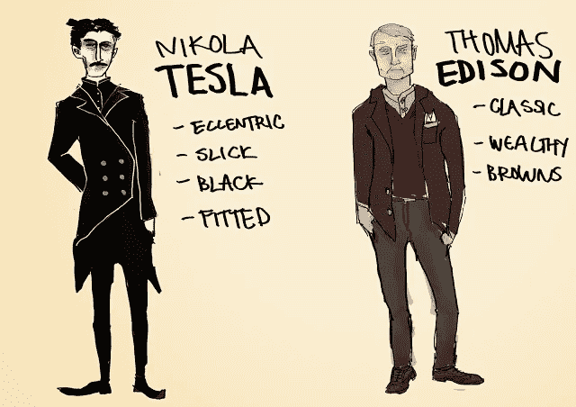
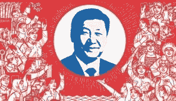

# 艾的人造卫星时刻

> 原文：<https://medium.com/hackernoon/ais-sputnik-moment-f7cb1c28f32b>

## 宿敌在换岗。现在，随着中国在人工智能领域占据主导地位，华盛顿必须小心谨慎。在中国学者李开复的新书中，他讨论了中国在人工智能未来中的作用以及美国可能的衰落

Source: Sputnik Archive (1957)

# 太空竞赛

我最近读完了出生于台湾的科技风险投资家、前谷歌中国总裁李开复的《人工智能超级大国:中国、硅谷和新世界秩序》。在这篇文章中，拥有卡内基梅隆大学计算机科学博士学位的李开复讨论了几个世纪以来，中国如何追赶其技术更先进的竞争对手美国和俄罗斯，最终赶上了他们；并且，很快，将会在人工智能的竞赛中领先。从美国和苏联在 20 世纪 50 年代开始的“太空竞赛”中获得叙事灵感，苏联成功将 Sputnik 1 号送入轨道，给了美国所需的“踢屁股”,以击败俄罗斯获得最终奖项，即 1969 年的阿波罗 11 号登月。

Kai-Fu Lee’s book, a great read

# 独特视角

这位作者的观点非常独特，也很有见地:他的生活跨越了两个非常不同但相似的世界:他在硅谷和中国商界都担任过高层职位，与北京方面密切合作，给他带来了别人没有的洞察力。

> 中国的人工智能革命既令人震惊又有趣，改变了人类活动所有领域的生活。

# 人造卫星时刻

李开复在书中称之为“中国的史泼尼克时刻”，描述了中国最伟大的围棋选手柯洁被谷歌 DeepMind 的 AlphaGo 击败的那段时间。这明确地证明了人工智能潜力的范围和规模，以及李开复如何设想中国将成为全球人工智能技术的下一个大玩家，并最终成为卓越的力量。

> 这只是时间问题。

然而，他认为这一切都有一个附带条件

由于美国和其他领先国家已经在人工智能领域取得了大部分重大创新，作者认为北京不会在这个领域取得成功。他把这归结为中国公司如何并且将能够实施这样的技术。他认为，归根结底，重要的是实施，而不是创新。李推测，中国将在这方面占据主导地位。

# 无情和超竞争力

李开复认为，中国计算机科学家的优势之一是，已经有相当数量的人工智能研究工作可以在网上轻松获得，因此他们可以简单地利用人工智能领域的资源，在国内进一步开发人工智能技术。他认为在未来几年对中国很有帮助的另一个特点是，在商业方面，中国的残酷无情和超竞争性。中国人也不像西方人那样担心自己的隐私问题，这将使北京方面能够进一步发展监控技术，而不会受到普通民众或政治对手的抗议或社交媒体批评的干扰。

> 然而，人们可能会认为，政客们自己的私生活永远不会受到这种审查。

# 发展受阻

C 中国有能力复制、犯错和重复这个过程，直到他们在任何商业或技术领域提出一个令人满意的工作模式，这正是在实施过程中获得成功所需的平衡。如果他们可以用人工智能做到这一点，那么胜利者已经为人所知。

*美国可以被归类为人工智能世界的尼古拉·特斯拉，所有的创造力和艺术性；而中国是永远固执的托马斯·爱迪生，有毅力和纯粹的决心。*

AC vs DC. Source: Quora

中国的商业态度在许多方面都很有效，但同样效率低下，很容易想象它将能够在许多技术发展领域实现人工智能系统。此外，在过去的几十年里，城市的快速发展导致了前所未有的农村人口迁移，中产阶级对服务产生了巨大的需求，如果技术以正确的方式实施，人工智能可以满足这些需求。

中国过去在技术进步方面的停滞发展是另一个优势，它可以在未来在人工智能方面超越美国。这一点的证据可以从中国如何全面采用数字支付系统中看出来，而西方社会在某些情况下仍在使用过时的技术，如卡支付系统，甚至是过时的支票。

> 这当然也适用于人工智能。

此外，中国的规模，无论是从人口数量还是从该国人口中的用户数量来看，都意味着它拥有规模优势，这意味着它可以从人口中挖掘的数据要比竞争对手多得多。中国的人口刚刚超过 14 亿，远远超过欧洲和美国(不包括俄罗斯)的总和，后者的人口略高于 10 亿。

*再次，明显的优势。*

# 政府支持

这对中国政府、企业家和人工智能开发者来说无疑是一个福音，他们也得到了 XXX 的支持。北京对未来有很大的想法，并希望其人工智能的发展远远超出华盛顿的范围和能力。这种积极的态度，一种不怕承担风险来实现目标的态度，对中国的软件公司和创业公司来说都是一件好事。

China’s Great Leader, XXX. Source: hongkongfp.com

## 李开复认为，中美之间的人工智能竞赛必须考虑几个因素，我们将简要阐述这些因素:

*人工智能有四个最重要的领域，它们是:*

## 在互联网上:

第一个是 Web AI，也称为互联网 AI，它基本上跟踪和追踪一个人在互联网上搜索的内容。这是人工智能最广泛和最基本的形式，在美国和中国都已经得到了很好的发展，但在不久的将来，中国可能会略微超过美国人。

## 在商业领域:

相比之下，商业人工智能是一种允许企业利用其获得的数据，根据人工智能数据做出深思熟虑的决定，然后允许公司提前计划的人工智能。在这里，作者感到遗憾的是，中国远远落后于其竞争对手，但可能在未来几年内获得牵引力，尽管在整体发展方面仍落后于华盛顿。

## 在面部识别中:

下一个是面部识别功能和通用计算机视觉(CV)，属于感知人工智能的范畴。作者认为中国在这方面略微领先于美国，并且在未来几年将遥遥领先。*对华府来说不是好兆头。*

## 在自主人工智能中:

最后是自主 AI。这种人工智能指的是我们在生活中可以与之互动的东西，高端形式的人工智能，例如，无人驾驶汽车或其他形式的具有*“某种程度的独立或自主”*的技术。李声称，至少目前，中国在这方面远远落后于美国，但按照目前的发展速度，将来会与美国平起平坐。

这对美国人来说不是好消息，因为没有其他国家有能力实现这种增长。五年后，中国至少会与最聪明的人工智能技术在一个公平的环境中竞争，谁知道会发生什么。

# 未来的可能性

然后，他继续详细讨论了中国将如何很快引领人工智能技术的应用和使用，他认为，至少从个人的角度来看，这些技术对中国经济的整体增长和社会的进步更有效。他的意思是，深度思考人工智能的正确应用，就像指定的自主类型一样，可以改善法律系统，改善中小学生的教育体验，帮助医生进行医疗诊断，以及管理城市和其他城市群的交通和物流服务。

# 红旗

他指出，服务业这种明显演变的一个危险信号，可能是当前工作模式和劳动力市场实践的彻底崩溃和瓦解，创造出一个失业且漫无目的的社会。然而，并不是每个人都会受到影响，就像今天的世界一样，参与开发人工智能深度思维系统的企业家和商人会为自己制造私人财富，这反过来会使他们与其他人疏远。

> 所以总会有贫富之分。技术不会消除这一鸿沟。

Source: sociable.com

**仍然会有超级富豪。过着迷人的生活。远离我们其余的人，平民——这一次不要努力工作，因为我们不会有任何工作。**

> 不幸的是，人工智能永远不会改变这一点。

无论如何，如果你想在技术层面上了解中国的命运，特别是在人工智能方面，以及美国如何有一条咄咄逼人的龙在它的背上，*人工智能超级大国:中国，硅谷和新的世界秩序*是必读书。

我只能说我强烈推荐它。