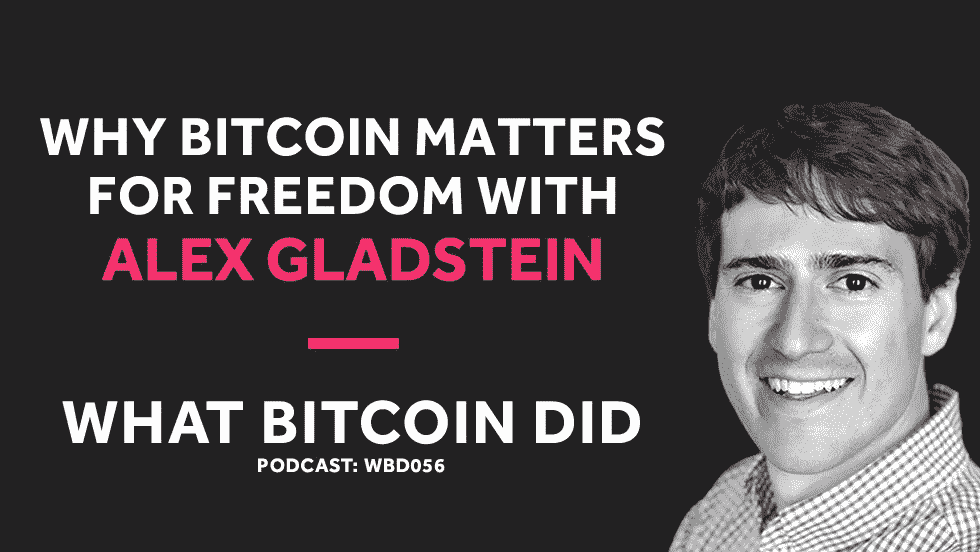

# 亚历克斯·格拉德斯坦谈比特币对自由的重要性

> 原文：<https://medium.com/hackernoon/alex-gladstein-on-why-bitcoin-matters-for-freedom-63b31e79a40e>

## 音频采访转录— WBD056

***注:*** *以下是我采访人权基金会首席战略官 Alex Gladstein 的文字记录。我从翻译中使用 Rev.com，他们删除了嗯，错误和半句。我已经检查了转录，但如果您发现任何错误，请随时发送* [*邮件给我*](http://hello@whatbitcoindid.com) *。可以* [*在这里*](https://www.whatbitcoindid.com/podcast/alex-gladstein-on-why-bitcoin-and-decentralised-technology-matters-for-freedom) *听原声录音。*

*你可以在这里订阅播客* [*听所有剧集*](https://www.whatbitcoindid.com/podcast/) *。*

在这一集里，我采访了人权基金会的首席战略官亚历克斯·格拉德斯坦。我们讨论了比特币和加密货币如何在专制政权下增加自由，以及 Dem 技术如何导致加密投资浪潮。

联系比特币做了什么:
听:[**iTunes**](https://itunes.apple.com/gb/podcast/what-bitcoin-did-podcast-bitcoin-crypto-trading-strategy/id1317356120?mt=2)|[**Spotify**](https://open.spotify.com/show/0mWUJuONiilW5JSBBFZ0s7?si=5qcbjpjYSRyKpi8wycEZUw)|[**Stitcher**](https://www.stitcher.com/podcast/what-bitcoin-did)|[**SoundCloud**|](https://soundcloud.com/what-bitcoin-did)[**YouTube**](https://www.youtube.com/whatbitcoindid)|[**TuneIn**](https://tunein.com/radio/What-Bitcoin-Did-p1079869/)关注: [**网站**](https://www.whatbitcoindid.com/)

# **采访记录**

**面试日期:2018 年 12 月 6 日星期四**

> **“很多对比特币的驳斥、批评和攻击来自那些享受稳定金融体系的人。”**
> 
> **—亚历克斯·格拉德斯坦**

**彼得·麦科马克 **:** 晚上好，亚历克斯，你好吗？**

**亚历克斯·格拉德斯坦(Alex Gladstein)**:**我很棒，谢谢你邀请我。**

**[**彼得·麦科马克**](https://twitter.com/PeterMcCormack) **:** 嘿，谢谢你的到来。我过去听过几次你的采访，我觉得它们很吸引人。很高兴和你聊天。关于做我的研究的一件有趣的事情是，我可能相当天真地认为人权基金会在几年前就已经成立了，只是当我做研究和准备时，它实际上与委内瑞拉有关。我认为这将是一个很好的亚历克斯…一个好的开始方式是你只给你的背景。如何成为人权基金会的首席战略官？你的任务是什么，你的主要活动是什么。是啊，这是个很好的开始。**

**[**亚历克斯·格拉德斯坦**](https://twitter.com/gladstein) **:** 确定。从某些方面来说，人权基金会是一个非常关心权力下放的组织，我会为你解释的。基本上，这是一个组织，一个非盈利性的组织，它观察世界各地政府的结构，发现高度集权政府的弱点或问题。在全球 90 多个国家。对数十亿人来说，权力掌握在一个人或一小群人手中。准确地说是 93 个国家和 40 亿人口。在社会中，你真正考虑的是科学成就、专利率和创新，或者你是否关心福利、正义、识字率、预期寿命和产妇健康率，或者你是否关心。即使是和平与战争，也没有两个自由民主国家互相争斗。**

**[**亚历克斯·格拉德斯坦**](https://twitter.com/gladstein) **:** 我们只是相信，无论你想称之为分权治理还是自由民主，都有巨大的价值，这取决于你。基本上，治理系统中的人们被规则而不是统治者统治。这是我们的一个非常特殊的使命，我们基本上是威权主义的学生，我们研究它如何运作，以及我们如何能帮助生活在这些政权下的人们。从古巴政府统治下的人民到津巴布韦、缅甸、朝鲜、中国、俄罗斯。不幸的是，它们太多了，遍布世界各地。但是我们真的采取了一种特殊的策略，我们想出了如何帮助那些生活在没有新闻自由和独立司法的地方的人们。在他们不能雇佣人权律师或去当地非营利组织保护他们的地方，无论你是在努力促进劳工权利还是在努力拯救环境，或者是试图揭发一名当地政客的腐败行为，在独裁统治下你都做不到这一点。这是没有机制的。在那里你可以安全地做。**

**亚历克斯·格拉德斯坦 **:** 如果你看看法国过去几天发生的事情，你会看到一场大规模的人民力量运动，这场运动将导致联邦政府政策的改变。这在独裁统治下是做不到的，所以我们只需要想一想我们的社会结构，并意识到其中一些比其他的更加集权，我真的认为并相信，如果你把前 20 名最突出的独裁或专制或集权社会放在一起。前 20 名是最分散的，民主的，几乎任何你作为一个人想要的东西，你宁愿在一个自由的社会里。我认为这是我们工作的重点和基础。2007 年，我以实习生的身份开始了在人权基金会的旅程。当时我在英国议会工作，实际上是作为自由党的研究助理，在自由党影子外交大臣周游世界时为他做一些简报和论文。**

**亚历克斯·格拉德斯坦 **:** 我申请了纽约市人权基金会的一份工作。当时大约一岁，我得到了这份工作。我去了纽约市，我的第一个任务是把装满外界信息的背包放在一起，我们要把它们送给古巴地下图书馆运动。基本上，当时和今天在很大程度上，古巴的所有信息都由共产党控制。如果你想要一本书或一部电影，必须得到他们的批准。我们决定以一种好的方式挑起一些麻烦，并通过可以自由前往古巴的拉丁美洲人、技术和媒体让他们了解外面的世界。例如，它可能是 V 的配音版，比如《深仇大恨》或《勇敢的心》之类的。他们实际上会看这些电影，在人们家里的小讨论小组里读这些书，然后谈论它们。你知道这是在 89 年。**

**[**亚历克斯·格拉德斯坦**](https://twitter.com/gladstein) **:** 这后来发展成为现在的[听不清 00:04:55]系统，他们有一种方法，一些古巴人会安装一个卫星天线，非法下载内容，把它放在硬盘上，然后在附近分发，人们会从上面下载他们想要的东西，这就是它的发展过程。当时，人们似乎完全依靠从古巴境外带来的东西来了解正在发生的事情。这是我的第一次经历，我发现它真的很强大，真的很感人，很有创意，我决定全职为他们工作。那年夏末，我得到了一份工作，从那以后，我一直为他们做各种各样的项目。2015 年，我被任命为首席战略官，现在我负责领导我们的发展方向，如何发展，如何筹集资金，建立新的合作伙伴关系，以及我们的媒体和公共宣传战略。**

**[**彼得·麦科马克**](https://twitter.com/PeterMcCormack) **:** 古巴经常被浪漫化，尽管它是共产主义的一种好形式。**

**[**亚历克斯·格拉德斯坦**](https://twitter.com/gladstein) **:** 是的，我会说这是典型的被两类人浪漫化了。古巴的统治者是盗贼，基本上是当权的小偷和没去过古巴的人。他们喜欢浪漫地幻想这是一个每个人都有免费医疗和住房的好地方。这是一个最近爆发霍乱的国家，在那里你被逮捕或者说出你的想法或者在墙上画一些政府不同意的东西。这是一个拥有非常糟糕的医院基础设施的国家，事实上，如果你去阅读、观察和研究它。真的是一个非凡的洗脑系统，人们很难了解外面的世界，我认为人们真的被束缚在那里，这是一件可悲的事情。如果你真的想一想，最近有多少世界级的公司或发明或拯救生命的疗法出自古巴。很少。真正聪明的古巴人不得不离开。**

**亚历克斯·格拉德斯坦 **:** 有一种叫做人才流失的东西，大多数独裁政权都会发生。在这个暴虐的社会里，人们逃离是因为他们不能锻炼自己，不能表达自己，不能做他们想做的事情。他们最终会去别的地方。我认为像西班牙和美国这样的国家在很多方面都从中受益。一些最聪明的古巴人已经离开，把他们的果实奉献给了其他地方的社会。**

**[**彼得·麦科马克**](https://twitter.com/PeterMcCormack) **:** 切·格瓦拉老师他们真的只是一个伟大的宣传吗？**

**[**亚历克斯·格拉德斯坦**](https://twitter.com/gladstein) **:** 耶。切·格瓦拉是一个杀人犯，一个恐同者，一个把人关在战俘营里的人。每当我看到穿 Che 衫的人，我都会感到惊讶。我想我明白他们在说什么，但这对所有被他和他的革命杀害的人来说是可怕的无知和非常无礼的。HRF 想做的事情之一是在独裁民主的领域做大量的公众教育。我们确实在主流媒体上发表了很多文章，我们也做了很多宣传活动，试图把独裁、腐败和独裁主义的问题放到像 ESPN、早安美国、公告牌、人物甚至干草叉和音乐杂志上。我们试图让这个问题引起那些通常不考虑基本人权和自由的人的注意。这是我们战略的重要组成部分。**

**[**彼得·麦科马克**](https://twitter.com/PeterMcCormack) **:** 现在委内瑞拉的情况与古巴的情况有多相似？**

**[**亚历克斯·格拉德斯坦**](https://twitter.com/gladstein) **:** 嗯，我的意思是说，看起来有明显的相似之处，因为都有一个独裁的权力结构，这是非常不同的。我的意思是，委内瑞拉是一个著名的国家，当整个大陆都是独裁政权时，它是拉丁美洲人的避难所。人们纷纷逃离那里，委内瑞拉是一个值得骄傲的地方，人们可以在这里寻求自由国家的庇护。这已经变成了完全相反的情况，根据联合国的数据，现在每天逃离委内瑞拉的委内瑞拉人比逃离叙利亚的叙利亚人多。数百万委内瑞拉人离开了委内瑞拉，现在作为难民生活在拉丁美洲的其他国家。这真的很令人难过，这是可以避免的吗？大概吧。2000 年，乌戈·查韦斯从一开始就留下了一些非常明显的迹象，表明他将建立一个独裁政权。**

**亚历克斯·格拉德斯坦 **:** 我的意思是关闭媒体，没收他不喜欢的人的财产，充实他的家庭，进行大腐败，基本上寻求与其他独裁政权结盟，如伊朗和俄国，将司法和议会而不是议会与他自己的亲信堆在一起。这一切都在发生，世界大基本上做得很少。甚至其他人权团体和机构组织也对委内瑞拉的侵犯人权行为保持沉默，直到查韦斯执政后期。人权基金会成立的另一个原因是什么？我们的创始人是一位委内瑞拉的活动家，名叫托尔·哈尔弗森，他目睹了这一切的发生，但没有人真正为此做些什么 2004 年，2005 年，2056 年，他决定创建一个组织，明确关注封闭和封闭的社会。**

**亚历克斯·格拉德斯坦 **:** 要么是彻头彻尾的独裁，要么正在经历某种民主侵蚀。再一次，这影响了我们的很多想法，即权力平衡、权力分离和健康的公民社会对人类来说是多么好的事情。**

**[**彼得·麦科马克**](https://twitter.com/PeterMcCormack) **:** 查韦斯之所以能够夺取政权，是因为他的社会政策吸引了工人阶级和民众？**

**[**亚历克斯·格拉德斯坦**](https://twitter.com/gladstein) **:** 当然是的。他非常受欢迎。他绝对是一个平民主义者。只是当你将民粹主义与开始瓦解国家规则和规则集的能力混合在一起。那会立刻变得危险。有一个民粹主义者掌权是一回事，他受到宪法或独立的最高法院或立法机构的制约，当他违反法律时，可以挑战和制约并调查他。但在查韦斯的例子中，他将民粹主义与逐渐发展的威权主义混合在一起，这种威权主义在他去世时变成了彻头彻尾的威权主义。**

**[**彼得·麦科马克**](https://twitter.com/PeterMcCormack) **:** 有没有关于这个国家将如何以及为什么从民主社会转变或迁移到专制社会的模式的研究？它真的只是归结于渴望权力的个人吗？**

**[**亚历克斯·格拉德斯坦**](https://twitter.com/gladstein) **:** 双方都有大量的奖学金。在 80 年代、90 年代和 2000 年初，出现了令人难以置信的民主化浪潮。从葡萄牙到韩国，再到非洲、亚洲和拉丁美洲的许多地方，到处都在变得民主化，他们正在摆脱专制主义和殖民主义的枷锁，走向独立。你可以看到这样的遗产，事实上现在世界上有几十个国家，基本上接近一半的人类生活在某种自由民主制度下。与此同时，在 2000 年左右，你开始看到事情开始向另一个方向转变，开始有点停滞不前。你看到了像土耳其的埃尔多安、俄罗斯的普京和委内瑞拉的查韦斯这样的机会。那些在开始时或多或少自由和公平选举出来的领导人，他们很受欢迎，有机会引导他们的国家走向自由和公平的方向，却走上了另一条路。通过一系列的腐败，十年来的策略巩固了权力。**

**亚历克斯·格拉德斯坦 **:** 最近，你会看到民主在菲律宾、孟加拉国等地倒退。这些非常非常大的国家。泰国最近发生了军事政变。那真是令人沮丧。你已经看到接近…在这些国家，我刚刚提到在过去十年中有 10 亿人在倒退，这当然非常令人担忧，但我们知道有相当多的研究表明为什么以及如何发生这种情况。如果我们希望看到更多的自由社会真正制约政府权力，那么对付民主侵蚀的最佳解毒剂，甚至是我认为最好的工具。当你想到你鼓励立宪主义和宪法。当你鼓励公民社会和自由媒体时，这些事情比选举重要得多。所有独裁者都有某种形式的选举。所有政府都是如此。当你谈论自由和公平的选举时，你只有在打好基础后才能真正实现。**

**亚历克斯·格拉德斯坦(Alex Gladstein)**:**我们研究了很多其他的东西，不一定是选举，而是像言论自由这样的东西。开设非营利或独立媒体渠道的能力。调查政客和腐败的能力。这些其他权利和自由真的很重要，它们是构成一个开放社会的基础。**

**[**彼得·麦科马克**](https://twitter.com/PeterMcCormack) **:** 好吧。我会说，在英格兰长大，我已经离开了一个非常优越的生活，我会说，我认识的很多人都知道，他们关注着新闻。他们知道不同的事情正在发生，但我要说他们更清楚像朝鲜这样的极端例子。对于生活在独裁统治下，人们真正不理解的是什么，我们有什么样的基本人权，而这些国家的人民却没有。**

**[**亚历克斯·格拉德斯坦**](https://twitter.com/gladstein) **:** 好吧，我会给你一个石蕊测试的想法，然后我想让赛格威进入另一个话题，我想我会在钱的问题上帮助我们。这样想想，你们国家能不能有一个大赦国际组织。如果你能，这标志着一个重要的…在一个重要的层面上，你有某种开放的社会。如果你能管理一个批评政府、争取更多自由的人权组织，并且你以公开运作、筹集资金、在该国首都的办公室工作的方式开展活动，这实际上是一个很好的试金石，可以检验哪些国家是自由的，哪些国家不是，谁在当地有大赦办公室。另一个有趣的问题是，在哪里你可以合法地进行骄傲游行，而不用担心被打得屁滚尿流。不管它是什么样的独裁政权，也不管独裁政权信仰什么宗教。不管是乌干达、俄罗斯、中国、古巴还是土耳其，不管是基督徒还是穆斯林还是其他什么。这其实并不重要。**

**[**亚历克斯·格拉德斯坦**](https://twitter.com/gladstein) **:** 独裁政府不管出于什么原因都爱拿同性恋者当替罪羊。当你看到骄傲游行时，你可以这样想。在哪些国家你可以进行骄傲游行，这也很好地符合了什么是开放社会，什么不是。我确实认为人们不会真的考虑太多的钱，我认为这对我们来说是一个很好的赛格威。当我们谈论历史的时候，我们谈论了很多关于政教分离的问题。我们并不经常谈论州内的资金分离。当你想到像挪威这样的民主国家，金钱和国家有着很强的分离。决定我们如何印钱和印更多钱，以及货币政策将会如何的人，并不是坐在行政部门的同一批人。实际上这很重要。在所有的独裁和专制制度中，独裁者或掌权的一群人，寡头政治决定货币政策。**

**[**亚历克斯·格拉德斯坦**](https://twitter.com/gladstein) **:** 这实际上是一件非常重要的事情，它又一次帮助我们将这个世界划分为集权程度的不同层次。**

**[**Peter McCormack**](https://twitter.com/PeterMcCormack)**:**在准备过程中，我看了你的其他一些采访，你谈到的一点非常有趣，你几乎解释了我们正处于人类历史上的这个关键时刻，这是中央集权与大规模监控路径之间的斗争，然后还有另一条路径，这是一条未知的路径，一条权力从政府手中被夺走的未知的分权路径。这有某种…如果我有比特币和其他技术，就像现在有这些路径在战斗，你怎么看？**

**[**亚历克斯·格拉德斯坦**](https://twitter.com/gladstein) **:** 我想提醒一下，不要把去中心化的选择视为某种程度上的无政府主义或自由主义乌托邦式的东西。我认为这些分散的技术更像是对监控状态的一种检查。我相信像比特币、IPFS、去中心化的互联网接入、零知识加密这样的技术。我并不把它们看作是通向某种怪异的无政府主义和完全自由主义社会的途径，我把它们看作是防止大规模监控国家和制衡政府权力的途径。我认为大多数人，不管他们的意识形态如何，都应该在某种程度上理解，由一个团体、一个势力、一个政府或一个合作机构来控制我们所有的数据、她的所有资金和我们所有的信息，确实是有问题的。作为公民，我们应该为保留对此的控制而斗争。也许不能完全控制，但可以控制一些。**

**[**亚历克斯·格拉德斯坦**](https://twitter.com/gladstein) **:** 对我们数据的一些控制，对谁能看到我们的位置数据和健康数据之类的东西的一些控制。对生活在独裁统治下的人们来说，真正关键的是对我们金钱的控制。**

**[**彼得·麦科马克**](https://twitter.com/PeterMcCormack) **:** 大规模监控在威权政府下运作，但也在民主下运作，对吗？两者有何不同？说说我们在美国国家安全局的经历，以及你在中国会经历什么？**

**[**亚历克斯·格拉德斯坦**](https://twitter.com/gladstein) **:** 我有一个朋友史蒂夫·沃特豪斯来自兰花实验室，他总是在他的家乡谈论伦敦可能是世界上监控最严密的城市。我想那是对的。几乎每个国家都有某种复杂的监控状态。只是有多先进的问题。不同的是，一些国家有人权，而另一些国家没有人权。你的政府能利用监视状态来惩罚政治反对派吗？好吧，在英国没有。几乎没有。在美国也没有。然而在中国肯定。这就是你要开始思考的方式。许多向中国出售监控技术的公司也在向西方国家出售监控技术。每个人都像大红色按钮一样建造。只是你多快能按下去的问题。在一个独裁国家，你已经可以按下那个按钮了，没有。没有…我们谈到了金钱和国家的分离，在中国没有技术和国家的分离。从字面上看，共产党开始控制这些公司。**

**亚历克斯·格拉德斯坦(Alex Gladstein)**:**像 10 cent right 这样的大公司以及所有的电信公司都是如此。在美国，我们既有隐喻上的分离，也有地理上的分离。硅谷和华盛顿相距 3000 英里。真的，那很有帮助。左边是埃隆·马斯克、扎克伯格以及谷歌和微软的所有人，右边是 DC 的所有政客。这种分离可能有点健康。我当然不认为让政府，本质上是一个中央集权的政府来控制所有的技术是一个好主意。这似乎是一个灾难的处方。**

**[**Peter McCormack**](https://twitter.com/PeterMcCormack)**:**尽管政府仍有可能利用区块链技术进行监控。具有讽刺意味的是，在比特币最初被视为匿名的地方，你现在可以追踪区块链，所以你可以用它追踪人们。有没有政府使用加密或分散技术或区块链技术的例子？**

**[**阿历克斯·格拉德斯坦**](https://twitter.com/gladstein) **:** 是的，让我们实际上分解一下。我认为这对我们的目的是有用的，我认为只是为了教育的目的，当我们谈到语义学和我们使用的词语时，应该更具体一点。我参加了很多活动，人们都很喜欢区块链·克罗珀，不管怎样。我真的不知道他们在说什么。当有人说 crypto 时，那是什么意思>他们是在谈论密码学、加密货币吗？一般来说，他们在谈论加密货币，但它是某种虚构的加密货币，但它是某种虚构的加密货币。不是具体的一个。当他们谈论区块链时，他们通常指的是比特币区块链的某些方面，也许是可变性和透明性，但与他们梦想的其他东西结合在一起。我真的认为我们从学术的角度来看待这个问题，并且具体一点，是健康的。谈到比特币区块链，是的，我认为它在目前的状态下非常有用，因为它允许人们以一种大规模金融监控非常困难的方式进行交易。**

**[**亚历克斯·格拉德斯坦**](https://twitter.com/gladstein) **:** 例如，我是美国政府，我可以拿起电话打给美国银行或任何这些大型银行集团。三十几个和美联储有关系的人。我可以这样说，“嘿，我不喜欢彼得，让我们确保钱不会进入他的账户。”这是审查制度，这种事情经常发生。比特币不可能做到这一点。不仅有审查阻力，共谋不会导致你不能接收某人的交易，而且还有这种程度的反监视，因为追踪真实世界的身份到比特币区块链很昂贵，这当然是可行的，但不便宜。你必须使用链式分析，这既费时又费钱。从法律角度来看，这当然是可行的，在这种特殊情况下，你试图追踪这些钱去了哪里。当你开始谈论 10，00，50，000，100，000 个比特币钱包时。那会非常非常困难。我喜欢把它想成是一种保护机制，来对抗……非法的大规模金融监控。**

**[**亚历克斯·格拉德斯坦**](https://twitter.com/gladstein) **:** 我也喜欢它作为一种保护机制，对抗针对持不同政见者和其他人的针对性审查。不管是人权非政府组织还是别的什么。弗拉基米尔·普京可以关闭一个非政府组织的银行账户，但他不能阻止他们接收比特币。伊朗政府可以监控与反对派有关的某些人的银行账户，并在他们的家人有一定资金流入时冻结账户，但他们无法阻止他们接收比特币。我觉得在这方面还是挺有革命性的。现在，其他不是大币的 blocks chain 技术怎么用来对付人？我想在很多方面。当你开始引入区块链的概念，它有一个后门，在某种程度上是集中的，记录可以事后编辑，那么你会让政府非常兴奋。你有 Petro，世界上第一个国家 ICO 可以说是在委内瑞拉。这是不可操作的，但你可以看到他们想做什么。**

**[**亚历克斯·格拉德斯坦**](https://twitter.com/gladstein) **:** 他们的目标是希望他们在想，让我们挺过去，但利用这一点，我们可以跟踪所有的钱，并在我们需要时冻结它们。伊朗人、沙特人和中国人都将在未来一两年内做出类似的事情。我们谈论的是完全可监控、可追踪、可冻结的国家加密货币。这就像独裁者的春梦。当我谈到区块链时，我们真的需要把我们正在谈论的东西分开。真的归结为有没有后门。对人们说[听不清 00:25:34]，我认为这是一个非常令人兴奋的项目。我认为你可以对这个领域的许多不同技术持开放态度。我认为比特币是民权活动家应该感到非常兴奋的一种货币。我认为这是一件值得关注的事情。**

**[**阿历克斯·格拉德斯坦**](https://twitter.com/gladstein) **:** 我们能不能有一个相对分散的稳定的硬币，人们可以在没有政府干预的情况下使用和互动。我和该领域的几位专家谈过，他们基本上说，政府没有真正明确的方法来阻止和进行一项死亡交易。太酷了。这才是有趣的地方。当我们谈论区块链和权力下放时，未来肯定会有很多市场金融智能合同创新，对房地产等领域有用，我的意思是，谁知道呢。我对抵制审查感兴趣，因为我是一名人权活动家。我有兴趣帮助那些生活在破碎的金融体系下的独裁和专制政权下的人们，在这样的体系下，如果没有严密的监控和审查，他们就不能自由地互动和交易。**

**[**Peter McCormack**](https://twitter.com/PeterMcCormack)**:**有几件事我想先解开，我想后退几步。首先，你是如何看待这两个比特币地址的制裁的？这看起来有点傻，因为你可以把东西弹来弹去。在我看来，这几乎是美国政府能够感知比特币的唯一方式……地址受到了制裁。你对此有什么看法？**

**[**亚历克斯·格拉德斯坦**](https://twitter.com/gladstein) **:** 我认为它向你展示了，至少现在比特币是一项技术，如果政府在进行司法调查、欺诈和腐败，它实际上是有用的。一般来说，如果你现在想通过比特币洗钱，大额洗钱，我会说这不是一个好主意。看起来当你最终把他们的钱转移到其他资产类别时，你可能会被抓住。它向你展示了至少现在它实际上是一种政府可以用于特定调查的简洁工具。我再次认为这使得广泛的金融监控变得不切实际，这很酷，但就目前的形式来看，它还不是一项真正的隐私技术。我相信在接下来的几年里，它将会成为一种隐私技术，无论是在链上还是通过用户技术钱包，第二层技术。现在，政府可以用它来追踪大规模的犯罪行为。这可能是件好事。**

**[**亚历克斯·格拉德斯坦**](https://twitter.com/gladstein) **:** 当你谈到这两个被追捕的家伙时。我的意思是，显然，他们只是没有真正练习良好的操作安全性。你不必使用同一个地址……很明显，你不应该每次都使用一个地址进行很多很多很多的交易。如果你说的是生活在专制或受压迫社会的人。是的，我们要好好教他们[听不清 00:28:34]。那对我来说是明显的。否则，人们会被抓住的。我和一些委内瑞拉人交谈，他们在我至少不知道的空间，或者他们不知道是否有人在委内瑞拉被链条分析逮捕了。据我们所知，委内瑞拉政府还没有这样做。但是中国政府做了吗？我不知道。美国政府在做吗？绝对的。我认为这只是关于政府有多精明和投入多少资源的问题。**

**Alex Gladstein**:**无论如何，伊朗的惨败给我们的教训是，持不同政见者、活动人士和记者在使用比特币等技术时，必须好好观察。第二，就目前的形式而言，比特币似乎可以防止合法的监控，但实际上可能有利于国家对特定案件进行法医调查。**

**[**Peter McCormack**](https://twitter.com/PeterMcCormack)**:**你会支持比特币基础链的完全隐私，因为并不是每个人都会……就像我曾经交谈过的一些人一样，他们认为这可能是下一场内战，但类似于严厉的工人。不是每个人都想要完全的隐私，有些人会喜欢你可以在区块链上追踪一切的事实。**

**[**亚历克斯·格拉德斯坦**](https://twitter.com/gladstein) **:** 有些人确实如此，但那些人并没有生活在独裁统治下。我将比特币视为一种解放工具，而不是为居住在旧金山和纽约的人们提供便利。我们有一个运转良好的金融体系。我认为它是生活在破碎的金融体系和压抑的腐败环境下的人们的解放工具。我希望它成为一枚隐私硬币。但也可能不是。你说得对。这显然是整个比特币生态系统的共识，所以我们真的无法知道。但我要说的是，似乎很多核心开发者和持有大量比特币的人以及非常关心比特币的人确实关心隐私，关心权利和自由，如果在未来几年内，如果链上私人交易成为可能，我会再次感到震惊。**

**[**彼得·麦科马克**](https://twitter.com/PeterMcCormack) **:** 好的。我只想后退一步。你是什么时候加入人权基金会的？**

**[**亚历克斯·格拉德斯坦**](https://twitter.com/gladstein) **:** 2007。**

**[**彼得·麦科马克**](https://twitter.com/PeterMcCormack):2007，对。这就是前比特币时代。你是在什么时候发现比特币的，它改变一切的啊哈时刻是什么时候？你会说，“好吧，这是一个能真正帮助我们的工具？**

**[**阿历克斯·格拉德斯坦**](https://twitter.com/gladstein) **:** 让我们把视角缩小一点，简单看一下人权领域的技术。通过我们的工作，我们了解了为什么技术将成为人权斗争中改变游戏规则的一部分，随着我们走向未来，这将越来越成为事实。每个人都有电话，对吧？或者几乎每个人都有手机。是解放工具还是大规模监控追踪设备？这是个很好的问题，对吧？当我们在 2007 年、2008 年、2009 年和 2010 年开始与世界各地的活动家一起工作时，我们发现，总的来说，他们对信息安全并不太熟悉。我们实际上是从像电子前沿基金会这样的组织中引入一些人来帮助教他们如何在网上保持安全，他们如何使用 BPMs 这样的东西，他们如何加密他们的通信，以及他们如何，更广泛地说，对他们共享的信息更安全一点。**

**[**亚历克斯·格拉德斯坦**](https://twitter.com/gladstein) **:** 数字卫生不是新出版的吧？这是一种生活方式的选择；我知道你已经和詹姆森以及其他 OPSEC 领域的人讨论过这个问题，对吗？**

**[**彼得·麦科马克**](https://twitter.com/PeterMcCormack) **:** 嗯嗯(肯定)。**

**亚历克斯·格拉德斯坦 **:** 但是随着时间的推移，你必须做出一系列的决定，改变你的行为方式。我们开始与民间社会组织者、独立记者和封闭社会中的持不同政见者合作，因为对他们来说，这非常重要。我记得有一年我们有一个安哥拉持不同政见者；这是在多斯桑托斯下台之前，可能是六年前。他正在调查安哥拉的将军们，他们卷入了钻石和石油腐败，他的电脑有点古怪，他把它带到了奥斯陆自由论坛，我们有几个人在 EFF 的旅游项目中工作；我们和他坐在一起，他们看着他的电脑，他们说，“这到底是怎么回事？”他们基本上发现，他正在调查的一家与这些将军有关联的公司雇佣了一个人来刺探他，并且基本上每隔一两分钟就对他的工作进行截图，或者类似的事情。这就是它跑得慢的原因。他们发现了这一点，实际上…我记得 PC Mag 对此做了一个大的特别报道，因为他使用的是 Mac，这是一个暴露出来的大漏洞。**

**亚历克斯·格拉德斯坦 **:** 其他几家计算商店也对此进行了报道。它最终登上了 2013 年 6 月《新闻周刊》的封面，是关于白帽黑客和黑帽黑客的对比，对吗？人权基金会试图招募尽可能多的白帽子类型的人，并与他们合作。差不多就在那个时候，我们开始与 Wicker 合作，这是一个加密的通信平台，我们还开始参加每年都会举办的死亡大会。所以，我们总是试图在这个领域招募你想帮助的人。我们不仅一直在使用 Wicker 和 Trans-License 2013，而且我们还为我们网络中的活动分子创建了一条热线，当他们有特定的信息安全问题时，我们可以将他们与能够帮助他们的人配对。这些是我们之前做的一些事情。然后我个人是 2013 年开始了解比特币的。**

**[**亚历克斯·格拉德斯坦**](https://twitter.com/gladstein) **:** 直到 2017 年初至年中，我才开始真正投入其中，并获得尊重和理解，这是因为我们合作的一些公司希望在加密货币和区块链领域帮助我们，所以在每年的奥斯陆自由论坛上，我们聚集在一起……这是人权基金会举办的峰会，我们聚集了挪威不同领域的持不同政见者和活动家以及行业领袖。我们非常关注技术，谷歌、Twitter、YouTube 和所有这些公司都会来关注，我们实际上开始对 Bit Fury、Consensus 感兴趣，这些公司开始帮助我们做非常好的事情和教育。当我们开始和他们有更多的接触时，我意识到，哇，我真的应该试着多了解一些，于是我掉进了兔子洞。我估计是三年前不到一点，大约一年半前真的掉下来了。**

**Alex Gladstein**:**我粗略地了解了一下，意识到了，但肯定没有意识到它被人们用在了专制的环境中。直到最近，这一直是我学习更多的动力，与人们谈论它，并试图与其他人分享这些知识。**

**[**Peter McCormack**](https://twitter.com/PeterMcCormack)**:**我们经常听说委内瑞拉甚至津巴布韦的用例，但实际上，您可能比任何人都了解。crypt 在独裁政权中实际上被使用了多少？**

**[**亚历克斯·格拉德斯坦**](https://twitter.com/gladstein) **:** 如果你想一想，就我们从某些分析比特币和加密交易的网站了解到的情况来看，目前为止，大约有 3000 万到 4000 万人可能是对加密货币和比特币互动人数的最大估计。有人说少，有人说多，但很明显，我们不到 1%，对吧？他们是几乎整个星球的快速拭子，当然那里的人们对这种东西一无所知。我认为我们还为时过早，但我们看到的是，在金融体系崩溃的领域，一些明显的采用。我给你举几个例子。显然，我们谈到了委内瑞拉；我将分享一些关于现在那里发生的事情的细节。在过去的几个月甚至几天里，我猜委内瑞拉政府已经建立了一个系统，他们试图监控人们互动和登录他们银行账户的 IP 地址。**

**亚历克斯·格拉德斯坦 **:** 他们基本上已经向委内瑞拉的银行发布了一项命令，防止人们在国外访问他们的银行账户，对吧。他们会竭尽全力做到这一点。已经不容易了；已经很久没有给你家寄钱了吧？所有这些服务都是为了做到这一点而建立的，一些人真的把西联汇款送到哥伦比亚的一家银行，他们的家人穿过边境去取钱，然后把现金带回委内瑞拉，这看起来太假释了。是的，根据一些和我一起工作的委内瑞拉人的说法，这实际上非常有效，发短信或打电话，要求一点比特币，几分钟后把它放进你的钱包，然后去 Craigslist 风格的交易所，就像当地的 Bitcoin.com 类型的东西，在那里你通过 WhatsApp 或其他一些信使进行协调，并将其兑换成菲亚特或其他任何你想要的东西。这实际上是如今将资金引入委内瑞拉的更好方式之一。**

**亚历克斯·格拉德斯坦 **:** 这当然是人们使用它的一个领域。我的意思是，很明显，你已经听说其他人正在通过采矿将加密和比特币带入…比特币特别是进入委内瑞拉的生态系统，因为能源很便宜，对吗？它几乎是免费的，所以你有很多研究生或其他人在挖掘比特币，然后使用它，他们中的一些人用它来逃避。我的意思是，这只是一个一般的概念，你可以逃到一个不同的国家，而你的所有价值都完好无损地存在你的手机上、热钱包上、闪存盘上、冷存储上，甚至只是记忆在你的大脑中。这是非常革命性的。人们在历史上直到现在都没有。我认为我们必须看看什么是现金，现金是隐私和言论自由，世界正在变得无现金，我认为比特币确实开始给我们一个想法，我们如何创造数字货币，我们开始保留一些现金曾经允许我们拥有的东西。**

**[**亚历克斯·格拉德斯坦**](https://twitter.com/gladstein) **:** 你已经看到了委内瑞拉发生的一些事情；我和尼日利亚的一家公司谈过，他们叫做 BuyCoins，我在那里问了他们一些问题，这是一个位于西非中部的大国，在未来 40 年内，它的人口可能会超过美国。我的意思是，这是一个巨大的国家，他们对中国来说是一个非常大的市场，对吗？我与之交谈的这个人基本上是在说为什么尼日利亚有这么多的加密技术，他说大约 93%的加密技术都是比特币。他实际上是在说价值主张，人们这么做的原因是为了商业；就是和那些资本管制已经达到极限的中国公司做生意:这些进出口公司在尼日利亚买卖东西，他们达到了极限，然后他们把比特币作为副业。听起来真的很有趣。**

**[**阿历克斯·格拉德斯坦**](https://twitter.com/gladstein) **:** 他说，当然，现在有很多投机行为，很多想做外汇交易的人现在都在做加密交易，尼日利亚有很多非常聪明的软件工程师，他们中的很多人也在从事这项工作。但他说，人们使用加密的首要原因实际上是它的商业功能，这令我着迷。我的意思是，你想想那些对谁有钱谁没钱有严格规定的地方，所以我有一个朋友，她的名字叫 Raya Mapub，她是一个阿富汗的科技 CEO。因此，在阿富汗，女性显然受到法律的对待，在社会上比男性受到的待遇要少，所以她试图通过创建一家软件公司来挑战这一点，她会在那里雇佣女性，教她们如何编码、贡献和赚钱。然后，她面临着这个问题，嗯，我如何支付他们？因为是阿富汗，很多软件都被禁止了。如果她给他们现金，他们的丈夫、兄弟和叔叔会从他们那里拿走，或者阻止他们开设银行账户。他们不想让他们财务自由。**

**[**亚历克斯·格拉德斯坦**](https://twitter.com/gladstein) **:** 她开始用比特币支付，他们在手机上使用比特币，这给了他们财务自由，这真的很有趣。她甚至说，他们中的一个，几年前，因为政治威胁不得不逃离阿富汗，她带着她的比特币在土耳其旅行，在欧洲制造；德国制造，然后幸运的是，在那段时间里，她的比特币大幅升值，然后她能够使用它:兑换成法定货币，在德国开始新的生活，所以这相当令人印象深刻。然后，我和中国的一些人谈了谈。我最近在台湾参加了我们在那里举办的一个活动，我们与相当多经常往返于中国大陆的人进行了交谈，他们说他们基本上使用比特币进行交易，并以一种他们不希望政府看到的方式将钱带入和带出中国。**

**[**亚历克斯·格拉德斯坦**](https://twitter.com/gladstein) **:** 这些不是罪犯，这些是积极分子；这些是从事教育工作的人。所以，我认为无论你在哪里，你都会看到一些严肃的收养，因为一些非常有趣的原因。**

**[**彼得·麦科马克**](https://twitter.com/PeterMcCormack) **:** 是什么阻碍了更广泛的采用？**

**[**亚历克斯·格拉德斯坦**](https://twitter.com/gladstein) **:** 可用性，教育。我是说，这很难。你必须精明。如果你是一名在委内瑞拉挖掘比特币的研究生，那可不是小事；它知道如何做到这一点。即使要弄清楚如何接受比特币，并使用某种 Craigslist 式的交易所将其转化为法定货币，这些事情都很难。我甚至和一个在推特上认识的伊朗人聊天，我们在加密线路上聊天，他是那里的一个年轻人，他告诉我，在伊朗有一些商店或地方，你可以去那里与人见面并交换东西，这是比特币的良好服务。这正在发生，伊朗也不像委内瑞拉那样糟糕，但它是一个恶性通货膨胀的死亡螺旋，货币相对于世界其他货币保持价值。尤其是在这样的地方，尽管比特币很不稳定，但它仍然是一个非常强大的工具。基本上，你会看到挑战，我认为，主要不仅仅是可用性，我想，是设计和易用性，还有教育。**

**[**亚历克斯·格拉德斯坦**](https://twitter.com/gladstein) **:** 不同语言的比特币教育材料并不多。有一些，而且还在增长，这令人钦佩，我们应该做得更多，但这肯定还不够。我还认为，从教育的角度来看，我前面提到的合并问题是一个大问题。我不知道，如果你要写一本关于物理或化学的书，你会从学术角度出发；你会看到整件事，你会公平处理，对吗？人们并不真的是这样的；每个人都有加密货币世界的议程，对吗？公平地说，如果你把一本关于比特币的书送给伊朗、委内瑞拉或中国等地的人，这本书绝对应该从比特币背后的技术开始。比特币背后的技术历史，数十年的密码学以及导致比特币诞生的这些不同领域的不同进步。第二章，这个人为什么要创造比特币？他们给我们留下了一些线索？他们试图解决什么社会问题？早期是怎么运作的？**

**[**亚历克斯·格拉德斯坦**](https://twitter.com/gladstein) **:** 第三章，更广泛的采用。也许是第四章，然后你开始谈论，嗯，人们开始意识到也许他们可以创造分散计算和其他东西。基本上，人们现在正在跳过第一到第四章，他们只是来到这些地方说，“让我们谈谈智能合同。”我只是觉得，没有让每个人都至少很好地理解为什么比特币会被创造出来，为什么它会继续很好地工作，这是一个巨大的错误。为什么。这应该以一种非常公平的教育方式来完成，并且这些文本和资源应该被传播到世界各地，包括关于如何做好你自己的 OPSEC。我认为要做到这一点需要世界级的努力。它们非常非常重要。**

**[**Peter McCormack**](https://twitter.com/PeterMcCormack)**:**我微笑的原因是我有一个网站，我总是被人们问及如何进入 crypto，我总是说，“看，这不是一件容易的事情。”所以，我在我的网站上放了一个东西；这是一个循序渐进的指南，可能和你的结构不一样。但我有第一步:观察。是关于比特币的介绍。他们在 Twitter 上关注安德烈亚斯，然后关注他的 YouTube，观看他的视频，然后观看比特币银行业务。然后，读第二步。我在英国有一本关于比特币的书，还有纳撒尼尔·帕帕的书，还有安德烈亚斯的书。第三，我有 listen，我有一个特定的播客，第四是他们刚刚订阅的内容。最后，在这里签名，然后去买一些。我和你在一起；你不能…它不像你有一个微波炉，你可以只是阅读它，打开它，它立即开始制作食物。这需要很长时间。**

**[**阿历克斯·格拉德斯坦**](https://twitter.com/gladstein) **:** 有一天很可能会这样运作，对吧？现在你是对的，学习它并实现它是非常重要的，当然使用它也是非常重要的；那是超级混乱的。我认为人们只需要明白，这不是你可以阅读克里夫笔记的东西，而是像物理或化学或其他任何东西，你必须研究多年才能真正理解它，或者至少六到八个月，对吗？你必须在这上面投入时间。因此，比起购买比特币或任何加密货币，我认为人们投入时间和理解其工作原理要聪明得多。这对你来说更有价值。看，市场可能会起起落落，但你对这项技术的理解在未来会对你很有帮助，因为你将处于边缘；你会比其他人知道得更多。在大多数行业中，如果你在接下来的六到八个月里，真正研究这个问题并理解它是如何工作的，你将能够走进几乎任何公司、政府机构，并且比任何人都了解它。**

**[**亚历克斯·格拉德斯坦**](https://twitter.com/gladstein) **:** 现在是做这件事的绝佳时机，尤其是在你与真正需要它的人互动的地方或领域。我认为这一切都归结于很多解雇，对比特币的批评和攻击来自那些拥有稳定金融体系的人，在这个体系中，他们可以很容易地获得资本，他们实际上信任他们的银行和政府。你可以笑，但即使在美国或英国，你也非常相信你的银行和政府不会偷你的钱，并实际上提供存款保险之类的东西。即使在委内瑞拉、津巴布韦或索马里兰，你也不会完全不信任政府的资金，对吗？所以，这是最大的不同，我想这就是为什么我对这个如此着迷，因为我和这些国家的许多人一起工作，我看到他们明显需要对他们的钱进行某种控制。**

**彼得·麦考马克 **:** 但是有一件事很有趣，我觉得很有趣，比特币有这么多不同的使用案例。你已经从这里解释了一堆例子，在不同的权威和制度下，或者在不同的环境下的人们。这种银行业务让没有银行账户的人有了一些发言权；这是真的吗？但是你刚刚在阿富汗给了我一个很好的例子。我遇到的另一个很好的例子是一个完全西化的版本，我在旧金山和一个叫 Wire 的人在一起，如果你想转账，就说你是一家外汇公司；你想把钱从英国转到澳大利亚，银行对银行，需要几天时间，而且费用很高。他们所做的是，他们在两国进行比特币的场外交易，然后存入银行，所以他们可以在六个小时内完成交易，价格大约为 75 美元；送多少都没关系。**

**[**彼得·麦科马克**](https://twitter.com/PeterMcCormack) **:** 看起来共同的因素是比特币，它带走了规则。你可以创建自己的一套规则，无论是你在旧金山的公司向澳大利亚的公司汇款，还是阿富汗的某人想要创建一个允许女性挣钱的企业。它打破了所有的规则，对吗？**

**[**亚历克斯·格拉德斯坦**](https://twitter.com/gladstein) **:** 耶。我认为这种方式重新引入了金钱的点对点性质，这种性质在城市地区的许多情况下基本上被从我们的社会中剥离出来。当然，在世界上大多数国家的农村地区，人们仍然使用现金，但是，特别是在中国和其他地方，人们越来越多地使用像 WePay 这样的东西，早期支付一切。当你去中国的农村，你走在街上，我在那里当记者的朋友们反馈说，即使在非常非常农村的地区，你也可以用带有二维码功能的手机给乞丐钱或买芒果。这正在发生；我想，我们会称之为中介，或者……他们在你和你交往的人之间插入其他人。不是递给某人一张 20 美元的钞票，而是点对点的，你是在二维码上扫描它，在它到达其他人之前会经过三四家银行，即使他们就站在你面前。**

**[**阿历克斯·格拉德斯坦**](https://twitter.com/gladstein) **:** 因此，通过比特币，它重新引入了货币交易的点对点性质。我认为这是一个非常基本的东西，我们可以在此基础上发展，我想说的一点是，我认为比特币是许多技术之一，可以帮助我们建立一个集中的未来。这非常重要，甚至可能是最基本的，但它需要其他东西才能真正对人们有所帮助。就像它需要分散的入口和出口一样，它需要抵制审查的互联网接入；它需要隐私技术和实施隐私技术的人。如果你有一个让你对使用比特币感到兴奋的生态系统，你可能也希望有一个让你对自己的本地和健康数据拥有某种控制权感到兴奋的生态系统，这些东西可能不一定与块链相关，但它们肯定会以某种方式与加密相关。是的，我发现展望未来几年，我做的销售点只是购买和销售东西，我使用 lightning 或其他东西运行一个使用它的应用程序。**

**亚历克斯·格拉德斯坦(Alex Gladstein)**:**我也在努力思考如何更好地控制我的个人数据，以及有哪些技术可以帮我做到这一点。在这个去中心化的领域，我确实认为比特币是最重要的技术之一，如果不是最重要的话，或者如果你想称之为反独裁技术，实际上有助于促进公民自由。我认为这是人们应该真正思考的问题。对我来说，有趣的是它提出了一个非常吸引人的投资策略。人们谈论清洁技术、头部技术和健康技术。那么，为什么不投资于演示技术或民主技术，这些技术将使公民自由更加强大，并有助于隐私和用户数据等问题，同时在未来 10 年内有可能变得非常富有。你看看安德森·霍洛维茨，他们有 3 亿美元的加密基金，他们的第一笔投资是投资一家致力于为各种应用加密用户数据的公司。**

**[**亚历克斯·格拉德斯坦**](https://twitter.com/gladstein) **:** 我的意思是，太酷了；我是说，那个基金会有好的表现吗？大概；应该有更多的人这样做吗？有；人们甚至应该说这就像一个影响投资的事情吗？肯定；他们为什么不这么做？我不确定，但我想多看一些。**

**[**彼得·麦考马克**](https://twitter.com/PeterMcCormack) **:** Dem tech 不是我听过的一个名词吧？所以，还是普及一下吧。**

**亚历克斯·格拉德斯坦 **:** 在接下来的几个月里，我有一系列演讲活动，我被邀请去做这个演讲。所以希望我们能开始出点力，有所作为。听着，曾经一度没有清洁技术或绿色技术之类的东西，大约 70 年前，人们聚在一起说，“嘿，所有这些正在减少能源消耗或其他什么的公司，他们实际上彼此没有任何关系，但我们将在他们周围建立一个集群，只是说，“嘿，这个清洁技术。让我们去不同的家庭基金会和 CSR，企业社会责任部门和基金，甚至像共同基金和大学之类的东西，然后说，“嘿，你可以从你的投资策略中拿出一定比例，试着通过这里让世界变得更好。现在，我想做的是，除了通过教育、医疗保健和拯救环境让世界变得更美好之外，为人们增加另一种选择，以切实改善公民自由。**

**[**亚历克斯·格拉德斯坦**](https://twitter.com/gladstein) **:** 我认为这非常重要，这可以追溯到我们对话的开始，但公民自由对所有这些事情都非常重要。你想要一个更公平的医疗系统，你想要防止污染，你想要更高的最低工资，你需要公民自由来写文章，报纸要求你游行和抗议这些事情。没有公民自由，我们就失去了一切:我们改善生活方方面面的能力。它们是如此基本，以至于我觉得这是一件非常紧迫的事情，我觉得，从跨大西洋两党的角度来看，无论你站在政治走廊的哪一边，你都可能在某种程度上担心威权主义，无论你是担心民粹主义的威权主义，还是担心脸书和谷歌拥有你的所有数据，或者你担心政府变得真的很大。不管你担心什么，我们可能都支持公民自由是好的这一观点。**

**亚历克斯·格拉德斯坦 **:** 我确实觉得这种东西会流行起来，尤其是当我们看到我们什么都不做时会发生什么。不幸的是，我们不必进行思想实验。我们看到了中国正在发生的事情，那里没有金钱的分离，没有技术的分离，人们正在建立这个可怕的奥威尔式的系统，在这个系统中，你的行为现在变成了政府给你打分的一种方式。这不是你有时读到的国家神话，但这肯定是中国政府试图在地方层面通过各种实验做的事情:市政和企业开始跟踪人们并给他们评分，这样他们就可以，而不是需要通过暴力来实施他们的统治，通过人们相互自我审查和成为忠诚的公民以及参加谁是最忠诚的公民的竞争来合法化和支持他们的统治。这绝对是辉煌和可怕的，只有通过高度集中的技术才有可能。这是一个未来。**

**[**彼得·麦科马克**](https://twitter.com/PeterMcCormack) **:** 是黑镜。**

**[**亚历克斯·格拉德斯坦**](https://twitter.com/gladstein) **:** 好吧，也许这不完全是黑镜，但在某些情况下，它甚至比那更可怕。他们得到了…这是一个政府，正在使用最好的技术将一百万穆斯林投入战俘营，据美国国务院称，可能甚至是两百万:两百万人。我们真的不知道；那里没有独立的新闻，仍然不透明，很难理解。但是我们有远见。我们可以走中央集权的道路，政府完全控制一切，并开始拥有你的所有互动，无论是沟通、财务、行为等等。这不是我想要的未来。这不是一个反乌托邦。这是十多亿人的现实，所以让我们假设它不会发生在我们身上，但我们必须与之斗争，我认为唯一的斗争方式是健康的技术组合。**

**[**亚历克斯·格拉德斯坦**](https://twitter.com/gladstein) **:** 我认为就像戴崴曾经说过的那样，所有的政府，不管他们是谁，他们都会试图剥夺人民的自由，所以与其说服他们不要这样做，不如让我们创造技术让这变得不可能。我想说，一半的策略是建立技术，可以检查或挑战监视国家，但另一半只是老派的政治运动和老派的人权宣传。我们既需要公众运动来施加压力，迫使公司和政府采取有利于隐私的政策和技术，我们也需要鼓励人们建立技术，使奥威尔式的国家成为不可能。这个政策的一个很好的例子是…或者我现在住在奥克兰，但我不是本地人；我……最近，但是在加州的奥克兰，当地城市有一个市民监督委员会，监督当地城市当局购买监控设备。**

**[**亚历克斯·格拉德斯坦**](https://twitter.com/gladstein) **:** 市民对此有某种检查机制，奥克兰已经发生了很多明显的警察暴力等恶劣事件，所以市民们聚集在一起，他们看到了这样的事情……我猜几年前，警察基本上……他们在十字路口安装了这些监控摄像头， 他们只是拍摄每一个经过每一个十字路口的车牌，他们只是把这些数据存储在某个密室里，他们永远也不会处理掉。 太疯狂了。现在，有一点公民监督。我认为每个国家每个城市都应该有一个公民隐私委员会，对吗？也许这就是问题所在。我相信联邦监管机构会正确监管技术吗？不。但是我们在努力开发更难操控的技术的同时，必须有某种由公民推动的政策检查。**

**[**Alex Gladstein**](https://twitter.com/gladstein)**:**再补充一点，我认为这是一个很好的例子，一旦技术的用户群对某件事足够感兴趣，也许一家公司会走这条路。例如，加密的端到端消息传递:脸书和 WhatsApp 不管你对他们如何实现它的批评，都不应该走那条路，对吗？他们被迫以某种方式为他们的人民提供服务；为他们的客户，对不对？我觉得这个可以。**

**彼得·麦科马克 **:** 我有几个重要的问题要问你。监视国家，你会对人们说什么，例如，英国的军情六处会说我们在去年阻止了 38 起恐怖袭击。你对此有什么看法？**

**亚历克斯·格拉德斯坦 **:** 我是反恐和政府保护人民的忠实粉丝。我不认为大规模非法监控是必要的。我认为他们可以通过专业的警察调查来做到。当谈到中东的反恐问题时，你甚至会看历史书，我最喜欢的书之一是《隐现之塔》,这是一位杰出的联邦调查局特工和奥萨马·本·拉登的历史；它追溯了他们的生活。它只是向你表明，有效的是传统的学校警察工作:对特定案件的调查，我们在不同的情报机构之间有密切的合作，你在立案，你以特定的方式起诉人。无益的是广泛的非法监控；只是没什么帮助。我不认为军情六处或中情局或联邦调查局需要这个来保护我们。**

**[**Peter McCormack**](https://twitter.com/PeterMcCormack)**:**然后最后一件事，我想去 Dem tech。我认为这真的很有趣，它真的激发了我的兴趣，我会告诉你为什么。尽管技术很棒，但有太多的人参与比特币，他们只是希望价格上涨。通常是生活在不真正需要比特币的地方的人们，所以他们想要 ETF，他们想要华尔街采用这是非常困难的事情，当现实中你在这里有 40 亿潜在客户群，他们可以直接使用这项技术，你可以明天就支持它。一群人可以走到一起，建立一个网站，教育和教导人们如何做这件事。**

**[**阿历克斯·格拉德斯坦**](https://twitter.com/gladstein) **:** 是的，听着，我和一些不同的公司进行过交谈，他们意识到了这一点，并且正在仔细考虑，他们已经开始想出如何做到这一点。我真的相信，在未来十年，比特币，或许还有其他加密货币的影响将是针对那些没有银行系统的人。我认为杀手级应用是货币，特别是比特币，我认为点对点、商业和汇款甚至援助将会真正改变世界。我确实认为一些大公司已经意识到了这一点。作为 gen tech 战略的一部分，我认为你必须投资比特币基础设施，包括用户端、钱包端、应用端，当然还有幕后。**

**[**Alex Gladstein**](https://twitter.com/gladstein)**:**无论是考拉公司还是某个特定的 on-ramp 还是像闪电之类的分散支付网络。这些对于比特币在这些地方的广泛应用都非常重要。我还想说，当它出现的时候，就像 Dem tech 这又回到了我们最初的对话，但你的听众应该思考的是，当我们谈论影响力投资时，这是一种纯粹的投资，也是一种纯粹的馈赠，这是一种想法，“嘿，在某个地方，我们可以投资一种特定类型的事业，我们可能会获得稍微低一点的回报，但我们会让世界变得更好，对吗？”嗯，整个行业是由联合国的可持续发展目标引导的，所以这是“影响力投资者的北极星”。事实是，在 17 个联合国可持续发展目标中，民主一词被零次提及，隐私一词被零次提及，新闻一词被零次提及，分权一词被零次提及。人权和腐败很少被提及。**

**[**亚历克斯·格拉德斯坦**](https://twitter.com/gladstein) **:** 我的意思是，这是一份由各国政府起草的权威文件，旨在指出我们在不威胁自身实力的情况下，在全球范围内做些什么。当你看到一些涉及 STGs 的政府时，叙利亚的阿萨德政府在 2012 年帮助起草了这些东西，当时他们正在屠杀所有的人民，对吗？当你真正看着它，然后你看着这份从外面看起来如此漂亮、模糊和温暖的文件时，这是相当疯狂的。当你仔细看的时候，你会发现这是一份非常专制的文件，它不会对世界上的任何政治力量构成威胁。集权政治是一个巨大的问题。生活在独裁统治下的人比无法获得清洁饮用水的人、每天生活费不到 2 美元的人、遭受战争或自然灾害的人或难民的总和还要多。生活在压迫下的人比所有这些东西加起来还多，然而你从来没有听说过，它总是房间里的大象。但这是我们改变现状的机会。**

**亚历克斯·格拉德斯坦(Alex Gladstein)**:**我们不能只做真正重要的礼物和捐赠，我真的鼓励你的听众去寻找他们喜欢的非营利组织，不管是，我会不要脸的，人权基金会或类似电子前沿基金会或大赦国际或任何他们喜欢的组织。去做那件事，支持那件事；那是非常重要的。但与此同时，人类投资策略会考虑一种新的投资组合或基金，这种投资组合或基金只会关注支持隐私和公民自由的技术。我认为这将是非常重要的，否则我们将走向我们聊天的未来。**

**[**彼得·麦科马克**](https://twitter.com/PeterMcCormack) **:** 我想问你的最后几件事是，我不像你那样了解世界上发生的事情。很明显，你接触到了很多消极的东西，但我猜你也接触到了很多积极的事情。你此刻希望与绝望的平衡点在哪里？**

**亚历克斯·格拉德斯坦 **:** 那是个棘手的问题。听着，人们经常把参加我们奥斯陆自由论坛的活动描述为非常情绪化，非常宣泄；这就像坐过山车一样，因为你听到这些非常令人沮丧的故事，你只是在心里大喊为什么我们不能更多地帮助这些人。但是到最后，它真的很健康。当你参加了这些活动，听了人们正在经历的斗争，你会非常激动，我认为这有两件事:首先，它教育了你，它给你提供了一个机会，让你知道如何帮助那些没有你幸运的人，他们没有你所拥有的这些权利，其次，它也让你更加珍惜和警惕你所拥有的权利。我认为，作为 HRF 建立的这个社区的一部分，并更多地了解在喀麦隆、缅甸和朝鲜发生的事情，实际上可能最终会使你成为一个更积极的公民，无论你的生活如何，这给了我很大的希望，即我们对人们有这种双重影响。**

**亚历克斯·格拉德斯坦(Alex Gladstein)**:**我认为让我坚持下去的是从我接触的这些活动家和记者那里听到的这些故事，以及他们是多么坚持不懈。我的意思是，有些人做了你不会相信的事情，只是为了一小部分我们每天都认为理所当然的权利。你逃离了朝鲜，拄着拐杖跋涉了 6000 英里来到自由之地，只为获得掌控自己命运的权利，决定自己的事业。你会看到从阿富汗逃出来的妇女，她们只是为了能在某种程度上控制自己的财务。有人逃离委内瑞拉，只是为了养活家人。在英国、韩国、日本和世界其他许多地方，有些人会为了我们享有的最微小的权利和自由而再次牺牲一切。**

**[**亚历克斯·格拉德斯坦**](https://twitter.com/gladstein) **:** 当你目睹他们的希望和坚持时，我想这是非常鼓舞人心的，它会让你想要坚持下去。**

**[**彼得·麦科马克**](https://twitter.com/PeterMcCormack) **:** 你提到了朝鲜，对吗？我们之前讨论过，他们即将召开一个会议。你对此有什么看法？**

**[**亚历克斯·格拉德斯坦**](https://twitter.com/gladstein) **:** 是啊，我们应该触及这一点。事实上，我今天与韩国政府就此进行了会谈。他们想更多地了解我和人权基金会对这项工作的想法。但是本质上在春天，看起来可能在四月，朝鲜政府将举办一个区块链会议。我马上想到了几件不同的事情，第一，大约一年前在朝鲜，你会看到一个精心策划的波将金村庄，你会花很多钱，它会填满这个嗜血残暴的政权的口袋，这个政权把成千上万的人关在战俘营里，让他们挨饿，谋杀和强奸他们的人民。一般来说，支持他们并不是一个好主意，而且你实际上也没有机会去和“真正的朝鲜人”互动。你只会和一群精心策划的人交谈，他们得到了朝鲜政权的认可，并且深深地忠于金氏王朝。**

**[**亚历克斯·格拉德斯坦**](https://twitter.com/gladstein) **:** 基本上，在朝鲜，有 50 多个剧组，所以在印度，你听说过有贱民和布罗曼之类的，对吧？在朝鲜，实际上有 50 多个这样的社会等级，大致分为忠诚、动摇和敌对。它们实际上是地理分布的。最忠诚的人住在平壤和其他城市地区，从那里到最不忠诚的敌对的人住在沙漠、山区等等。当你去平壤时，你真的会遇到最忠诚的人，那 1%中的 1%。所以，你要说服他们改变生活方式的想法是不太可能的。你再一次提供…我今天会见的政府官员说了类似€3000 做这件事。这是他们需要的钱；这是他们迫切需要的硬通货，所以你给了他们想要的东西。现在，当你到达那里时会发生什么？你会说，“去他妈的。我觉得我可以有所作为。”**

**亚历克斯·格拉德斯坦 **:** 所以，你出现在平壤，他们会带你四处参观，让你向金日成和金正日的雕像鞠躬，他们会带你参观一些非常重要的朝鲜历史遗迹，他们会在你周围的人都在挨饿的时候，给你表演一些特技。然后，最终你会参加一个会议，坐下来讨论块链，他们基本上会盯着你说:“我们如何才能从中受益？”真的吗，你不远万里来到平壤，和这些大屠杀坐在一起，你真的要给他们建议吗？整件事看起来是如此的被误导，我真的会鼓励任何听到这个的人不要去；抵制这件事。我最近在南非看到的最有影响力的事情之一是，我们已经开始在那里举办一个会议，你可以去参观种族隔离博物馆。当你走进那个房间，它向你展示体育明星、音乐明星、企业和奥林匹克抵制种族隔离的力量有多大，因为它是邪恶的。**

**[**亚历克斯·格拉德斯坦**](https://twitter.com/gladstein) **:** 事情造成了这么大的不同；这花了很长时间，但却产生了巨大的影响。我问人们，“好吧，朝鲜政权好到什么程度？”我认为这要糟糕得多。为什么他们应该被允许参加奥运会？他们凭什么抢你的生意？你为什么要去朝鲜，给他们建议如何建设区块链？不要这样做。现在，在工程方面，你真的认为他们会尝试建造什么样的区块链？你认为他们会是一些分散的金钱网络，没有必要的政党可以控制对他们的吸引力吗？当然不是。他们将试图建立某种监视区块链，以便更有效地跟踪其人员的活动。从工程学的角度来看，这可能吗？或者说这有意义吗？我不知道，可能不会。但他们肯定会尝试，所有去的人都会参与其中。**

**[**亚历克斯·格拉德斯坦**](https://twitter.com/gladstein) **:** 我真希望这件事不了了之。没有理由…如果你想帮助韩国人民，建造很酷的积木链，去韩国吧。**

**[**彼得·麦科马克**](https://twitter.com/PeterMcCormack) **:** 耶。我还听说沙特阿拉伯有很多区块链工程。那里发生了什么事？因为我对此一无所知。**

**[**亚历克斯·格拉德斯坦**](https://twitter.com/gladstein) **:** 嗯，我觉得你得看看媒体。聪明的人能读懂报刊；他们可以看到，这是一个独裁政权，它对杀害贾马尔·卡舒吉这样的记者毫无怜悯之心，它参与了也门的一场残酷战争，屠杀了无数平民，它折磨那些仅仅是为了争取自己开车权利的女性活动家。来自各种企业的大人物前往沙特阿拉伯谈论金融创新，Ripple 或 IBM 等公司甚至前往沙特阿拉伯建设支付基础设施和所谓的智能城市。我认为接下来的六个月非常重要。这些公司是要继续与沙特独裁政府合作，还是要退出并表明立场？**

**[**Alex Gladstein**](https://twitter.com/gladstein)**:**几周前，在那里举行了一次大型金融峰会，西门子和优步的首席执行官们退出了会议，很明显，企业界或许真的可以在我们的政府严重失败的地方表明立场。但是我们会看到的。我想二月份在沙特阿拉伯会有一个大型的区块链峰会。所有这些发言者都将留在名册上吗？他们现在真的要去那里吗？在卡舒吉被谋杀、这些激进分子遭受酷刑以及也门战争之后，这种事情真的会发生吗？这些人实际上是要去沙特阿拉伯，并试图帮助…只是残酷的政府建立区块链监控系统？我认为我们需要表明立场，我认为这是开始，不仅仅是在委内瑞拉，不仅仅是在中国。我不认为你的公司应该为穆斯林拘留营建设基础设施，我也不认为你的公司应该为沙特政府建设街区监控城市的未来，这样他们就可以基本上锁定并惩罚或钉死他们不同意的人。**

**[**亚历克斯·格拉德斯坦**](https://twitter.com/gladstein) **:** 通常情况下，当一家公司与沙特阿拉伯做生意时，他们会试图掩盖事实；他们尽量不为此感到骄傲。这并不像你让哈里伯顿到处跑，并为它在沙特的新合同感到骄傲；不，他们想掩盖这件事。那么，为什么区块链不同呢？为什么 IBM 对与沙特政府做生意感到兴奋？为什么 Ripple 真的以此为荣？有什么区别？我觉得区别在行业；不同的是，在这种情况下，没有道德可言。不同的是，人们很高兴接受邀请去沙特阿拉伯谈论加密。所以，生态系统中的人们需要有所作为；生态系统中的人们开始表明立场，开始对他们正在建造的东西更加小心。我认为这是非常重要的关键点。**

**[**彼得·麦科马克**](https://twitter.com/PeterMcCormack) **:** 对。好吧。哇哦。我最后一个问题是。所以，这将在下周发布，非常有趣的是，我还将接受 Vijay Boyapati 的采访。他写了一篇非常好的文章，叫做《看好比特币的理由》,为什么它很重要，货币的历史，为什么它是好货币，为什么它是硬货币。但是在…正如我对你说的，有…我关心你所说的一切，但是我对 Dem 技术方面的东西非常感兴趣。我试图远离金钱，我试图远离技术带来的好处。一个很好的结束方式就是…告诉我播客的听众，除了赚钱之外，为什么他们应该关心比特币，为什么他们真的应该关心比特币？**

**亚历克斯·格拉德斯坦 **:** 我认为你的听众应该把自己放在一个生活在独裁政权下的人的位置上，他们的所有行动都被跟踪和监视。多么大的启示；能够如此反复地将一个非常软、轻量级的程序下载到您的手机上，并能够接收一个文件，让您能够去买东西和交易，或者甚至只是保存它以供将来使用，或者甚至记住某种短语，您可以稍后使用来恢复这个文件，并使用它来养活您的家人或为将来保存，这将是一条多么重要的生命线啊。这才是比特币真正能够做到的。没错，是钱；是的，钱的事情真的很重要，但最终我认为它是一种解放工具，让生活在专制或压迫或金融监控系统下的人们有能力掌握自己的生活，开始自己做决定。**

**[**亚历克斯·格拉德斯坦**](https://twitter.com/gladstein) **:** 我认为这从价格上来说在某些方面是完全没有联系的。这是我们在全球范围内再次相互交流的一种方式，一种没有中介的点对点的方式，我认为这是非常健康的。也许比特币目前的版本不是他们 10 年后将要使用的版本；我知道事实并非如此。但很明显，这只是人类如何相互交流的一个有趣的创新。我确实认为，当你审视这个世界以及人类如何随着时间的推移而进化时，总是我们相互联系的方式的进化推动了技术的进步。如果你认为农业革命是好是坏，我知道对此有很多争论。但是仔细想想。这真的是人类如何联网的一次升级；它把我们从这些小的狩猎/采集团体带到了城市、城镇、村庄和帝国，这些团体真的不能超过 150 人。**

**[**阿历克斯·格拉德斯坦**](https://twitter.com/gladstein) **:** 然后是工业革命，由于各种技术的进步，它在短短几百年内将地球上的几亿人口带到了几十亿。如果你追溯到很久以前，你会发现认知革命使人类不同于动物。你可以在像《智人》这样的书中买到这一点。但是每次人类发生重大变革，都是关于我们如何相互联系，我真的觉得，在某些基础层面上，比特币是非常基础的，它真的重新引入了一种理念，即无论我们在地球上的什么地方，我们都可以以对等的方式相互交流，我只是看到这对个人来说是巨大的希望、积极和强大的，希望对独裁政权来说是坏消息。**

**[**彼得·麦科马克**](https://twitter.com/PeterMcCormack) **:** 好的。最后，知道人们如何追踪人权基金会是很棒的，在那里他们可以发现他们在做什么；在那里他们可以发现你在做什么，你想听谁的意见，人们如何参与进来？**

**[**亚历克斯·格拉德斯坦**](https://twitter.com/gladstein) **:** 太棒了。你可以在社交媒体上轻松追踪我们。所以，我们是推特上的 HRF。我是格拉德斯坦；只是我的姓，G-L-A-D-S-T-E-I-N。至于你如何直接参与，我们实际上有一个项目。它叫做奥尔索自由论坛，是一系列在全球举行的会议。我们将于 2 月 26 日在墨西哥城举办为期一天的活动，4 月 6 日在南非举办。我们为期三天的峰会将于 5 月 28 日至 30 日在挪威举行。然后，我们将于 9 月在纽约和 11 月在台北举办为期一天的活动。你可以来参加这些活动，你可以见到这些活动家和持不同政见者，他们正竭尽全力为他们的家庭和后代创造一个更自由的未来，一个更团结的社会，你可以与他们交换意见，向他们学习，并找出如何参与和如何有所作为。我真的很鼓励你在这里互动，并实际参加我们的活动之一。**

**[**亚历克斯·格拉德斯坦**](https://twitter.com/gladstein) **:** 如果你想要邀请，就给我写信，alex@hrf.org，你的听众显然对比特币领域也很有研究，可能对其他技术也有研究，所以我建议你也给我写信，如果你有一个特别的项目想要支持或与我们合作。如果你想更多地了解比特币在某个国家的应用，或者如果你想赞助一些研究或在某个特定的应用上合作，或者帮助某个特定的民间社会团体或企业家。让我们来谈谈，让我们来实现它。**

**彼得·麦科马克 **:** 听着，我想实际上我想出来参加峰会。我从未去过挪威，所以我想我可能会去那里。这太棒了。非常感谢你的到来，我真的很喜欢。我认为我们肯定要做后续工作。我还有很多事情没问。**

**[**Alex Gladstein**](https://twitter.com/gladstein)**:**我想明确地正式宣布，你应该来参加 Olso 自由论坛，和我们的一些与会者一起做几集节目。我想你会玩得很开心的。**

**彼得·麦科马克 **:** 不，我会我一定会。谢谢你能来，亚历克斯，这太棒了。**

**[**亚历克斯·格拉德斯坦**](https://twitter.com/gladstein) **:** 太棒了，非常感谢，我们稍后再聊。**

**联系比特币做了什么:
听:[**iTunes**](https://itunes.apple.com/gb/podcast/what-bitcoin-did-podcast-bitcoin-crypto-trading-strategy/id1317356120?mt=2)|[**Spotify**](https://open.spotify.com/show/0mWUJuONiilW5JSBBFZ0s7?si=5qcbjpjYSRyKpi8wycEZUw)|[**Stitcher**](https://www.stitcher.com/podcast/what-bitcoin-did)|[**SoundCloud**|](https://soundcloud.com/what-bitcoin-did)[**YouTube**](https://www.youtube.com/whatbitcoindid)|[**TuneIn**](https://tunein.com/radio/What-Bitcoin-Did-p1079869/)关注: [**网站**](https://www.whatbitcoindid.com/)**