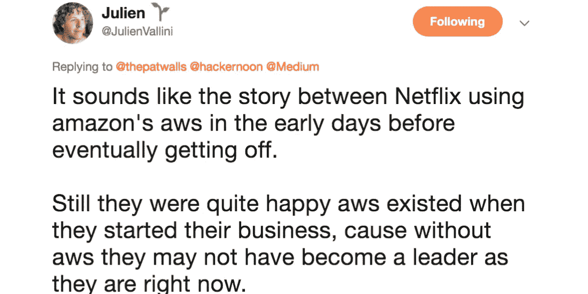

# 所有你需要知道的关于黑客中午的过渡小康媒体的软件

> 原文：<https://medium.com/hackernoon/all-you-need-to-know-about-hacker-noons-transition-off-medium-s-software-cb5d67504130>

[source @julienvallini](https://twitter.com/JulienVallini/status/1060177021953806342)

非常感谢“你的朋友@ Medium”带来的美好时光，但我们该继续前进了。我们祝他们在发展付费出版物方面好运——这是一个有趣的实验。作为临别礼物，我们过去的图书馆将被复制——将故事从 hackernoon.com 转移到 medium.com/hackernoon——以便过去的黑客正午故事、统计数据和关联可以为媒体社区保留。

# 你为什么要从 HackerNoon.com 移除 Medium 的软件？

简而言之:在媒体付费墙模式下，我们不再是一家可行的企业，最终，作为一家媒体公司，要想迈出下一步，我们需要拥有自己的软件。

详细的长回答:[首席执行官大卫·斯穆克的这一集播客](https://www.youtube.com/watch?v=Hy4Lduu9CKg)。你也可以在这里阅读文字记录。

# 为什么黑客中午是一个更好的替代媒体？

首先，这不是一个二选一的问题。作家应该拥有自己的内容，并在许多地方分发。如果你想用付费墙来赚钱，medium.com 和 coil.com 是很好的选择。如果你想消除阅读障碍(如付费墙、弹出广告等)。)，黑客正午是一个发布的好地方。除了编辑评论和质量分发，我们还为投稿作者提供可定制的显著位置简介[行动号召](https://help.hackernoon.com/app/page/1SbI75hPiZa1lK13KpL_1ZmaYQ9IFBKXBtjmJDe5w5M4)(Hacker Noon 2.0 的一个新功能)，可用于将流量引向您在互联网上的首选位置，如时事通讯订户、招聘广告、社交媒体活动、您信任的公司/组织或任何其他内容。可以查看例题[这里](https://hackernoon.com/@David) & [这里](https://hackernoon.com/@alibabatech)或者[这里](https://hackernoon.com/@techloaf)。

# 我的老黑客正午故事会怎么样？

他们将继续留在他们目前的位置:HackerNoon.com/Story-Title 与我们新的后端软件，并从 HackerNoon.com/Story-Title 转移到 Medium.com/HackerNoon/Story-title，以便他们保留媒体链接，鼓掌，统计，个人资料协会等..投稿作者可以从 Medium.com([how to](https://help.medium.com/hc/en-us/articles/360022015814-Delete-a-post))或 HackerNoon.com([support@hackernoon.com](mailto:support@hackernoon.com)或通过你的黑客正午仪表盘)删除任何故事。

# 我的黑客正午故事网址会怎么样？

他们会继续工作！除非你选择退出我们的[服务条款](http://terms.hackernoon.com)，否则你的《黑客正午》故事的网址将指向他们在 HackerNoon.com/Story-Title,生活的整个时间里一直使用的同一个网址，因为我们不想断开互联网上的任何链接([请在此报告断开的链接](https://contribute.hackernoon.com/#missing))。这些故事将连接到一个新的作者简介，你可以要求。

# 如何在 2.0 中认领我的老故事？

首先，使用我们之前联系您时使用的同一电子邮件在我们这里创建一个新帐户。然后，在您的作者简介中输入您的媒体句柄。如果您的电子邮件与我们数据库中的电子邮件相匹配，那么您不需要做任何其他事情。如果没有，我们将向您发送电子邮件，并要求额外的验证步骤。如果在这个过程中需要任何帮助，请给我们发消息:[support@hackernoon.com](mailto:support@hackernoon.com)。

# 我必须在新平台上注册/创建账户吗？

任何人都可以通过访问[hackernoon.com](http://hackernoon.com)→[开始](http://auth.hackernoon.com)创建一个免费帐户。读者不必创建黑客中午帐户:-)，但如果他们这样做，他们可以访问一些 dope 功能。为了开始写作和出版，作者必须创建帐户。

# 有没有办法把我的新黑客中午账号和我的老黑客中午账号在 Medium 上合并？

是的，如果你的电子邮件匹配，并且你正确地输入了你的媒体句柄，你会在“存档”下看到你所有的旧故事，在“故事”下看到新故事。如果您的电子邮件与我们数据库中的不匹配，您需要向我们提供一些验证。

[此处提供了更详细的分步指南。](https://hackernoon.com/a-step-by-step-guide-to-connect-your-medium-account-to-your-hacker-noon-account-j02fo32rw)

# 为什么我的老故事不出现？

很抱歉。可能有很多原因:您当前的媒体句柄与我们系统中的不匹配，媒体暂停了一个故事/帐户，或者您已经选择退出我们的[服务条款](http://terms.hackernoon.com)！在这些情况下，请给 support@hackernoon.com 的[发电子邮件，我们将能够帮助你。](mailto:support@hackernoon.com)

> [原载于 HackerNoon.com](https://hackernoon.com/all-you-need-to-know-about-hacker-noon-vs-medium-t0fg3zz4)