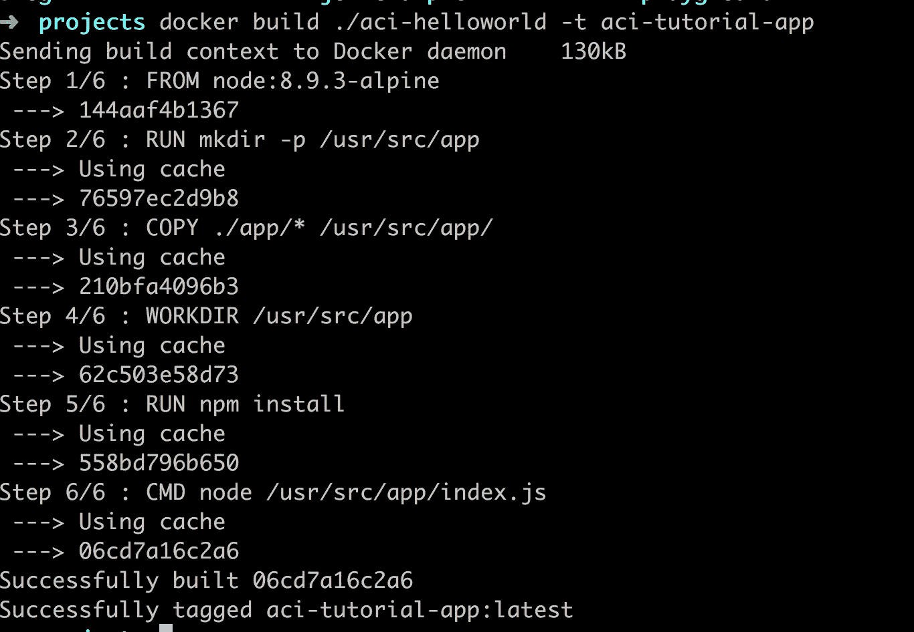
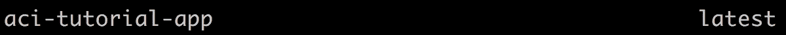
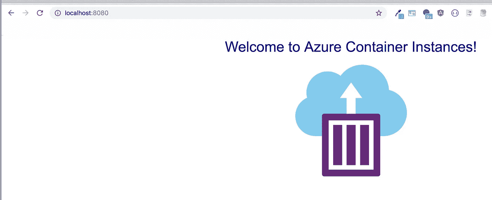
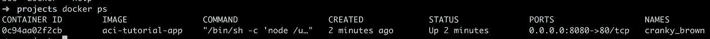
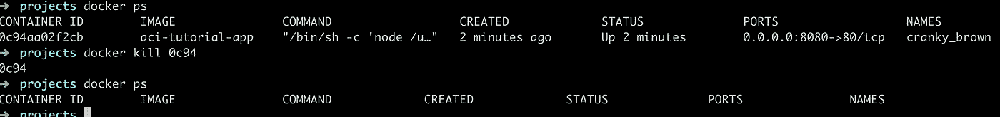
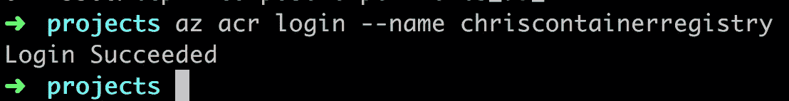
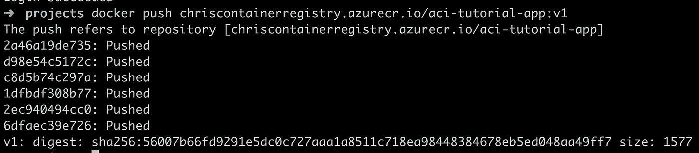
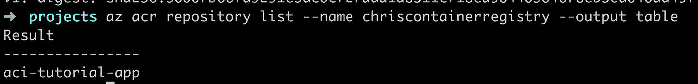
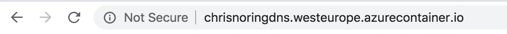

# 你所有的容器都属于我们——部署到微软 Azure

> 原文：<https://medium.com/hackernoon/all-your-containers-are-belong-to-us-deploying-to-microsoft-azure-2e9aa464a113>

> Azure Container 实例支持将 Docker 容器部署到 Azure 基础设施上，而无需配置任何虚拟机或采用更高级别的服务。


在[推特](https://twitter.com/chris_noring)上关注我，很乐意接受您对主题或改进的建议/Chris

那是 1989 年。游戏 Zero Ving 刚刚在日本发行。游戏的创造者 Toaplan 一点也不知道他们的游戏会在 2019 年成为传奇，因为你作为一个用户在输掉游戏时面临的屏幕。*你所有的基地都是属于我们的*——也就是说，你已经输了。容器当然不是这样，使用容器你会大获全胜，当你把它们带到云上时更是如此。

> 今天，在一个或多个容器中开发和交付应用程序变得越来越普遍。Docker 是最常见的容器化软件之一。这是一个很棒的工具，可以很容易地创建图像和容器，还可以监控它们。如果我们能继续使用 Docker，并把我们的应用程序带到云端，那不是很好吗

在本文中，我们将执行以下操作:

*   **解释**，为什么我们可能需要云
*   **从 GitHub 克隆**应用程序源代码，让我们更专注于将应用程序发布到云上，而不是从头开始编写，所以让我们使用一个现有的应用程序
*   **从应用程序源创建**一个容器映像，这是我们需要做的一个预备步骤
*   **在本地 Docker 环境中测试映像，在我们将您的软件推向云之前，在本地测试它总是一个好的做法**
*   创建一个容器注册表，这是 Azure 上存储 Docker 图片的东西
*   **部署**我们的应用程序，我们可以从容器注册表中的一个映像创建一个容器实例

# 资源

如果你错过了我们在这篇文章中提到的链接。他们在这里:

*   安装 Azure CLI
*   [本文基于](https://docs.microsoft.com/en-us/azure/container-instances/container-instances-tutorial-deploy-app?wt.mc_id=medium-blog-chnoring)的教程
*   [az 容器命令](https://docs.microsoft.com/en-us/cli/azure/container?view=azure-cli-latest#az-container-create?wt.mc_id=medium-blog-chnoring)
*   [学习集装箱登记模块](https://aka.ms/learn-container-registry)
*   [Docker 教程系列](https://itnext.io/docker-from-the-beginning-part-i-ae809b84f89f)

# 云的承诺

使用容器技术允许我们将应用程序分成许多服务。最重要的是，它提供了一个安全可靠的应用交付选项。现在，下一个问题来了，我们将它交付到哪里，本地还是云？

这篇文章是关于将你的应用程序交付到云中的，所以当然，我们有点偏颇。让我简短地解释一下为什么我们认为云是应用程序的绝佳选择:

*   性价比，从你只需为你实际使用的东西付费的意义上来说，它是性价比高的。在本地场景中，您可能需要为您认为会增加的用户和使用量支付服务器、CPU、内存等费用。这是一笔很大的现金支出，你需要问自己，我是否愿意花时间去寻找我需要的东西，同时也愿意花时间和金钱去升级它？
*   **可扩展**，云可以轻松实现横向和纵向扩展，增加一名新员工不成问题，增加更多服务器和数据库也不成问题，我们可以在几分钟内完成
*   **弹性**，想象你是一家电子商务公司，在节假日或者黑色星期五之类的时候用户突然激增。云可以动态地添加您需要的额外资源来应对这种情况，当然，当用户数量下降到更正常的水平时，它可以动态地缩减规模

# 先决条件

您需要安装以下软件

*   Docker，这里有针对 Linux、Mac 和 Windows 的不同指南，查看[官方文档](https://docs.docker.com/)以了解如何为您的操作系统安装 Docker
*   Azure CLI [安装](https://docs.microsoft.com/cli/azure/install-azure-cli)

# 克隆应用程序

我们最初说过，我们将更多地关注如何部署而不是编写应用程序，因此，我们将使用一个预制的应用程序，您可以从这里下载:

> *git 克隆*[*https://github.com/Azure-Samples/aci-helloworld.git*](https://github.com/Azure-Samples/aci-helloworld.git)

看着它，你会发现它是一个非常简单的运行 Express 的`Node.js`应用程序。为了便于演示，存储库中有两个感兴趣的文件:

*   `app/index.js`，这是应用程序的入口点
*   `Dockerfile`，这是 docker 文件，它将帮助我们将应用程序构建成一个图像，并最终成为一个包含应用程序的容器。

让我们来看看`app/index.js`文件:

```
const express = require('express'); 
const morgan = require('morgan'); 
const app = express(); app.use(morgan('combined')); app.get('/', (req, res) => { res.sendFile(__dirname + '/index.html') }); var listener = app.listen(process.env.PORT || 80, function() {
  console.log('listening on port ' + listener.address().port); 
});
```

从上面我们可以看到，这是一个非常标准的`Node.js + Express`应用程序，这里没有魔法。

现在让我们来看看`Dockerfile`:

```
FROM node:8.9.3-alpine RUN mkdir -p /usr/src/app COPY ./app/ /usr/src/app/ WORKDIR /usr/src/app RUN npm install CMD node /usr/src/app/index.js
```

它执行以下操作:

*   **选择一个操作系统镜像**，简而言之，我们基于 Ubuntu 和一个名为 alpine 的发行版，它预装了 Node.js。
*   **创建一个目录**，命令如下`mkdir -p /usr/src/app`
*   **复制从`./app/`到`/usr/src/app/`的所有文件**
*   **将工作目录**设置为`/usr/src/app`
*   **使用`npm install`安装我们的节点依赖关系**
*   **使用`node /usr/src/app/index.js`启动我们的应用**

总而言之，这是一个非常标准的外观`Dockerfile`。

# 建立形象

构建图像是我们在实际启动应用程序之前需要做的预备步骤。构建步骤将获取我们需要的操作系统映像，下载相关库，复制我们的应用程序代码，等等。

我们可以使用`docker build`命令来构建一个图像。我们需要使用的确切命令是:

> *码头工人建造。/ACI-hello world-t ACI-tutorial-app*

上面的命令在目录`/aci-helloworld`中查找 Dockerfile 并创建一个名为`aci-tutorial-app`的映像。运行该命令应该会产生如下所示的输出:



上面显示了我们在`Dockerfile`中设置的所有步骤，例如:

*   关闭操作系统映像，复制我们的应用程序
*   设置一个`WORKDIR`，
*   通过运行`NPM INSTALL`安装依赖项，
*   用`CMD node /user/scr/app/index.js`启动应用程序

如果运行以下命令，我们可以看到创建的映像:

> *docker 图像*



好，那么，我们有一个图像，这意味着我们准备好了我们的下一步；在本地测试。

# 通过实例化一个容器来测试图像

现在我们有了一个图像，我们可以使用`docker run`从它创建一个容器。完整的命令如下所示:

> *docker run-d-p 8080:80 ACI-tutorial-app*

让我们来看看论点:

*   `-d`，这告诉容器在后台运行
*   `-p`，这允许我们映射端口，参数值应该这样解释[外部端口]:[容器内部端口]

我们可以看到外部端口是`8080`，这意味着我们可以导航到

> [*http://localhost:8080*](http://localhost:8080/)*确保我们的应用程序正常工作。*

这是我们得到的图像，所以我会说我们的容器正在工作:



使用以下命令，我们可以列出所有正在运行的容器:

> *docker ps 它应该呈现以下结果:*



我们不希望容器运行并耗尽资源，所以让我们关闭它。我们想运行命令`docker kill`来关闭容器，但是，这个命令需要一个参数，它需要`container id`。还记得我们跑`docker ps`的时候吗？第一栏是我们的`container id`。虽然我们不需要完整的 id，但是前 4 个字符就足够了。所以让我们开始指挥吧

> *docker kill【容器 id，4 个前字符】docker ps //应该是空单就是这样。下面是我们刚刚运行的命令的屏幕截图:*



# 创建容器注册表

> Azure 容器注册中心是你在 Azure 中的私有 Docker 注册中心。

我们需要`Docker`、`Docker Engine`和`Azure CLI`来完成这项工作。此时我们已经安装了`Docker`，让我们看看如何安装`Azure CLI`:

> [*https://docs . Microsoft . com/en-us/CLI/azure/install-azure-CLI？view = azure-CLI-最新*](https://docs.microsoft.com/en-us/cli/azure/install-azure-cli?view=azure-cli-latest)

在我们创建这个注册表之前，我们需要一个`Resource Group`。一个`Resource Group`是一个逻辑容器，我们需要在其中放置所有的资源，如应用程序、数据库和现在的`Resource Group`。同一组中的所有内容都可以轻松安全地进行通信。

所以让我们先创建它:

```
az group create --name [your name for a resource group] --location westeurope
```

一旦创建了这个`Resource Group`，我们就可以继续创建我们的`Container Registry`。

该命令如下所示:

```
az acr create --resource-group [your name for your resource group] --name [your name for a registry] --sku Basic --admin-enabled true
```

让我们把它分解一下。

> *az acr 创建*

是创建我们的`Container Registry`的实际命令。那么我们需要一些论据:

*   `**--resource-group**`，这个参数应该是我们新创建的`Resource Group`
*   `**--name**`，这是我们给注册中心起的名字，例如`containerregistry`
*   `**--sku**`，这是价格方案，我们选择最便宜的一款叫做`Basic`

您应该得到如下所示的输出:

```
{ 
  "adminUserEnabled": true, 
  "creationDate": "2018-03-16T21:54:47.297875+00:00", 
  "id": "/subscriptions/<Subscription ID>/resourceGroups/myResourceGroup/providers/Microsoft.ContainerRegistry/registries/mycontainerregistry082", 
  "location": "eastus", 
  **"loginServer": "[your container registry name].azurecr.io"**, 
  **"name": "containerregistry"**, 
  "provisioningState": "Succeeded", 
  "resourceGroup": "myResourceGroup", 
  "sku": { "name": "Basic", "tier": "Basic" }, 
  "status": null, 
  "storageAccount": null, 
  "tags": {}, 
  "type": "Microsoft.ContainerRegistry/registries" 
}
```

重要的部分是用值`Succeeded`返回一个`provisionState`。

# 登录我们的注册表

我们需要登录我们的注册表，然后才能将 docker 图像推送到它。让我们登录:

```
az acr login --name [name of container registry]
```

那会告诉你是否一切正常

您的输出应该如下所示:



上面你可以看到我选择调用注册表`chriscontainerregistry` put，你必须用你选择的名字替换它。

# 标签容器图像

要将容器映像推送到像 Azure Container Registry 这样的私有注册中心，必须首先用`registry's login server`的全名标记该映像。

这一点可以在创建注册表时通过查看 JSON 输出来找到。您正在寻找一个名为`"loginServer"`的物业。其格式为`[your registry name].azurecr.io`。在我的情况下，那将是`chriscontainerregistry.azurecr.io`。

因此，要么您记住我们创建容器注册表时的名称`loginServer`，要么您可以随时通过调用以下命令来检索`loginServer`:

```
az acr show --name [container registry name] --query loginService --output table
```

这将为我们提供打印在终端中的`loginServer`名称。当然，在我们的例子中,`[container registry name]`是值`chriscontainerregistry`,因此根据您选择的名称进行相应的调整。

让我们现在回到码头。我们需要用容器注册表的`loginServer`标记`aci-tutorial-app`图像的*标签*。

我们用以下命令标记它:

> *docker 标签 ACI-tutorial-app/ACI-tutorial-app:v1*

我们来分解一下。

*   这是我们图像的名字，如果你想验证的话，运行`docker image`
*   **/aci-tutorial-app:v1** ，这将对图像进行标记，这样就有可能将其推送到我们的容器注册表中。需要注意的是，`:v1`这是一个版本号，但是我们可以很容易地称之为`LATEST`或者今天的日期，关键是要有一个系统，这样你就知道你是否想要使用一个特定的图像

因此，在我们的例子中，使用正确值的正确命令应该是:

> *docker 标签 aci-tutorial-app【容器注册表名称】. azure Cr . io/ACI-tutorial-app:v1*

此时运行`docker images`命令，验证它是否被正确创建。它应该是这样的:


# 将映像推送到存储库

现在，我们实际上可以将图像推送到存储库。我们通过执行以下命令来实现这一点:

> *docker push/ACI-tutorial-app:v1*

有了所有正确的值，它将是:

> *码头工人推 chriscontainerregistry.azurecr.io/aci-tutorial-app:v1*

您可能需要先登录，在这种情况下，您可以运行以下命令:

> *az acr 登录名称【集装箱注册名称】*

执行`docker push`应产生以下结果:



# 列出存储库中的图像

好了，现在我们实际上想看看我们有什么图片，剧透一下，应该是我们刚刚上传的那张；)

我们可以运行以下命令:

```
az acr repository list --name --output table
```

使用`acrName`的正确值，它看起来像这样:

```
az acr repository list --name [name of container registry] --output table
```

这就是我们唯一推送的图片:)



# 部署应用程序

既然我们在存储库中有了我们的映像，我们可以告诉存储库从我们的映像创建一个容器，从而部署我们的应用程序。

要运行我们的部署命令，我们首先需要一些信息，即:

*   登录服务器，我们可以对其运行以下命令

```
az acr show --name --query loginServer
```

*   用户名和密码，为此我们运行以下命令:

```
az acr credential show --name --query "passwords[0].value"
```

这将返回密码

好了，现在我们来看看 deploy 命令，它看起来可能有点吓人:

```
az container create --resource-group myResourceGroup --name aci-tutorial-app --image <acrLoginServer>/aci-tutorial-app:v1 --cpu 1 --memory 1 --registry-login-server <acrLoginServer> --registry-username <acrName> --registry-password <acrPassword> --dns-name-label <aciDnsLabel> --ports 80
```

创建容器的方法有很多，如果你对其他方法感兴趣，看看这个链接 [az 容器创建](https://docs.microsoft.com/en-us/cli/azure/container?view=azure-cli-latest#az-container-create)

# 检查进度和日志

如果部署需要一段时间，您可以使用以下命令同时检查状态:

```
az container show --resource-group [name or resource group] --name aci-tutorial-app --query instanceView.state
```

在一个很长的 JSON 回复后，寻找`provisioningState: Succeded`，如果你有，你是好的。

让我们用下面的命令来看看我们的容器:

```
az container show --resource-group [name of resource group] --name aci-tutorial-app --query ipAddress.fqdn
```

我们可以通过运行以下命令来查看应用程序的日志:

```
az container logs --resource-group [name of resource group] --name aci-tutorial-app
```

*这将告诉我们在端口 80 上运行*

# 访问部署的应用程序

一旦部署完毕，我们就可以通过`--dns-name-label`值访问应用程序，就像这样:



# 摘要

我们开始部署一个应用程序。这次我们想要部署一个 docker 容器。为此，我们首先需要创建一个 docker 图像。所以我们用`docker build`创建了一个。

然后我们意识到我们需要一个`Container Registry`，因为我们将从那里部署我们的映像，即实例化一个 docker 容器并部署它。

为了让它出现在`Container Registry`中，我们首先需要用`loginServer`名称标记它，之后我们推送标记的图像。

最后，我们告诉`Container Registry`从我们的映像创建一个容器并部署它。部署完成后，我们可以进入浏览器，验证应用程序是否存在，成功:)

其实没那么多步。我的意思是，假设我们的应用程序由 3 个其他服务组成。我们只需要为每一个构建一个图像，标记它，推送，并创建一个容器。