# 大宗商品的另类贝塔策略

> 原文：<https://medium.com/hackernoon/alternative-beta-strategies-in-commodities-27d70f27a5ee>

Harry Markowitz 于 1952 年提出的现代投资组合理论一直是资产配置和投资组合构建的基石。事实上，过去十年，传统资产类别之间的相关性稳步上升。看似不相关的资产步调一致，一度被认为是多元化的投资组合没有经受住这场风暴。

这导致一些投资者探索替代贝塔策略，作为传统市场投资组合的替代品。可选的β策略有两个方面。一种方法是“基于风险的方法”，另一种是“基于因素的方法”。

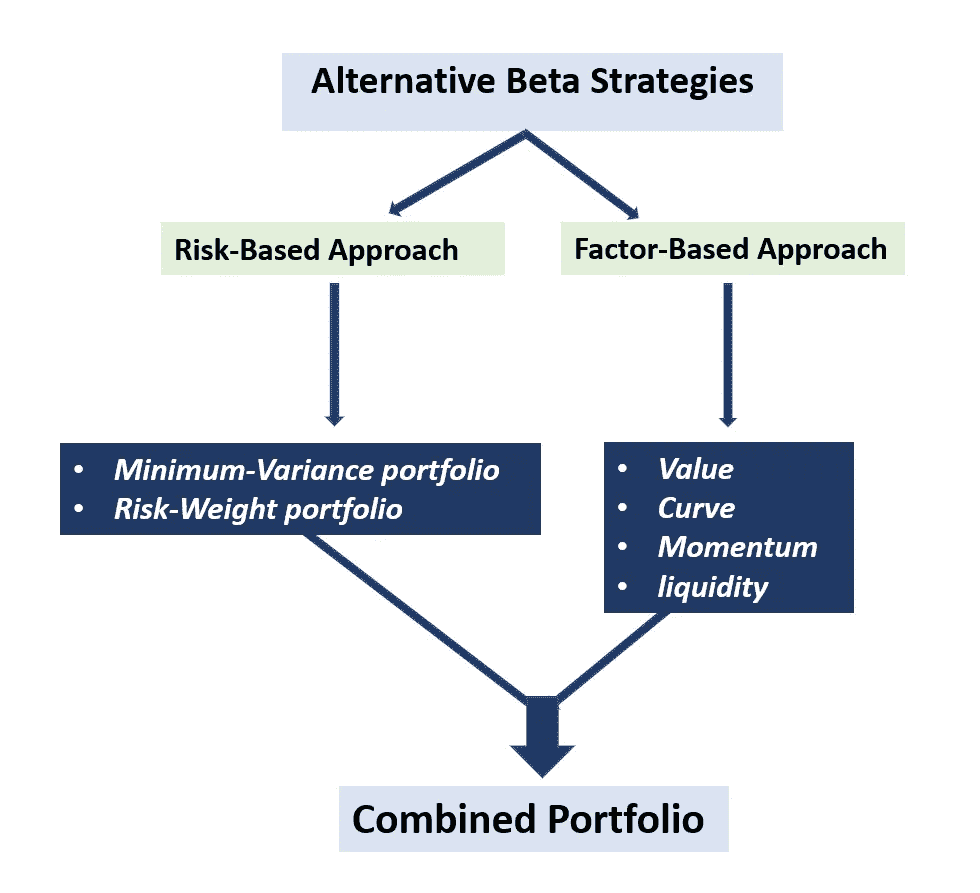

这些策略已成为股票投资的一部分，这些策略的流行源于对多样化的渴望和对系统性风险因素解释了大部分长期投资组合回报的认识。

本文探讨了基于风险的*和基于因素的*商品贝塔指数，并评估了在多资产投资组合中组合多个系统风险因素的优点。**

# **1.评估备选 Beta 策略**

## **1.1 基于风险的方法**

**传统指数使用全球生产和交易流动性作为分配部门和商品权重的主要决定因素。**

**尽管行业数量众多，但 S&P GSCI 严重倾向于能源(历史上风险最高的行业)。权重已经高达 60-70%，相当于指数中总风险的大约 80-90%。例如，指数中 24 种商品成分中最小的 10 种成分加起来占指数的比例不到 10%。**

**另一方面，道琼斯指数在设计时就有行业限制，不允许超过三分之一的指数被主宰。然而，能源通常占总风险敞口的 50%左右，随着能源价格在年度重定价之间上涨，这一限额通常会被突破。**

**基于风险的方法中有两种常见的方法——风险权重组合*和最小方差组合*。****

*   ******风险权重指数*** 试图给五个商品板块中的每一个分配相似的风险预算。***
*   *****最小方差指数*** 寻求最小化指数整体的波动性。**

**结果表明，上述两种策略都能降低风险。**

**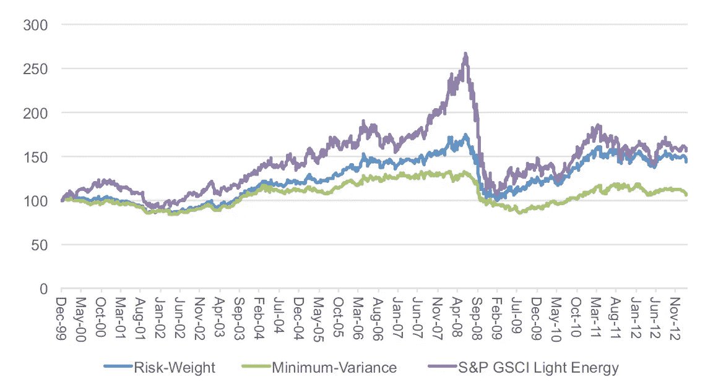**

**Performance of a Selection of Risk-Based Strategies**

*   **最小方差策略在所有三个指标中实现了最低的风险。**
*   **这两种基于风险的策略的年化回报率都低于 S&P GSCI 光能基准。较少接触能量可以解释这一点。**

**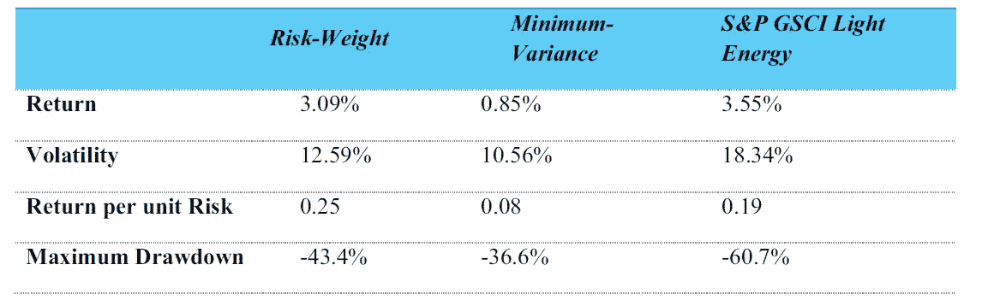**

**Risk-Based Strategies**

**当考虑风险和收益的权衡时，风险权重策略优于最小方差策略。大宗商品价格和波动性往往相伴而行。因此，商品回报的分布往往是正偏态的。**

**仅仅以最低水平的波动性为目标可能是违反直觉的，更令人满意的方法是通过在不同商品和部门之间分配风险预算来降低风险。**

## **1.2 基于因素的方法**

**基于因素的方法包括通过赚取与系统因素相关的风险溢价来提高回报。在商品中，最广为人知的因素是 ***价值、曲线、动量和流动性*** 。**

*****1.2.1 价值策略*****

**价值策略旨在从那些被错误定价的商品中获取超额回报。**

*   ***购买一组被低估的大宗商品，期望它们的价格会收敛到更高的水平。***
*   ***投资者除了买入廉价商品，还卖出被高估的商品。***

**这些策略以库存最低的商品为目标。由于难以瞬间补充，他们将经历价格上涨。这些商品的短缺需要时间通过额外生产、需求破坏或两者兼而有之来解决。**

**已经提出了许多理论来解释商品期货市场的期限结构和实物股票储备之间的关系:**

*   **尼古拉斯·卡尔多[1939]——现货和期货价格(或期货基差)之间的差异可归因于**仓储成本**、**储存商品所放弃的**利息以及库存的**便利收益**。当一种商品被视为稀缺商品时，便利收益会增加，因为持有实物股票会带来好处。**
*   **布里登[1980]和贾根纳森[1985]认为期货价格是对未来现货价格和风险溢价的预测。最近，Gorton、Hayashi 和 Rouwenhorst [2007]提供了便利收益和库存水平之间的负的非线性关系的证据。**

**由于对冲未来价格风险的兴趣增加，未来现货价格也将走强。**

**当市场预期供应短缺时，不同期限的期货合约价格都会上涨，从而使整个期货曲线平行向上移动。**

**近年来推出了许多指数来收获这种“风险溢价”。它们包括根据感知的稀缺性对少量商品进行同等加权。尽管它们总体回报强劲，但由于指数中包含的大宗商品数量较少，它们的敞口往往相当集中。**

**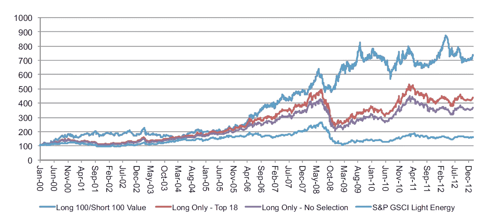**

**Performance of a Selection of Value Strategies**

**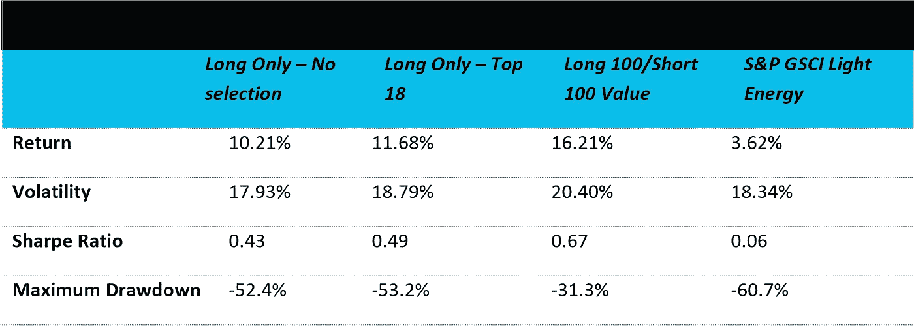**

**Value Strategies: Historical Annualized Risk and Return**

**丹尼尔·翁和康小伟进行的一项研究显示，价值策略在调查期间表现良好，所有策略的夏普比率都高于基准。**

**应该指出的是，对所应用的加权方案进行简单的改变就可以获得良好的收益，同时降低风险。**

**通过淘汰最被高估的商品的积极选择也是有利的。**

**长 100/短 100 版本整体收益最好。但是，这种增强型也承担了更高的活动风险。**

**所有三种策略的最大提款都低于基准。**

*****1.2.2 曲线策略*****

**指数通常只是被动的做多指数，定期滚动其近月期货头寸，以维持对大宗商品的敞口。**

**在现货溢价期间，可以通过同时卖出一个更贵的即将到期的合约和买入一个更便宜的后续合约来获得正套利。**

**在期货溢价期间，投资者遭受负套利，这侵蚀了他们的整体回报。一段时间以来，许多商品的期货曲线一直处于期货溢价状态。这导致了各种曲线策略的发展，这些策略试图通过滚动更长期限的合同来减轻这种期限结构的负面影响。**

**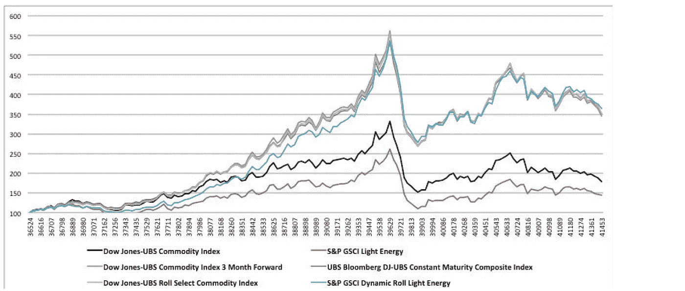**

**Performance of a Selection of Curve Strategies**

**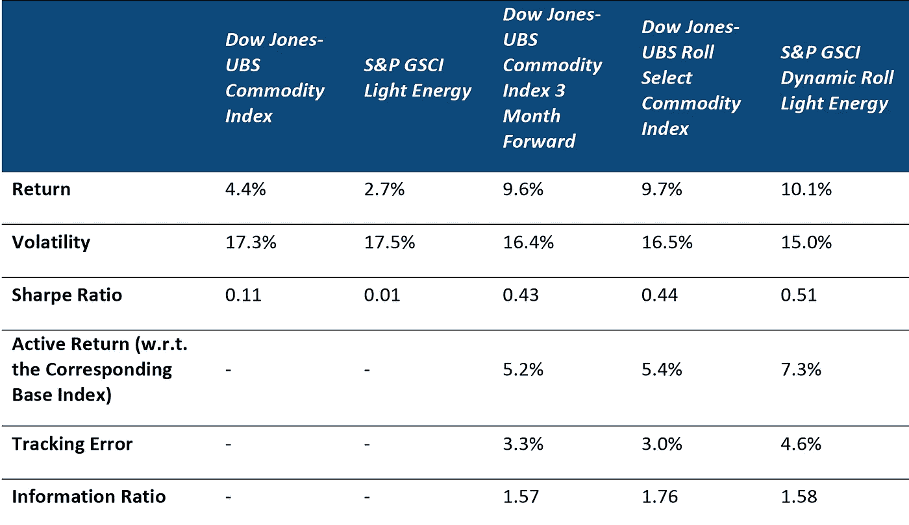**

**Curve Strategies: Historical Annualized Risk and Return**

**理论上，大宗商品生产商折价出售长期合约，以对冲其产出，而消费者通常溢价购买短期合约，以确保近期消费。**

**曲线策略最简单的实施包括系统地滚动到预先定义的到期日的远期合约，例如三个月的合约。**

**实施曲线策略的另一个方法是投资不同期限的合约。**

**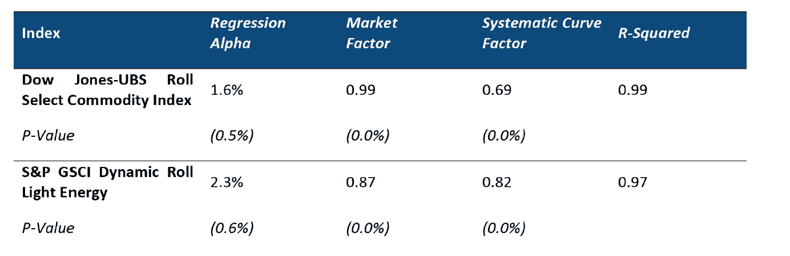**

**Performance Attribution of Curve Strategies**

**甚至更动态的策略——如 S&P·GSCI 动态滚动和道琼斯-瑞银滚动精选指数——近年来也引起了人们的兴趣。**

**从长期来看，所有四种曲线策略的回报率都高于各自的基准。**

*****1.2.3 动量策略*****

**动量策略旨在利用商品回报的持续性，这种持续性源于投资者和工业市场参与者的心理偏差。**

**除了投资者心理之外，工业市场参与者的行为也可能影响价格趋势。以堪萨斯小麦为例，消费者需求全年保持相当稳定，而产量可能会有很大变化，因为种植通常在前一年的 9 月开始。如果在 6 月和 7 月的收获季节，需求突然激增，而进口又不能满足需求，价格将不可避免地上涨，从而形成积极的价格势头。**

**动量策略可以通过多种方式实现。一般来说，它们既持有多头头寸，也持有空头头寸，至少包括两个步骤:**

1.  **确定每种商品的仓位。**
2.  **决定合适的加权方案。**

**简单的动量策略的一个例子是晨星多头/空头商品指数，它使用简单的移动平均线信号来确定每种商品的交易头寸，然后根据其期货的未平仓合约进行加权。**

**S&P 系统全球宏观商品指数确立了每种商品的趋势，并从统计上验证了趋势的稳定性。然后，它对每个部门给予相等的风险资本准备金，并对该部门内的成分给予相等的权重。**

**在没有明确趋势的窄幅波动市场中，它们不太可能产生回报。这凸显了投资组合依赖单一策略的危险。**

*****1.2.4 流动性策略*****

**这些第一代指数的一个重要特征是它们在一个类似的窗口滚动。例如，S&P GSCI 指数在第五个和第九个营业日之间滚动五天，而道琼斯瑞银指数在第六个和第十个营业日之间滚动。**

**因此，大量投资流入，同时卖出近月合约并买入随后的近月合约，从而产生可以获得的流动性溢价。**

**然而，随着更多创新指数上市，这种好处正在消失，这些策略的回报正在减少。**

**因此，与其他来源相比，流动性是最小的回报来源，但它对商品市场来说是独一无二的。**

# **2.综合不同来源的风险溢价**

**商品市场中基于因素的战略，可以作为多资产投资组合中不同商品战略和资产配置组合的基础。**

**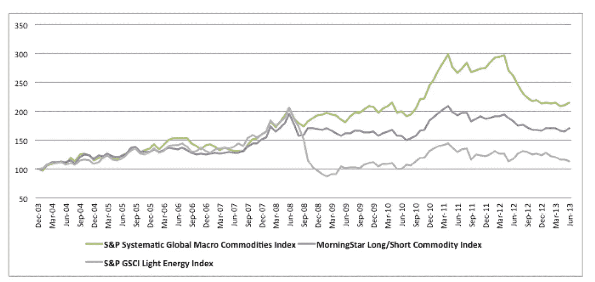**

**Performance of a Selection of Momentum Strategies**

**总的来说，他们表现不佳的时期并不总是彼此重合。它们可能提供分散风险的潜力。**

**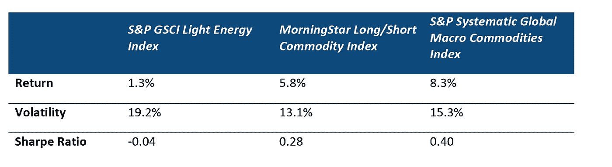**

**Momentum Strategies — Historical Annualized Risk and Return**

**策略之间的相关性较低，并且这些策略与广义指数之间的相关性较低至负。这是意料之中的，因为价格呈上升趋势的商品会自动增加它们在广义指数中的代表性。**

**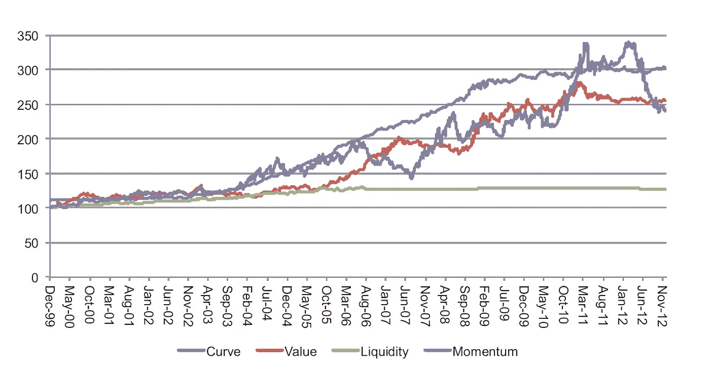**

**Historical Performance of Systematic Commodity Factors**

**系统性商品因素策略的历史表现允许在下跌趋势中做空商品，为策略创造额外价值。要素回报并不代表无风险回报的来源。这只是构建投资组合的另一种方式。**

****

**Correlation of Matrix of Commodity Risk Factors**

**左边的数据显示，两种策略的绝对表现都超过了基准指数。**

**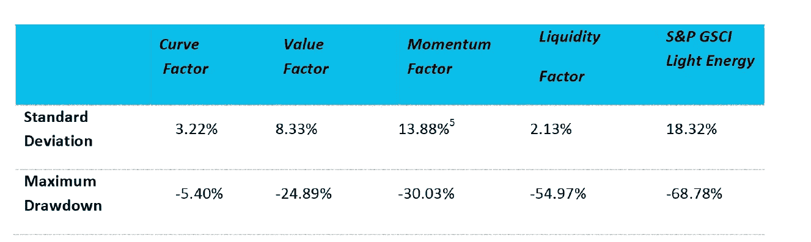**

**Annualized Volatility and Maximum Drawdown of Commodity Risk Factors**

**然而，风险权重的整体表现更好，因为它的风险水平较低，表明在创建投资组合时管理风险的优势。**

**总的来说，它们与基准的相关性都很低，是很好的分散投资组合的工具。**

****

**Historical Performance of Compromise Factor Strategies**

**资料来源:标准普尔道琼斯指数。数据从 1999 年 12 月 31 日至 2012 年 12 月 31 日。提供图表是为了说明的目的。过去**

***业绩并不能保证未来的结果。此图表中反映的一些数据可能反映了假设的历史表现。***

# **3.结论**

**另类贝塔策略可以服务于各种不同的投资目标，包括降低波动性或减少系统性风险敞口。**

**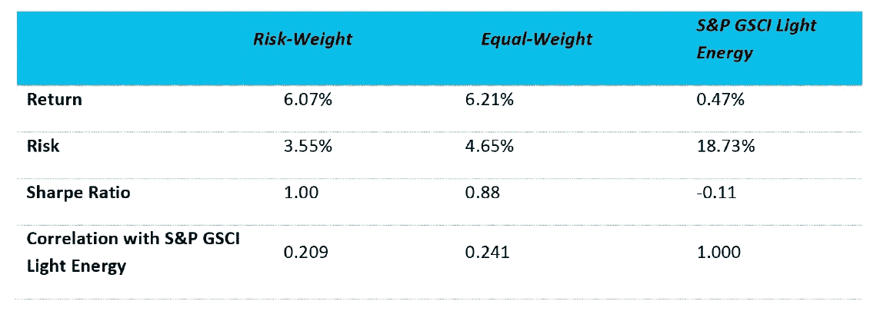**

**Composite Strategies Return: Historical Annualized Risk and Return**

**投资者必须检查这些策略是否符合他们的目标和风险偏好。**

**另类贝塔的两种主要方法是“基于风险的方法”，降低投资组合风险，以及“基于因素的方法”，通过赚取系统风险溢价来提高回报。**

**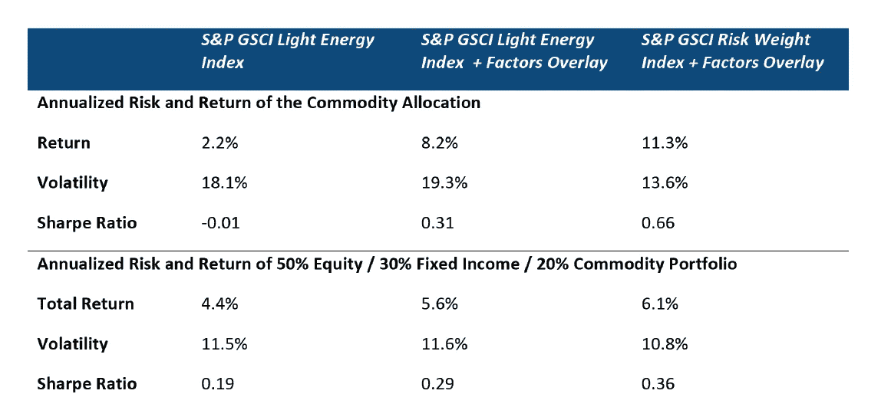**

**Combining Different Commodity Allocations in a Multi-Asset Portfolio**

**尽管另类贝塔在股票策略投资中已经相当成熟，但它在大宗商品中仍是一个新生概念。**

**然而，由于投资者追求更多样化的投资组合，并认识到系统性风险因素解释了大部分回报，商品替代β产品的开发正在加快步伐。**

**作为投资组合大宗商品配置的一部分，分配到备选贝塔策略中有潜在的好处，并且将基于风险和基于因素的大宗商品策略结合起来，历史上比被动的只做多策略本身提供了更高的回报和更低的风险。**

**最后，应该记住的是，另类贝塔策略通常会冒相当大的主动风险，这在很大程度上是由因素暴露驱动的。要素回报可能是不稳定的，所有替代贝塔策略有时会经历相当大的下降。**

*****免责声明#1:这不是财务建议。我没有资格提供财务建议，也不打算这样做。本文仅供参考和学习之用。*****

*****免责声明#2:本文由《另类投资分析师评论》的原文改编改写。*****

**在 [Twitter 上关注我！](https://twitter.com/gayanhashed)**