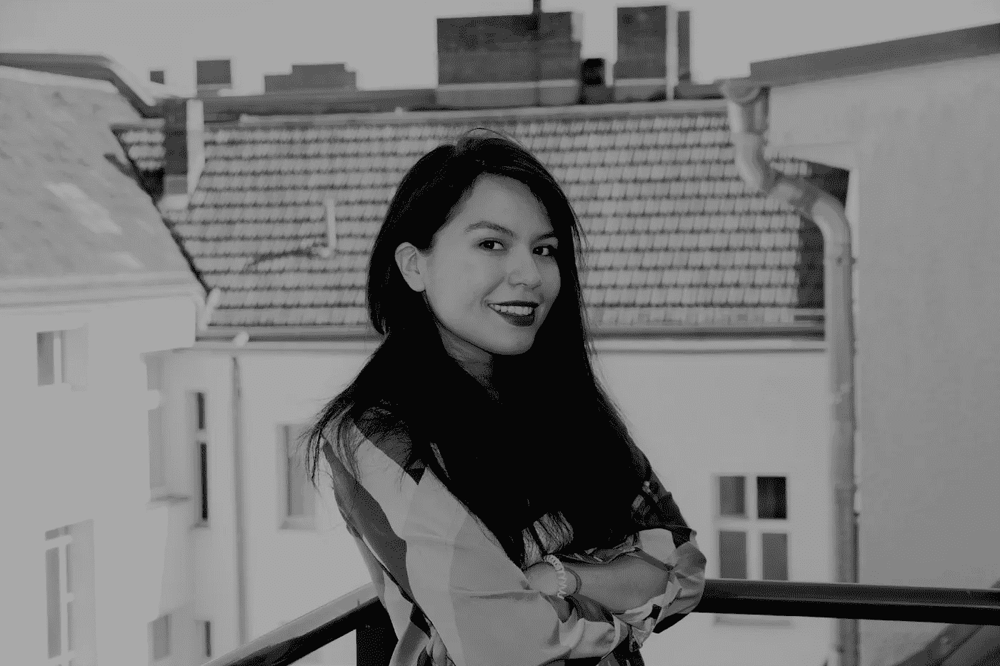

# 太平洋标准时间今天中午，AMA 和艾丽西娅·费拉斯科在一起

> 原文：<https://medium.com/hackernoon/ama-with-alicia-ferratusco-at-noon-pst-today-d95c5173f936>

## Alicia Ferratusco 是 Starfish 的联合创始人，这是一个充满活力的区块链和共同生活空间。[问她任何事情@太平洋标准时间今天中午！](https://community.hackernoon.com/t/i-am-alicia-ferratusco-realaliciafe-founder-of-starfish-network-ask-me-anything-5-9-noon-pst/2417)这是[黑客正午社区的](https://community.hackernoon.com/)[第三个 AMA](https://community.hackernoon.com/c/ama) 。

[*用艾丽西娅的话说:*](https://community.hackernoon.com/t/i-am-jeff-atwood-codinghorror-co-founder-of-stack-overflow-and-discourse-ask-me-anything-4-8-noon-pst/1800)

*我创办了* [*海星 2*](https://www.starfish.network/) *，这是加州最具活力的新兴科技合作和活动空间之一。我们已经举办了 300 多场活动，接待了像查理·李和安德烈亚斯·安东诺普洛斯这样有影响力的人。*

问我任何关于区块链社区、联合办公、实验性房地产、生态系统建设和空间运作机制设计的问题。

我将在 2019 年 5 月 9 日(星期四)中午 12:00 现场回答您的问题。我真的很兴奋能在黑客中午在这里做这件事！

*请随意* [*将此添加到您的日历中。*](https://calendar.google.com/event?action=TEMPLATE&tmeid=NDYzMWxicnE2dTFjY2hxYzY4YnJja3RnZ2wgYWxpY2lhQHN0YXJmaXNoLm5ldHdvcms&tmsrc=alicia%40starfish.network)

## [加入 AMA。](https://community.hackernoon.com/t/i-am-alicia-ferratusco-realaliciafe-founder-of-starfish-network-ask-me-anything-5-9-noon-pst/2417)

要提名自己或其他人参加[黑客正午 AMA](https://community.hackernoon.com/c/ama) ，请直接在[推特](https://twitter.com/DavidSmooke)或[黑客正午](https://community.hackernoon.com/u/David)上给我发消息。