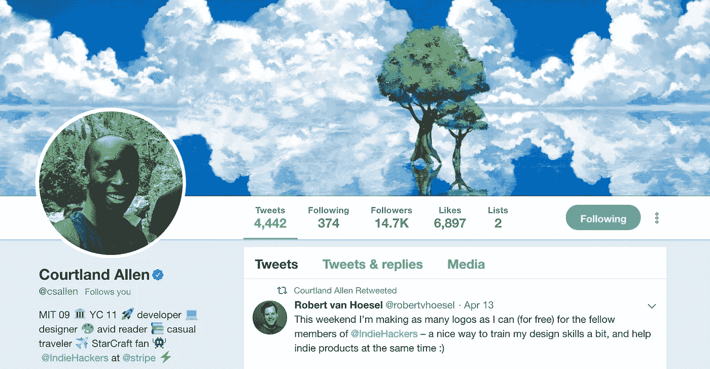
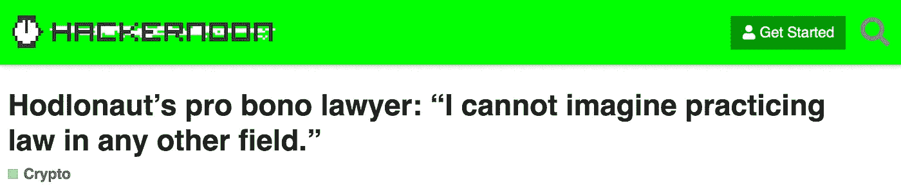

# 太平洋时间 4 月 18 日周四中午，AMA 和独立黑客的考特兰·艾伦在一起

> 原文：<https://medium.com/hackernoon/ama-with-indie-hackers-courtland-allen-at-noon-pst-on-thursday-4-18-8286e8647c03>

## 科特兰·艾伦在 Stripe 创立并经营 IndieHackers.com。[问他任何事情@太平洋标准时间 4/18 周四中午](https://community.hackernoon.com/t/im-courtland-allen-creator-of-indie-hackers-ask-me-anything-thu-apr-18-noon-pst/1945)。

用[考特兰](https://twitter.com/csallen)自己的话说:

*问候黑客中午的人们！*

*我是* [*独立黑客*](https://www.indiehackers.com/) *的创作者考特兰。2016 年，我厌倦了开发人员的工作，渴望自己做点什么。但是我在网上找不到太多关于作为一个开发者建立一个盈利的企业的信息，除了从风投那里筹集资金和做一些创业的事情。*

所以我创建了独立黑客，一个开发者和创始人交流故事和建议的社区，帮助彼此从我们的应用和副业项目中赚钱。(也是 [*播客*](https://www.indiehackers.com/podcast) *！)*

*九个月后，它被*[*Stripe*](https://stripe.com/)*收购，在过去的两年里，我一直愉快地在那里工作，采访了 400 多位创始人，在这个过程中学到了很多东西。*

*随意* [*把这个添加到你的日历 2*](https://calendar.google.com/event?action=TEMPLATE&tmeid=MTE1ZmUwZ2ltbnJhbml1c3F1YTExdXIyN2wgYW1pcHVibGljYXRpb25zLmNvbV9zZmZuYTU5aWtiMTllbTdkMTYzODEyanRwOEBn&tmsrc=amipublications.com_sffna59ikb19em7d163812jtp8%40group.calendar.google.com) *和/或* [*问个问题(马上)*](https://community.hackernoon.com/t/im-courtland-allen-creator-of-indie-hackers-ask-me-anything-thu-apr-18-noon-pst/1945) *。我将在 2019 年 4 月 18 日太平洋标准时间中午回答您的任何问题。*

[*问我什么都行！*](https://community.hackernoon.com/t/im-courtland-allen-creator-of-indie-hackers-ask-me-anything-thu-apr-18-noon-pst/1945)

## 你错过了上周的 AMA 吗？

阅读[杰夫·阿特伍德·AMA](https://community.hackernoon.com/t/i-am-jeff-atwood-codinghorror-co-founder-of-stack-overflow-and-discourse-ask-me-anything-4-8-noon-pst/1800)(以及[黑客霍德尔的概述](https://hackernoon.com/key-takeaways-from-jeff-atwoods-ama-on-hackernoon-78abc7501530))。

你也可以[提名其他人……或者你自己](https://community.hackernoon.com/t/ama-signup-nomination-thread/1101)成为[黑客正午 AMA](https://community.hackernoon.com/c/ama) 。

**回到互联网...**我将在哪里工作[办公时间@ IndieHackers.com 太平洋标准时间 4 月 19 日星期五上午 10 点](https://www.indiehackers.com/Smooke/post/officeHoursPromo-0a56dbb305)。其他新闻(本周我最喜欢的标题):

亲切的问候，

大卫·斯穆克

