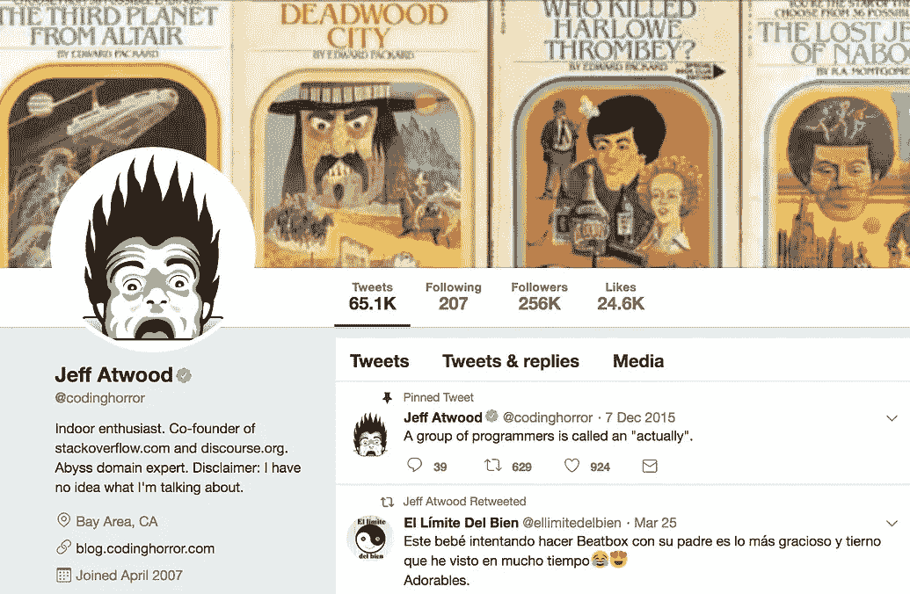

# AMA 和杰夫·阿特伍德(@codinghorror)在太平洋标准时间今天中午

> 原文：<https://medium.com/hackernoon/ama-with-jeff-atwood-codinghorror-at-noon-pst-today-2433e74a1897>

## [杰夫·阿特伍德](https://community.hackernoon.com/t/i-am-jeff-atwood-codinghorror-co-founder-of-stack-overflow-and-discourse-ask-me-anything-4-8-noon-pst/1800)是栈溢出和话语的联合创始人。[问他任何事情@太平洋标准时间今天中午！](https://community.hackernoon.com/t/i-am-jeff-atwood-codinghorror-co-founder-of-stack-overflow-and-discourse-ask-me-anything-4-8-noon-pst/1800)这里是[黑客正午社区的](https://community.hackernoon.com/)[第一 AMA](https://community.hackernoon.com/c/ama) 。

[*用杰夫的话说:*](https://community.hackernoon.com/t/i-am-jeff-atwood-codinghorror-co-founder-of-stack-overflow-and-discourse-ask-me-anything-4-8-noon-pst/1800)

*我在 2008 年与人合作创办了* [*栈溢出*](https://stackoverflow.com/) *，最终成为了* [*栈交换网的 Q & A 站点*](https://stackexchange.com/) *。2012 年离开 SO 后，我开始从事* [*话语*](https://discourse.org/) *的工作，这是一个开源的论坛软件，这也是我今天仍在从事的工作。*

我会现场回答你的问题(太平洋标准时间中午)。很激动我们在这里做的是 [*黑客正午的话语实例*](http://community.hackernoon.com) *。我听说它非常棒。*

*随意* [*把这个添加到你的日历*](https://calendar.google.com/event?action=TEMPLATE&tmeid=MzFqdmk3OTMxbTc1b2RxNnVsdnVxMmhqZGQgZGF2aWRAaGFja2Vybm9vbi5jb20&tmsrc=david%40hackernoon.com) *或者在下面提问。很快聊！*

## [加入 AMA](https://community.hackernoon.com/t/i-am-jeff-atwood-codinghorror-co-founder-of-stack-overflow-and-discourse-ask-me-anything-4-8-noon-pst/1800) 。

要提名自己或其他人参加[黑客正午 AMA](https://community.hackernoon.com/c/ama) ，请直接在[推特](https://twitter.com/DavidSmooke)或[黑客正午](https://community.hackernoon.com/u/David)上给我发消息。