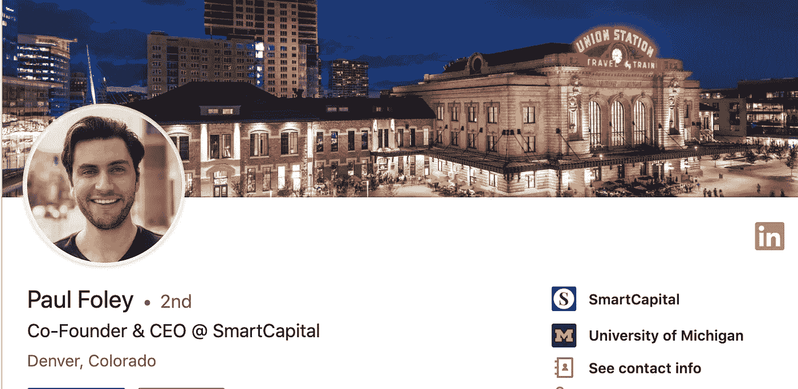

# AMA 与科罗拉多州 SmartCapital 董事总经理保罗·福利(Paul Foley)。@本周五下午 2:00 MT

> 原文：<https://medium.com/hackernoon/ama-with-paul-foley-paulnfoley-managing-director-of-smartcapital-colorado-4bf77f853edc>

## Paul Foley 是科罗拉多州 SmartCapital 的总经理。[问他任何事情@ 1PST 本周五](https://community.hackernoon.com/t/i-am-paul-foley-paulnfoley-managing-director-of-smartcapital-colorado-ask-me-anything-06-07-2-00-pm-mt/3161/9)！这是[黑客正午社区的第七个](https://community.hackernoon.com/) [AMA](https://community.hackernoon.com/c/ama) 。

## [*用保罗的话说:*](https://community.hackernoon.com/t/i-am-paul-foley-paulnfoley-managing-director-of-smartcapital-colorado-ask-me-anything-06-07-2-00-pm-mt/3161)

嘿，黑客正午社区！

我是 Paul Foley，SmartCapital 的总经理。

[SmartCapital 科罗拉多投资组合](https://t.sidekickopen10.com/s1t/c/5/f18dQhb0S7lM8dDMPbW2n0x6l2B9nMJN7t5X-FdSD1CW1pgJmW1pNgd4Tkl1Z5dnbMM103?t=https%3A%2F%2Fwww.colorado.capital%2F&si=7000000000442546&pi=730749fa-da8e-4d7b-ddea-1884e1ac8991)允许投资者接触科罗拉多的 25 家快速增长的初创公司。所有公司都有由其他风险投资或战略投资伙伴领导的融资，我们会跟进这些融资，所有公司都有可观的收入。

你可以把这看作是科罗拉多州成长型公司的指数基金。

很高兴来到这里参加 6 月 7 日星期五下午 2:00 的 AMA

下面随便问个问题。很快聊！

## 加入 [AMA。](https://community.hackernoon.com/t/i-am-paul-foley-paulnfoley-managing-director-of-smartcapital-colorado-ask-me-anything-06-07-2-00-pm-mt/3161)

> 更多信息: [BusinessDen 报道了科罗拉多州的 SmartCapital 投资组合](https://t.sidekickopen10.com/s1t/c/5/f18dQhb0S7lM8dDMPbW2n0x6l2B9nMJN7t5X-FdSD1CW1pgJmW1pNgd4Tkl1Z5dnbMM103?t=https%3A%2F%2Fbusinessden.com%2F2019%2F05%2F07%2Fnew-angel-fund-wants-to-invest-only-in-colorado%2F&si=7000000000442546&pi=730749fa-da8e-4d7b-ddea-1884e1ac8991)
> 
> 要提名自己或其他人参加[黑客正午 AMA](https://community.hackernoon.com/c/ama) ，请直接在[推特](https://twitter.com/DavidSmooke)或[黑客正午](https://community.hackernoon.com/u/David)上给我发消息。

## 作为额外的参考，请查看[黑客 Noon 过去的 AMAs](https://community.hackernoon.com/c/ama) :

*   [杰夫·阿特伍德(@codinghorror)，Stack Overflow 和 Discourse 的联合创始人](https://community.hackernoon.com/t/i-am-jeff-atwood-codinghorror-co-founder-of-stack-overflow-and-discourse-ask-me-anything-4-8-noon-pst/1800)
*   [科特兰·艾伦(@csallen)，独立黑客的创造者](https://community.hackernoon.com/t/im-courtland-allen-creator-of-indie-hackers-ask-me-anything-thu-apr-18-noon-pst/1945)
*   [Alicia Ferratusco(@ realaliciafe)，海星网创始人](https://community.hackernoon.com/t/i-am-alicia-ferratusco-realaliciafe-founder-of-starfish-network-ask-me-anything-5-9-noon-pst/2417)
*   [泰勒·莫纳汉(@tayvano_)，MyCrypto 的首席执行官](https://community.hackernoon.com/t/im-taylor-monahan-ceo-of-mycrypto-ask-me-anything-5-16-12pm-pst/2597)
*   [Mike Kalomeni ( @KalomeniM)，)elementus.io 的联合创始人，加州理工学院前火箭科学家](https://community.hackernoon.com/t/i-am-mike-kalomeni-kalomenim-cofounder-of-elementus-io-and-former-rocket-scientist-at-caltech-ask-me-anything-05-23-12pm-pst/2721)
*   [Muneeb，Blockstack 联合创始人。](https://community.hackernoon.com/t/im-muneeb-co-founder-of-blockstack-ask-me-anything-noon-pst-5-28-19/2808)
*   [卡洛斯，证券化的联合创始人](https://community.hackernoon.com/t/i-m-carlos-co-founder-of-securitize-ask-me-anything-noon-pst-5-31-19/2912)
*   即将发布:[我是 Shamir Karkal，Simple Bank 的联合创始人，Sila 的现任首席执行官。问我任何问题 06/11/19 @中午太平洋标准时间](https://community.hackernoon.com/t/i-am-shamir-karkal-co-founder-of-simple-bank-and-current-ceo-at-sila-ask-me-anything-06-11-19-noon-pst/3158)