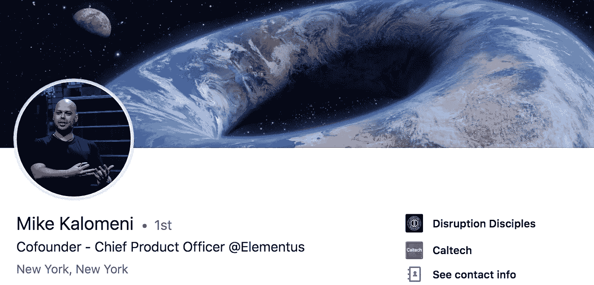

# 太平洋标准时间今天中午，AMA 与火箭科学家转型区块链企业家

> 原文：<https://medium.com/hackernoon/ama-with-rocket-scientist-turned-blockchain-entrepreneur-at-noon-pst-today-5e082335a1a>

## 迈克·卡洛梅尼是 Elementus_io 的联合创始人，也是一名前火箭科学家。[问他任何事情@太平洋标准时间今天中午！](https://community.hackernoon.com/t/i-am-mike-kalomeni-kalomenim-cofounder-of-elementus-io-and-former-rocket-scientist-at-caltech-ask-me-anything-05-23-12pm-pst/2721)这是[黑客正午社区的](https://community.hackernoon.com/)[第五个 AMA](https://community.hackernoon.com/c/ama) 。

## [用迈克的话说:](https://community.hackernoon.com/t/i-am-mike-kalomeni-kalomenim-cofounder-of-elementus-io-and-former-rocket-scientist-at-caltech-ask-me-anything-05-23-12pm-pst/2721)

*“我叫迈克·卡洛梅尼。我在加州理工学院做研究以完成我的航空航天学位，专注于高超音速飞机的空气动力学。然后我在凯捷做管理咨询，在那里我是空客大数据实验室的 Scrum Master。*

*这让我加入了 Max Galka 和 Nuria Gutierrez，共同创建了*[*Elementus*](http://elementus.io/)*，这是一个区块链查询引擎，在 Cryptopia hack 期间使用，用于解决 Quadriga 之谜。*

我将在太平洋标准时间 2019 年 5 月 23 日中午 12:00 现场回答您的问题。期待大家对黑客正午社区的高度评价！

请随意将此添加到您的日历中，或者在下面提问。回头见。”

## [加入 AMA](https://community.hackernoon.com/t/i-am-mike-kalomeni-kalomenim-cofounder-of-elementus-io-and-former-rocket-scientist-at-caltech-ask-me-anything-05-23-12pm-pst/) 。

**P. S.** [提名自己或者别人](https://community.hackernoon.com/t/ama-signup-nomination-thread/1101/2)为[黑客正午 AMA](https://community.hackernoon.com/c/ama) 。也可以直接在[推特](https://twitter.com/DavidSmooke)或者[黑客中午](https://community.hackernoon.com/u/David)给我留言。

**P.P.S.** 看看[我们过去的 ama](https://community.hackernoon.com/c/ama):

*   [杰夫·阿特伍德(@codinghorror)，栈溢出和话语](https://community.hackernoon.com/t/i-am-jeff-atwood-codinghorror-co-founder-of-stack-overflow-and-discourse-ask-me-anything-4-8-noon-pst/1800)的联合创始人
*   [科特兰·艾伦(@csallen)，独立黑客的创造者](https://community.hackernoon.com/t/im-courtland-allen-creator-of-indie-hackers-ask-me-anything-thu-apr-18-noon-pst/1945)
*   [Alicia Ferratusco(@ realaliciafe)，海星网创始人](https://community.hackernoon.com/t/i-am-alicia-ferratusco-realaliciafe-founder-of-starfish-network-ask-me-anything-5-9-noon-pst/2417)
*   [泰勒·莫纳汉(@tayvano_)，MyCrypto 的首席执行官](https://community.hackernoon.com/t/im-taylor-monahan-ceo-of-mycrypto-ask-me-anything-5-16-12pm-pst/2597)