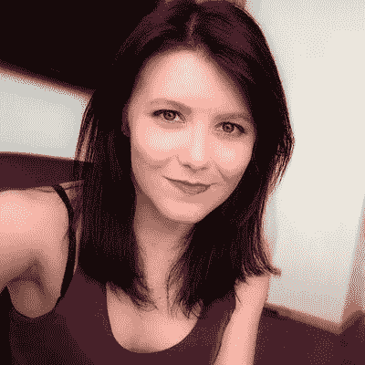

# AMA 和泰勒·莫纳汉在太平洋标准时间今天中午

> 原文：<https://medium.com/hackernoon/ama-with-taylor-monahan-at-noon-pst-today-f7baac69cbed>

## [泰勒是 MyCrypto](https://community.hackernoon.com/t/im-taylor-monahan-ceo-of-mycrypto-ask-me-anything-5-16-12pm-pst/2597/17) 的创始人& CEO，之前曾于 2015 年联合创立 MyEtherWallet。这是[黑客正午社区的第四个](https://community.hackernoon.com/) [AMA](https://community.hackernoon.com/c/ama) 。在这里提出你的问题[。](https://community.hackernoon.com/t/im-taylor-monahan-ceo-of-mycrypto-ask-me-anything-5-16-12pm-pst/2597/17)

[*用泰勒的话说:*](https://community.hackernoon.com/t/im-taylor-monahan-ceo-of-mycrypto-ask-me-anything-5-16-12pm-pst/2597/17)

*我是 MyCrypto 的创始人& CEO，之前在 2015 年联合创立了 MyEtherWallet。*

[*my crypto*](https://mycrypto.com/)*是为数不多的开源以太坊钱包接口，可以让你完全控制自己的密钥，完全控制自己的资产。我们最近还收购了*[*Ambo*](https://itunes.apple.com/us/app/ambo/id1460081235)*背后的团队和产品，这是一款移动以太坊钱包(目前仅适用于 iOS)，旨在让每个人都能理解和使用加密货币。*

*最近我们一直在努力为 MyCrypto 做一些重大的重新设计和功能添加，你可以* [*在这里先睹为快*](https://twitter.com/MyCrypto/status/1109192549611143168) *。希望在接下来的几周能有更多的消息，但是现在，* ***问我任何问题！***

[***我会回来现场回答你所有的问题***](https://community.hackernoon.com/t/im-taylor-monahan-ceo-of-mycrypto-ask-me-anything-5-16-12pm-pst/2597) ***太平洋时间 5 月 16 日中午 12:00。***

*请随意将* [*添加到您的日历中。*](https://calendar.google.com/event?action=TEMPLATE&tmeid=NDYzMWxicnE2dTFjY2hxYzY4YnJja3RnZ2wgYWxpY2lhQHN0YXJmaXNoLm5ldHdvcms&tmsrc=alicia%40starfish.network)

## [加入 AMA。](https://community.hackernoon.com/t/im-taylor-monahan-ceo-of-mycrypto-ask-me-anything-5-16-12pm-pst/2597)

要提名自己或其他人参加[黑客午间 AMA](https://community.hackernoon.com/c/ama) ，请直接在[推特](https://twitter.com/DavidSmooke)或[黑客午间](https://community.hackernoon.com/u/David)上给我发消息。