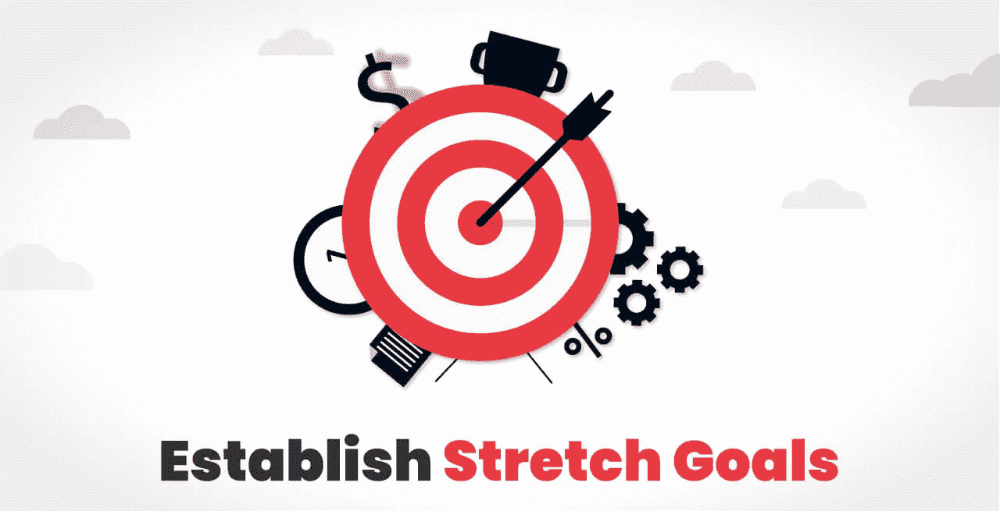

# 设定 2019 年销售团队目标的八步指南

> 原文：<https://medium.com/hackernoon/an-8-step-guide-to-setting-sales-team-objectives-in-2019-987ac8f0f9c4>

当你在设计商业计划时，设定销售目标是一个不可或缺的重要方面，它可能比你想象的还要困难！

一个在设定销售目标时只关注数字的销售经理正在犯一个严重的判断错误！

我并不是说你不应该专注于推动更多的销售和推动整个团队取得成功，但如果你没有一个清晰而强大的计划来实现一系列切实的目标，你和你的团队就不可能实现你为他们设定的神奇目标。

考虑公司的长期目标是很重要的。如果你只是为销售代表设定一些随机的高数字，很有可能他们最终会提供一些糟糕的、无利可图的、高交易量的交易，所有这些都是为了达到这些数字。

这些交易不仅会在短时间内告吹，还可能因为未能兑现或未能充分兑现销售代表的承诺而给你的公司带来坏名声。

这个想法是设置一些激励的数字，而不是设置一些看起来无法实现和令人生畏的目标！

**设定目标的同时变聪明**

在设定目标之前，仔细考虑和研究所有相关数据！

然而，设定目标的黄金法则是设定明智的目标。

*   **具体** —要清楚，要具体。当你设定一个具体的目标时，你很有可能会表现得更好，而不是模糊的目标。
*   **可衡量的** —目标需要是可衡量的。确保目标易于确定，例如将流失率降低 30%，将潜在客户获得率提高 20%等。
*   **可实现的**——不要忘乎所以。如果你为别人设定的目标不切实际，你就是在浪费每个人的时间！
*   **相关**——确保与你的大局相关。当你设定一个商业目标时，确保它与你的商业目标一致
*   **有时间限制的**——设定明确的截止日期。当团队知道为你的目标设定的最后期限或时间范围时，他们会减少拖延，保持在正确的轨道上，并且总是知道他们的进展。

## 一般来说，销售经理设定的销售目标包括以下内容:

*   月度销售目标
*   瀑布目标
*   序列目标
*   活动目标
*   激励目标
*   目标进展
*   延伸目标
*   导师目标

# 如何设定智能销售目标？

1.  [设定你的月度销售目标](https://www.appypie.com/sales-goals-strategies#Set-your-monthly-sales-goal)
2.  [建立你的瀑布目标](https://www.appypie.com/sales-goals-strategies#Establish-your-waterfall-goals)
3.  [对目标进行优先排序](https://www.appypie.com/sales-goals-strategies#Prioritize-the-Goals)
4.  [确立活动目标](https://www.appypie.com/sales-goals-strategies#Establish-activity-goals)
5.  [激励目标](https://www.appypie.com/sales-goals-strategies#Incentivize-the-goals)
6.  [跟踪目标进度](https://www.appypie.com/sales-goals-strategies#Track-the-progress-of-goals)
7.  [建立延伸目标](https://www.appypie.com/sales-goals-strategies#Establish-stretch-goals)
8.  [提出导师目标](https://www.appypie.com/sales-goals-strategies#Propose-mentor-goals)

# 1.设定你的月度销售目标

这一条适用于个人和团队目标。你为自己或团队设定的月度销售目标只有在与年度销售目标一致时才有意义。

要做到这一点，最好的方法是从为公司设定的年度收入目标向后推。

在你计划并定义了你的目标后，你就可以继续计算整个销售部门、较小的团队和单个销售代表需要销售多少，以达到年度收入目标。

在制定这个月销售目标时，重要的是你要考虑到任何季节性波动或人员配备问题。这意味着，如果第三季度有几个新人加入销售团队，你将很难实现销售目标。你应该做的是在 Q2 或第四季度做计划，这样你的年度目标就不会受到影响。

# 2.建立你的瀑布目标

当你为你的员工创建或重新调整销售目标或任务目标时，注意你要给他们一些时间来逐步达到新的目标。给你的团队一个突然的目标只会让他们变得紧张和不知所措。

这意味着，如果你的销售代表一天打 15 个电话，你不能指望他们突然开始一天打 30 个电话。这必须以交错的方式进行，从 15 岁到 18 岁到 20 岁，以此类推。

这样做肯定会对整体士气更好。如果你突然增加 100%的负载，他们很可能无法满足。这真的会降低积极性。

瀑布方法被证明可以产生大量高质量的工作。团队不会因为压力而疲惫和崩溃，因为在达到为他们设定的新目标之前，他们有时间适应不断增加的负荷。

# 3.对目标进行优先排序

无论项目的规模和范围如何，优先顺序是实现目标的关键。这里的想法是首先找出哪些目标在成就上带来最大的价值。

假设你正在为一名初级销售主管设定目标；这将有助于你在有改进余地的地方设定目标。如果他们需要挖掘潜在客户，那么他们的目标应该是每周增加 15%的潜在客户。

当你这样做的时候，你实际上是在对目标进行排序，这意味着如果你的团队不能实现为他们列出的所有目标，他们至少会实现对公司和他们的成功之路最关键的目标。

# 4.建立活动目标

当您向团队中的个人贡献者分配销售目标时，将他们需要达到的数字转化为活动目标是很重要的。

你需要事先做一些基础工作，包括个人在整个销售漏斗中的记录和表现历史。正是在这些信息的基础上，你才能得出他们实现销售数字所需的联系方式、电子邮件、电话或会议的实际数量。

例如，让我们考虑个人平均每月需要完成四笔交易才能达到他们的月度目标。如果他们的业绩历史表明他们的演示有 50%转化为交易，那么他们应该在那个月安排 8 次演示才是合理的。而且，如果他们的电子邮件中有 30%给了他们演示，那么他们应该发出 27 封电子邮件。

当您逆向工作时，您可以很容易地将(看起来似乎是一项艰巨的任务)转化为一个更易于管理的度量标准。

# 5.激励目标

向完成目标或配额的个人提供激励几乎是一种常态。然而，这些激励因情况而异，可以是任何东西，从金钱到代金券，礼物到假期，或者任何你认为可能激励你的团队作为个人和团队表现更好的东西。

如果你是一家初创企业或小型企业，没有预算来提供这些奖励，这是可以理解的。你可以随时提供组织内部的认可或额外的休假时间，作为对员工有利的激励。

# 6.跟踪目标的进展

任何未被跟踪或未被监控的目标都注定会落空，无法实现。如果没有适当的系统，就不可能对其进行监控。

您可以使用 CRM 中的仪表板来监控这一点，或者如果您喜欢用老方法来做这件事，您可以训练您的团队成员在 Excel 电子表格中输入他们的每周数字。

通过这种方式，你可以很快发现那些无法完成每周工作的员工，以免导致无法实现每月目标！

虽然，在短期内，你可能会想跳过这一步，但是相信我，从长远来看，这是值得的。

# 7.建立延伸目标

这一条可能不适合所有人。如果你发现你的一个团队成员在努力实现他们的月度目标时已经遇到了困难，增加一个挑战性目标只会增加焦虑程度。

焦虑永远无助于实现目标！

然而，当你有一个高绩效的员工时，这种方法非常有效。你可以很容易地扩展目标(当然是现实的)，比如 125%。这个百分比应该足以构成一个挑战，激励他们做得更好。

# 8.提议导师目标

如果一个团队成员正在为某个目标而奋斗，或者正在经历一个艰难的阶段(这发生在我们当中最优秀的人身上！)你可以建议他们找一个合适的导师或者导师团队。

创建一个框架，列出你希望他们努力的所有领域，或者建议他们在导师的帮助下自己创建一个框架。

除了他们的经理，当你有一个可以信赖的人时，那会很棒。有时这正是他们茁壮成长所需要的！

# 包扎

在你设定新目标或重温旧目标的过程中，与你的团队成员保持联系，并试图弄清楚他们对事情进展的感受是非常重要的。这样，你就能确保他们对你为他们设定的现有和新的销售目标感到满意。目标应该让他们兴奋，挑战他们，但仍然可以实现。

这是一个设定目标和管理团队的好方法，你也可以[创建自己的移动应用](https://www.appypie.com/)，这样每个人，无论是在办公桌前还是在现场，都可以在同一个页面上，使目标更容易理解和访问。

*原载于 2019 年 4 月 26 日*[*【https://www.appypie.com*](https://www.appypie.com/sales-goals-strategies)*。*