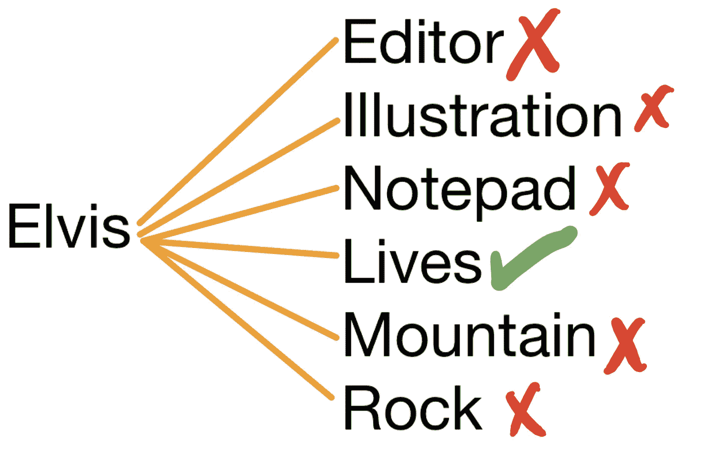
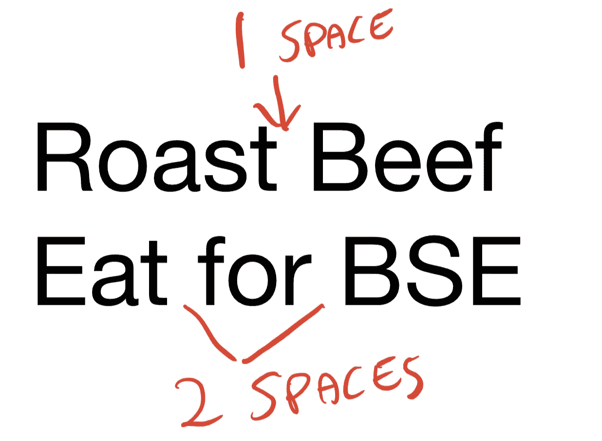
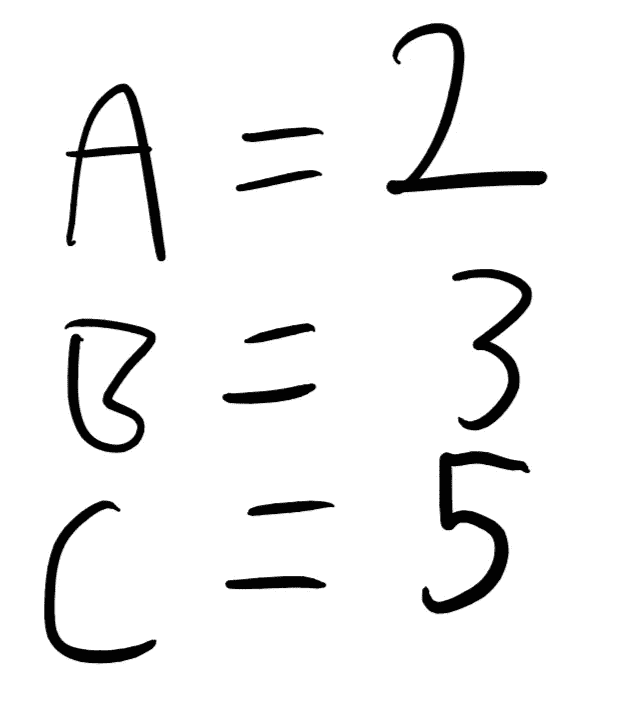
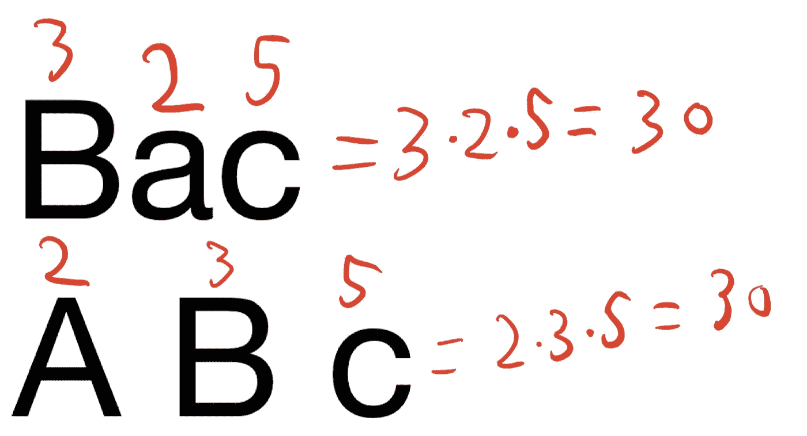

# 一种寻找字谜的算法

> 原文：<https://medium.com/hackernoon/an-algorithm-for-finding-anagrams-2fe7655de85b>

寻找单词的变位看起来并不是一个困难的问题，但有一个有趣的解决方案。

本文已更新。在此处找到更新版本:

 [## 一种寻找字谜的算法

### 寻找单词的变位看起来并不是一个困难的问题，但有一个有趣的解决方案。变位词是一个单词…

skerritt.blog](https://skerritt.blog/an-algorithm-for-finding-anagrams/) 

变位词是一个可以转化成另一个单词或句子的单词或句子。猫王和生命有相同的字母，所以猫王是生命的变位词。

大多数人会立即解决这个问题的方法是拿一个单词，在字典中检查每个单词，看看字母组合是否完全匹配。

这样做的方法将使用一个*多重集*。*集合*就像数组一样，顺序无关紧要，不允许重复。对于数组，[a，b]与[b，a]不同。但是用一个集合，(a，b)和(b，a)是一样的。

集合不允许重复。所以(a，a，a，a，a，b)和(b，a)是一样的——因为第一个集合会变成(a，b)。

一个*多集*是一个允许重复的集合，但是顺序无关紧要。对于这个例子，让我们从小处开始。

在我们的例子中，我们有一个名为字典的列表，字典中的每一项都是一个单词。我们想找出这些单词中哪些是“猫王”的变位词，所以我们要做的是像这样在字典中循环:

Note: this isn’t how multisets work in Python, but I’m mainly using this to illustrate a point. You can find out how multisets work [here](https://dbader.org/blog/sets-and-multiset-in-python).

You, probably.

你说得对。这真的很慢。这是可行的，但是我们有两个问题。第一个问题是，资本化不会使多重集相等。第二个问题是，输出的句子中出现的空格会比原始单词中出现的多。

例如，“烤牛肉”是“为疯牛病而吃”的变位词。

给定两个句子，如“烤牛肉”和“吃牛海绵状脑病”，如果我们将它们转换成多重集，它们将不会相等，因为空格的数量不同。还有另一种方法可以计算两个句子是否是彼此的变位。算术的基本定理是:

> 每个整数或者本身是一个质数，或者可以表示为质数的乘积，而且，这种表示是唯一的，即因子的顺序。

质数是只有两个因子的数字——数字本身和 1。

如果我们给字母表中的每个字母分配一个质数，就像这样:

依此类推，然后计算这些数的乘积，这个数是唯一的，因为算术的基本定理。

这意味着对于一个多重字母集，多重字母集中每个字母的质数乘积是唯一的。如果两个单词或句子有相同的数字，这两个单词或句子是彼此的变位词。让我们看一个简单的例子，“BAC”是“A Bc”的变位词吗？

确定哪些单词是其他单词的变位词就像创建一个{ Word:Prime factorization }字典一样简单，然后将所有的质因数分解分组。

现在，给定两个句子，我们可以很容易地判断它们是否是彼此的变位组合。

## 你喜欢这篇文章吗？在社交媒体上与我联系，讨论所有与计算机科学相关的事情😁

[推特](https://twitter.com/brandon_skerrit)|[insta gram](http://instagram.com/brandon.codes)|[LinkedIn](https://www.linkedin.com/in/brandonls/)

别忘了点击那个👏拍手声👏按钮，以示感谢！

我写这篇文章没有得到报酬。如果你想支持我或喜欢这篇文章，请随时给我买杯茶或下面的东西😍✨

 [## 用贝宝支付布兰登·斯凯里特。我

### 去 paypal.me/BrandonSkerritt 输入金额。既然是 PayPal，那就简单又安全。没有 PayPal…

www.paypal.me](https://www.paypal.me/brandonskerritt)  [## 通过 Monzo.me 即时支付 Brandon

### 点击链接向布兰登付款。你不需要创建一个账户，而且完全免费。

monzo.me](https://monzo.me/brandonskerritt)