# 高频再平衡分析——一种全新的密码组合管理策略

> 原文：<https://medium.com/hackernoon/an-analysis-of-high-frequency-rebalancing-a-new-strategy-for-crypto-portfolio-management-da95fe7d4fd4>

在过去一年半的时间里，我们的团队已经成为加密市场投资组合再平衡领域公认的全球领导者。执行超过 3.5 亿美元的再平衡，[***Shrimpy***](https://www.shrimpy.io/)**已经俘获了成千上万加密货币交易者的心。我们不仅介绍了重新平衡作为普通加密用户的可行选项，我们的研究还导致了一种新策略的探索——高频重新平衡。**

*如果你是新的平衡者， [**注册一个免费的 Shrimpy 账户**](https://www.shrimpy.io/) 和 [**加入我们的电报组**](https://t.me/shrimpygroup) 来了解最新的研究。我们还推荐阅读我们在这里发表的第一批文章之一:*

* [## 加密货币的投资组合再平衡

### 投资组合再平衡是投资者使用了几十年的策略。首先，投资者必须确定如何…

hackernoon.com](https://hackernoon.com/portfolio-rebalancing-for-cryptocurrency-7a129a968ff4) 

我们的团队分析了去年几十万个不同投资组合的表现。我们发现历史上表现最好的再平衡期在 1 小时到 1 天之间。这项研究将调查这些日内再平衡周期，以确定 1 小时到 1 天之间的再平衡历史表现如何。目标是更好地描述高频再平衡的特征。

虽然周期性再平衡在历史上表现异常，但最近的研究也指出，阈值再平衡优于周期性再平衡。你可以在这里找到这些研究之一:

 [## 加密货币再平衡策略的最佳阈值

### 这项研究将成为加密货币投资组合基于阈值的再平衡的首次主要分析。的…

blog.shrimpy.io](https://blog.shrimpy.io/blog/the-best-threshold-for-cryptocurrency-rebalancing-strategies) 

在我们深入研究结果之前，了解这项研究是如何建立的是很重要的。我们的数据来源、回溯测试限制和配置都会影响我们获得的结果。没有这些信息，很难弄清我们是如何得出结论的。如果你迫不及待地想要得到结果，可以直接跳到“结果”部分。

## 贸易和数据

从币安交易所收集了他们支持的每一对资产的完整的一年的精确买卖市场数据。从 2018 年 5 月 3 日**开始，到 2019 年 5 月 3 日**结束，这些精确的数据被用于评估重新平衡执行时的具体交易。

本研究模拟交易时，计算中考虑了 0 . 075%的**标准费用。这是目前币安用户的最高交易费，他们已经启用了**使用 BNB 收费**。由于这是用户在 [Shrimpy 应用](https://www.shrimpy.io/)上最常见的情况，我们将把它作为我们的基本费率。在每次回溯测试中，这笔费用将在每笔交易中收取。所以，从 LTC 到 XMR 的交易会从 LTC 到 BTC，然后从 BTC 到 XMR。在这种情况下，两笔交易都产生了 0.075%的费用。其结果是一个在实时交易场景中如何收取费用的精确模型。**

如上所述，我们的回溯测试使用从交易所收集的**实际买卖数据**。这些数据提供了 CoinMarketCap 等其他数据源所不具备的精确性。其结果与投资组合再平衡过程中实际发生的情况非常接近。

最后，我们的研究没有试图将传统市场的分析应用于加密货币。这两个市场在许多方面是不同的，这意味着我们不能总是将传统的市场研究应用于加密领域。试图这样做可能会导致不准确的结论。

> 注意:人们最近发表了一些研究，这些研究使用 CoinMarketCap 数据来评估交易策略的表现。CoinMarketCap **不**提供买卖数据，而是**不应**用于分析交易策略的汇总数据。对 CoinMarketCap 数据进行回溯测试**将**导致非常不正确的结果、糟糕的结论和潜在的资金损失。

## 再平衡期

这项研究将评估从 **1 小时到 1 天**的日内再平衡周期。从 1 小时开始，将评估每一整小时，直到我们达到 24 小时的重新平衡期。这意味着我们将每隔 1 小时、2 小时、3 小时、…、23 小时和 24 小时检查一次重新平衡。

重新平衡期是指每次重新平衡之间的具体时间。因此，24 小时的重新平衡周期将导致每天在完全相同的时间进行重新平衡。改变这一时间段将有助于我们确定再平衡的频率是否在历史上影响了投资组合的表现。 [**了解有关加密货币再平衡的更多信息**](https://hackernoon.com/portfolio-rebalancing-for-cryptocurrency-7a129a968ff4) **。**

## 资产选择和分配

从 2018 年 5 月 3 日**到 2019 年 5 月 3 日**在币安可用的所有资产都包括在本研究中，除了以下资产:美元、USDT、TUSD、PAX、USDC、USDS。

在投资组合构建过程中，从币安的可用资产池中随机选择资产，创建一个包含 10 项资产的投资组合。在整个回溯测试中，每个投资组合都保持了**平均加权分配**。这意味着，在每次再平衡活动结束时，每项资产都持有投资组合总价值的 10%。

除了固定每个投资组合的资产数量之外，我们的研究还将每个投资组合的初始价值固定为**5000 美元**。

虽然我们的研究随机选择资产，但我们强烈反对将此作为创建投资组合的策略。 [**了解如何成功构建强大的投资组合**](https://hackernoon.com/10-tips-for-creating-a-killer-cryptocurrency-portfolio-447f1a191a9c) **。**

## 回溯测试

回溯测试是对一组给定的数据进行策略执行模拟的过程。这有助于证明一项战略的可行性，而不需要使用真正的资金进行测试。在这项研究中，我们使用回溯测试来比较高频投资组合再平衡与简单的买入并持有策略的结果。对于每个重新平衡频率，我们运行一组 1000 个回溯测试。这使我们能够通过绘制所有这些回溯测试的结果来发现投资组合表现的趋势和模式。 [**阅读更多关于回溯测试的内容，或者自己运行**](https://hackernoon.com/the-crypto-portfolio-rebalancing-backtest-tool-66563cf2f18b) **。**

# 结果

在从 1 小时到 24 小时的每个小时重新平衡周期运行回测后，我们绘制了 1，000 次回测的中值性能图。我们发现的是下图。

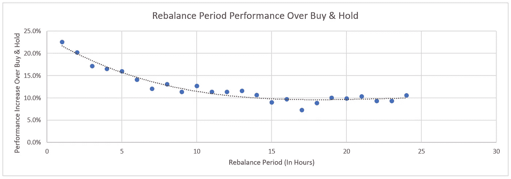

Each data point represents the median performance of 1,000 backtests. The x-axis represents the rebalance period used for each set of backtests, ranging from 1 hour to 24 hours. The y-axis is the performance increase over buy and hold. A performance increase of 10% therefore means rebalancing performed 10% better than buy and hold at that rebalance period.

这些结果表明，在更短的重新平衡周期内，性能有明显的提高趋势。随着再平衡期的延长，我们观察到相对于买入并持有，业绩增长稳定在 10%左右。通过缩短重新平衡周期，我们发现在 1 小时的重新平衡周期中，中值性能提高到 22.55%。

在无数评估再平衡性能的研究中，在更短的再平衡周期内性能提高的趋势再次出现。例如，我们之前评估交易费用对再平衡绩效影响的研究发现，较低的交易费用倾向于将最佳再平衡期向较短的再平衡期转移。

 [## 加密投资组合再平衡:交易费用分析

### 这项研究将进一步研究交易费用及其对投资组合表现的影响。

hackernoon.com](https://hackernoon.com/crypto-portfolio-rebalancing-a-trading-fee-analysis-eb9a34f692ac) 

除了交易费用对业绩的影响，我们还发现，流动性较高的交易所也倾向于更短的再平衡期。以下研究比较了 Bittrex 和币安上的重新平衡。

 [## 交易所流动性——一项比较研究

### 在这项研究中，我们将看看外汇流动性对基本再平衡投资组合的影响…

blog.goodaudience.com](https://blog.goodaudience.com/exchange-liquidity-a-comparative-study-e184ef7162f) 

对于这项研究，我们应该记住的最后一个关键特征是投资组合规模对业绩的影响。我们的回溯测试发现，当使用更多样化的投资组合时，再平衡期越短，表现越好。

 [## 投资组合多样性:技术分析

### 多元化给投资组合增加了多少价值？

hackernoon.com](https://hackernoon.com/portfolio-diversity-a-technical-analysis-c2c49f4d3a77) 

# 详细结果

以下结果评估了从 1 小时再平衡期到 24 小时再平衡期的每个再平衡期。

## 1 小时重新平衡期

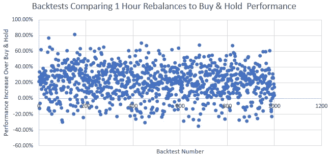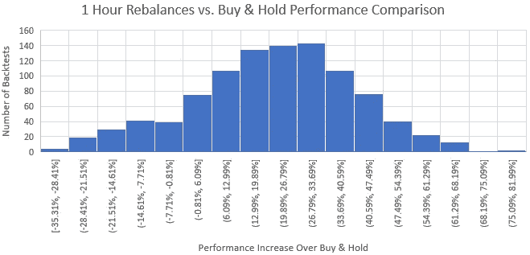

> 85.90%的投资组合表现优于买入并持有。

> 相对于买入并持有的业绩增长中值: **22.55%**

## 2 小时重新平衡期

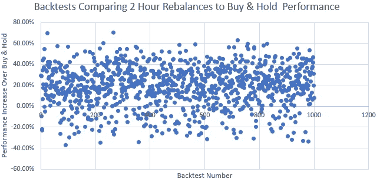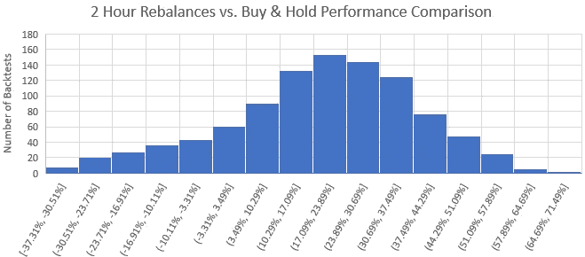

> 83.90%的投资组合跑赢买入并持有。

> 相对于买入并持有的业绩增长中值: **20.29%**

## 3 小时重新平衡期

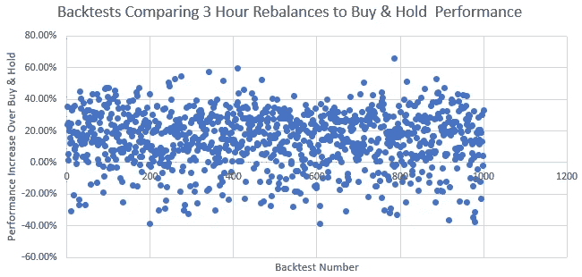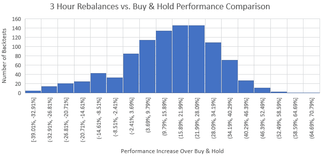

> 82.50%的投资组合跑赢买入并持有。

> 相对于买入并持有的业绩增长中值: **17.18%**

## 4 小时重新平衡期

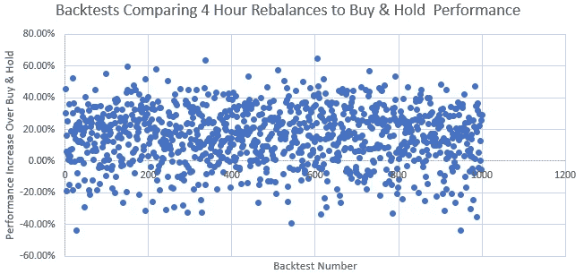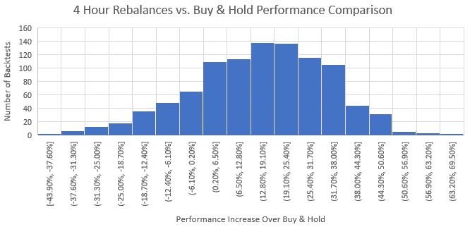

> 81.20%的投资组合跑赢买入并持有。

> 相对于买入并持有的业绩增长中值: **16.65%**

## 5 小时重新平衡期

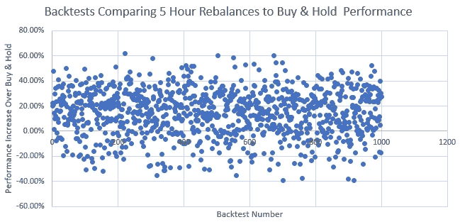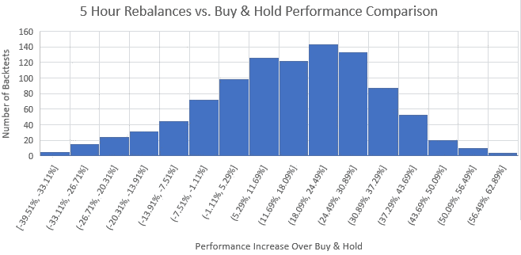

> 78.40%的投资组合表现优于买入并持有。

> 相对于买入并持有的业绩增长中值: **16.01%**

## 6 小时再平衡期

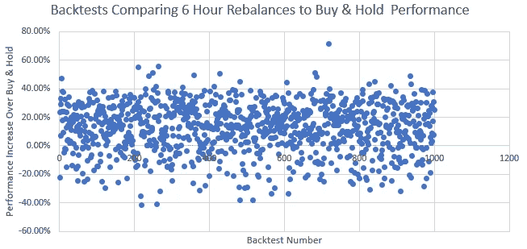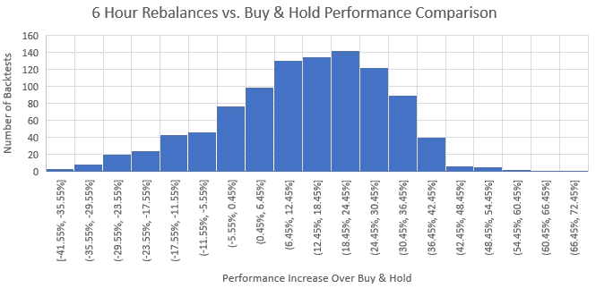

> 78.60%的投资组合跑赢买入并持有。

> 相对于买入并持有的业绩增长中值: **14.11%**

## 7 小时重新平衡期

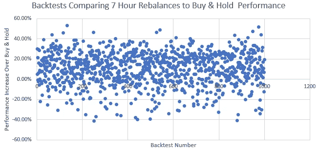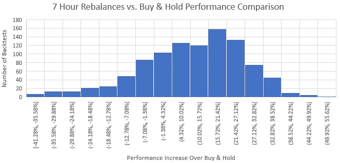

> 75.40%的投资组合表现优于买入并持有。

> 相对于买入并持有的业绩增长中值: **12.15%**

## 8 小时再平衡期

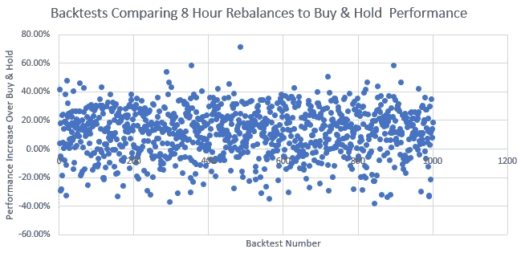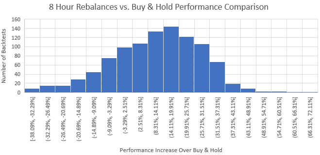

> 76.10%的投资组合跑赢买入并持有。

> 相对于买入并持有的业绩增长中值: **13.19%**

## 9 小时重新平衡期

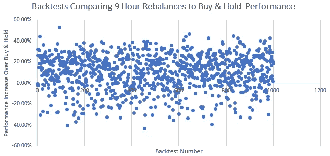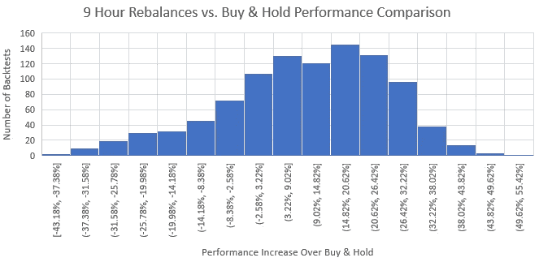

> 74.40%的投资组合跑赢买入并持有。

> 相对于买入并持有的业绩增长中值: **11.43%**

## 10 小时重新平衡期

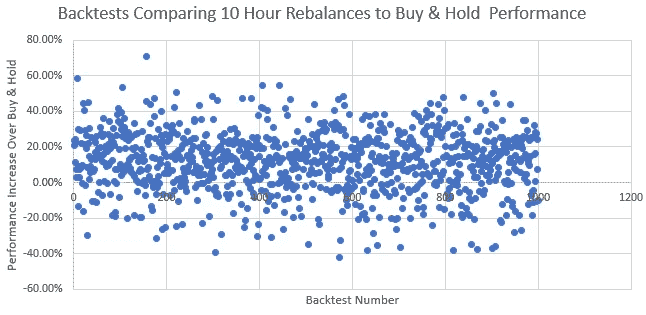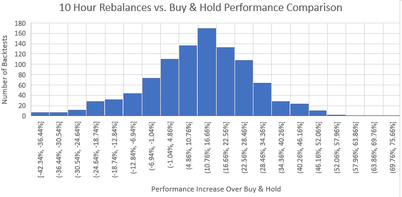

> 77.00%的投资组合表现优于买入并持有。

> 相对于买入并持有的业绩增长中值: **12.75%**

## 11 小时重新平衡期

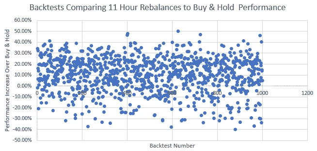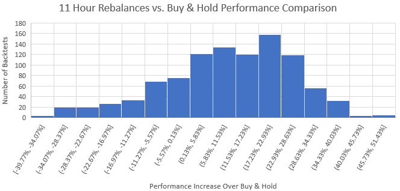

> 75.10%的投资组合跑赢买入并持有。

> 相对于买入并持有的业绩增长中值: **11.37%**

## 12 小时重新平衡期

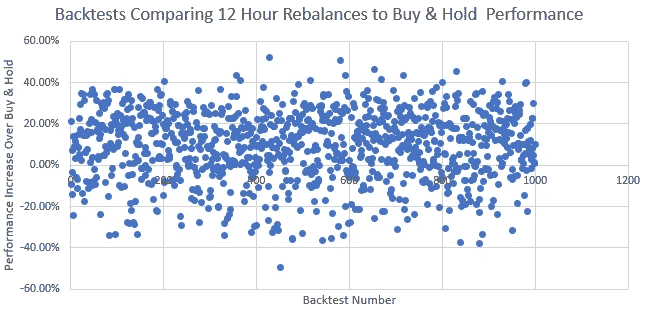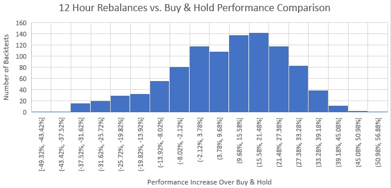

> 72.30%的投资组合跑赢买入并持有。

> 相对于买入并持有的业绩增长中值: **11.34%**

## 13 小时重新平衡期

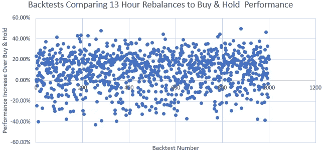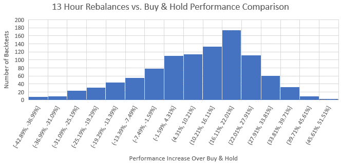

> 72.20%的投资组合跑赢买入并持有。

> 相对于买入并持有的业绩增长中值: **11.69%**

## 14 小时重新平衡期

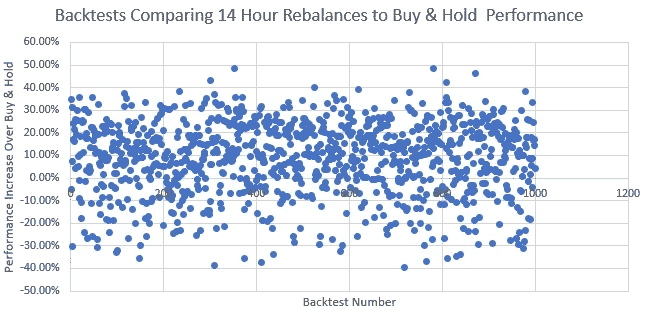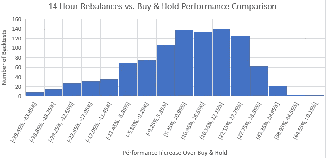

> 73.00%的投资组合表现优于买入并持有。

> 相对于买入并持有的业绩增长中值: **10.74%**

## 15 小时重新平衡期

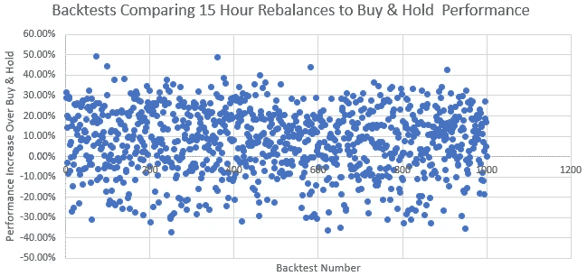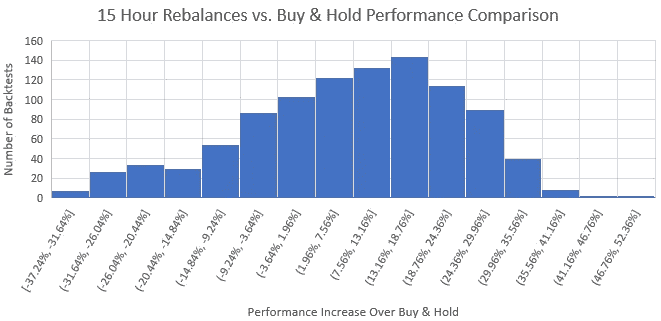

> 68.90%的投资组合跑赢买入并持有。

> 相对于买入并持有的业绩增长中值: **8.99%**

## 16 小时再平衡期

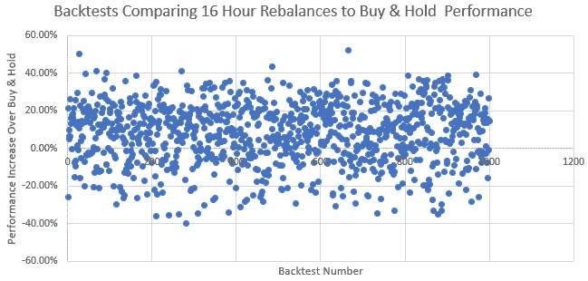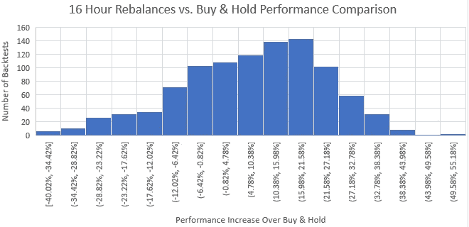

> 69.90%的投资组合表现优于买入并持有。

> 相对于买入并持有的业绩增长中值: **9.77%**

## 17 小时重新平衡期

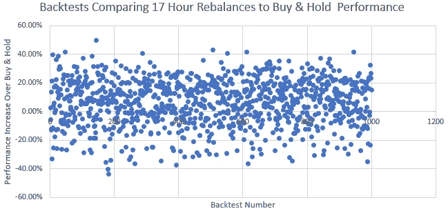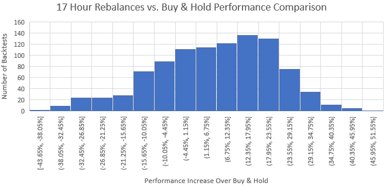

> 65.10%的投资组合跑赢买入并持有。

> 相对于买入并持有的业绩增长中值: **7.39%**

## 18 小时重新平衡期

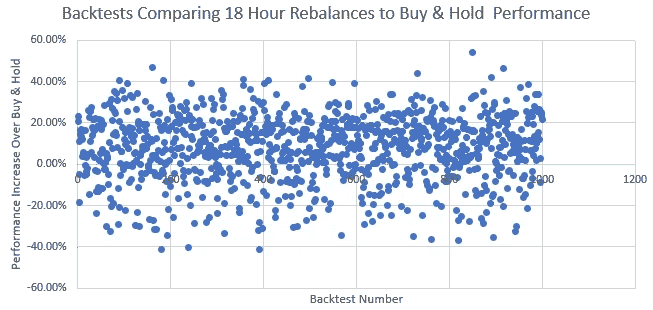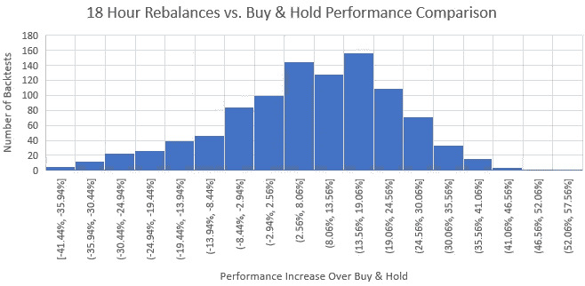

> 71.50%的投资组合跑赢买入并持有。

> 相对于买入并持有的业绩增长中值: **8.90%**

## 19 小时重新平衡期

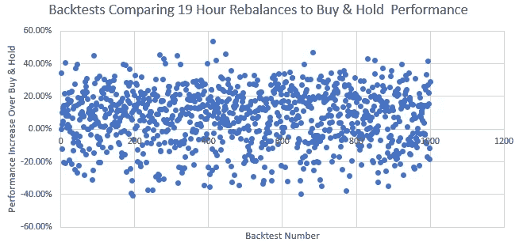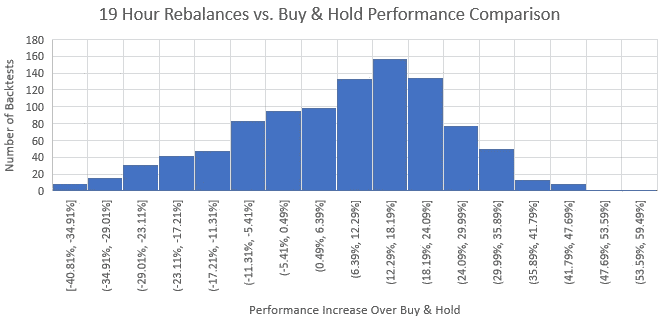

> 68.10%的投资组合跑赢买入并持有。

> 相对于买入并持有的业绩增长中值: **10.02%**

## 20 小时再平衡期

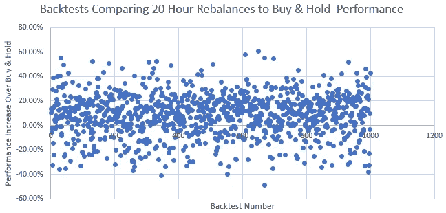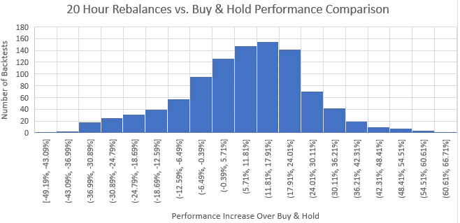

> 72.10%的投资组合跑赢买入并持有。

> 相对于买入并持有的业绩增长中值: **9.88%**

## 21 小时重新平衡期

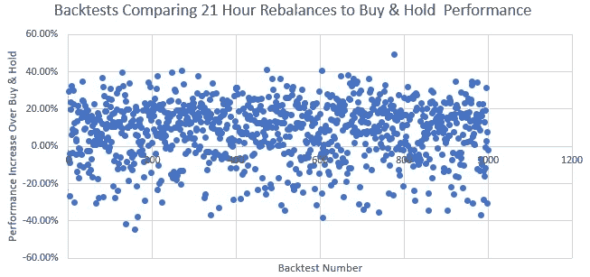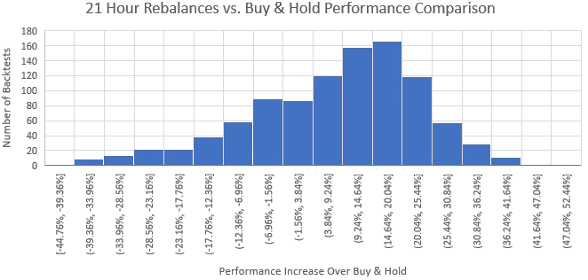

> 72.70%的投资组合跑赢买入并持有。

> 相对于买入并持有的业绩增长中值: **10.41%**

## 22 小时再平衡期

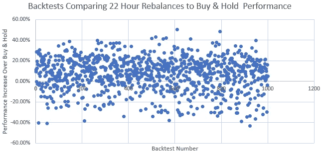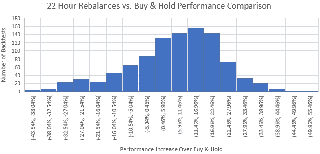

> 72.00%的投资组合表现优于买入并持有。

> 相对于买入并持有的业绩增长中值: **9.41%**

## 23 小时再平衡期

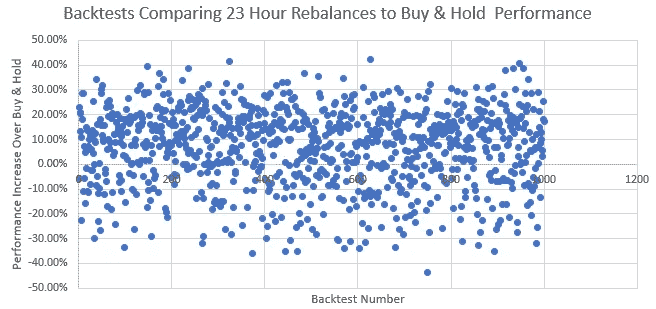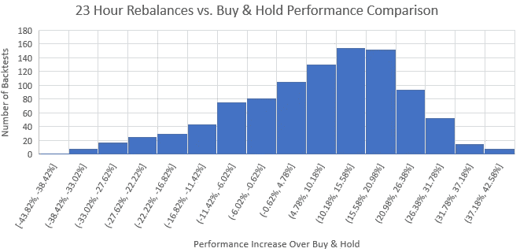

> 70.30%的投资组合跑赢买入并持有。

> 相对于买入并持有的业绩增长中值: **9.34%**

## 24 小时重新平衡期

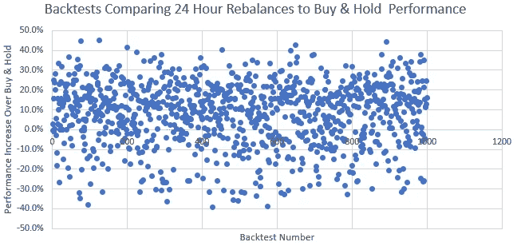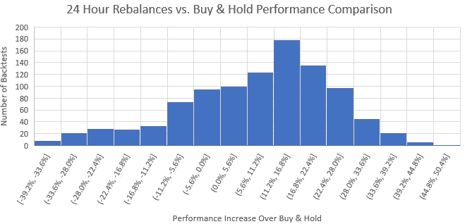

> 71.00%的投资组合表现优于买入并持有。

> 相对于买入并持有的业绩增长中值: **10.6%**

# 结论

高频再平衡是一种新的加密货币投资组合策略，由 [**Shrimpy 应用**](https://www.shrimpy.io/) 推向市场。当在高流动性和低费用的交易所实施再平衡策略时，短的再平衡周期在历史上是最佳的，这一发现为密码交易者参与市场开辟了新的途径。Shrimpy 能够自动利用加密货币的波动性，而不是随着市场变化手动调整头寸。

在这项研究中，我们的结果与我们之前所有关于再平衡性能的出版物非常一致。我们发现较短的再平衡周期优于较长的再平衡周期，直到 1 小时的频率。结果表明，1 小时的再平衡期是本研究中检验的一年时间内的最佳时间。

> 一小时的再平衡期比买入并持有高出 22.55%。

> 免责声明:回溯测试检查过去的表现，并不保证未来的表现。

# 关于虾皮

[**Shrimpy**](http://shrimpy.io/) 是一个自动化的加密交易&投资组合管理工具，让用户只需点击几下鼠标就能自动化他们的加密投资组合。Shrimpy 还支持应用程序开发人员使用的最先进的交易 API。

## Shrimpy 应用

 [## Shrimpy —加密货币投资组合管理

### 管理您的数字资产的最简单、最值得信赖的方式。

www.shrimpy.io](https://www.shrimpy.io/) 

[**Shrimpy App**](https://www.shrimpy.io/)**是面向加密货币和数字资产所有者的免费投资组合管理解决方案。通过其独特的指数和再平衡引擎，Shrimpy 允许交易者管理他们的加密资产，类似于传统的指数基金。通过提供一个简单的被动管理解决方案，Shrimpy 为用户提供了一个有效的长期解决方案来管理他们的加密资产，而不必进行交易。**

## **Shrimpy API**

** [## 面向开发者的加密交易 API

### 业界领先的加密交易、实时数据收集和交易账户管理 API。

developers.shrimpy.io](https://developers.shrimpy.io/) 

[**Shrimpy 的加密交易 API**](https://developers.shrimpy.io/) 是作为一个基于云的解决方案创建的，以解决几个加密开发者的障碍，包括**交易所交易**、**产品可扩展性**和**用户管理。**有了 Shrimpy 的 API 在手，开发人员可以利用我们现有的交易基础设施和免费的实时数据进行应用开发，而不是独自管理与每个交易所的连接。

## 共同记录本

[coinordebook](https://www.coinorderbook.com/)是一个免费的加密货币市场数据提供商，它利用 Shrimpy 开发人员 API 来收集实时市场数据。除了交易所资产清单，[**coin orderbook**](https://www.coinorderbook.com/)分析套利机会、订单数据、交易对价差。

*~捕虾队*** 

***原载于 2019 年 5 月 9 日*[*https://blog . shrimpy . io*](https://blog.shrimpy.io/blog/an-analysis-of-high-frequency-rebalancing)*。****