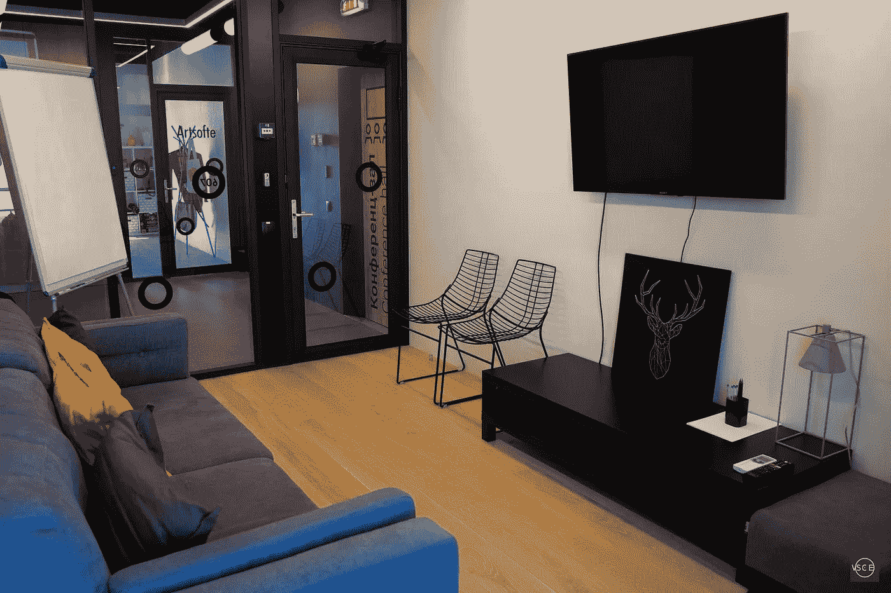
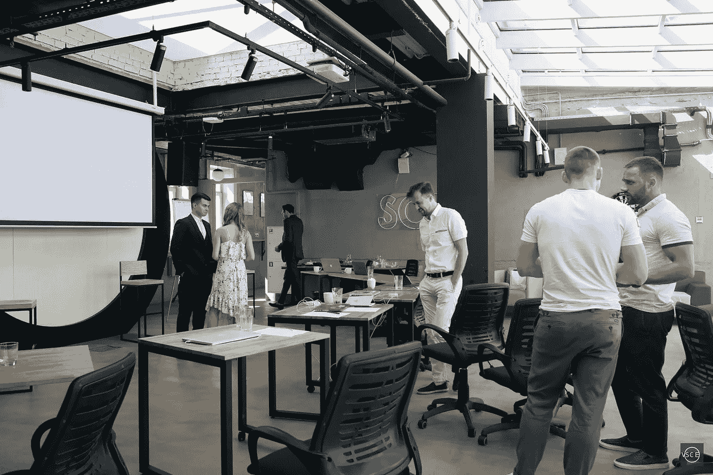
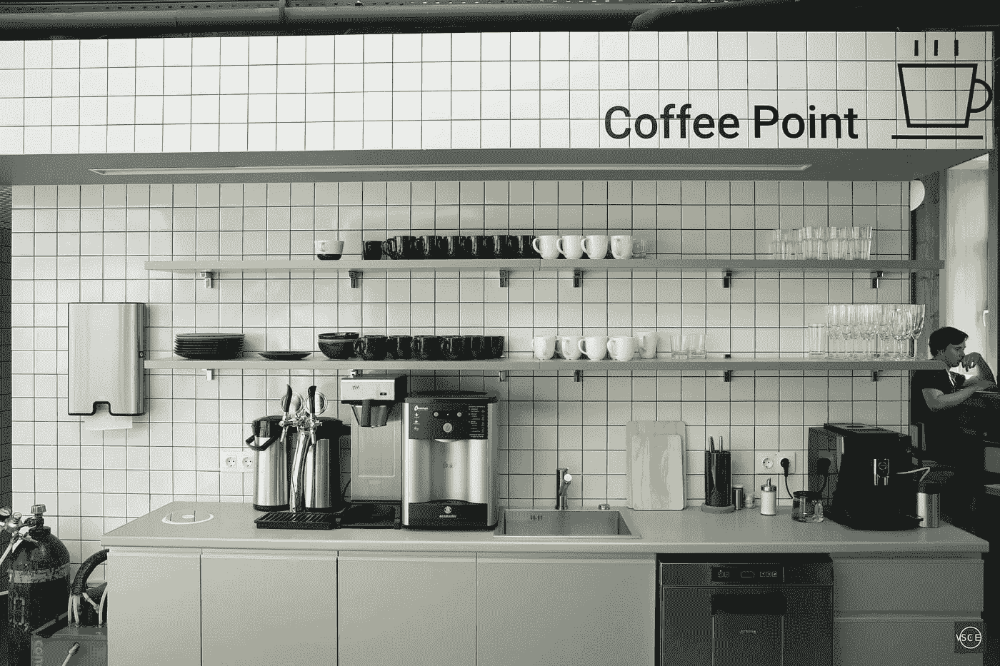

# 莫斯科充满活力的合作文化内景:SOK Kurskaya

> 原文：<https://medium.com/hackernoon/an-inside-look-at-moscows-vibrant-coworking-culture-sok-kurskaya-690bf95631f6>

*The spectacular rooftop working and dining area* © Photo by [Dmitry Kabanov](https://medium.com/u/a1d1c2e0a44f?source=post_page-----690bf95631f6--------------------------------)

在过去的几年里，俄罗斯首都成为了 100 多万新居民的家园，这些新居民是由这座城市的高薪工作带来的，包括科技创业公司、电信和媒体公司提供的工作。

莫斯科拥有数字游牧者想要的一切，包括许多合作空间。这个叫 SOK 的一定会让你印象深刻。

SOK 背后的人已经做了研究，探索了以色列、英国和德国的最佳合作空间。他们接触了 WeWork 和 Mindspace，并从他们的经历中学习。

他们利用政府数据来定义“商业活动高峰期”并选择最佳地点。他们雇佣了不止一个，而是几个设计工作室和设计局，将他们对完美合作体验的愿景带入生活。

*The view from the rooftop* © Photo by [Dmitry Kabanov](https://medium.com/u/a1d1c2e0a44f?source=post_page-----690bf95631f6--------------------------------)

本质上，索克的 Kurskaya 位置是传统办公空间的样子，如果它是为了促进租户之间的合作而设计的。

它结合了传统和开放空间楼层规划的元素，拥有可容纳 12 人的智能办公室。

*A common working area on the 7th floor: outlets, desks and lots of light* © Photo by [Dmitry Kabanov](https://medium.com/u/a1d1c2e0a44f?source=post_page-----690bf95631f6--------------------------------)

智能办公室允许在必要时不间断工作，同时仍然提供对公共空间的方便访问。直观的基础架构管理和透明的访问控制使团队重新定位变得轻而易举。

这种流动性是这个概念的一个重要部分——你可以很容易地为一个项目组建一个团队，然后在传统办公室的安全环境中完成它。

*Is this a lounge? Is this a meeting room? Why can’t it be both?* © Photo by [Dmitry Kabanov](https://medium.com/u/a1d1c2e0a44f?source=post_page-----690bf95631f6--------------------------------)

每个区域都经过精心装饰。工作空间是不受干扰的，休息室是为社交和放松而设计的。根据您的需求，这里有一系列会议室，可以进行严肃的谈判，也可以与您的商业伙伴进行友好的交谈。

*This event space can fill up to 100 people* © Photo by [Dmitry Kabanov](https://medium.com/u/a1d1c2e0a44f?source=post_page-----690bf95631f6--------------------------------)

每层都有一个厨房，屋顶上有一个自助小吃店，一个指定的“饮料”区和一个免费用于公共活动的开放空间。

*Come here on Tuesday and Thursday nights for a pint of local draft beer. Or any other time for a cup of coffee*

SOK Kurskaya 空间本应是一个试验场，供日后大规模实施的想法使用。这项实验证明是成功的，组织者很快就开放他们的新地点。

**关于作者:**

> *Dmitry 与品牌合作，创建内容并大规模推广企业文化。他是 Techstars Startup Digest 的元老之一。除此之外，他还担任 SXSW Pitch 活动和 SXSW Release IT 活动的顾问。*
> 
> startupdigestmail.com