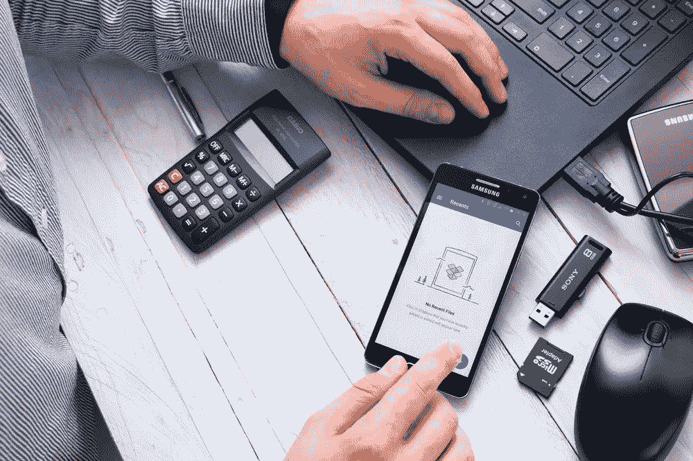
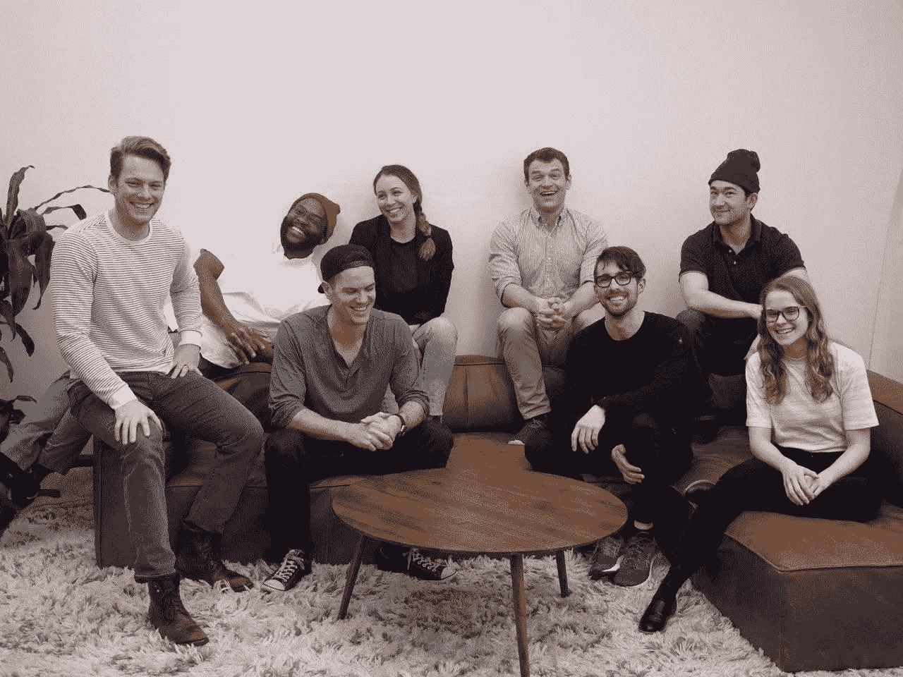
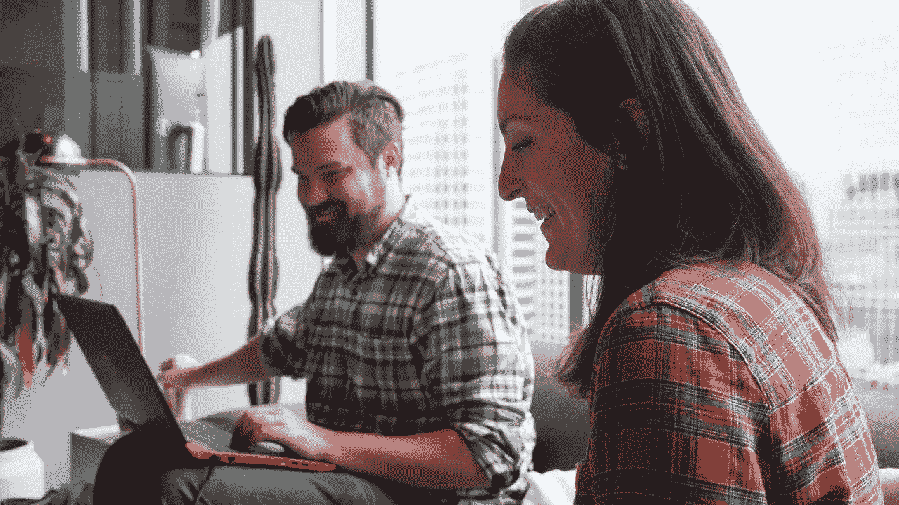

# 一个鼓舞人心的故事:移动优先的方法是一个成功的游戏计划

> 原文：<https://medium.com/hackernoon/an-inspiring-story-of-mobile-first-approach-as-a-winning-game-plan-a81530b6e400>

**A 2018 study in Ireland found that local consumers checked their phones 55 times per day on average (Mobile Consumer Survey, Deloitte).** Photo credit: Shutterstock

阿里巴巴创始人、中国首富马云说:“没有明天的专家，只有昨天的专家。”。

当[肯尼·克莱恩](https://www.linkedin.com/in/kennykline/)和一个朋友在 2014 年创立他们的营销机构时，这两位企业家带着笔记本电脑来到咖啡店，并经常在纽约一间狭小的公寓里挑灯夜战。

数字营销在**是出了名的竞争**，而这两个白手起家的公司的前景充其量看起来也只能算中等。

# **移动优先的游戏计划**

喝着深夜拿铁咖啡， [JAKK Media](https://jakk.media/) 的创始人坚持他们的信念:未来属于那些能够通过 iPhones、三星设备和小屏幕交流*和娱乐*的营销人员。这位前麦肯锡公司(McKinsey)顾问和哥伦比亚商学院(Columbia Business School)毕业生将农场赌在了未来:一种移动优先的方法(T21)，为企业客户创造用户参与。

**Mr. Kenny Kline (far left), managing partner of a marketing agency that he co-founded in 2014, leads 30 employees in Brooklyn, N.Y. and Austin, Texas. He says brands should adopt a mobile-first strategy in everything they do or risk getting left behind by innovative marketers.** Photo credit: K. Kline

M . r . Kline(实习五年后)现在领导着纽约布鲁克林和德克萨斯州奥斯汀的 30 名员工。他对品牌有什么建议？

> 我们的秘方是，与桌面相比，人们在移动设备上参与内容的方式有所不同。智能手机用户想要笑声、乐趣和刺激。品牌迷失在铺天盖地的噪音中，甚至一大笔预算也可能落空。他们必须争夺观众的 ***缩短注意力跨度*** 。

杰克的共同创始人指的是那些被游戏、推特、聊天应用、电话和短信以及其他看似紧急的任务全天候打断的成年人和孩子。这些导致*给**的不引人注目的***消息被忽视——就像昨天的黑白报纸一样。

**Web surfers are spending less time on desktop to find content. Mobile traffic was 70% of all web traffic in 2018, according to AdWeek. Thus, consumer habits are clearly evolving.** Photo credit: Shutterstock

# **智能手机使用的指数级增长**

根据 2018 年 AdWeek 调查，消费者现在每天在移动设备上花费五个小时，占所有网络流量的 70%。移动视频的使用同比增长了 88%。

但是如果你的面向手机的内容或基础设施不好，所有的(潜在)流量将很快消失。例如，如果页面加载时间超过三秒，一半(53%)的站点访问会被放弃。当涉及到电子商务时，谷歌发现**一秒钟的延迟可以减少 20%的转化率**。

教训是:数字人群*极度不耐烦*，人们要求通过**引人注目的内容**或报价获得即时满足。

Twitter [Kenny Kline](https://medium.com/u/b9ad4f9c1557?source=post_page-----a81530b6e400--------------------------------)

K line 表示，公司必须忘记过去的趋势，创新的营销方式是当今移动时代的关键。

尽管趋势很有说服力，但大多数公司仍然优先考虑台式机。可能是 ***抗拒改变*** *而另一些是* ***无法适应*** *。我看到太多的品牌被抛在后面，尤其是在与不怕试错的破坏性营销人员竞争时。*

# **引人注目的内容作为竞争优势**

即使我们生活在信息时代，杰克的共同创始人说信息是不够的。他建议品牌尝试创造性的方法来抓住人们的注意力。

在过去的十年里，移动营销逐渐颠覆了电视、广告牌和报纸等传统渠道。因此，广告实践中的结构性转变为遵循移动优先游戏计划的企业创造了机会。

此外，注意力是新的财富。它代表流量和参与度，其中一部分转化为销售额。其中一部分导致了业务的重复。“最好的营销感觉不像营销，”著名营销人汤姆·菲什伯恩说。

尽管噪音很大，但要让信息从一个小小的电子屏幕辐射到**并接触或影响一个人，需要**打破常规的思维**和大胆的设计。**

他的团队表现如何？

> 今天，我们的网站每月有数百万的访问者，超过 60%的流量来自手机。我们希望手机用户说，‘哇，这是**难以置信的内容！**’。其次，在线材料必须针对手机屏幕进行优化。

当你有十几个公司账户时，现在的咖啡味道如何？肯尼·克莱恩笑了。“更美味。因为你对一切都心存感激——不管是生意还是其他。”

当**愿景与现实**相符时，世界认为你*是专家*。

**“The best marketing doesn’t feel like marketing,” says Tom Fishburne, a well-known marketer.** Photo credit: K. Kline