# 数字图像文本分类中的形态学操作介绍

> 原文：<https://medium.com/hackernoon/an-introduction-to-morphological-operations-for-digital-image-text-classification-79cb14bab2d7>

*在你开始之前，确保按照文章使用 Colab 笔记本进行* [*行数*](https://colab.research.google.com/github/sthalles/computer-vision/blob/master/project-3/CountLines.ipynb) *和* [*字数*](https://colab.research.google.com/github/sthalles/computer-vision/blob/master/project-3/CountWords.ipynb) *。*

给定一个数字化的文本文档图像，人们可能会问的一个常见问题是？

*如何定位和统计文档中的行数和字数？*

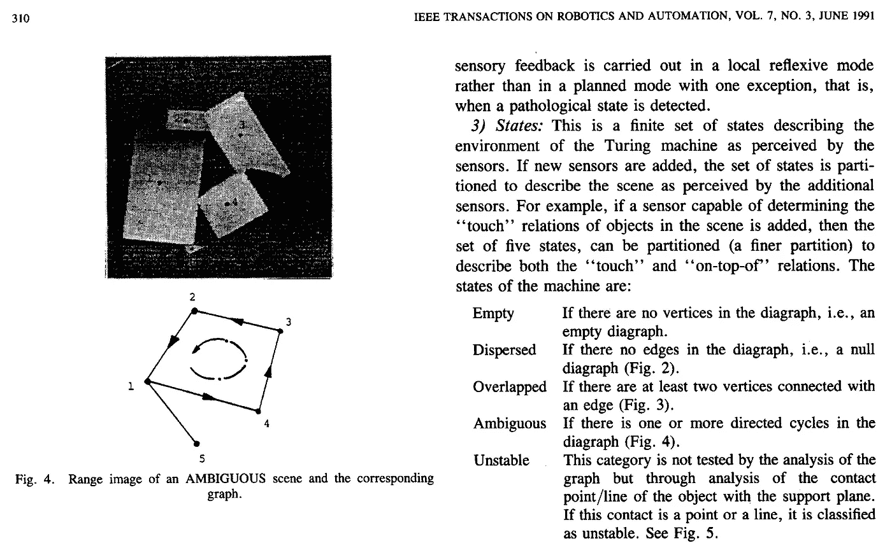

How can we take a digitilized input image like this and count the number of words and lines on it?

为了回答这个问题，我们描述了一种在数字化文本图像中定位线条及其相应单词的方法。该方法基于数字图像形态学操作。你可以在封面图片中看到字数统计结果。

## 形态学图像处理

总之，形态学运算是一组图像处理算法，它使用预定义的核来作用于图像像素。这些被称为结构化元素的内核定义了用于处理图像的模式。下面，你可以看到一些常见结构元素的例子。

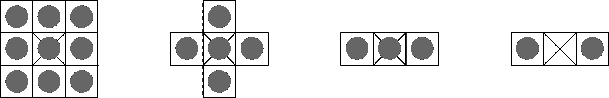

你可以把这些元素想象成简单的矩阵。这里，黑色圆圈代表值 1(前景)。此外，结构化元素是基于某个本地原点(标记为 Xs)定义的。

最常见的形态学操作是**膨胀和腐蚀**。在这两种方法中，内核对图像进行卷积，并按照标准替换目标(原点)像素。

直观上，侵蚀具有**恶化前景元素的边界像素**的效果。我们可以把它看作是扩大背景像素，缩小前景元素的形状。

简而言之，预定义的核作为 2D 卷积在图像上传递。然后，假设一个二值图像，如果内核下的所有像素都是 1，那么一个输入像素将是 1。否则，它得到一个 0。

我们也可以认为腐蚀是在内核下的像素上应用最小函数。这样，输出像素将是内核下所有像素中的最小值。正如我们不久将看到的，腐蚀也有消除白噪声的作用。

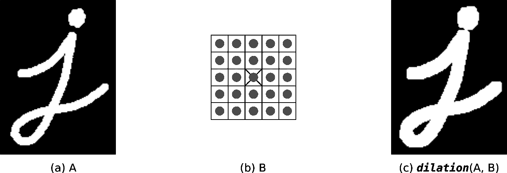

Example of the Dilation operation. Adapted from [OpenCV website](https://docs.opencv.org/3.0-beta/doc/py_tutorials/py_imgproc/py_morphological_ops/py_morphological_ops.html).

膨胀的作用正好相反。**扩展前景元素的边界**。因此，它也减少了背景像素的数量。与侵蚀相反，给定一个输入像素，如果至少一个输入像素(在内核下)为 1，则输出为 1。否则，输出为 0。

类似地，膨胀对内核下的像素应用**最大 ope。换句话说，输出像素将是属于内核的所有像素中的最大值。**

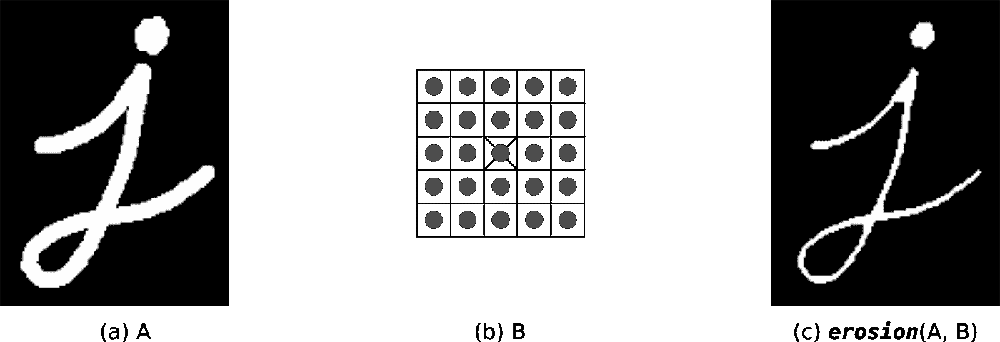

Example of the Erosion operation. Adapted from [OpenCV website](https://docs.opencv.org/3.0-beta/doc/py_tutorials/py_imgproc/py_morphological_ops/py_morphological_ops.html).

我们也可以将这两种操作结合起来。例如，**开口**是腐蚀后扩张的应用。类似地，膨胀后侵蚀被称为**关闭**。

直观上，开被广泛用作噪声去除变换。它用于平滑对象边界，并删除对象之间的细连接。

另一方面，闭合用于消除前景对象中的小间隙。此外，它还具有合并对象之间的窄间隔的效果。

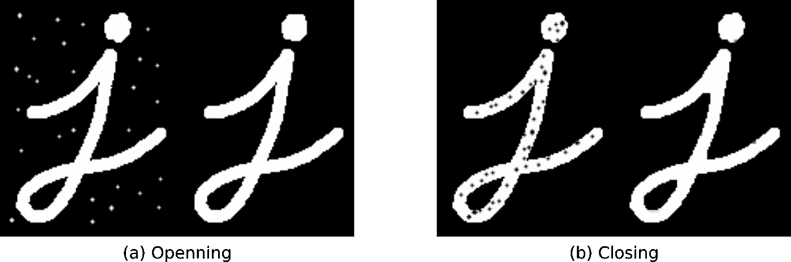

Adapted from [OpenCV website](https://docs.opencv.org/3.0-beta/doc/py_tutorials/py_imgproc/py_morphological_ops/py_morphological_ops.html)

## 在文本文档中查找行

正如你将看到的，为了找到台词和单词，我们将为这两项任务开发一个通用的配方。让我们深入研究一下。

为了让形态学操作符按预期的那样工作，我们将输入图像转换为二进制表示。然后，反转像素值以保证 2 个属性:

*   黑色像素(0)代表背景。
*   白色像素(1s)代表前景。

第一步是创建一个 100 像素宽、1 像素高的结构化元素。使用这个元素，我们对输入图像应用膨胀操作。**我们期望膨胀增加前景元素(图像中的单词)的边界像素**。

内核的拉长形状(100 像素宽)具有在水平方向拉伸前景像素的效果。结果，代表文本中单词的像素被合并成一个宽的前景像素块。请看图 1 (a)来看看结果。

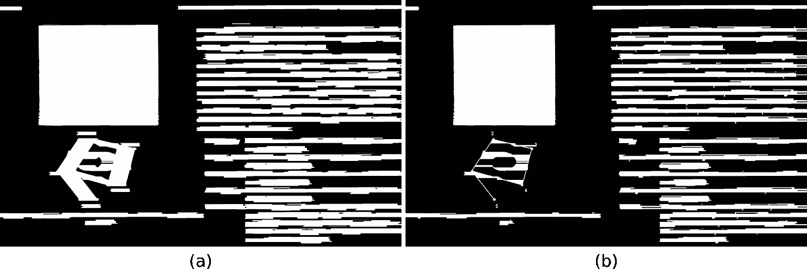

Figure 1: Result of horizontal dilation (a) and erosion (b)using a structuring element with 1-pixel height and 100 pixels wide.

接下来，我们使用相同的结构元素腐蚀膨胀的结果。目标是细化代表前景的块的边界。这里，侵蚀从每个块的边界移除了几个像素。结果，我们得到了更小的块，如图 1 (b)所示。

这第一系列操作允许我们在水平方向上找到前景像素块。现在，我们将执行相同的操作，但方向相反。

我们首先创建一个不同的结构元素。这一次，它是 200 像素高，1 像素宽。当我们使用这个核来扩展原始图像时，我们从第一次扩展中得到类似的效果。但是，请注意，被合并的前景元素块是在垂直方向上。同样，我们从膨胀中得到结果，并应用腐蚀，目的是得到更好的结果。图 2 显示了垂直膨胀和侵蚀的结果。

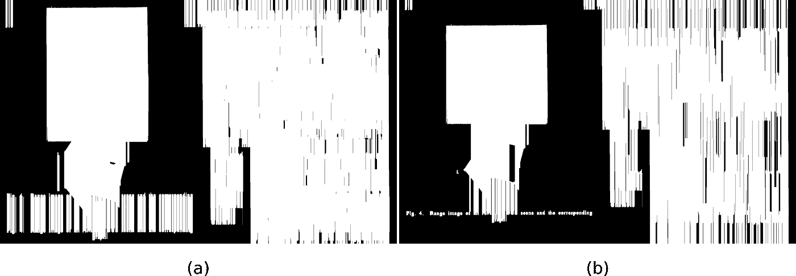

Figure 2: Results of vertical dilation (a) and erosion (b) to the input image.

代表水平和垂直块的中间结果现在可以使用一个**和** **逐像素操作**来合并。这个想法是巩固两个方向的发现。直观上，一个有效的文本行必须同时出现在两种表示中才能被认为是一个有效的行。正如我们所料，这一步去除了许多在输入图像中只能水平或垂直检测到的候选图像。因为我们将前景像素表示为 1(白色)，背景像素表示为 0(黑色)，所以逐像素的 and 运算可以表示为简单的乘法。

最后，合并垂直和水平表示可能会在前景对象中添加一些洞。为了确保我们最小化这个问题，**我们应用了一个 30 像素宽和 1 像素高的内核形状的闭合操作**。结果如图 3 所示。

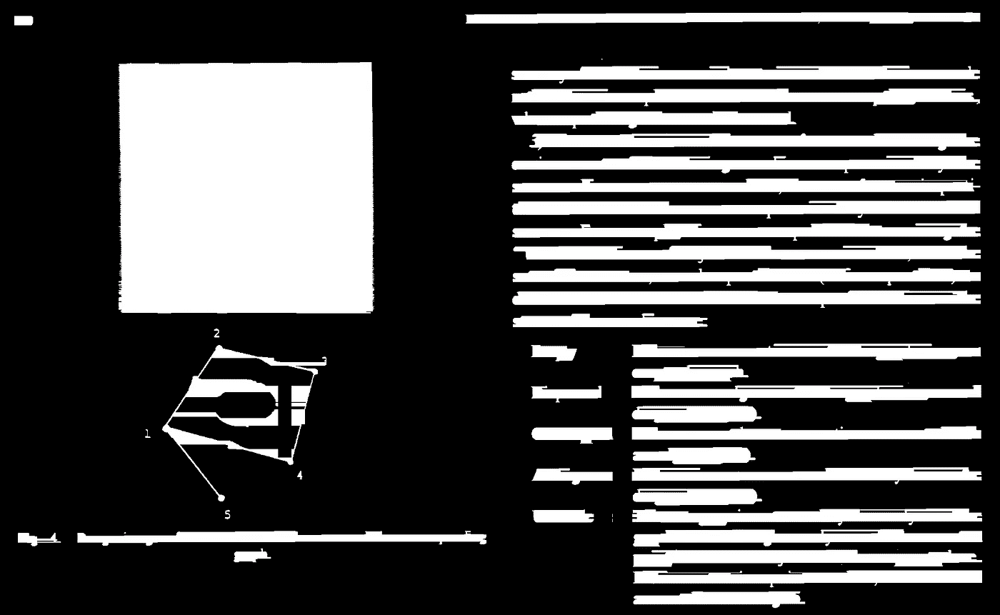

Figure 3: Final result after merging the horizontal and vertical representations and removing small gaps.

我们希望在图 3 所示的结果中找到连接组件周围的边界框。连通分量是共享公共预定义规则的一组像素。

为了找到这样的区域，我们可以使用 OpenCV*connectedComponentsWithStats()*函数。对于二进制图像，它返回一个分段图像，其中每个组件的像素都标有唯一的值。换句话说，第一分量的像素可以具有标签 1，第二分量的像素可以是 2，等等。同样，对于每个组件，它返回适合该组件的最小矩形— **边界框**。

有了每个组件的边界框，我们可以使用像素信息(在框内)来计算一些特征。反过来，我们将使用这些特性来设计一组规则，将一个给定的组件分类为文本或非文本。

基本上，对于每个包围盒，我们将计算 2 个特征。

*   *黑色像素与框内像素总数的比率*。
*   *白色到黑色过渡的比例以及框中的像素总数。*

这个想法是，对于表示文本行的组件，这些特性将非常相似。相反，其他组件将表达这些特征的不同分布。因此，我们可以设计试探法，通过比较特征值将组件分类为文本或非文本。看看图 4 中的最终结果。

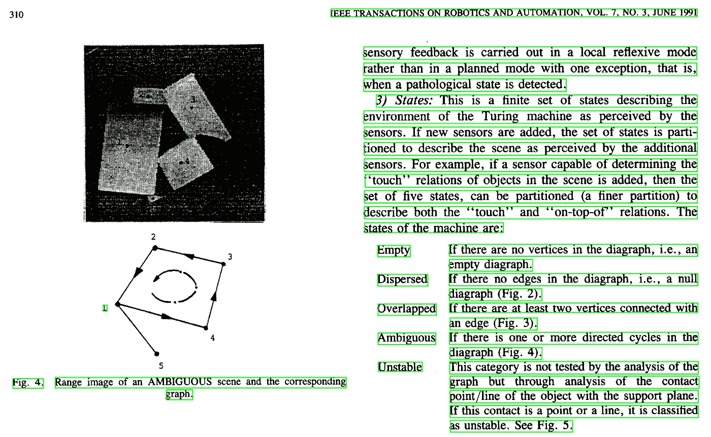

Figure 4: Line counting result. Note that lines with large spacing between words are counted as 2 instances.

正如我们所看到的，图 4 中的结果非常健壮。注意文本中的一些行在 2 中被吐槽了。这是因为，在某些点上，一些单词彼此相距甚远。结果，水平膨胀无法将它们合并成一个独特的块。此外，由于这一额外的差距，垂直运营部门无法将它们作为一个实体来检测。

将文本行视为文档行(不考虑单词之间的间距)，输入文档有 28 行。然而，该算法能够计数总共 35 行。

## 统计文本文档中的单词

要本地化文本中的单个单词，过程非常相似。主要区别在于结构元素的形状。

对于第一组操作，我们选择 12×1(12 像素宽 1 像素高)的结构化元素。请注意，我们减少了这个内核的水平范围(与用于识别线条的内核相比)。这个想法是，虽然大多数单词有一个拉长的(矩形)形状，但它们没有线那么宽。

按照我们的方法，膨胀将在水平方向扩展前景像素。侵蚀将提炼新的文本块。因为我们选择了一个更窄的结构元素，**膨胀具有在一个独特的块**中合并相同单词的字母的效果。您可以在图 6 中看到结果。

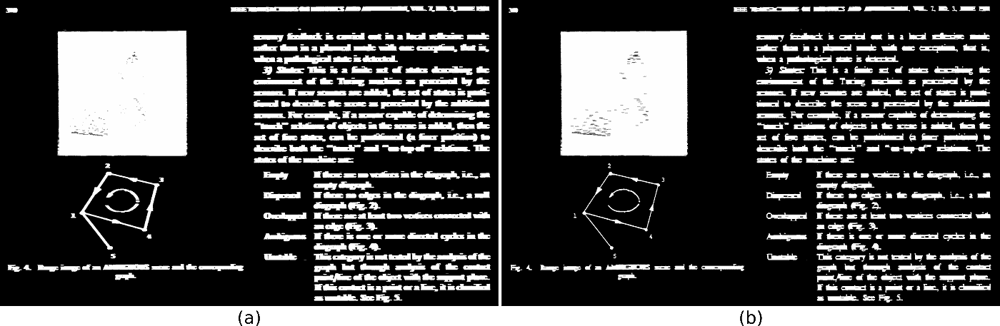

Figure 6: Horizontal dilation (a) and erosion (b).

为了找到垂直模式，我们定义一个宽度为 1 像素、高度为 4 像素的结构化元素。同样，我们采用原始输入图像，并使用该内核应用膨胀和腐蚀。

最后，我们使用逐像素 and 运算合并水平和垂直表示，并应用闭合来填充可能的间隙。合并后的结果如图 7 所示。我们可以看到，水平和垂直表示的组合产生了干净的、定义良好的单词块。下一步是找到每个连接组件周围的边界框。

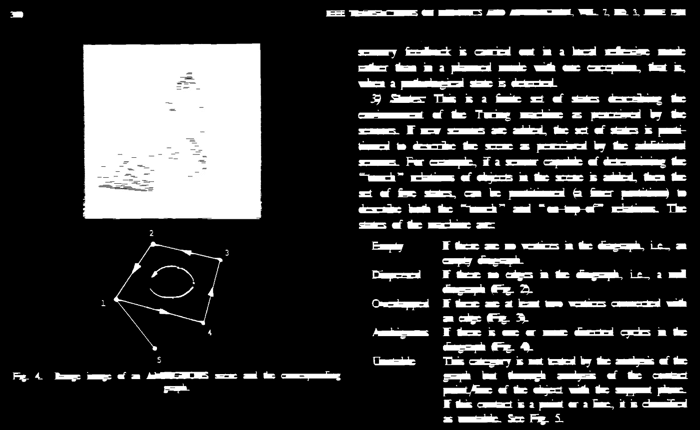

Figure 7: Final result after merging the horizontal and vertical representations and removing small gaps.

对于每个边界框，我们可以计算出**像素比率**和**白色到黑色的过渡**。最后，我们可以手工设计试探法来区分一个包围盒是文本还是非文本。最终结果可以在图 8 中看到。

Figure 8: Final word counting result.

将数字视为单词，并丢弃特殊字符，该文本大约有 241 个单词。**该算法能够从 316 个可能的候选单词中检测出总共 244 个单词(初始边界框的数量**)。

## 讨论和结论

需要注意的是，尽管这种方法看起来很健壮，但它并不通用。事实上，结构化元素的形状并不能推广到其他文档。此外，我们用来将前景组件分类为文本或非文本的方法也不通用。

如果我们只使用简单的试探法进行分类，所提出的解决方案可能会为不同的文档图像输出不同的(不准确的)结果。这是由于印刷文件的混乱性质。尽管它们在结构方面表现良好，但形态结构元素对字体大小、行距和字体类型等非常敏感。

实现一套通用规则的更好的方法是在系统中添加一个可学习的组件。一种方法是学习无监督区域，其中相似的对象基于某种相似性度量而聚集在一起。

为此，我们可以对组件的图像块使用聚类算法，例如 K-Means。通过这种方式，我们可以学习将文本碎片收集在一起(因为它们是相似的)。以同样的方式，我们将学习与文本不相似的图像块的不同聚类。尽管如此，我们仍然会受到寻找连接组件的能力的限制。

这就是所有的形态学操作。

**感谢阅读。**