# RSA 公钥密码系统简介

> 原文：<https://medium.com/hackernoon/an-introduction-to-public-key-cryptosystems-with-rsa-7e34cc67cf22>

仅在过去几年中，全球就发生了多起大规模数据泄露事件。最近，万豪酒店[曝光了](https://www.washingtonpost.com/business/2018/11/30/marriott-discloses-massive-data-breach-impacting-million-guests/)5 亿人的数据(占世界人口的 7%！).

安全性在互联网的每个方面都很重要。想象一下，如果亚马逊不能保证你的信用卡安全，或者如果你的脸书信息是公开的，或者如果任何人都可以阅读你的医疗保健提供商的电子邮件。一个没有安全通信的世界是可怕的。这就提出了一个问题——我们如何保证我们的通信安全？

本文开始回答这个问题。我们将通过介绍和一个例子来看公钥密码系统。接下来，我们将讨论一种特定的公钥密码系统——RSA(Rivest–sha mir–ad leman)算法。这个算法是以罗恩·里维斯特(1942)、阿迪·萨莫尔(1952)和伦纳德·阿德曼(1945)的名字命名的。RSA 已经有 50 年了，现在还在用！

# 公钥密码系统

密码系统是一组用于在各方之间安全传输信息的过程。密码系统的一个很好的例子是书写。你和我都同意一组曲线是对一个物体的加密。这些曲线通常被称为字母。

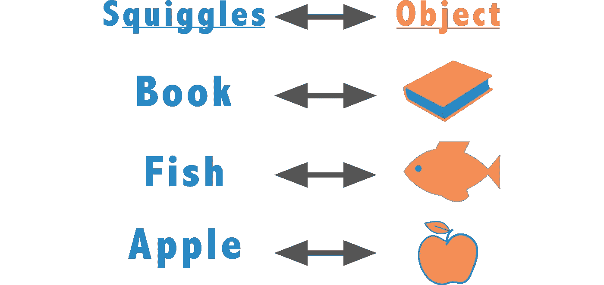

Some common squiggle-object pairs

现在，你和我可以发送关于那个物体的信息。这些信息是安全的，不会被任何看不懂我们语言的人看到。对朱利叶斯·凯撒来说，这是一个相当安全的系统。凯撒活着的时候，只有 5%的罗马人能读写。

这个“公钥”的想法呢？在密码系统中，密钥是输入到产生特定输出的函数中的一条信息(通常是一个数字)。公钥**T3 是其值为公开知识的密钥。一些密码系统使用私钥，私钥的值是保密的。**

RSA 是一种公钥密码系统，因为它使用一个公钥和一个私钥。正如您所猜测的，加密密钥以明文形式接收消息，并将其转换为安全的密文。解密密钥撤销这个过程。

# 一个例子

我们中的许多人都使用过投票箱形式的公钥密码系统。我们将在下面使用一个修改过的投票箱，这样我们就可以使用上面的条款。假设我们有一个上锁的外箱，这个外箱里面是我们的投票箱。

我们首先从外盒开始。外部盒子当前被锁定。但是钥匙在盒子外面，所以任何人都可以打开它。外盒外面的密钥是我们的公钥。每个人都可以访问它，每个人都可以使用它。

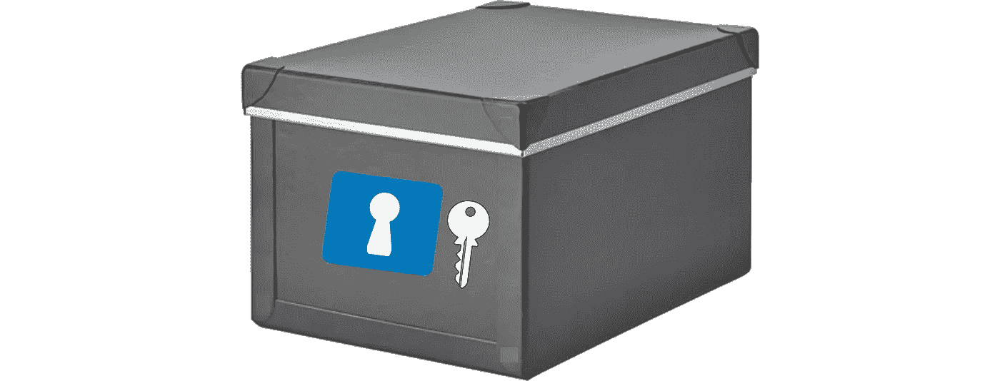

The outer box (Image source [here](https://www.ikea.com/us/en/catalog/products/50395669/))

所以，我们打开外箱，发现里面有一个投票箱。投票箱在下面。让我们假设顶部的裂缝完全是单向的(即你不能拉出任何选票)。这个箱子上有一把锁，但没有钥匙。内部锁的钥匙是私人钥匙。必须保密，否则任何人都可以看到选票。

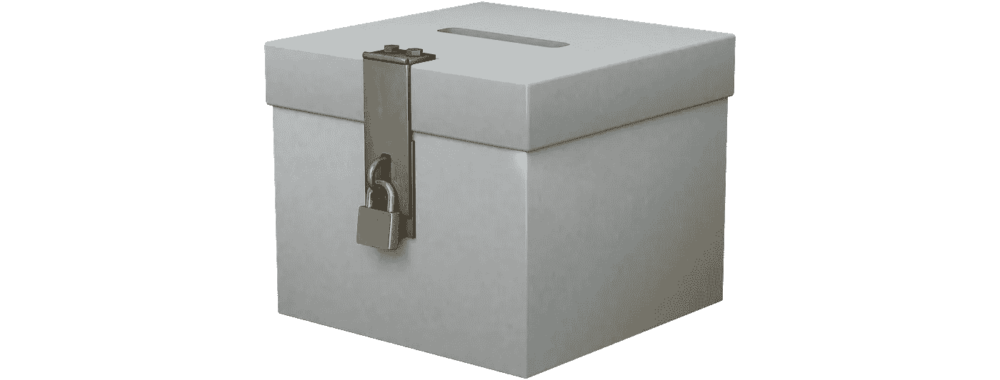

The inner box

而这恰恰是一个公钥密码系统。假设私钥是私有的，任何人都可以安全地投下选票。只有有内箱钥匙的人才能阅读。

在 RSA 加密中，任何人都可以使用公钥安全地发送消息，但这些消息只能由拥有私钥的人阅读。

# 公钥密码系统的好处

公钥密码系统如此重要的原因是它们不需要任何共享的先验信息。你和你当地的投票官员不同意共享一个秘密的私人密钥，你们不交换任何信息，你们甚至不需要见面。这对于现代系统是非常宝贵的，因为建立私钥是不切实际的。

想象一下，你必须去实体亚马逊商店，亲自获取一个秘密密码，回到你的电脑前，然后开始购物。想象一下，你不得不为脸书、谷歌、Twitter、Venmo、iMessage、Outlook 和所有其他应用这么做。这是不可能的。公钥密码系统解决了这个问题。

# RSA 算法中的 4 个关键概念

在深入研究 RSA 算法本身之前，我们需要了解四个关键概念:模运算、最大公约数、欧拉极限函数和欧拉定理。

**(1)** 模运算通常被称为时钟运算。标准时钟只有 12 个小时。第 13 个小时并不存在。时钟又回到了第一个小时。时钟以 12 为模数工作。这相当于说时钟以 12 为模工作。假设我有一些号码 *x = 376* 。假设我们想知道什么是 *x* 与模 59 全等。我们来看看 *x* 除以模数后的余数。我们的结果如下所示。因此*x = 376*≦*22 mod 59*。

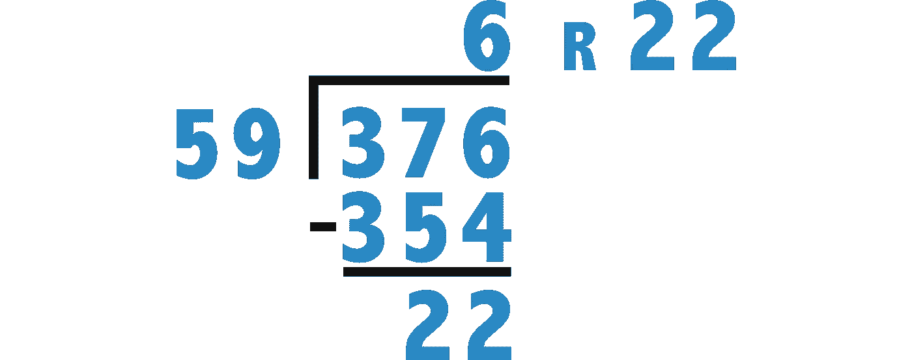

An example of modular arithmetic

另一种思考方式是 376 = 596+22。其实任何数对于整数 *q* 和 *r* 用 0 ≤ *r < n* 都可以写成*x = n**q*+*r*。这里， *x* 全等于 r *模 n* 。这是 RSA 加密的重要组成部分。

**(2)** 两个数的最大公约数是两个数相除的最大整数。也被称为最大公因式。例如，gcd(15，21) = 3，因为 3 是 *15* 和 *21* 的因子，并且是最大的因子。同理，gcd(8，12) = 4。虽然 *2* 也是 *8* 和 *12* 的因子，但是 *4* 更大。如果这两个数字没有共享因子，如 *14* 和 *25* ，那么 gcd(14，25) = 1。更多关于 gcd 的信息，请看[这里](https://www.youtube.com/watch?v=uE9O8N5JYB4)。

**(3)** 当两个数不共享任何因子时(比如 *14* 和 *25* ，我们说这两个数互质，它们的 gcd 等于 1。比如 *19* 和 *8* 是互质。 *271* 和 *22* 也是如此。接下来，我们定义一个函数 *ϕ(n).*该函数返回小于 *n* 且与 *n* 互质的整数个数。下面是一些例子。这个函数叫做[欧拉的全等函数](https://en.wikipedia.org/wiki/Euler%27s_totient_function)。它以莱昂哈德·欧拉(1707 年)的名字命名。注意，如果 *n* 是[素数](http://mathworld.wolfram.com/PrimeNumber.html)，那么 *ϕ(n) = (n-1)* ，因为所有小于 *n* 的数都与*n*互质

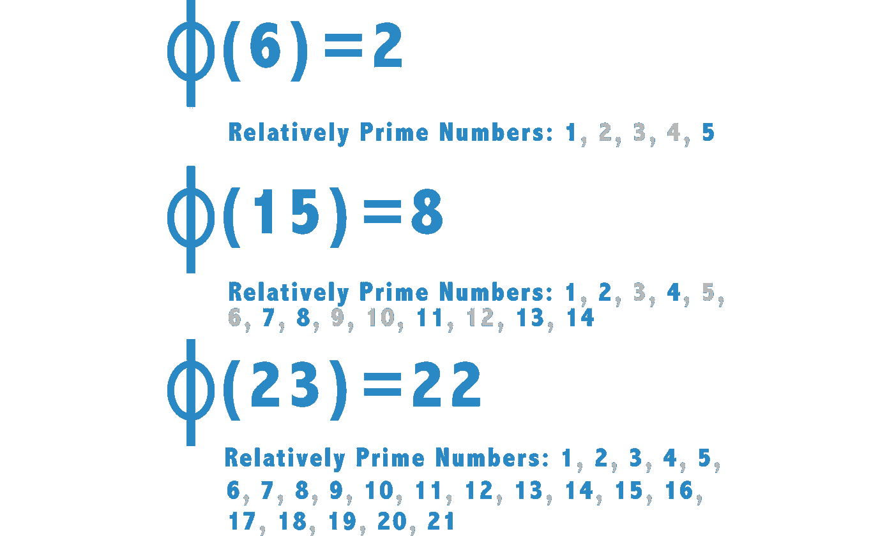

Some examples of the *ϕ(n) function*

**(4)** 最后一个关键概念也来自欧拉。欧拉定理(也称为费马-欧拉定理)是 RSA 算法成功的基础。这个定理陈述如下。对于本文来说，这个证明包含了太多的数论。但是对证明感兴趣的，看[这里](https://kconrad.math.uconn.edu/blurbs/ugradnumthy/eulerthm.pdf)。

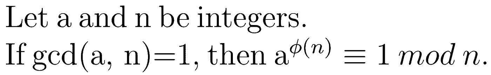

Euler’s Theorem

# RSA 算法

好吧！现在我们有了讨论 RSA 算法所需的所有工具。假设爱丽丝想给鲍勃发一条信息。我们将这个消息称为 *m* 。

我们可以使用 [ASCII](https://en.wikipedia.org/wiki/ASCII) 值将 *m* 转换成一个数字。例如，十六进制 ASCII 中的消息“Hello”是“48 65 6C 6C 6F”。然后，我们可以将十六进制(0x48656C6C6F)转换为十进制(310939249775)。现在我们的消息是 310939249775。一旦我们有了一个有效的消息，Bob 必须做一些工作，然后 Alice 才能给 Bob 发送消息。RSA 算法概述如下。

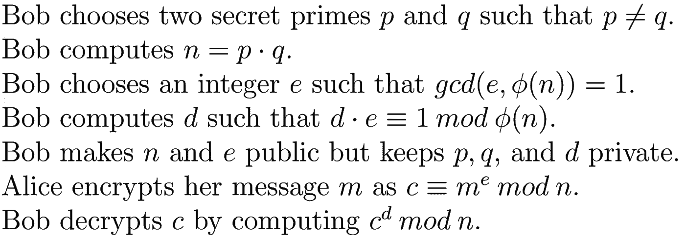

RSA Algorithm

我们如何知道最后一步将返回原始消息？我们依靠**欧拉定理**如下图。出于我们的目的，我们可以假设 *gcd(m，n) = 1* ，因为 *n* 的唯一因子是 *p* 和 *q* 。 *m = p* 或者 *m = q* 的几率很小。

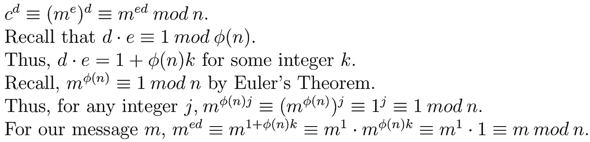

Euler’s Theorem and the verification of the RSA algorithm

# 用 Python 实现 RSA 算法

以下代码使用 RSA 对给定消息 *m (* 进行加密和解密，只要 *m* 在转换为整数时小于 *n)* 。这段代码当然不健壮，只是作为一个例子。它不应被用作安全通信的手段。对于那些想要编辑代码库的人来说，GitHub 库在这里是[T21。](https://github.com/andrewjoliver/rsa_implementation/blob/master/rsa_algorithm.py)

我们首先需要两个方法——一个将单词转换成整数，另一个将整数转换成单词，即“hello”⇆310939249775。这两个函数如下。

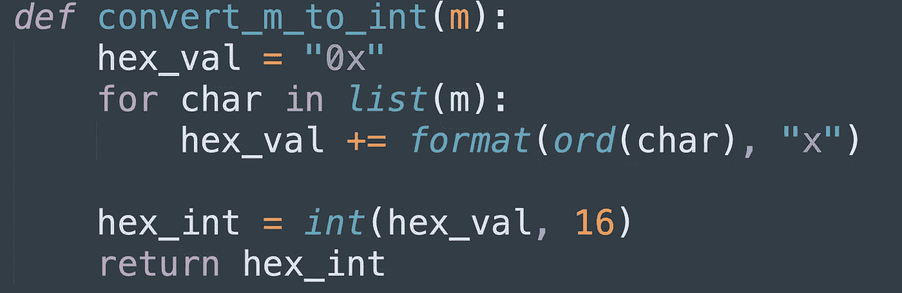

Conversion Function from Strings to Integers

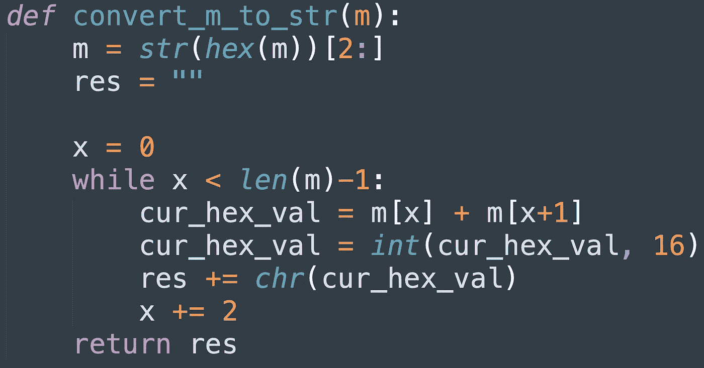

Conversion Function from Integers to Strings

下一步是处理设置。我们需要定义ϕ(n).该函数采用一个参数 *num_digits* ，它表示我们的素数 *p* 和 *q 的位数。*下面的代码使用 50 位数的素数。这意味着 *n* 大约有 100 位数长。真正的 RSA 加密使用大约 600 位的 *n* 。

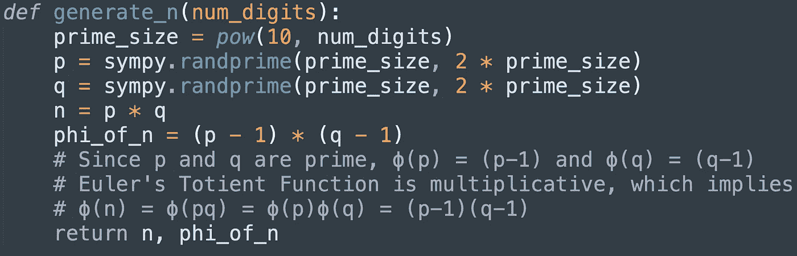

Generation of n and *ϕ(n)*

鲍勃就快到了！他需要做的就是定义 *e* 和 *d* ，这是通过下面的方法完成的。 *d* 的生成需要模逆。Rosetta 代码有一个我们使用的很棒的实现。我们使用一个 25 位数的 *e* ，这对于我们的目的来说应该足够了。

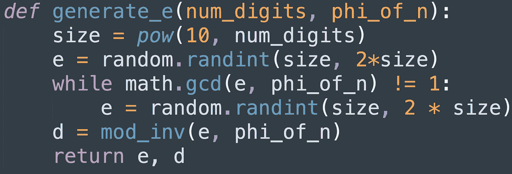

Generation of e and *d*

我们都准备好了。我们现在可以使用下面的两种方法加密和解密消息。

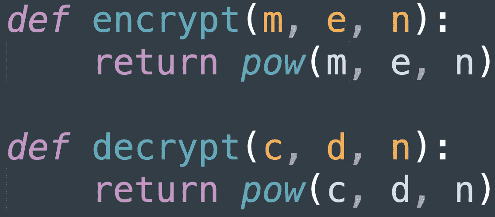

RSA Encryption and Decryption Algorithms

我们在下面实现了一个 *main()* 方法来驱动我们的代码，我们都准备好了。

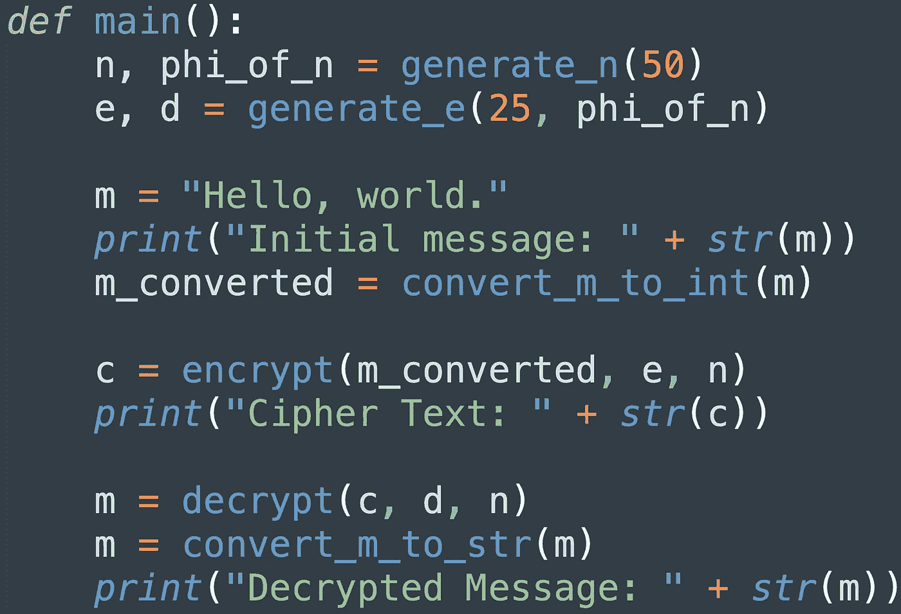

Our main() method for our RSA implementation

我们看到它起作用了！

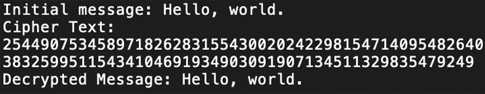

The results of our RSA algorithm.

# 结束语

本文只是对公钥密码系统和 RSA 的介绍。但是肯定有更多的内容要介绍！对于选择 *p、q、e* 、 *d* 和 *m 的值，存在[限制和标准协议](https://tools.ietf.org/html/rfc8017#section-3.1)。存在执行上述计算的有效方式。有兴趣学习和探索更多的，推荐[密码学入门(第二版)](https://www.amazon.com/Introduction-Cryptography-Coding-Theory-2nd/dp/0131862391)。*

虽然构建 RSA 当然很有趣，但破解 RSA 更有趣。RSA 的优势在于我们无法对两个不同的大素数的乘积进行因式分解。尝试这样做的两种方法是[二次筛选](https://www.youtube.com/watch?v=Y3N0vZoPCWE)和[通用数字域筛选](http://citeseerx.ist.psu.edu/viewdoc/download?doi=10.1.1.219.2389&rep=rep1&type=pdf)。